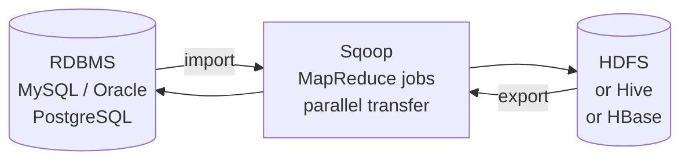

# Sqoop — Fundamentals


## 🎯 Analogy

Think of Sqoop like a data bridge between relational databases and HDFS/Hive: it parallelizes JDBC reads into MapReduce tasks, splitting the table by primary key so multiple mappers load different row ranges simultaneously.

---
## What is Sqoop?

**Apache Sqoop** (SQL-to-Hadoop) is a tool for efficiently transferring bulk data between Apache Hadoop and structured datastores (RDBMS). It uses MapReduce under the hood to parallelize imports and exports.



**Key capabilities:**
- Import full tables or query results from RDBMS to HDFS/Hive/HBase
- Export data from HDFS back to RDBMS
- Incremental imports (only new/changed rows)
- Automatic schema detection and Hive table creation

---

## Basic Import

```bash
# Import entire table from MySQL to HDFS
sqoop import \
  --connect jdbc:mysql://mysql-host:3306/sales_db \
  --username etl_user \
  --password secret123 \
  --table orders \
  --target-dir /user/hadoop/orders \
  --num-mappers 4

# Output files in /user/hadoop/orders/
# part-m-00000, part-m-00001, part-m-00002, part-m-00003
# (4 mappers = 4 output files)
```

### Import with Options

```bash
# Import specific columns
sqoop import \
  --connect jdbc:mysql://host/db \
  --username user --password pass \
  --table orders \
  --columns "order_id,customer_id,amount,order_date" \
  --target-dir /data/orders \
  --num-mappers 8 \
  --fields-terminated-by ',' \      # CSV format
  --lines-terminated-by '\n' \
  --null-string '\\N' \             # NULL representation
  --null-non-string '\\N'
```

---

## Import to Hive

```bash
# Import directly into a Hive table (auto-creates table if not exists)
sqoop import \
  --connect jdbc:mysql://host/db \
  --username user --password pass \
  --table customers \
  --hive-import \
  --hive-table default.customers \
  --hive-overwrite \               # Replace existing data
  --num-mappers 4

# With partitioning
sqoop import \
  --connect jdbc:mysql://host/db \
  --username user --password pass \
  --query "SELECT * FROM orders WHERE order_date='2024-01-15' AND \$CONDITIONS" \
  --hive-import \
  --hive-table orders_partitioned \
  --hive-partition-key order_date \
  --hive-partition-value "2024-01-15" \
  --target-dir /tmp/sqoop_staging \
  --num-mappers 4
```

> **Note:** The `\$CONDITIONS` placeholder is required when using `--query`. Sqoop replaces it with WHERE clauses to split the data across mappers.

---

## Incremental Import

Two modes for importing only new or changed data:

### Append Mode (new rows only)

```bash
# First run: full import
sqoop import \
  --connect jdbc:mysql://host/db \
  --username user --password pass \
  --table orders \
  --target-dir /data/orders \
  --incremental append \
  --check-column order_id \
  --last-value 0 \
  --num-mappers 4

# Subsequent runs: import rows with order_id > last_value
sqoop import \
  --connect jdbc:mysql://host/db \
  --username user --password pass \
  --table orders \
  --target-dir /data/orders \
  --incremental append \
  --check-column order_id \
  --last-value 50000 \         # Last max order_id from previous run
  --num-mappers 4
```

### Last Modified Mode (updated rows)

```bash
sqoop import \
  --connect jdbc:mysql://host/db \
  --username user --password pass \
  --table customers \
  --target-dir /data/customers \
  --incremental lastmodified \
  --check-column updated_at \
  --last-value "2024-01-14 23:59:59" \
  --merge-key customer_id \    # Merge updated rows with existing data
  --num-mappers 4
```

---

## Basic Export

```bash
# Export HDFS data back to MySQL table
sqoop export \
  --connect jdbc:mysql://host/db \
  --username user --password pass \
  --table order_summary \
  --export-dir /data/order_summary_output \
  --input-fields-terminated-by ',' \
  --num-mappers 4 \
  --batch                      # Use JDBC batch inserts (faster)

# Upsert (update existing, insert new)
sqoop export \
  --connect jdbc:mysql://host/db \
  --username user --password pass \
  --table order_summary \
  --export-dir /data/order_summary_output \
  --update-key order_id \      # Key column for matching existing rows
  --update-mode allowinsert \  # Insert if not found (upsert)
  --num-mappers 4
```

---

## Sqoop Jobs (Saved Commands)

```bash
# Save a job for reuse
sqoop job \
  --create daily_orders_import \
  -- import \
  --connect jdbc:mysql://host/db \
  --username user --password pass \
  --table orders \
  --target-dir /data/orders \
  --incremental append \
  --check-column order_id \
  --last-value 0 \
  --num-mappers 4

# Run the saved job (Sqoop tracks last-value automatically)
sqoop job --exec daily_orders_import

# List all jobs
sqoop job --list
```

---

## How Sqoop Parallelism Works

Sqoop splits imports across multiple mappers using a **split column** (usually the primary key):

```
Table has 1,000,000 rows, order_id 1 to 1,000,000
--num-mappers 4

Mapper 1: SELECT * FROM orders WHERE order_id >= 1 AND order_id < 250001
Mapper 2: SELECT * FROM orders WHERE order_id >= 250001 AND order_id < 500001
Mapper 3: SELECT * FROM orders WHERE order_id >= 500001 AND order_id < 750001
Mapper 4: SELECT * FROM orders WHERE order_id >= 750001 AND order_id <= 1000000
```

**Custom split column:**
```bash
sqoop import ... --split-by order_date --num-mappers 4
# Splits on date ranges instead of primary key
```

---

## Supported Databases

| Database | JDBC Driver | Connection String |
|----------|-------------|-------------------|
| MySQL | mysql-connector-java | `jdbc:mysql://host/db` |
| PostgreSQL | postgresql | `jdbc:postgresql://host/db` |
| Oracle | ojdbc | `jdbc:oracle:thin:@host:1521:sid` |
| SQL Server | mssql-jdbc | `jdbc:sqlserver://host;database=db` |
| DB2 | db2jcc | `jdbc:db2://host:50000/db` |

---


## ▶️ Try It Yourself

```bash
# Import a full table from MySQL into HDFS as Parquet
sqoop import   --connect jdbc:mysql://mysql-host:3306/orders_db   --username reader --password secret   --table orders   --target-dir /data/raw/orders/   --as-parquetfile   --num-mappers 8   --split-by id

# Incremental import (only new rows since last run)
sqoop import   --connect jdbc:mysql://mysql-host:3306/orders_db   --table orders   --incremental append   --check-column id   --last-value 100000   --target-dir /data/raw/orders/incremental/

# Export from HDFS back to MySQL
sqoop export   --connect jdbc:mysql://mysql-host:3306/analytics_db   --table revenue_summary   --export-dir /data/gold/revenue/   --input-fields-terminated-by ','
```

> **Run it:** Copy the snippet into a REPL or file — no external services needed for the basic example.

---
## Interview Tips

> **Tip 1:** "How does Sqoop parallelize imports?" — "Sqoop queries the RDBMS for the min/max of the split column (usually primary key), then divides the range equally across N mappers. Each mapper runs its own JDBC query with a WHERE clause covering its partition."

> **Tip 2:** "What's the difference between append and lastmodified incremental?" — "Append handles insert-only tables (new rows have larger key). lastmodified handles tables where rows are updated — it re-imports any row whose updated_at column changed since the last run, then merges with existing HDFS data."

> **Tip 3:** "What happens if a Sqoop export fails midway?" — "HDFS data already exported is NOT rolled back — partial data lands in the target table. Use a staging table approach: export to a staging table, then atomic swap with the target via stored procedure or transaction."

> **Tip 4:** "When would you NOT use Sqoop?" — "When you need CDC (real-time change capture) — Sqoop does bulk batch transfers, not row-level change events. Use Debezium or Kafka Connect JDBC source for CDC. Also avoid Sqoop for very large tables without a good split column — it falls back to single-mapper sequential import."
