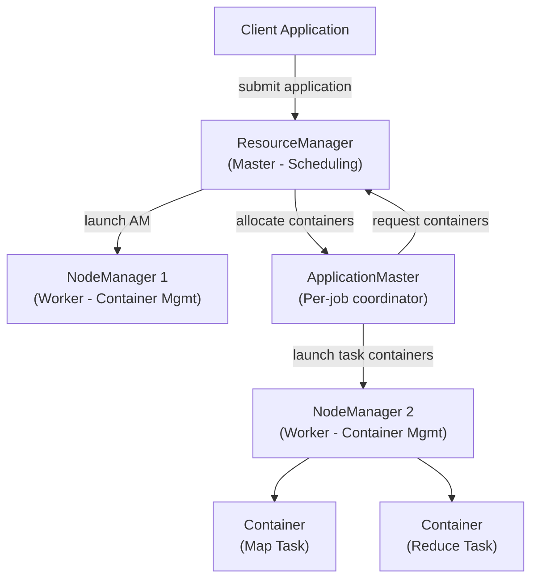

# YARN Fundamentals

## What is YARN?

YARN (Yet Another Resource Negotiator) is Hadoop's cluster resource management system, introduced in Hadoop 2.x. It separates resource management from job execution, allowing multiple processing frameworks (MapReduce, Spark, Flink, Tez) to share a single Hadoop cluster.

**Before YARN (Hadoop 1.x):** MapReduce handled both resource management AND job execution → limited to MapReduce only.

**With YARN:** Resource management is decoupled → any framework can run on the cluster.

## YARN Architecture



## Core Components

### ResourceManager (RM)
The master daemon with two main components:
- **Scheduler**: Allocates resources to applications (does NOT monitor or restart tasks)
- **ApplicationsManager**: Accepts job submissions, negotiates first container for AM, restarts AM on failure

### NodeManager (NM)
Runs on each worker node:
- Manages containers on the local node
- Reports resource availability (CPU, memory) to ResourceManager
- Monitors container resource usage and kills containers that exceed limits
- Provides log aggregation for completed containers

### ApplicationMaster (AM)
Per-application coordinator (runs inside a YARN container):
- Negotiates resources with ResourceManager
- Coordinates task execution with NodeManagers
- Reports application progress and status
- Handles task failures and re-requests containers

### Container
The unit of resource allocation:
- Fixed amount of CPU (vcores) and memory
- Runs one task (map task, reduce task, Spark executor, etc.)
- Isolated resource usage enforced by NodeManager (via cgroups)

## Application Lifecycle

```mermaid
graph LR
    Submit["1. Client submits<br>application"]
    AMStart["2. RM allocates container<br>for ApplicationMaster"]
    Register["3. AM registers with RM<br>reports capabilities"]
    Request["4. AM requests resource<br>containers from RM"]
    Launch["5. RM allocates containers<br>AM launches tasks in NMs"]
    Monitor["6. AM monitors tasks<br>re-requests on failure"]
    Finish["7. AM reports success<br>unregisters from RM"]

    Submit --> AMStart --> Register --> Request --> Launch --> Monitor --> Finish
```



## YARN Resource Model

### Memory
```xml
<!-- yarn-site.xml on each NodeManager -->
<property>
  <name>yarn.nodemanager.resource.memory-mb</name>
  <value>24576</value>  <!-- 24 GB total memory for containers on this node -->
</property>
<property>
  <name>yarn.scheduler.minimum-allocation-mb</name>
  <value>1024</value>  <!-- Minimum container size: 1 GB -->
</property>
<property>
  <name>yarn.scheduler.maximum-allocation-mb</name>
  <value>8192</value>  <!-- Maximum container size: 8 GB -->
</property>
```

### CPU (vcores)
```xml
<property>
  <name>yarn.nodemanager.resource.cpu-vcores</name>
  <value>16</value>  <!-- 16 virtual CPU cores available for containers -->
</property>
<property>
  <name>yarn.scheduler.minimum-allocation-vcores</name>
  <value>1</value>
</property>
<property>
  <name>yarn.scheduler.maximum-allocation-vcores</name>
  <value>8</value>
</property>
```

## YARN Schedulers

### FIFO Scheduler
- Simple queue: first in, first out
- Not suitable for shared clusters (one large job starves all others)
- Only appropriate for single-tenant clusters

### Capacity Scheduler (default for Hadoop)
- Multiple queues, each with guaranteed capacity
- Resources can be shared across queues when one is idle
- Supports queue hierarchies

```xml
<!-- capacity-scheduler.xml -->
<property>
  <name>yarn.scheduler.capacity.root.queues</name>
  <value>production,development,analytics</value>
</property>
<property>
  <name>yarn.scheduler.capacity.root.production.capacity</name>
  <value>60</value>  <!-- 60% of cluster for production -->
</property>
<property>
  <name>yarn.scheduler.capacity.root.development.capacity</name>
  <value>20</value>  <!-- 20% for development -->
</property>
<property>
  <name>yarn.scheduler.capacity.root.analytics.capacity</name>
  <value>20</value>  <!-- 20% for analytics -->
</property>
<property>
  <name>yarn.scheduler.capacity.root.production.maximum-capacity</name>
  <value>80</value>  <!-- Can burst to 80% if cluster is idle -->
</property>
```

### Fair Scheduler
- All applications get equal share of resources over time
- New applications get resources quickly (even when cluster is busy)
- Supports fair sharing within queues

```xml
<!-- fair-scheduler.xml -->
<allocations>
  <queue name="production">
    <minResources>40000 mb,40 vcores</minResources>
    <maxResources>80000 mb,80 vcores</maxResources>
    <weight>3</weight>
    <schedulingPolicy>fair</schedulingPolicy>
  </queue>
  <queue name="development">
    <minResources>10000 mb,10 vcores</minResources>
    <weight>1</weight>
  </queue>
  <defaultQueueSchedulingPolicy>fair</defaultQueueSchedulingPolicy>
</allocations>
```

## Submitting to Specific Queues

```bash
# MapReduce job to specific queue
hadoop jar myapp.jar MyJob \
  -D mapreduce.job.queuename=production \
  /input /output

# Spark application to queue
spark-submit \
  --master yarn \
  --queue analytics \
  --num-executors 10 \
  --executor-memory 4g \
  myapp.py

# Check queue status
mapred queue -list
mapred queue -info production
```

## YARN CLI Commands

```bash
# List running applications
yarn application -list

# List all applications (including finished)
yarn application -list -appStates ALL

# Kill an application
yarn application -kill application_12345_0001

# Get application logs
yarn logs -applicationId application_12345_0001

# Get container logs
yarn logs -applicationId application_12345_0001 \
  -containerId container_12345_0001_01_000001

# Node information
yarn node -list
yarn node -status <node-id>

# Queue information
yarn queue -status root.production
```

## YARN vs MESOS vs Kubernetes

| Feature | YARN | Mesos | Kubernetes |
|---------|------|-------|------------|
| Primary use | Hadoop ecosystem | Mixed workloads | Containerized apps |
| Hadoop integration | Native | Via framework | Via operators |
| Scheduling model | Pull (AM requests) | Push (Mesos offers) | Request/Limit |
| Isolation | Memory + CPU | CPU + memory + disk | Container resources |
| Maturity for Hadoop | Best | Good | Growing |
| Cloud native | No | Partial | Yes |

## Interview Tips

> **Tip 1:** A key YARN interview question is "what happens when the ApplicationMaster fails?" — YARN restarts the AM in a new container. For MapReduce, the AM can recover completed tasks from HDFS; only in-progress tasks need to be rerun. For Spark, the AM restarts and the application starts from scratch (unless checkpointing is used).

> **Tip 2:** Explain the difference between ResourceManager's Scheduler and ApplicationsManager clearly. The Scheduler just allocates resources — it has NO knowledge of application status or tasks. The ApplicationsManager tracks running applications and restarts AMs.

> **Tip 3:** When asked about multi-tenancy in Hadoop, the answer is Capacity Scheduler queues. Explain the key parameters: `capacity` (guaranteed %), `maximum-capacity` (burst limit), `user-limit-factor` (per-user fairness within queue).

> **Tip 4:** Know the resource model: YARN allocates memory in chunks of `minimum-allocation-mb`. If a container requests 1.5 GB with minimum=1024 MB, it gets rounded up to 2048 MB. This means poorly sized containers waste resources.

> **Tip 5:** Mention that YARN Timeline Server stores application history metadata, and YARN ResourceManager web UI (port 8088) is the go-to for monitoring running and recently completed applications. In a real interview, mentioning these operational tools shows practical experience.
