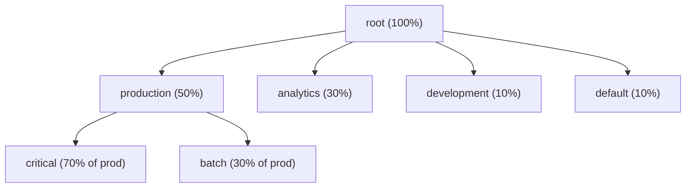

# YARN Real-World Patterns

## Multi-Tenant Cluster Design

### Scenario: 5-Team Shared Cluster



```xml
<!-- capacity-scheduler.xml -->
<configuration>
  <!-- Top-level queues -->
  <property>
    <name>yarn.scheduler.capacity.root.queues</name>
    <value>production,analytics,development,default</value>
  </property>

  <!-- Production queue: 50% guaranteed, can burst to 80% -->
  <property>
    <name>yarn.scheduler.capacity.root.production.capacity</name>
    <value>50</value>
  </property>
  <property>
    <name>yarn.scheduler.capacity.root.production.maximum-capacity</name>
    <value>80</value>
  </property>
  <property>
    <name>yarn.scheduler.capacity.root.production.queues</name>
    <value>critical,batch</value>
  </property>

  <!-- Critical sub-queue: never preempted -->
  <property>
    <name>yarn.scheduler.capacity.root.production.critical.capacity</name>
    <value>70</value>
  </property>
  <property>
    <name>yarn.scheduler.capacity.root.production.critical.disable_preemption</name>
    <value>true</value>
  </property>
  <property>
    <name>yarn.scheduler.capacity.root.production.critical.priority</name>
    <value>10</value>  <!-- Highest priority -->
  </property>

  <!-- Analytics: 30% guaranteed -->
  <property>
    <name>yarn.scheduler.capacity.root.analytics.capacity</name>
    <value>30</value>
  </property>
  <property>
    <name>yarn.scheduler.capacity.root.analytics.maximum-capacity</name>
    <value>60</value>
  </property>

  <!-- Development: limited -->
  <property>
    <name>yarn.scheduler.capacity.root.development.capacity</name>
    <value>10</value>
  </property>
  <property>
    <name>yarn.scheduler.capacity.root.development.maximum-capacity</name>
    <value>20</value>
  </property>
  <property>
    <name>yarn.scheduler.capacity.root.development.user-limit-factor</name>
    <value>0.5</value>  <!-- No single developer can use more than 5% of cluster -->
  </property>
</configuration>
```

## Case Study: SLA-Driven Cluster Optimization

### Problem
A financial services company has 3 SLA tiers:
- **Tier 1** (market data processing): Must complete within 30 minutes of market close
- **Tier 2** (risk calculations): Must complete by 11 PM
- **Tier 3** (analytics/reports): Best effort, by morning

Current state: All jobs share a single queue, Tier 1 often delayed by long-running Tier 3 jobs.

### Solution

```bash
# Step 1: Create tiered queues with preemption
# Tier 1: guaranteed 40%, can burst to 100%, preemption enabled
# Tier 2: guaranteed 40%, can burst to 80%
# Tier 3: guaranteed 20%, can burst to 50%, preemptible

# Step 2: Configure jobs to use correct queues
# market_data_pipeline.sh
spark-submit \
  --master yarn \
  --queue root.tier1.market-data \
  --conf spark.yarn.priority=10 \
  --executor-memory 8g \
  --num-executors 20 \
  market_data_job.py

# Step 3: Monitor SLA compliance
#!/bin/bash
JOB_START=$(yarn application -list -appStates RUNNING | grep market-data | awk '{print $6}')
CURRENT_TIME=$(date +%s000)
ELAPSED=$(( (CURRENT_TIME - JOB_START) / 60000 ))
if [ $ELAPSED -gt 25 ]; then
  echo "ALERT: Market data job at ${ELAPSED} min - SLA risk!"
  # Page on-call engineer
fi
```

### Monitoring SLA Compliance
```bash
# Track job completion times programmatically
yarn application -list -appStates FINISHED \
  -appTypes MAPREDUCE,SPARK | \
  awk '{print $1, $4, $5, $6, $7}' | \
  grep market-data > /tmp/sla_report.txt

# Parse and alert on violations
python3 << 'EOF'
import subprocess
import json

result = subprocess.run(
    ['yarn', 'application', '-list', '-appStates', 'FINISHED', '-outputformat', 'json'],
    capture_output=True, text=True
)
apps = json.loads(result.stdout)
for app in apps['apps']['app']:
    if 'market-data' in app['name']:
        duration_min = app['elapsedTime'] / 60000
        if duration_min > 30:
            print(f"SLA VIOLATION: {app['id']} took {duration_min:.1f} minutes")
EOF
```

## Cluster Capacity Planning

### Formula for Cluster Sizing
```
Required Cluster Capacity = Peak Resource Demand × Safety Factor / Utilization Target

Example:
- Peak concurrent: 5 Spark jobs × 20 executors × 4 GB = 400 GB
- Safety factor: 1.3 (30% buffer for burst)
- Target utilization: 75%

Required: 400 × 1.3 / 0.75 = 693 GB

DataNode spec: 256 GB RAM → 200 GB for YARN containers
Nodes needed: 693 / 200 = 3.5 → provision 4 nodes

Recommendations:
- Start cluster: 4 large nodes
- Monitor: if sustained utilization > 80%, add nodes
- Alert at: 90% cluster utilization (preemption becomes aggressive)
```

### Autoscaling on Cloud

For Hadoop on EMR/Dataproc/HDInsight, autoscaling replaces manual capacity planning:

```python
# AWS EMR Managed Scaling policy (via boto3)
import boto3

emr = boto3.client('emr')
emr.put_managed_scaling_policy(
    ClusterId='j-EXAMPLE123',
    ManagedScalingPolicy={
        'ComputeLimits': {
            'UnitType': 'Instances',
            'MinimumCapacityUnits': 2,
            'MaximumCapacityUnits': 50,
            'MaximumOnDemandCapacityUnits': 10,
            'MaximumCoreCapacityUnits': 20
        }
    }
)
```

## Diagnosing Production Issues

### Issue: Jobs Queued Despite Free Resources

```bash
# Check 1: Is the queue at maximum-capacity?
yarn queue -status root.production

# Check 2: Are there enough available vcores/memory?
yarn node -list | awk 'NR>3 {sum += $5} END {print "Total available:", sum}'

# Check 3: Does requested container size exceed node capacity?
# If job requests 32 GB container but max node has 24 GB → never allocates
yarn node -list --all | awk '{print $2, $3}'  # Node capacity info

# Check 4: Node label constraints
# Job requesting label "gpu" but no GPU nodes available
grep "nodeLabelExpression" application_submission.log

# Check 5: Per-user queue limits
# User already at user-limit-factor maximum
grep "user.*limit" /var/log/hadoop/yarn/resourcemanager*.log | tail -20
```

### Issue: NodeManagers Running Out of Local Disk

```bash
# YARN uses local disk for:
# - Container working directories
# - Localized resources (JARs, configs)
# - Shuffle data (for MapReduce)
# - Container logs (before aggregation)

# Check local dirs usage
yarn node -list | head -5
# On each NodeManager:
df -h /data/yarn/local/  # yarn.nodemanager.local-dirs
df -h /data/yarn/logs/   # yarn.nodemanager.log-dirs

# Configure multiple local dirs (YARN stripes across them)
# yarn-site.xml:
# yarn.nodemanager.local-dirs = /disk1/yarn,/disk2/yarn,/disk3/yarn
# yarn.nodemanager.log-dirs = /disk4/yarn-logs

# Clean up old container dirs manually (if NM disk cleanup is behind)
find /data/yarn/local/usercache/ -name "*.tmp" -mtime +1 -delete
yarn rmadmin -refreshNodes  # After manual cleanup
```

## Production Monitoring Checklist

```bash
# Key YARN metrics to monitor (from RM JMX or Prometheus YARN exporter)

# Cluster utilization
curl http://rm-host:8088/ws/v1/cluster/metrics | python3 -m json.tool | grep -E "allocatedMB|totalMB|allocatedVirtualCores|totalVirtualCores"

# Applications summary
curl http://rm-host:8088/ws/v1/cluster/appstatistics?states=RUNNING,ACCEPTED

# Per-queue metrics
curl http://rm-host:8088/ws/v1/cluster/scheduler | python3 -m json.tool

# Key alerts:
# - clusterMetrics.allocatedMB / totalMB > 0.9 → cluster at 90% capacity
# - appsAccepted (pending) > 20 → queue congestion
# - appsKilled rate increasing → OOM kills or preemption spike
# - unhealthyNodes > 0 → investigate immediately
```

## Interview Tips

> **Tip 1:** When designing a multi-tenant YARN cluster, always start with the business SLA requirements, then work backwards to queue configuration. Showing this business-driven approach (vs. just technical configuration) impresses senior interviewers.

> **Tip 2:** The `disable_preemption` flag on specific queues (for SLA-critical queues) is a production necessity that many candidates don't know about. Once preemption is globally enabled, you must explicitly protect critical queues from being preempted by lower-priority work.

> **Tip 3:** Disk management on NodeManagers is often the unglamorous cause of cluster outages. YARN writes enormous amounts of data to local disk (shuffle files, container logs). Having separate disk mounts for YARN local dirs vs OS vs HDFS DataNode data is a best practice.

> **Tip 4:** For cloud deployments, managed autoscaling (EMR Managed Scaling, Dataproc autoscaling) eliminates the capacity planning problem. This is increasingly the right answer over manual cluster sizing for interview questions about "how do you handle peak loads?"

> **Tip 5:** When asked about YARN observability, mention the three sources: RM web UI (live applications), Timeline Server (historical), and Prometheus YARN exporter for Grafana dashboards. The combination of real-time and historical data is essential for capacity planning and incident analysis.
