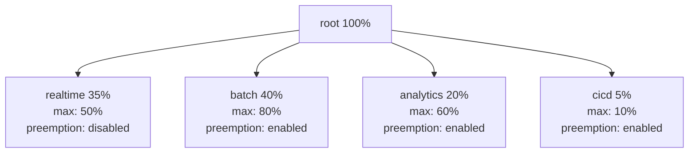

# Scenario Questions — YARN

<article data-difficulty="junior">

## 🟢 Junior: Application Stuck in ACCEPTED State

**Scenario:** A data engineer submits a Spark job to the YARN cluster. The application shows `ACCEPTED` state in the YARN UI for 30 minutes without starting. No error message is visible. Other jobs on the cluster are running normally. What could be causing this and how do you diagnose it?

<details>
<summary>💡 Hint</summary>
ACCEPTED means the ResourceManager received the application but hasn't started the ApplicationMaster yet. Think about what's needed to start the AM: queue capacity, available resources, and node constraints.
</details>

<details>
<summary>✅ Solution</summary>

**Diagnostic Steps:**

**Step 1: Check queue status**
```bash
yarn queue -status root.default
# Look for: used capacity, pending applications
# If used = maximum-capacity → queue is full
```

**Step 2: Check cluster resources**
```bash
yarn node -list
# Available Memory, Available VCores for each node
# Sum available: is there enough for the AM container?

# Check ResourceManager UI: http://rm-host:8088/cluster
# Look at: Memory Used vs Total, VCores Used vs Total
```

**Step 3: Check the application's AM resource request**
```bash
yarn application -status application_12345_0001
# Look at: Num used Containers, Reserved Containers, AM Host
# If Reserved > 0: resources are reserved but not yet available
```

**Step 4: Check for node label constraints**
```bash
# If the Spark job was submitted with --conf spark.yarn.am.nodeLabelExpression=gpu
# and no GPU nodes are available → stuck forever
yarn node -list --all | grep label
```

**Step 5: Check ResourceManager logs**
```bash
grep "application_12345_0001" /var/log/hadoop/yarn/yarn-yarn-resourcemanager-*.log | tail -50
# Look for: "Queue does not have enough headroom"
# Or: "Resource request is beyond maximum capacity"
```

**Common Causes and Fixes:**

| Cause | How to Identify | Fix |
|-------|----------------|-----|
| Queue at max capacity | `used = maximum-capacity` | Wait, kill lower-priority jobs, or increase max |
| No node has enough memory | All nodes show low available memory | Reduce `--executor-memory` or `--driver-memory` |
| Wrong node label | Job requests non-existent label | Fix job configuration |
| User limit exceeded | RM logs show user limit message | Wait for user's other jobs to finish |
| AM resource too large | RM logs show "beyond max allocation" | Reduce driver memory |

**Prevention:**
```bash
# Check resources before submitting
yarn node -list | awk 'NR>3 {memAvail += $5} END {print "Available:", memAvail, "MB"}'
# Estimate job needs: executors × memory + driver memory
# Submit to correct queue with appropriate resources
```

</details>

</article>

<article data-difficulty="mid-level">

## 🟡 Mid-Level: Designing Queue Strategy for Mixed Workloads

**Scenario:** Your company runs a shared Hadoop cluster with these workload types:
- **Real-time ETL**: 10 jobs/hour, each needing 5 min completion, cannot be delayed
- **Daily batch**: 20 large jobs that run between 6 PM and 6 AM
- **Ad-hoc analytics**: Data scientists submit unpredictable queries throughout the day
- **CI/CD testing**: Short test jobs submitted during business hours, must not consume excessive resources

Design the YARN queue strategy including capacity, preemption, and user limits.

<details>
<summary>💡 Hint</summary>
Think about which workloads conflict with each other, which need guaranteed resources vs. best-effort, and how to use preemption to protect SLA workloads without starving others.
</details>

<details>
<summary>✅ Solution</summary>

**Queue Design:**



**Configuration:**
```xml
<configuration>
  <property>
    <name>yarn.scheduler.capacity.root.queues</name>
    <value>realtime,batch,analytics,cicd</value>
  </property>

  <!-- Realtime: 35% guaranteed, protected from preemption -->
  <property>
    <name>yarn.scheduler.capacity.root.realtime.capacity</name>
    <value>35</value>
  </property>
  <property>
    <name>yarn.scheduler.capacity.root.realtime.maximum-capacity</name>
    <value>50</value>
  </property>
  <property>
    <name>yarn.scheduler.capacity.root.realtime.disable_preemption</name>
    <value>true</value>
  </property>
  <property>
    <name>yarn.scheduler.capacity.root.realtime.priority</name>
    <value>10</value>
  </property>

  <!-- Batch: 40% guaranteed, can burst nights/weekends -->
  <property>
    <name>yarn.scheduler.capacity.root.batch.capacity</name>
    <value>40</value>
  </property>
  <property>
    <name>yarn.scheduler.capacity.root.batch.maximum-capacity</name>
    <value>80</value>
  </property>
  <!-- Batch jobs can be preempted if realtime queue fills up -->

  <!-- Analytics: 20% for data scientists, per-user limits -->
  <property>
    <name>yarn.scheduler.capacity.root.analytics.capacity</name>
    <value>20</value>
  </property>
  <property>
    <name>yarn.scheduler.capacity.root.analytics.maximum-capacity</name>
    <value>60</value>
  </property>
  <property>
    <name>yarn.scheduler.capacity.root.analytics.user-limit-factor</name>
    <value>0.5</value>  <!-- No single data scientist > 10% cluster -->
  </property>
  <property>
    <name>yarn.scheduler.capacity.root.analytics.maximum-am-resource-percent</name>
    <value>0.15</value>
  </property>

  <!-- CICD: strict limits for test jobs -->
  <property>
    <name>yarn.scheduler.capacity.root.cicd.capacity</name>
    <value>5</value>
  </property>
  <property>
    <name>yarn.scheduler.capacity.root.cicd.maximum-capacity</name>
    <value>10</value>
  </property>
  <!-- Single container limit for test isolation -->
  <property>
    <name>yarn.scheduler.capacity.root.cicd.maximum-allocation-mb</name>
    <value>4096</value>
  </property>
</configuration>
```

**Submission Configuration by Workload:**
```bash
# Real-time ETL
spark-submit --queue root.realtime --priority 10 etl_job.py

# Batch jobs (time-restricted start via Oozie coordinator)
hadoop jar batch.jar MyBatchJob \
  -D mapreduce.job.queuename=root.batch /input /output

# Ad-hoc analytics (data scientists)
spark-submit --queue root.analytics \
  --conf spark.dynamicAllocation.enabled=true \
  --conf spark.dynamicAllocation.maxExecutors=20 \
  analysis.py

# CI/CD test jobs
spark-submit --queue root.cicd \
  --num-executors 2 --executor-memory 2g \
  --driver-memory 1g \
  test_job.py
```

**Expected Behavior:**
- During business hours: realtime=35%, analytics=20%, cicd=5%, batch uses remaining 40%
- Night hours: batch bursts to 80%, realtime maintains 35%, analytics/cicd idle
- Burst scenario: if realtime needs more → preempts from analytics/batch queues (not cicd, which has strict max)

</details>

</article>

<article data-difficulty="senior">

## 🔴 Senior: Cascading Failure — One Queue Starving the Cluster

**Scenario:** At 9 AM Monday, a data engineer accidentally submits 500 small Spark jobs to the `analytics` queue instead of a test cluster. The analytics queue is configured with `maximum-capacity=60%`. Within minutes, the production real-time ETL jobs (in the `realtime` queue) start failing with timeout errors. The batch jobs scheduled overnight haven't finished either. You are on call. Diagnose and recover the cluster within 15 minutes, then design safeguards to prevent recurrence.

<details>
<summary>💡 Hint</summary>
Think about immediate mitigation (kill the runaway jobs), understanding what broke (why did realtime fail if it has its own queue?), and systemic fixes (rate limits, job limits per user, automated detection). The most interesting part is diagnosing WHY realtime failed if queues are supposed to be isolated.
</details>

<details>
<summary>✅ Solution</summary>

**Minute 0-3: Immediate Investigation**

```bash
# 1. Get cluster overview
curl -s http://rm-host:8088/ws/v1/cluster/metrics | python3 -m json.tool
# Expected: appsRunning=500+, allocatedMB near totalMB

# 2. Find the runaway user
yarn application -list -appStates RUNNING | awk '{print $8}' | sort | uniq -c | sort -rn | head
# Output: "485 engineer_john" → found the culprit

# 3. Check realtime queue status
yarn queue -status root.realtime
# Expected: usedCapacity=35%, state=RUNNING
# BUT: appsAccepted (pending) in realtime queue? → Yes, 12 pending!
```

**Root Cause Analysis:**

```
The realtime queue's ApplicationMasters are consuming the 
maximum-am-resource-percent (default 10% of queue).

With 500 apps in analytics queue, their AMs also consume resources.
The realtime queue has capacity=35%, but if AM resources are exhausted
across the cluster, new AMs can't start even in an uncongested queue.

Secondary issue: The overnight batch jobs didn't finish because
analytics jobs consumed resources the batch queue was bursting into.
Batch queue: guaranteed=40%, but was using 70% during the night.
When analytics queue exploded, it reclaimed that burst capacity.
```

**Minute 3-8: Mitigation**

```bash
# Kill ALL applications for the runaway user
yarn application -list -appStates RUNNING,ACCEPTED \
  -user engineer_john | grep application | awk '{print $1}' | \
  xargs -I{} yarn application -kill {}

# Verify killing is in progress
watch -n 5 "yarn application -list -appStates RUNNING | wc -l"
# Should drop from 500 to <20 within 2-3 minutes

# Also kill the accepted ones (in queue but not started)
yarn application -list -appStates ACCEPTED \
  -user engineer_john | grep application | awk '{print $1}' | \
  xargs -I{} yarn application -kill {}
```

**Minute 8-12: Restore Production**

```bash
# Verify realtime queue is recovering
yarn queue -status root.realtime
# usedCapacity should drop as killed app resources free up

# Check if realtime ETL jobs are now running
yarn application -list -appStates RUNNING | grep realtime-etl

# If realtime ETL jobs also failed (not just delayed):
# Restart them from monitoring system or trigger re-run
curl -X POST http://airflow:8080/api/v1/dags/realtime_etl/dagRuns \
  -H "Content-Type: application/json" \
  -d '{"conf": {"date": "2024-01-15"}}'
```

**Minute 12-15: Verify Stability**

```bash
# Monitor cluster returning to normal
watch -n 10 "curl -s http://rm-host:8088/ws/v1/cluster/metrics | \
  python3 -c 'import sys,json; m=json.load(sys.stdin); \
  print(f\"Running: {m[\"clusterMetrics\"][\"appsRunning\"]}, \
  MemUtil: {m[\"clusterMetrics\"][\"allocatedMB\"]/m[\"clusterMetrics\"][\"totalMB\"]:.1%}\")'"
```

**Post-Incident: Systemic Fixes**

```xml
<!-- 1. Per-user application limit in analytics queue -->
<property>
  <name>yarn.scheduler.capacity.root.analytics.maximum-applications-per-user</name>
  <value>10</value>  <!-- No user can submit more than 10 apps at once -->
</property>

<!-- 2. Per-queue application limit -->
<property>
  <name>yarn.scheduler.capacity.root.analytics.maximum-applications</name>
  <value>50</value>
</property>

<!-- 3. Protect AM resources in realtime queue -->
<property>
  <name>yarn.scheduler.capacity.root.realtime.maximum-am-resource-percent</name>
  <value>0.5</value>  <!-- 50% of realtime queue for AMs (allow many small AMs) -->
</property>
```

```python
# 4. Automated detection and alerting
# Prometheus alert rule:
# ALERT YarnUserJobExplosion
# IF yarn_queue_running_apps{queue="analytics", user=".*"} > 20
# FOR 5m
# ANNOTATIONS { summary="Single user running >20 apps in analytics queue" }

# 5. Cluster-wide rate limiting script (submit as cron)
#!/usr/bin/env python3
import subprocess, json, sys

MAX_APPS_PER_USER = 15
result = subprocess.run(['yarn', 'application', '-list', '-appStates', 'RUNNING,ACCEPTED',
    '-outputformat', 'json'], capture_output=True, text=True)
apps = json.loads(result.stdout)
user_counts = {}
for app in apps.get('apps', {}).get('app', []):
    user = app['user']
    user_counts[user] = user_counts.get(user, 0) + 1

for user, count in user_counts.items():
    if count > MAX_APPS_PER_USER:
        print(f"ALERT: {user} has {count} applications running")
        # Page on-call or auto-kill excess
```

**Lessons Learned:**
1. Always test on test cluster — enforce via CI/CD gate that checks cluster name in submission
2. Per-user and per-queue application limits prevent blast radius
3. AM resource exhaustion can affect OTHER queues — this is the non-obvious cross-queue impact
4. Automated detection must catch this within minutes, not when humans notice production failures

</details>

</article>

---

## ⚡ Quick-fire Q&A

**Q: What is YARN and what are its main components?**
A: YARN (Yet Another Resource Negotiator) is Hadoop's cluster resource management layer. Its main components are the ResourceManager (cluster-wide resource arbiter), NodeManagers (per-node resource monitor and container launcher), and ApplicationMasters (per-application negotiation and task management).

**Q: What is a container in YARN?**
A: A container is an allocation of CPU and memory resources on a specific NodeManager node. YARN grants containers to applications; each Map or Reduce task (or Spark executor) runs inside a container, providing resource isolation between concurrent applications.

**Q: How does YARN enable multi-tenancy?**
A: YARN's Capacity Scheduler divides cluster resources into queues with guaranteed capacity allocations per team or application type. Multiple applications can run concurrently, each limited to its queue's share, preventing any single application from monopolizing the cluster.

**Q: What is the role of the ApplicationMaster?**
A: The ApplicationMaster is a framework-specific process (one per application) that negotiates resources from the ResourceManager, tracks task progress, handles task failures, and requests new containers for retries. MapReduce and Spark each have their own ApplicationMaster implementation.

**Q: How does YARN handle node failures?**
A: If a NodeManager stops sending heartbeats, the ResourceManager marks it as dead, reports its containers as failed to the relevant ApplicationMasters, and they request replacement containers. Tasks running on the failed node are re-scheduled on healthy nodes.

**Q: What is the difference between Capacity Scheduler and Fair Scheduler in YARN?**
A: Capacity Scheduler provides hard capacity guarantees per queue, allowing bursting to unused capacity but ensuring minimum allocations. Fair Scheduler dynamically distributes resources equally among running jobs, allowing smaller jobs to get resources quickly without fixed queue boundaries.

**Q: How does YARN support different processing frameworks?**
A: Any framework that implements the YARN ApplicationMaster protocol can run on YARN — MapReduce, Spark, Flink, Tez, and others. YARN manages resources; the framework manages its own execution logic, enabling multiple frameworks to coexist on the same cluster.

**Q: What is YARN Node Label and how is it used?**
A: Node Labels tag NodeManager nodes with attributes (e.g., GPU=true, high-memory). Queues or applications can request containers on nodes with specific labels, enabling workload routing — for example, directing ML training jobs to GPU nodes while keeping ETL jobs on standard nodes.

---

## 💼 Interview Tips

- Be precise about YARN's three-tier architecture (ResourceManager → NodeManager → ApplicationMaster) — many candidates conflate the RM with the AM, revealing shallow understanding.
- Know the Capacity vs. Fair Scheduler trade-off clearly: Capacity guarantees queue minimums (good for SLA-sensitive teams); Fair distributes dynamically (good for research workloads with variable job sizes).
- Discuss resource allocation in concrete terms — memory (MB) and vCores are the two resources YARN allocates; knowing this detail separates operational knowledge from theoretical knowledge.
- For senior roles, discuss queue configuration and capacity planning: how you'd size queues for different teams, handle peak demand bursting, and prevent resource starvation.
- Be ready to explain what happens when a cluster is resource-constrained: new application requests queue, existing applications don't get preempted (unless preemption is enabled), and jobs wait.
- Connect YARN to cloud alternatives: on AWS, EMR manages the cluster; on GCP, Dataproc. Showing you understand the managed service equivalent demonstrates modern relevance alongside YARN internals knowledge.
