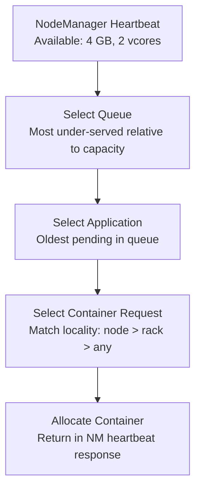
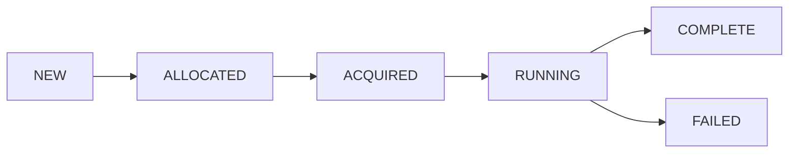
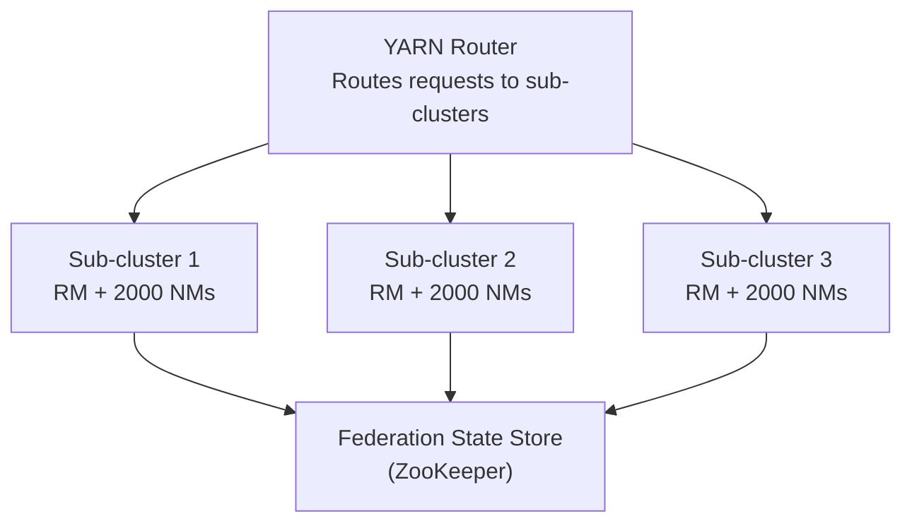

# YARN Senior Deep Dive

## ResourceManager Internals

### Scheduling Algorithm (Capacity Scheduler)

The Capacity Scheduler uses a multi-level decision process:



**Key scheduling decisions:**
1. **Queue selection**: Queue with highest ratio of (used/guaranteed_capacity) is served first — this is the "most starved" queue
2. **Application selection**: Within a queue, ordered by: FIFO vs fair (configurable per queue)
3. **Container selection**: Locality preference: node-local > rack-local > off-rack, with delay scheduling

### Delay Scheduling
YARN waits a brief period hoping a local slot becomes available before accepting a rack-local or off-rack allocation:

```xml
<property>
  <name>yarn.scheduler.capacity.node-locality-delay</name>
  <value>40</value>  <!-- Wait for 40 node heartbeats before accepting rack-local -->
</property>
```

**Why this matters**: Data-local task execution can be 2-5x faster than off-rack. A 40-heartbeat delay (at 1s heartbeat = 40s) is worth waiting for large data tasks.

## Container Allocation Internals

### Resource Request Structure
ApplicationMaster sends `ResourceRequest` objects:

```java
// AM requests containers at multiple locality levels
ResourceRequest nodeLocalRequest = ResourceRequest.newInstance(
    Priority.newInstance(1),
    "node1.datacenter.com",  // Specific node
    Resource.newInstance(2048, 1),  // 2 GB, 1 vcore
    numContainersNeeded,
    true  // relaxLocality
);

ResourceRequest rackLocalRequest = ResourceRequest.newInstance(
    Priority.newInstance(1),
    "/default-rack",  // Any node in same rack
    Resource.newInstance(2048, 1),
    numContainersNeeded,
    true
);

ResourceRequest anyRequest = ResourceRequest.newInstance(
    Priority.newInstance(1),
    ResourceRequest.ANY,  // Any node in cluster
    Resource.newInstance(2048, 1),
    numContainersNeeded,
    false  // Don't relax from rack-local
);

am.allocate(Arrays.asList(nodeLocalRequest, rackLocalRequest, anyRequest),
    new ArrayList<>());
```

### Container Lifecycle


- **ALLOCATED**: RM assigned resources; AM hasn't launched yet
- **ACQUIRED**: AM retrieved the allocation and is preparing to launch
- **RUNNING**: NM confirmed container is running
- **COMPLETE/FAILED**: Terminal states

## YARN Federation (for Very Large Clusters)

For clusters with 10,000+ nodes, a single ResourceManager becomes a bottleneck. YARN Federation splits the cluster into sub-clusters:



```xml
<!-- yarn-site.xml: Enable Federation -->
<property>
  <name>yarn.federation.enabled</name>
  <value>true</value>
</property>
<property>
  <name>yarn.federation.state-store.class</name>
  <value>org.apache.hadoop.yarn.server.federation.store.impl.ZKFederationStateStore</value>
</property>
<property>
  <name>yarn.router.webapp.address</name>
  <value>router-host:8089</value>
</property>
```

## Node Heartbeat Tuning

```xml
<!-- Heartbeat interval affects scheduling responsiveness vs overhead -->
<property>
  <name>yarn.resourcemanager.nm-heartbeat-interval-ms</name>
  <value>1000</value>  <!-- Default: 1 second -->
</property>

<!-- For large clusters (1000+ nodes), increase to reduce RM load -->
<!-- Trade-off: slower resource discovery, less responsive scheduling -->
<property>
  <name>yarn.resourcemanager.nm-heartbeat-interval-ms</name>
  <value>2000</value>  <!-- 2 seconds for large cluster -->
</property>

<!-- How often NM checks container status -->
<property>
  <name>yarn.nodemanager.localizer.cache.cleanup.interval-ms</name>
  <value>600000</value>
</property>
```

## Application-Level Resource Optimization

### Container Reuse (for MapReduce)
```xml
<!-- Reuse JVM across multiple tasks in same container (reduces JVM startup overhead) -->
<property>
  <name>mapreduce.job.jvm.numtasks</name>
  <value>-1</value>  <!-- -1 = reuse indefinitely within a container -->
</property>
<!-- Warning: static state persists between tasks; ensure mappers/reducers are stateless -->
```

### Dynamic Resource Allocation (Spark)
```bash
# Spark can request and release executors dynamically based on workload
spark-submit \
  --master yarn \
  --conf spark.dynamicAllocation.enabled=true \
  --conf spark.dynamicAllocation.minExecutors=2 \
  --conf spark.dynamicAllocation.maxExecutors=50 \
  --conf spark.dynamicAllocation.initialExecutors=5 \
  --conf spark.dynamicAllocation.executorIdleTimeout=60s \
  --conf spark.shuffle.service.enabled=true \  # Required for dynamic allocation
  myapp.py
```

**Why shuffle service is required**: When an executor is released, its shuffle data must remain accessible. The YARN NodeManager Auxiliary Service (shuffle service) holds shuffle data independently of the executor container.

## Handling Cluster Heterogeneity

### Dominant Resource Fairness (DRF)
In heterogeneous clusters, different jobs need different resource ratios:
- Job A: CPU-intensive (needs many cores, little memory)
- Job B: Memory-intensive (needs few cores, much memory)

DRF ensures fairness based on the **dominant resource** (the resource that is the bottleneck for each job):

```
Job A uses: 8 cores (50% of 16), 2 GB (10% of 20 GB)
  → Dominant resource: CPU (50%)

Job B uses: 2 cores (12.5% of 16), 12 GB (60% of 20 GB)
  → Dominant resource: Memory (60%)

Fair: Job B is using more of its dominant resource → Job A gets next allocation
```

## Production Tuning Checklist

```xml
<!-- ResourceManager tuning for large clusters -->
<property>
  <name>yarn.resourcemanager.scheduler.client.thread-count</name>
  <value>50</value>  <!-- AM-RM RPC threads; increase for many concurrent apps -->
</property>
<property>
  <name>yarn.resourcemanager.resource-tracker.client.thread-count</name>
  <value>50</value>  <!-- NM-RM RPC threads; scale with node count -->
</property>
<property>
  <name>yarn.resourcemanager.admin.client.thread-count</name>
  <value>1</value>  <!-- Admin operations; keep low -->
</property>

<!-- NodeManager tuning -->
<property>
  <name>yarn.nodemanager.localizer.client.thread-count</name>
  <value>5</value>  <!-- Threads for localizing resources (jars, configs) -->
</property>
<property>
  <name>yarn.nodemanager.delete.thread-count</name>
  <value>4</value>  <!-- Threads for cleaning up finished container dirs -->
</property>
```

## Diagnosing YARN Issues

### Application Stuck in ACCEPTED State
```bash
# Check if queue has capacity
yarn queue -status root.production

# Check ResourceManager logs for the application
grep "application_12345_0001" /var/log/hadoop/yarn/yarn-yarn-resourcemanager-*.log

# Common causes:
# 1. No nodes available with required memory/cores
# 2. Queue is at maximum capacity
# 3. Node label constraints not satisfied
# 4. AM resource request exceeds cluster max
```

### NodeManager Going Down Repeatedly
```bash
# Check NodeManager logs
grep -E "ERROR|WARN" /var/log/hadoop/yarn/yarn-yarn-nodemanager-*.log | tail -100

# Check cgroup limits if using Linux Container Executor
cat /sys/fs/cgroup/memory/hadoop-yarn/memory.limit_in_bytes

# Check disk health (NM needs local disk for container working directories)
df -h
iostat -x 5 3
```

### Resource Fragmentation
Occurs when small containers leave gaps that can't fit larger requests:

```
Cluster: 4 nodes × 8 GB = 32 GB total
Running: 10 containers × 2 GB = 20 GB used
Pending: 1 container × 8 GB = needs 8 GB free on ONE node

Available: 4 nodes × (8-5=3 GB each) = 12 GB total free
But no single node has 8 GB free → JOB WAITS despite 12 GB free cluster-wide
```

**Mitigation**: Container right-sizing (avoid unnecessarily large containers), queue max container size limits.

## Interview Tips

> **Tip 1:** DRF (Dominant Resource Fairness) is a key concept for senior roles. Explain that in a heterogeneous cluster, simple memory-based fairness disadvantages CPU-intensive jobs. DRF's equalizing of dominant resource usage percentages is the mathematically sound solution.

> **Tip 2:** When discussing YARN Federation, compare it to HDFS Federation: both solve the same problem (master node bottleneck at large scale) using the same pattern (multiple independent masters sharing worker nodes). This shows systems thinking.

> **Tip 3:** Resource fragmentation is a real production pain point. Explain the difference between cluster-level free resources and node-level availability. The solution: standardize container sizes (e.g., always use 4 GB or 8 GB containers) to reduce fragmentation.

> **Tip 4:** Dynamic Resource Allocation in Spark requires the External Shuffle Service because executor containers can be released while their shuffle data is still needed by downstream stages. Without it, releasing an executor loses its shuffle files. This is a subtle but important detail.

> **Tip 5:** Delay scheduling is often the difference between a well-performing and poorly-performing cluster. If delay is too short, many containers run off-rack (network I/O intensive). If too long, the scheduler wastes time waiting for local slots that never become available. Tuning requires monitoring locality statistics in the RM web UI.

## ⚡ Cheat Sheet

**HDFS architecture**
```
NameNode:   stores metadata (file → block mappings, permissions, namespace)
DataNode:   stores actual data blocks (default 128 MB per block)
Replication: default factor 3 (two local rack + one remote rack)
HA:         Active/Standby NameNode with JournalNodes for edit log sharing
```

**HDFS key commands**
```bash
hdfs dfs -ls /data/warehouse          # list files
hdfs dfs -put local.csv /data/raw/    # upload
hdfs dfs -get /data/output/ ./local/  # download
hdfs dfs -rm -r /data/tmp/            # delete
hdfs dfs -du -s -h /data/warehouse/   # disk usage
hdfs dfs -copyFromLocal -f src dst    # overwrite on upload
hdfs fsck /path -files -blocks        # check file health
```

**YARN resource model**
```
ResourceManager:  cluster master — allocates containers
NodeManager:      per-node agent — runs containers, reports health
ApplicationMaster: per-job — negotiates resources with RM
Container:        allocated unit (CPU cores + memory)

Scheduler types: FIFO, Capacity Scheduler (queues), Fair Scheduler
```

**Hive vs Spark SQL**
```
Hive:      MapReduce by default (slow); good for compatibility; HQL ≈ SQL
Hive LLAP: in-memory daemon; much faster (sub-minute queries)
Spark SQL:  Hive Metastore compatible but Spark execution — 10-100x faster
```

**Hive partitioning**
```sql
CREATE TABLE orders (order_id BIGINT, amount DOUBLE)
PARTITIONED BY (dt STRING, region STRING)
STORED AS PARQUET;
-- Dynamic partition insert
SET hive.exec.dynamic.partition.mode=nonstrict;
INSERT INTO orders PARTITION (dt, region)
SELECT order_id, amount, dt, region FROM staging_orders;
```

**MapReduce pattern**
```
Map:    input splits → emit (key, value) pairs
Shuffle: sort + group by key across nodes
Reduce: aggregate values per key → output
Use case today: Hive compatibility, very large batch on older clusters
```

**ZooKeeper use cases in Hadoop**
```
HBase region assignment  — ZK tracks which RegionServer owns which region
HDFS NameNode HA         — ZK elects Active NameNode
YARN RM HA               — ZK elects Active ResourceManager
Kafka broker coordination — ZK stores broker/topic metadata (pre-KRaft)
```

**HBase data model**
```
Table → Row → Column Family → Column Qualifier → Value (versioned by timestamp)
Row key design is critical: avoid hot-spotting (don't use sequential IDs)
Strategies: salt prefix, reverse timestamp, MD5 hash of natural key
```

**Key interview points**
- HDFS is optimized for large files, sequential reads; terrible for many small files
- Sqoop: parallel JDBC import from RDBMS to HDFS/Hive (one mapper per table partition)
- Oozie: XML-based workflow scheduler (predecessor to Airflow in Hadoop ecosystem)
- Pig: dataflow language (Latin) — pre-dbt/Spark era; rarely used in modern stacks
- Ecosystem today: HDFS + YARN still used, but S3/GCS replacing HDFS in cloud-native stacks
