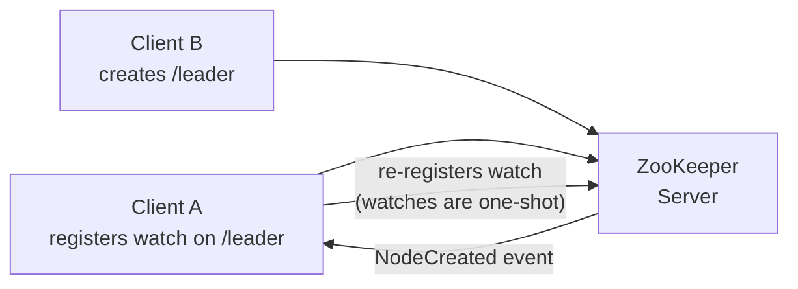
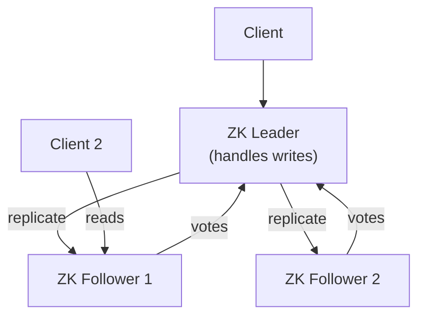

# ZooKeeper — Fundamentals

## What ZooKeeper Solves

Distributed systems face fundamental coordination challenges:
- **Leader election**: Which node is the master?
- **Configuration management**: How do all nodes get the same config?
- **Distributed locking**: How do you prevent two nodes from modifying the same data?
- **Service discovery**: Where is service X running right now?
- **Barrier synchronization**: How do you wait for N nodes to reach a checkpoint?

ZooKeeper is a distributed coordination service that provides primitives to solve these problems. It's the "traffic controller" of a Hadoop cluster.

## ZNode Types

ZooKeeper's filesystem-like namespace uses nodes called ZNodes:

| Type | Persistence | Numbered | Use case |
|------|-------------|----------|----------|
| **Persistent** | Survives client disconnect | No | Configuration, service registry |
| **Persistent Sequential** | Survives client disconnect | Yes (auto-incremented) | Ordered queue items |
| **Ephemeral** | Deleted when client disconnects | No | Leader election, liveness detection |
| **Ephemeral Sequential** | Deleted on disconnect | Yes | Distributed lock, leader election queue |

```
ZNode Structure Example:
/
├── hadoop-ha/
│   └── nameservice1/
│       ├── ActiveBreadCrumb      (persistent: which NN is active)
│       └── ActiveStandbyElector  (ephemeral: current leader lock)
├── hbase/
│   ├── master                   (ephemeral: current HBase master)
│   └── rs/
│       ├── rs001:16020           (ephemeral: region server alive)
│       └── rs002:16020           (ephemeral: region server alive)
└── kafka/
    └── brokers/
        └── ids/
            ├── 1                 (ephemeral: broker 1 alive)
            └── 2                 (ephemeral: broker 2 alive)
```

## Watches

Watches are one-time notifications: a client registers a watch on a ZNode and gets notified when that ZNode changes:



**Watch events:**
- `NodeCreated`: ZNode created
- `NodeDeleted`: ZNode deleted
- `NodeDataChanged`: ZNode data updated
- `NodeChildrenChanged`: Children of ZNode changed

## ZooKeeper Ensemble and Quorum

ZooKeeper runs as an ensemble (cluster) for fault tolerance:



**Quorum rule**: A ZooKeeper ensemble with N servers can tolerate `(N-1)/2` failures:

| Ensemble size | Failures tolerated | Quorum needed |
|--------------|-------------------|---------------|
| 1 | 0 | 1 |
| 3 | 1 | 2 |
| 5 | 2 | 3 |
| 7 | 3 | 4 |

**Always use odd numbers** — an even-sized ensemble provides no additional fault tolerance over the next-smaller odd number (4-server ensemble tolerates 1 failure, same as 3).

## Basic ZooKeeper Operations

### ZooKeeper CLI (zkCli.sh)

```bash
# Start ZooKeeper CLI
zkCli.sh -server zk-host:2181

# Create a persistent ZNode with data
create /config/app-version "1.0.0"

# Create an ephemeral ZNode
create -e /services/app-server-1 "192.168.1.10:8080"

# Create a sequential ZNode (for locking)
create -e -s /locks/resource- ""
# Creates: /locks/resource-0000000001

# Read data
get /config/app-version
# Returns: 1.0.0  stat: {version: 0, ...}

# Update data
set /config/app-version "1.1.0"

# Delete a ZNode
delete /config/app-version

# List children
ls /config

# Watch for changes
get -w /config/app-version
# This returns the data AND registers a one-time watch

# Show stat (metadata)
stat /config/app-version
# cZxid, mZxid, version, dataLength, numChildren, etc.
```

## ZooKeeper Session Concepts

```
Session lifecycle:
  Connect → Authenticate → Use → Disconnect (or timeout)

Session timeout:
  If the client doesn't send a heartbeat within session.timeout,
  ZooKeeper considers the session expired.
  ALL ephemeral ZNodes created by that session are deleted.

This is how ZooKeeper detects node failures:
  - Each node registers as /services/node-X (ephemeral)
  - If the node crashes, session expires, /services/node-X is deleted
  - Watchers on /services are notified
  - Leader election or failover logic runs
```

## Use Cases Overview

| Use case | ZooKeeper mechanism |
|----------|-------------------|
| Hadoop NameNode HA | Ephemeral ZNode for active NN; leader election |
| HBase Master election | Ephemeral ZNode; first writer wins |
| Kafka broker registration | Ephemeral ZNode per broker ID |
| Kafka controller election | Ephemeral ZNode; watches for changes |
| Distributed lock | Sequential ephemeral ZNodes; lowest wins |
| Configuration broadcast | Persistent ZNode; watches on all clients |
| Service discovery | Persistent children per service instance |

## ZooKeeper Configuration

```bash
# zoo.cfg (basic 3-node ensemble)
tickTime=2000           # Base time unit in ms
dataDir=/var/zookeeper/data
clientPort=2181
initLimit=10            # Leader startup: 10 * tickTime = 20 seconds
syncLimit=5             # Follower sync: 5 * tickTime = 10 seconds
maxClientCnxns=60       # Max connections per client IP

# Ensemble members
server.1=zk1:2888:3888
server.2=zk2:2888:3888
server.3=zk3:2888:3888
# Port 2888: follower-to-leader communication
# Port 3888: leader election
```

```bash
# Start ZooKeeper server
zkServer.sh start

# Check status (leader or follower)
zkServer.sh status

# Stop
zkServer.sh stop

# Check connectivity and leader
echo ruok | nc zk-host 2181  # Returns "imok" if healthy
echo stat | nc zk-host 2181  # Shows connections, mode, etc.
echo mntr | nc zk-host 2181  # Detailed metrics
```

## Interview Tips

> **Tip 1:** ZooKeeper's fundamental guarantee is **linearizability for writes** and **sequential consistency for reads**. Writes go through the leader; reads can be served by any server (possibly slightly stale). If you need the latest data, use `sync()` before reading.

> **Tip 2:** Ephemeral nodes are the key to failure detection. When a node crashes, its ZooKeeper session expires (after `session.timeout` ms), and all its ephemeral ZNodes are automatically deleted. Watchers on those nodes fire, triggering failover logic. This is more reliable than heartbeat polling.

> **Tip 3:** Watches are one-shot. After a watch fires, it is removed. Clients must re-register watches after receiving a notification. This is a common bug: if you forget to re-register, you stop receiving updates.

> **Tip 4:** Always use odd ensemble sizes. A 4-node ensemble is not more fault-tolerant than a 3-node ensemble (both tolerate 1 failure) but requires more resources. The correct progression is 1 → 3 → 5 → 7.

> **Tip 5:** ZooKeeper is not a general-purpose database. Its strengths are coordination primitives (leader election, locking, service discovery). Don't use it to store large data — ZNode data is limited to 1 MB, and it's optimized for small, infrequently updated coordination data.
