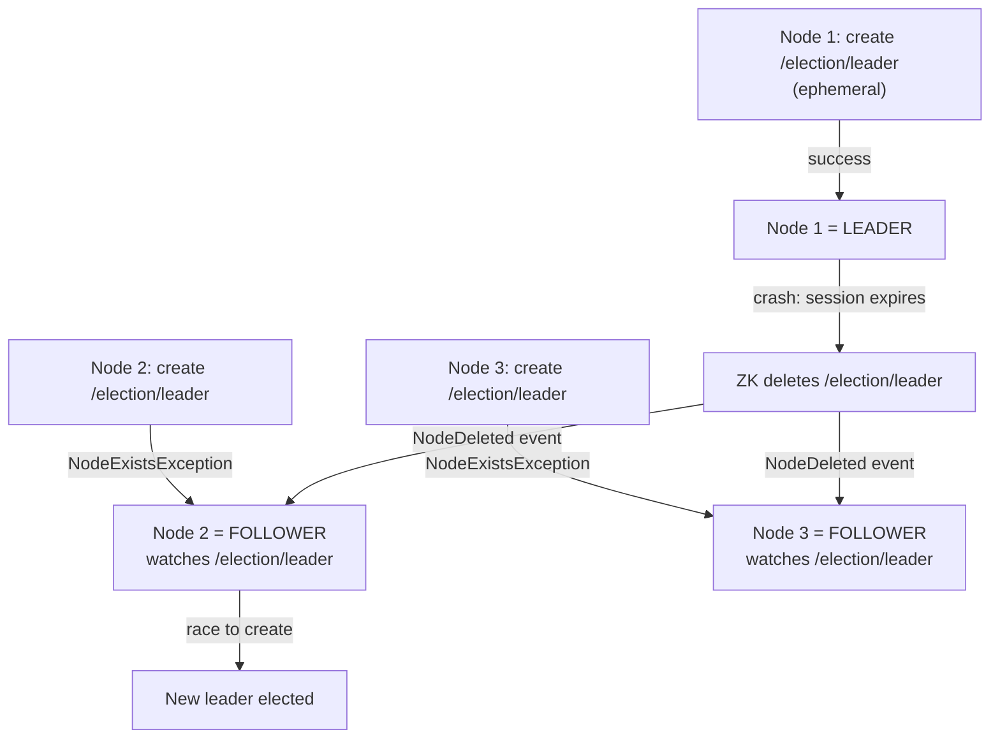
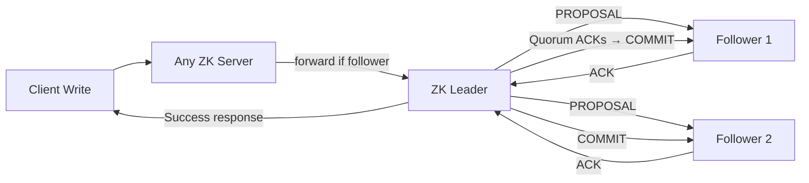
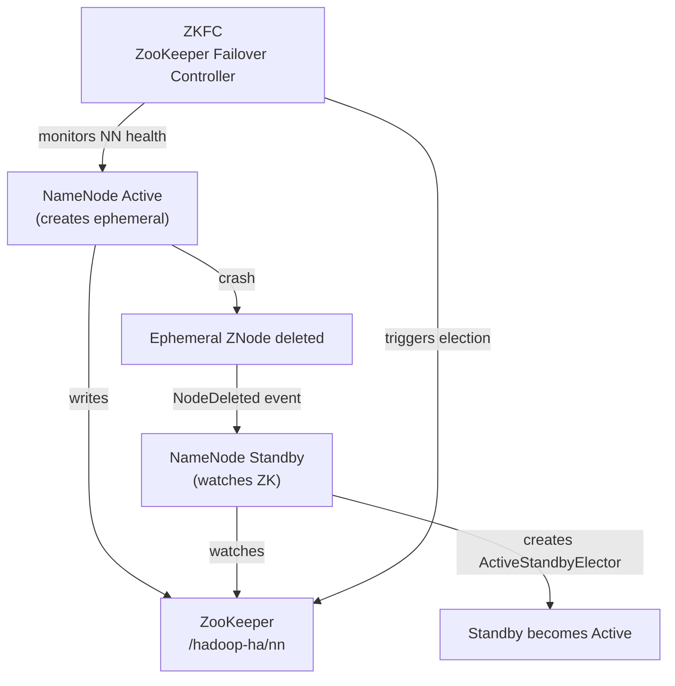

# ZooKeeper — Intermediate

## Leader Election Pattern

Leader election is ZooKeeper's most important distributed algorithm. All candidates try to create the same ephemeral ZNode — only one succeeds (the leader):



### Code Pattern for Leader Election

```java
public class LeaderElection implements Watcher {
    private ZooKeeper zk;
    private String myZNodePath;

    public void attemptLeadership() throws KeeperException, InterruptedException {
        try {
            // Try to create ephemeral ZNode
            myZNodePath = zk.create(
                "/election/leader",
                InetAddress.getLocalHost().getHostAddress().getBytes(),
                ZooDefs.Ids.OPEN_ACL_UNSAFE,
                CreateMode.EPHEMERAL
            );
            System.out.println("I am the LEADER: " + myZNodePath);
            onBecomeLeader();
        } catch (KeeperException.NodeExistsException e) {
            System.out.println("I am a FOLLOWER");
            // Watch the current leader for its deletion
            zk.getData("/election/leader", this, null);
        }
    }

    @Override
    public void process(WatchedEvent event) {
        if (event.getType() == EventType.NodeDeleted) {
            System.out.println("Leader died, trying to become leader...");
            try {
                attemptLeadership();
            } catch (Exception ex) {
                ex.printStackTrace();
            }
        }
    }
}
```

## Distributed Locking

Distributed locks prevent concurrent access to shared resources. Uses sequential ephemeral ZNodes:

```
Algorithm:
1. Create ephemeral sequential ZNode: /locks/resource-0000000001
2. List all children of /locks/
3. If my ZNode has the smallest sequence number → I hold the lock
4. Otherwise → watch the ZNode with the next-smaller sequence number
5. When that ZNode is deleted → go to step 2

This avoids the "herd effect" — only one client is watching each lock holder.
```

```python
# Python distributed lock using kazoo library
from kazoo.client import KazooClient
from kazoo.recipe.lock import Lock

zk = KazooClient(hosts='zk1:2181,zk2:2181,zk3:2181')
zk.start()

lock = Lock(zk, "/locks/shared-resource")

# Context manager for automatic release
with lock:
    print("I have the lock, doing work...")
    # Critical section here
    process_shared_resource()
    print("Releasing lock")

# Manual lock acquire/release
lock.acquire()
try:
    process_shared_resource()
finally:
    lock.release()

zk.stop()
```

## Service Discovery Pattern

```python
# Service Registration (called at startup by each service instance)
from kazoo.client import KazooClient
import socket, json

zk = KazooClient(hosts='zk1:2181,zk2:2181,zk3:2181')
zk.start()

# Register this service instance
service_data = json.dumps({
    "host": socket.gethostname(),
    "port": 8080,
    "version": "2.1.0"
}).encode()

# Ephemeral node — auto-deleted if service crashes
zk.create(
    f"/services/user-service/{socket.gethostname()}",
    service_data,
    ephemeral=True,
    makepath=True
)

# Service Discovery (called by clients looking for a service)
def get_service_instances(service_name):
    children = zk.get_children(f"/services/{service_name}")
    instances = []
    for child in children:
        data, _ = zk.get(f"/services/{service_name}/{child}")
        instances.append(json.loads(data))
    return instances

instances = get_service_instances("user-service")
print(f"Found {len(instances)} instances: {instances}")
```

## ZAB Protocol (ZooKeeper Atomic Broadcast)

ZAB is ZooKeeper's consensus protocol — it ensures all servers apply updates in the same order:

```
ZAB Phases:

Phase 1: LEADER ELECTION
  - All servers start in LOOKING state
  - Exchange votes (epoch + zxid + server ID)
  - Server with highest (epoch, zxid) wins
  - Majority must agree

Phase 2: RECOVERY (sync)
  - New leader discovers committed but not fully propagated changes
  - Syncs followers to latest committed state
  - Followers truncate uncommitted transactions

Phase 3: BROADCAST (normal operation)
  - Client sends write to any server
  - Non-leader forwards to leader
  - Leader sends PROPOSAL to all followers
  - Followers ACK if they wrote to disk
  - Quorum ACKs → leader sends COMMIT
  - All servers apply the transaction
```



**Key ZAB concept — ZXID**: A 64-bit transaction ID where the upper 32 bits are the epoch (leader term) and lower 32 bits are the counter. Each write increments the counter; a new leader election increments the epoch.

## Session Management and Timeouts

```
Session timeout (negotiated between client and server):
  - Client proposes: 5000ms
  - Server clamps to: [2 * tickTime, 20 * tickTime]
  - tickTime = 2000ms → range: [4000ms, 40000ms]
  - Negotiated timeout is max(client_timeout, 2*tickTime)

What happens on timeout:
  1. Client fails to send heartbeat within session timeout
  2. ZooKeeper expires session
  3. All ephemeral ZNodes from that session are deleted
  4. Client gets SESSION_EXPIRED on next operation
  5. Client must create a new ZooKeeper connection (new session)

Best practices:
  - Set session timeout >= 3x your network round-trip time
  - Set session timeout << your application's acceptable failover time
  - Typical production: 15-30 seconds
```

```java
// Handling session expiration
public void process(WatchedEvent event) {
    if (event.getState() == KeeperState.Expired) {
        System.out.println("Session expired! Reconnecting...");
        // Must create a new ZooKeeper instance
        try {
            zk = new ZooKeeper(connectString, sessionTimeout, this);
            // Re-register ephemeral nodes, re-run leader election, etc.
            registerService();
            attemptLeadership();
        } catch (Exception e) {
            log.error("Failed to reconnect", e);
        }
    }
}
```

## ZooKeeper in Hadoop Ecosystem

### HDFS NameNode HA



### HBase Master Election

```bash
# View HBase ZooKeeper ZNodes
zkCli.sh -server zk1:2181 <<< "ls /hbase"
# [master, meta-region-server, namespace, online-snapshot, replication,
#  rs, running, table, tokenauth, unassigned]

# View current HBase master
zkCli.sh -server zk1:2181 <<< "get /hbase/master"
# Returns: hostname:port\x00.... (binary with master info)

# View active region servers
zkCli.sh -server zk1:2181 <<< "ls /hbase/rs"
# [rs001.corp:16020,rs002.corp:16020,rs003.corp:16020]
```

### Kafka Broker Registration

```bash
# View Kafka brokers registered in ZooKeeper
zkCli.sh -server zk1:2181 <<< "ls /kafka/brokers/ids"
# [0, 1, 2]

# View broker metadata
zkCli.sh -server zk1:2181 <<< "get /kafka/brokers/ids/0"
# {"listener_security_protocol_map":{"PLAINTEXT":"PLAINTEXT"},
#  "endpoints":["PLAINTEXT://kafka-broker-0:9092"],
#  "host":"kafka-broker-0", "port":9092, "version":5}

# View Kafka controller (which broker is the controller)
zkCli.sh -server zk1:2181 <<< "get /kafka/controller"
# {"version":2,"brokerid":0,"timestamp":"1705276800000"}
```

## Interview Tips

> **Tip 1:** The sequential ephemeral lock pattern avoids the "thundering herd" problem. With a simple ephemeral ZNode, all waiting clients get notified when the lock is released and all compete at once. With sequential ZNodes, each client only watches its predecessor, so only one client is woken up per lock release.

> **Tip 2:** ZAB (ZooKeeper Atomic Broadcast) guarantees that writes are totally ordered across all servers. This is stronger than Paxos's guarantee in practice — ZAB is designed specifically for primary-backup systems where state replication is the primary concern.

> **Tip 3:** Session timeout is the critical tuning parameter for ZooKeeper-based HA. Too short → false failovers on GC pauses or slow networks. Too long → slow recovery from actual node failures. The typical production range is 15-30 seconds, tuned based on GC pause times of JVM applications.

> **Tip 4:** ZKFC (ZooKeeper Failover Controller) is a separate daemon that runs alongside each NameNode in Hadoop HA. It monitors NameNode health (via RPC health check) and manages the ZooKeeper session. This decoupling is important — ZooKeeper doesn't directly check NameNode health, ZKFC does.

> **Tip 5:** Kafka is moving away from ZooKeeper with KRaft mode (Kafka Raft Metadata). KRaft mode eliminates the ZooKeeper dependency, using Kafka itself as the metadata store. This is important context for 2024+ interviews.
