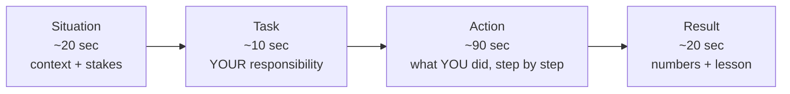

# Behavioral Questions — Fundamentals

Behavioral rounds feel "soft" but are scored as rigorously as coding rounds — and they're the round where prepared candidates gain the most ground for the least effort. This page covers the STAR method tuned for data engineers, the 20 most common questions, and the red flags that sink otherwise strong candidates.

---

## STAR, Tuned for Data Engineers

The DE-specific tuning:

- **Situation** must include scale or stakes: "our nightly revenue pipeline, ~80M rows, feeding the CFO's dashboard" — not "we had a pipeline."
- **Task** separates *your* job from the team's. Juniors blur this constantly; interviewers are grading the "I", not the "we".
- **Action** is 60% of the answer. Name tools, decisions, and at least one alternative you rejected.
- **Result** needs a number (latency, rows, hours saved, incidents avoided) and, ideally, one sentence of what you changed afterward.

**Total length: 2–3 minutes.** Past 3 minutes, you're losing the room; the interviewer will dig with follow-ups anyway.

---

## The 20 Most Common Behavioral Questions for DEs

Grouped by theme, with what's actually being tested.

### Failure & reliability (the DE specialty)

| # | Question | What it tests |
|---|---|---|
| 1 | Tell me about a time a pipeline you owned failed. | Ownership, debugging process, blamelessness |
| 2 | Describe a mistake that affected data downstream. | Honesty, impact awareness, prevention follow-through |
| 3 | Tell me about a production incident you handled. | Calm under pressure, communication during fire |
| 4 | A time you shipped something that turned out wrong. | Whether you detect and fix or hide and hope |

### Conflict & collaboration

| # | Question | What it tests |
|---|---|---|
| 5 | A disagreement with an analyst/scientist about data. | Empathy for consumers, evidence-based resolution |
| 6 | A conflict with another engineer about approach. | Disagreeing without being disagreeable |
| 7 | A time you pushed back on a stakeholder request. | Saying no with options, not just no |
| 8 | Working with a difficult teammate. | Maturity — never badmouth |

### Delivery & pressure

| # | Question | What it tests |
|---|---|---|
| 9 | A missed deadline. | Early communication, scope triage |
| 10 | Competing priorities — how did you choose? | Prioritization framework, stakeholder management |
| 11 | A time you had to deliver with incomplete requirements. | Comfort with ambiguity |
| 12 | The most ambitious thing you've shipped. | Scope of impact, initiative |

### Growth & ownership

| # | Question | What it tests |
|---|---|---|
| 13 | A time you learned a new technology quickly. | Learning method, not just outcome |
| 14 | Feedback that was hard to hear. | Coachability |
| 15 | Something you improved that nobody asked you to. | Initiative, ownership instinct |
| 16 | A time you automated/simplified a manual process. | DE instinct for toil reduction |

### Judgment & communication

| # | Question | What it tests |
|---|---|---|
| 17 | Explaining something technical to a non-technical person. | Audience adaptation |
| 18 | A decision you made with incomplete data. | Risk reasoning |
| 19 | A time you found a data quality issue others missed. | Rigor, skepticism about "green" pipelines |
| 20 | Why data engineering? / Why this company? | Motivation coherence, research |

**Prep math:** you do not need 20 stories. **6–8 strong stories cover all 20 questions** because each story answers 3–4 prompts. Build a story-to-question matrix during prep.

---

## A Model Junior Answer, Annotated

**Question:** "Tell me about a time a pipeline you owned failed."

> **(S)** "On my last team I owned the daily ingestion that loaded order CSVs from a vendor SFTP into our warehouse — about 500K rows a day feeding the ops dashboard. **(T)** One Monday the dashboard showed half the usual revenue, and since I owned that pipeline, tracing it was on me. **(A)** I checked our Airflow logs first — the DAG was green, which was the scary part. So I compared row counts between the landed file and the loaded table and found the file itself was truncated; the vendor's export had failed midway. The pipeline had loaded a valid-looking but incomplete file. I notified the ops team immediately so they'd stop trusting the numbers, contacted the vendor for a re-export, and re-ran the load after confirming counts. **(R)** Dashboard was correct by early afternoon. The lasting fix: I added a row-count threshold check that fails the DAG if today's volume drops more than 40% versus the trailing week, plus a checksum the vendor agreed to send. We caught two more truncated files that quarter — before anyone saw a wrong number."

Why this scores well: green-but-wrong is a real DE failure mode; the candidate communicated *before* fixing; the result includes prevention with a number.

---

## Red Flags That Sink Candidates

- **Blaming:** "the analyst kept changing requirements", "ops broke it". Even when true, frame as systems: "we lacked a change process, so I proposed one."
- **No "I":** answering everything as "we did". The interviewer cannot give *you* credit for *we*.
- **The flawless candidate:** "I can't think of a failure." Reads as either low self-awareness or thin experience. Have the failure story loaded.
- **Vague results:** "it worked much better after." Numbers or it didn't happen.
- **Rambling situations:** two minutes of context before any action. Cap the setup at 30 seconds.
- **Confidentiality theater:** refusing all specifics "due to NDA". Anonymize ("a large retail client", "~2 TB/day") instead of going vague.
- **Recency gaps:** all stories from 4+ years ago suggests stagnation. Keep at least half your stories from the last 18 months.

---

## How to Talk About Failure (the formula)

1. **Pick a real failure with real impact** — small-stakes stories ("I once had a typo") read as evasion.
2. **Own your part in one clean sentence:** "I deployed the change without a backfill plan — that was my miss."
3. **Spend most time on detection → response → communication.** DE interviewers care how fast you knew and who you told.
4. **End with the systemic fix** you drove: a check, an alert, a runbook, a process.
5. **Never** end on the failure itself; end on what's true now because of it.

---

## Build Your Story Bank (worksheet)

For each story, fill one row before interview week:

| Field | Your entry |
|---|---|
| Title (2–4 words) | e.g., "Truncated vendor file" |
| Scale numbers | rows/day, data size, users affected |
| My specific role | one sentence, "I" only |
| 3 actions I took | bullets, in order |
| Result number | %, $, hours, incidents |
| Questions it answers | map to #1–20 above |
| 30-second version | for when time is short |

Minimum bank for a junior loop: **5 stories** — one failure, one conflict, one deadline/pressure, one initiative, one learning-fast.

---

## Practice Protocol

- Write stories as bullets, never scripts — scripts sound recited and collapse under follow-ups.
- Rehearse **out loud**, twice per story; once at full length, once compressed to 60 seconds.
- Record one and listen for: "we" overuse, missing numbers, setup longer than 30 seconds.
- Have a friend ask two random follow-ups per story — follow-up survival is the real test.

For stronger frameworks, level-calibrated stories, and bar-raiser dynamics, continue to **intermediate.md** and **senior-deep-dive.md**.
