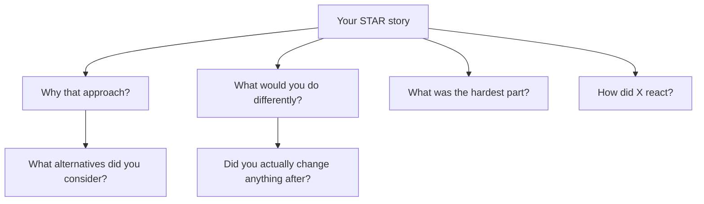

# Behavioral Questions — Intermediate

You know STAR. This page is about *winning* behavioral rounds at mid-level: calibrating stories to the level you're interviewing for, surviving follow-up drilling, handling the hard question families (conflict, missed deadlines, on-call), and steering the conversation toward your strengths.

---

## Level Calibration: The Same Story, Told Three Ways

Interviewers level-calibrate from your stories' *scope*, not your title. Watch one incident shift levels:

| Level read | "The pipeline failed and…" |
|---|---|
| Junior | "…I debugged it, fixed the bug, and re-ran the job." |
| Mid | "…I debugged it, fixed it, then added volume checks and an alert so the class of failure gets caught before consumers see it. I also wrote the runbook." |
| Senior | "…I ran the incident: assigned debugging, communicated ETA to stakeholders hourly, and after resolution led the postmortem that changed our deployment process for all eight pipelines on the team." |

**Mid-level signals to engineer into your stories:**
- Prevention, not just resolution (checks, alerts, runbooks)
- Consumers considered (who was told, when, how)
- Influence one step beyond your ticket (you improved the team's process at least once)

If every story ends at "fixed it", you'll be down-leveled regardless of resume.

---

## Surviving Follow-Up Drilling

Mid-level behavioral rounds are interrogative. Expect 3–5 follow-ups per story:

**Drill-proofing rules:**

- **Only tell true stories.** Embellishments collapse at follow-up depth 3. Interviewers are trained to drill until the details either cohere or crumble.
- **Pre-answer the big four** for each story: why this approach / what alternatives / hardest part / what changed after. Write one bullet each.
- **"What would you do differently"** always has a real answer prepared. "Nothing" is an instant red flag; pick a genuine improvement that doesn't undermine the story.
- If a follow-up hits something you genuinely don't remember, say so and reason aloud from what you do remember — composure under "I don't know" is itself scored.

---

## The Hard Question Families

### Conflict with analysts / data scientists

The trap: sounding like you think consumers are the enemy. The winning frame: **shared goal, different constraints, evidence resolves it**.

> "Our ML team wanted raw event-level data with no transformation — they didn't trust our cleaning. I wanted to avoid two teams maintaining duplicate logic. Instead of arguing in Slack, I set up a working session where we walked through three concrete records my pipeline had 'cleaned'. Two of my transformations were genuinely destroying signal they needed — I was wrong about those. One of theirs was a misread of the source schema. We ended with a bronze layer they could read raw plus a documented silver layer, and a contract on what cleaning happens where. The relationship flipped from adversarial to collaborative, and they became our silver layer's biggest advocates."

Note the structure: legitimate positions on both sides, *you were partly wrong*, evidence-based resolution, durable artifact (the contract).

### Missed deadlines

The trap: a story where the miss surprises stakeholders at the deadline. The winning frame: **early signal, scope triage, explicit re-commit**.

> "Three weeks into a six-week migration I could see the historical backfill alone would eat the remaining time — source data quality was far worse than scoped. I flagged it in week three, not week six, with three options: slip two weeks, ship current-year data on time and backfill history after, or add a person. The stakeholder chose the phased option; the dashboard launched on the original date with two years of data and the full history landed three weeks later. The lesson I applied since: I now spike data quality on a sample in week one of any migration estimate."

### On-call and incident stories

What's scored: detection speed, communication cadence, fix-vs-mitigate judgment, and postmortem follow-through.

> "I was paged at 2 a.m. — the CDC stream had stopped applying and the operational replica was 40 minutes stale and growing. First move was mitigation, not root cause: I confirmed with the on-call app engineer that their reads could tolerate staleness for an hour, posted a status to the incident channel with a 30-minute update promise, then dug in. Root cause was a schema change upstream adding a column the apply job couldn't map. I applied the column mapping, watched lag drain, and closed out by 4 a.m. The postmortem produced two changes: schema-change notifications from the upstream team's CI, and a lag alert at 10 minutes instead of 30 — we'd been alerting too late to act calmly."

### "Tell me about a time you disagreed with your manager"

Acceptable shapes: you disagreed, presented evidence, and (a) changed their mind, (b) found a third option, or (c) **committed to their call and made it work** — (c) is underused and lands very well when the outcome was fine. Unacceptable: stories where you were simply right and they were simply wrong; it telegraphs how you'll talk about this manager next.

---

## Steering: The Skill Nobody Practices

You have partial control over which stories get told.

- **Bridging:** if asked a question your bank doesn't cover, bridge from the nearest story: "The closest experience I have is X — it wasn't a vendor conflict but the dynamics were the same…". Honest bridging beats inventing.
- **Seeding:** end answers with a hook for your best material: "…and that incident is actually what led me to rebuild our alerting — happy to go into that." Interviewers often take the bait.
- **Portfolio balance:** across a full loop, deliberately distribute — one failure, one conflict, one delivery-under-pressure, one initiative, one mentoring/collaboration. If round 3 asks for a second failure story, have a second failure story.

---

## Question-to-Story Matrix (build this)

| Story | Failure | Conflict | Deadline | Initiative | Ambiguity | Learning |
|---|---|---|---|---|---|---|
| Truncated vendor file | ✅ | | | ✅ | | |
| ML team raw-data dispute | | ✅ | | | ✅ | |
| Migration backfill slip | | | ✅ | | ✅ | |
| CDC 2 a.m. page | ✅ | | | | | ✅ |
| Airflow upgrade I drove | | | | ✅ | | ✅ |
| Dashboard rebuild w/ analyst | | ✅ | ✅ | | | |

Eight stories with 2–3 checkmarks each covers any loop. Gaps in a column = a story you need to mine from memory this week.

---

## Mid-Level Mistakes That Still Happen

- **Over-rotating on technical detail** in behavioral rounds — the interviewer wants the human mechanics (who, when, how communicated); save the shuffle-tuning for the technical round.
- **Underselling prevention work.** "I added some monitoring" is a throwaway line; "that check has caught 4 incidents since" is a result.
- **One mega-story** stretched across every question. By round three, the loop debrief reads "limited range of experience."
- **Skipping the question asked.** If they ask about conflict and you tell an incident story, you score zero on conflict even if the story is great. Answer the question asked, then bridge.
- **No questions for them.** Mid-level candidates are expected to probe team health: "What does on-call actually look like per week?" "What's the last incident postmortem that changed something?"

---

## Rehearsal Plan (one week)

| Day | Task |
|---|---|
| 1 | Build/refresh the matrix; identify gaps |
| 2 | Write bullets + big-four follow-up answers for 2 weakest stories |
| 3 | Record yourself on failure + conflict stories; audit for "we", numbers, length |
| 4 | Partner drills you with random follow-ups, 3 deep |
| 5 | Compressed pass: every story at 60 seconds |
| 6 | Full behavioral mock, 45 minutes, 5 questions |
| 7 | Rest; read your matrix once |
