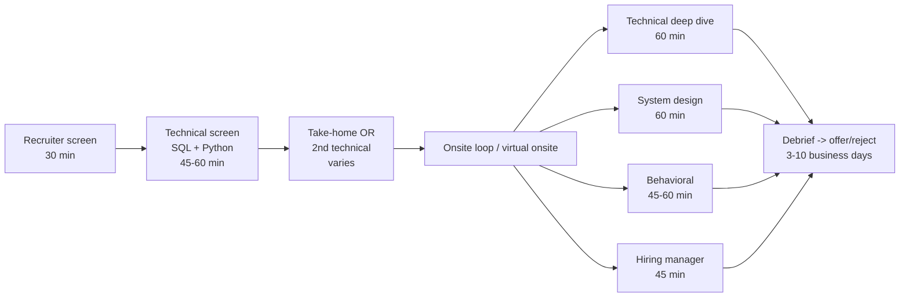

# Interview Process & Formats — Fundamentals

**Think of it like this:** a DE interview loop is itself a pipeline — you're the data. Each stage filters on different criteria, each has its own SLA, and failures at one stage rarely mean you'd fail the others. Knowing the pipeline's stages, what each one *actually* tests, and where candidates typically get dropped lets you prepare deliberately instead of cramming everything for every round.


## 🎯 Analogy

Think of the DE interview process like a multi-round tournament: each round tests a different skill (SQL coding, system design, behavioral). Knowing the format in advance lets you prepare the right type of answer for each round.

---
## The Standard DE Interview Loop



Typical end-to-end timeline: **3–6 weeks**. Startups compress to 1–2 weeks; big tech and banks stretch to 6–8.

## What Each Stage Actually Tests

### 1. Recruiter screen (30 min, phone/video)
- **Tests:** communication basics, motivation, logistics (location, visa, notice period, comp expectations), résumé truthfulness.
- **Not tested:** deep technical skill — but recruiters do pattern-match keywords ("have you used Spark in production?").
- **Junior mistake:** treating it as a formality and rambling. Have a 60-second self-summary and clear answers on logistics.
- **You should ask:** loop structure, tech stack, team size, why the role is open.

### 2. Technical screen (45–60 min, usually live coding)
The DE-specific screen is typically **SQL-heavy with some Python**:
- SQL: joins, aggregation, window functions, deduplication — usually 2–4 problems of increasing difficulty in a shared editor (CoderPad, HackerRank, Karat).
- Python: string/dict manipulation, parsing, simple data transformations — rarely hard algorithms for DE roles, but list comprehensions, dicts, and loops must be fluent.
- **What's scored:** correctness, then approach narration, then edge-case awareness (NULLs! duplicates! empty input!). Speed matters less than steady progress with clear thinking aloud.

### 3. Take-home assignment (2–8 hours, when used)
- Typical task: "Here's a CSV/API; build a small pipeline, model the data, answer 3 questions."
- **What's scored:** code structure, README quality, tests, idempotency thinking, honest assumptions documented — *not* feature count.

### 4. Technical deep dive (60 min)
- A conversation through your résumé projects: "walk me through the architecture," "why Kafka and not SQS?", "what broke and how did you debug it?"
- **What's scored:** whether you actually did what the résumé says, depth of understanding, decision reasoning.

### 5. System design (60 min — mid-level and above; juniors get a lighter version)
- "Design a pipeline that ingests X and serves Y." For juniors the bar is structured thinking and knowing the standard components, not a flawless architecture.

### 6. Behavioral / values / bar-raiser (45–60 min)
- STAR-format stories: conflict, failure, deadline pressure, ownership. At Amazon-style companies this round can veto everything else.

### 7. Hiring manager (45 min)
- Mix of light technical, team fit, career goals, and selling you on the team. Your questions here matter — prepared, specific questions signal genuine interest.

## Format Variants You'll Encounter

| Format | Where common | Key adjustment |
|---|---|---|
| Live SQL/Python in shared editor | Everywhere | Practice typing + talking simultaneously |
| Take-home project | Startups, some mid-size | Timebox honestly; README is half the grade |
| Karat / outsourced first round | Big tech adjacents | Very rubric-driven; expect retry options |
| Whiteboard system design | Onsite loops | Practice drawing while narrating |
| Pair-programming session | Eng-culture startups | Collaborate out loud; ask clarifying questions early |
| Case study presentation | Analytics-leaning roles | Prepare slides; rehearse the 10-min version |

## Live-Coding Etiquette (Junior Essentials)

1. **Restate the problem** in one sentence before coding; confirm assumptions ("can the same user appear twice per day?").
2. **Narrate intent, not syntax**: "I'll dedupe with ROW_NUMBER partitioned by user, keeping the latest" — then type quietly.
3. **Start simple, then improve.** A working nested query you then refactor to a window function beats a perfect solution that never compiles.
4. **Test out loud**: walk one example row through your query; name the NULL/duplicate/empty edge cases even if time runs out.
5. **When stuck, say what you know**: "I know I need a gaps-and-islands approach; let me build the grouping key step by step." Silence is the only unrecoverable state.
6. **Take the hint.** Interviewers offering hints are trying to pass you; ignoring hints is a real rejection reason.

## Virtual Onsite Logistics

- Test camera/mic/editor link the day before; have a phone fallback for the call.
- Keep water, a notepad, and your own résumé + prepared questions in view.
- Between back-to-back rounds: 5 minutes of standing/water — performance degrades measurably across a 4-round block otherwise.
- It's acceptable (often impressive) to ask each interviewer: "What does this round evaluate, so I can give you the most useful signal?"

## After the Loop

- **Send nothing? Wrong.** A short same-day thank-you to the recruiter (not essays to every interviewer) keeps the channel warm.
- **Follow up** if you pass the stated SLA: one polite nudge per stage is expected, not pushy.
- **Rejections**: ask for feedback (you'll usually get little, but sometimes gold), and ask about the re-apply window — typically 6–12 months, and rarely held against you.

## Key Takeaways

- The loop is a pipeline of *different* filters: logistics → coding fluency → real experience → design thinking → behaviors. Prepare per-stage, not generically.
- DE screens are SQL-first: window functions, dedup, NULL handling are the recurring trio.
- Narrate your thinking; take hints; test with an example row. Etiquette is scored.
- Timelines: 3–6 weeks typical; one polite follow-up per stage SLA breach is normal.

## ▶️ Try It Yourself

```python
# Common DE interview process by stage
interview_stages = {
    "1. Recruiter Screen (30 min)": {
        "format": "Phone/Zoom",
        "topics": ["Background walkthrough", "Why this role?", "Salary expectations"],
        "prep": "Know your resume stories, research the company",
    },
    "2. Technical Screen (45-60 min)": {
        "format": "Shared code editor (CoderPad, HackerRank)",
        "topics": ["SQL: window functions, CTEs, complex joins", "Python: data manipulation"],
        "prep": "Practice 20+ SQL medium problems on LeetCode/StrataScratch",
    },
    "3. Take-home Assignment (3-5 hours)": {
        "format": "GitHub submission",
        "topics": ["End-to-end pipeline", "Data quality checks", "Documentation"],
        "prep": "Have a template repo with tests, logging, README structure",
    },
    "4. System Design (45-60 min)": {
        "format": "Whiteboard or virtual diagram tool",
        "topics": ["Design a pipeline from requirements", "Scale, fault tolerance, cost"],
        "prep": "Practice: real-time event pipeline, data warehouse design",
    },
    "5. Behavioral (30-45 min)": {
        "format": "Video interview",
        "topics": ["STAR stories", "Leadership", "Conflict resolution"],
        "prep": "Prepare 5 strong STAR stories covering: failure, success, conflict, influence",
    },
}

for stage, details in interview_stages.items():
    print(f"
{stage}")
    print(f"  Format: {details['format']}")
    print(f"  Prep:   {details['prep']}")
```

> **Run it:** Copy the snippet into a REPL or file — no external services needed for the basic example.

---
