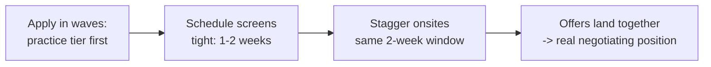

# Interview Process & Formats — Intermediate Concepts

Mid-level preparation means playing each format deliberately: knowing the rubric behind the round, managing take-homes strategically, and reading company archetypes to predict their loops.

## Predicting the Loop by Company Archetype

| Archetype | Typical loop | What's weighted | Watch out for |
|---|---|---|---|
| Big tech (FAANG-like) | Screen → 4–6 round onsite, bar-raiser/hiring-committee | Generalized problem solving, leveled behaviors, system design | Leveling decided by the loop, not the req; behavioral rounds have veto power |
| Data-forward scale-up | Screen → take-home or pairing → 3–4 rounds | Practical pipeline skills, stack overlap (dbt/Airflow/Spark), product sense | Take-home scope creep; "culture fit" as an undefined filter |
| Early startup | 1–2 conversations + practical session | Shipping speed, breadth, ambiguity tolerance | Process improvisation — you may need to drive structure yourself |
| Bank / insurer / telco | Multi-stage, panel formats, HR-driven | Depth on SQL/warehousing, governance awareness, stability signals | Slow timelines (6–10 weeks); rigid comp bands; compliance questions |
| Consultancy | Case-style + client-readiness screen | Communication polish, breadth, "can we put you in front of a client" | Case framing matters as much as the technical answer |

Use the archetype to allocate prep hours: a bank loop rewards 5 extra hours on SQL + dimensional modeling; a scale-up rewards the same hours spent building a small dbt project on their stack.

## Take-Home Assignments: Strategy, Not Just Effort

**The rubric behind most DE take-homes** (roughly weighted):
1. **Does it run, reproducibly?** (30%) — clear README, one-command setup, pinned dependencies.
2. **Code quality** (25%) — structure, naming, idempotency, error handling; not cleverness.
3. **Data thinking** (25%) — validation, edge cases handled or *documented*, sensible modeling.
4. **Communication** (20%) — assumptions stated, trade-offs explained, "what I'd do with more time."

**Strategic plays:**
- **Timebox visibly.** If they say 4 hours, spend ~4–6 and write: "Timeboxed to ~5h; with more time I'd add X, Y." This converts a weakness into a senior-looking judgment signal.
- **The README is half the deliverable.** Structure: problem restatement → how to run → design decisions → assumptions → known limitations → next steps.
- **Add 3–5 tests, not 50.** One happy-path, one malformed-input, one idempotency/rerun test signals professionalism without gold-plating.
- **Mirror their stack** when known (they use dbt → solve the modeling portion in dbt). Familiar shape lowers reviewer friction.
- **Ask one good clarifying question** before starting if the prompt is ambiguous — it's usually scored, and silence on a broken prompt is a real fail mode.

**When to decline a take-home:** >8 hours of scope, production-shaped work suspiciously specific to their backlog, or no compensation/feedback commitment for very large tasks. A polite alternative: offer a 90-minute pairing session instead — many companies accept.

## Live Rounds: Playing the Rubric

**Technical screen scoring sheets** typically have explicit checkboxes. Hit them deliberately:
- "Clarified requirements" → ask 1–2 questions even if the problem seems clear (NULLs? duplicates? volume? late data?).
- "Considered edge cases" → name them *before* being asked.
- "Communicated approach" → headline your plan before coding ("Plan: CTE to dedupe, then window for the running total").
- "Analyzed complexity/cost" → for SQL, mention what the query does to a large table (shuffle, full scan, index/partition use); for Python, big-O plus memory shape.

**The hint protocol:** hints are scored as "needed minor/major guidance," not as failure. The fatal pattern is *resisting* the hint. Acknowledge, integrate, credit: "Good point — partitioning by user first simplifies this; let me restructure."

**Running out of time:** state the remaining plan crisply. "What's left: handle ties in the window, and I'd add a test for empty partitions" often scores nearly as well as finishing.

## Panel and Deep-Dive Dynamics

- **Résumé deep dives are adversarially collaborative**: expect "what would break if volume 10×ed?", "what did *you* specifically own?", "why not the obvious alternative?" Prepare per-project: 5 numbers, 2 trade-offs, 1 failure, 1 thing you'd change.
- **Panels (common in banks/Europe):** address the asker, sweep eye contact to all; note who probes what — the quiet architect's single question usually carries the most debrief weight.
- **Skip-level / bar-raiser rounds:** they're calibrating level and veto risk, not stack fit. Stories should emphasize scope, influence, and judgment — the leveling vocabulary, not tool names.

## Managing Multiple Processes (Pipeline of Pipelines)

- **Sequence**: interview 2–3 "practice-tier" companies before your top choices; first loops are measurably rusty.
- **Synchronize onsites** so offers (each typically valid 1–2 weeks) overlap — this is the single biggest negotiation lever you control.
- **Track everything** (simple sheet: company, stage, date, SLA, contacts, comp signal). Five parallel processes exceed working memory.
- **Tell recruiters about competing timelines** — they can usually accelerate; surprise expiring offers help no one.

## Process Red Flags Worth Weighing

- More than ~5 rounds for a mid-level role, or repeated "one more conversation" additions → decision dysfunction.
- Take-home graded by silence (no feedback after substantial work) → how they treat people.
- Interviewers who haven't read your résumé, contradict each other on the role's scope, or can't name the team's current stack → role ambiguity you'll inherit.
- Pressure to accept before other loops conclude ("exploding" 48-hour offers at mid-level) → negotiate the deadline; reputable teams extend.

## Key Takeaways

- Identify the company archetype, then prep to *its* rubric — hours are finite.
- Take-homes are won on README, reproducibility, tests, and stated trade-offs; timebox visibly.
- Live rounds have checkbox rubrics: clarify, narrate, name edge cases, embrace hints.
- Run your search as synchronized pipelines so offers overlap; track stages in writing.
