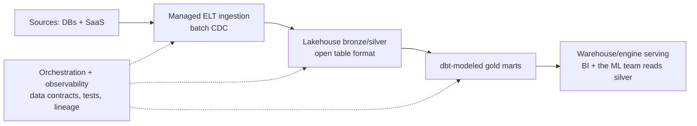

# Interview Process & Formats — Interview Scenarios

<article data-difficulty="junior">

## 🟢 Junior: Frozen in a Live SQL Screen

**Scenario:** You're 20 minutes into a 45-minute live SQL screen. The current problem: "Find each user's second-most-recent login." You know it needs a window function but you've blanked on the exact pattern, the editor is shared, and the interviewer is silently watching. Your mind is racing. What do you do in the next 60 seconds, and how do you handle the rest of the round?

<details>
<summary>💡 Hint</summary>

The unrecoverable state isn't being stuck — it's being *silently* stuck. Think about what you can verbalize (the shape of the solution you know exists), what you can build incrementally (start with most-recent, then generalize), and how the interviewer's hints fit into scoring.

</details>

<details>
<summary>✅ Solution</summary>

**The 60-second recovery:**

1. **Say the shape out loud:** "I know this is a ranking-per-group problem — ROW_NUMBER over a partition by user, ordered by login time descending, then filter to rank 2. Let me build it stepwise."
2. **Build the inner query first, simplest version:**

```sql
SELECT user_id, login_at,
       ROW_NUMBER() OVER (PARTITION BY user_id ORDER BY login_at DESC) AS rn
FROM logins;
```

3. **Walk one example row through it** ("user 7 has logins on the 5th, 3rd, 1st → rn 1, 2, 3 → I want rn = 2"), then wrap:

```sql
SELECT user_id, login_at
FROM (
  SELECT user_id, login_at,
         ROW_NUMBER() OVER (PARTITION BY user_id ORDER BY login_at DESC) AS rn
  FROM logins
) t
WHERE rn = 2;
```

4. **Name the edge cases unprompted:** users with a single login (absent from results — is that desired?), ties on login_at (ROW_NUMBER breaks them arbitrarily — RANK/DENSE_RANK if ties matter), NULL timestamps.

**Why this scores well even after freezing:** rubrics score approach narration, incremental progress, self-testing, and edge-case awareness. A 90-second silent freeze followed by this sequence typically out-scores a fast silent answer.

**If a hint comes:** integrate it gratefully and visibly — "Right, partition by user — thanks, that unblocks the rest." Hints are scored as "minor guidance," resisting them as a communication failure.

**For the rest of the round:** don't carry the wobble. One shaky problem rarely fails a screen; visible composure recovery is itself a positive signal.

</details>

</article>

<article data-difficulty="mid-level">

## 🟡 Mid-Level: The 10-Hour "4-Hour" Take-Home

**Scenario:** Your top-choice company sends a take-home: "Should take ~4 hours." Reading it, you estimate 10+: ingest a paginated API with auth, design a warehouse model, build incremental loading, add data quality checks, containerize, and write up scaling to 100×. You have a full-time job and two other active processes. Walk through your options and execute the best one.

<details>
<summary>💡 Hint</summary>

You have more than two options (silently overwork vs. silently underdeliver). Consider the email that renegotiates scope, what a visible timebox with documented cut-lines signals, and which parts of the rubric (README, reproducibility, tests, stated trade-offs) pay the most per hour invested.

</details>

<details>
<summary>✅ Solution</summary>

**Option analysis:**

| Option | Risk |
|---|---|
| Do all 10+ hours silently | Sets a precedent, burns your other processes, and *still* might miss their rubric |
| Do 4 hours silently, submit incomplete | Reads as low-effort without context |
| **Renegotiate / timebox visibly** | Minimal — scoping pushback is a positive signal at most healthy companies |
| Decline | Justified only if they refuse any flexibility |

**Execute — the email first:**

> "Excited to dig in. Scoping it honestly, the full brief looks like 10+ hours to do well. To respect both our time, I'd propose timeboxing to ~5 focused hours: a working pipeline for the core path with tests, plus a written design for the parts I'd build next (incremental strategy, scaling to 100×). Alternatively, I'm happy to do a 90-minute pairing session. Which would you prefer?"

**Then spend the 5 hours against the actual rubric:**

1. **Hour 1 — skeleton + reproducibility:** project structure, `docker compose up` or `make run`, pinned deps. *Does-it-run is the heaviest rubric line.*
2. **Hours 2–3 — core path done well:** API extraction with retry/backoff, idempotent load (natural key upsert), a small, defensible star schema. Code quality over feature count.
3. **Hour 4 — three tests + data checks:** happy path, malformed record, rerun-safety; row-count/null checks logged.
4. **Hour 5 — the README that does the selling:**
   - How to run (one command), design decisions, assumptions.
   - **"Cut lines"**: "Pagination edge X handled; resumable checkpointing designed but not built — here's the approach."
   - The 100× scaling answer as prose + a small diagram (this was a *writing* task disguised as a coding task).

**Why this wins:** you've demonstrated senior-shaped judgment (scoping, trade-off communication, timeboxing) *plus* clean execution — and the reviewers' first artifact is an email showing how you'll behave with their stakeholders.

**If they refuse any flexibility** ("just do all of it") at the *screening* stage for a mid-level role — weigh it as culture data. Sometimes the right move is doing it anyway for a top choice; do it knowingly, not resentfully.

</details>

</article>

<article data-difficulty="senior">

## 🔴 Senior: Driving an Ambiguous Onsite Design Round Off the Rails and Back

**Scenario:** Staff-level onsite. Prompt: "Design our analytics platform for the next three years." Ten minutes in, you realize you've been sketching a Kafka + Flink + lakehouse architecture — and the two interviewers have gone quiet. A glance at your notes: you never asked about scale, consumers, or team. You suspect you're building for a company they aren't. You have 35 minutes left. Recover the round.

<details>
<summary>💡 Hint</summary>

Naming the mistake explicitly is itself a senior signal — design reviews go wrong exactly this way and the skill being tested is correction. Think: stop, requirements excavation (consumers, SLAs, scale now/2yr, team shape, buy-vs-build), restate assumptions, then *re-derive* — possibly keeping pieces, possibly discarding the streaming spine entirely.

</details>

<details>
<summary>✅ Solution</summary>

**Minute 0–1 — Stop and name it (the recovery IS the demonstration):**

"Let me pause — I've been designing infrastructure before establishing requirements, which is exactly backwards. Let me fix that, because the right platform for 500 GB/day of batch reporting and the one for real-time ML at 50 TB/day share almost nothing."

Quiet interviewers usually flip visibly engaged at this moment: correcting your own trajectory under pressure is rarer interview evidence than any architecture.

**Minutes 1–8 — Requirements excavation, out loud, structured:**

- "Who consumes — analysts with SQL, ML services, customer-facing embeds?" *(Say: analysts mostly, one ML team emerging.)*
- "Freshness and correctness SLAs — is anything genuinely sub-hour?" *(Daily is fine; finance needs auditability.)*
- "Scale today and the honest 3-year curve?" *(~1 TB/day → maybe 5.)*
- "Team — size and shape?" *(4 DEs, strong SQL, limited streaming ops experience.)*
- "Buy-vs-build posture and cost sensitivity?" *(Mid-size budget, lean toward managed.)*

**Minute 8–10 — Restate and visibly re-derive:**

"So: SQL-first consumers, daily SLAs with audit requirements, single-digit TB/day, a 4-person team without streaming ops experience, managed-service bias. My earlier Kafka/Flink spine is wrong for this — it buys latency nobody asked for at an operational cost this team shouldn't carry. Keeping the lakehouse idea, discarding the streaming core."

**Minutes 10–25 — The recalibrated design, options first:**



- Present the one genuine fork as options: "Warehouse-centric (simplest for this team) vs lakehouse + query engine (cheaper at the 3-year scale, open formats protect the ML future). I'd choose the lakehouse path here, and here's the cost/skill trade I'm accepting..."
- Deep-dive the riskiest seam by choice, stated: "The make-or-break is the contract layer between ingestion and modeling — schema change management is what pages this team today."
- Close with: failure modes, the migration sequencing (strangler pattern from whatever exists), unit-cost shape, and "first thing I'd validate in production."

**Minutes 25–35 — Invite the attack:** "Where would you push back?" — then handle it as design review: concede real points, defend with reasons, never with volume.

**Debrief math:** a flawless-looking design built on unexamined assumptions fails staff loops; a derailed start + explicit correction + context-calibrated re-derivation is close to the *strongest* possible evidence — it's the actual job, performed live.

</details>

</article>

---

## Interview Tips

> **Tip 1:** "What does this round evaluate?" is a legitimate question to ask *at the start of each round* — it focuses your signal and reads as process maturity, not weakness. Interviewers with rubrics will usually tell you.

> **Tip 2:** Treat hints as scored collaboration, not failure: acknowledge, integrate, build on them visibly. The rejection-driving pattern interviewers report most isn't "needed a hint" — it's "ignored the hint."

> **Tip 3:** Synchronize your processes deliberately: practice-tier loops first, onsites for target companies inside the same two-week window, recruiters told about competing timelines. Overlapping offers change negotiations more than any script does.

---

## ⚡ Quick-fire Q&A

**Q: What's the typical DE interview loop?**
A: Recruiter screen → SQL/Python technical screen → take-home or second technical → onsite loop (technical deep dive, system design, behavioral, hiring manager) → debrief and offer. Usually 3–6 weeks end to end.

**Q: What do DE coding screens emphasize versus SWE screens?**
A: SQL-first (joins, windows, dedup, NULL handling) plus practical Python (parsing, dicts, generators) — rarely heavy algorithms. Edge-case narration and approach communication carry significant rubric weight.

**Q: How long should I let a take-home take?**
A: Roughly the stated estimate plus ~50%, timeboxed visibly: document cut lines and "what I'd do next" in the README. If the scope is 2×+ the estimate, renegotiate before starting.

**Q: What matters most in a take-home submission?**
A: Reproducibility (one-command run, pinned deps), then code quality, then data thinking (validation, idempotency), then the README that explains decisions and trade-offs. Feature count ranks last.

**Q: What is a bar-raiser round?**
A: An interviewer from outside the hiring team (Amazon-style) with veto power, focused on behavioral evidence and long-term hiring bar — prepare STAR stories with ownership and conflict, not more tech trivia.

**Q: How do I handle running out of time in a live round?**
A: State the remaining plan precisely: "Left to do: handle ties, add the empty-partition test." A crisp unfinished plan scores close to a finished solution on most rubrics.

**Q: When should I follow up after a round?**
A: Same-day brief thank-you via the recruiter; one polite nudge if their stated SLA passes. Two unanswered nudges is your answer.

**Q: Should senior candidates still drill coding before loops?**
A: Emphatically yes — a fumbled medium SQL/Python round is the most common cause of senior downleveling. Two weeks of daily 45-minute drills is typically sufficient insurance.
