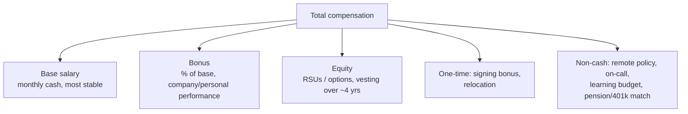

# Negotiation & Leveling — Fundamentals

**Think of it like this:** compensation is a price set in a market where one side (the employer) negotiates offers every week, and the other side (you) does it once every few years. The fundamentals below don't make you a shark — they just remove the information asymmetry, which is where most of the money is lost.

## Leveling: The Grid Behind Every Offer

Companies slot every engineer into a **level**, and the level — more than negotiation skill — determines the compensation band.

| Generic level | Big-tech-style label | Typical experience* | Scope expectation |
|---|---|---|---|
| Junior / Entry | L3 / E3 / SDE I | 0–2 yrs | Executes well-defined tasks with guidance |
| Mid | L4 / E4 / SDE II | 2–5 yrs | Owns features/pipelines independently |
| Senior | L5 / E5 / Senior | 5–8+ yrs | Owns systems end-to-end, mentors, resolves ambiguity |
| Staff+ | L6+ / E6+ | varies | Cross-team scope, technical direction |

\*Experience is a *correlate*, not the criterion — the loop's evidence of scope decides.

**Why juniors must care:** an offer is a (level, band-position) pair. Being slotted L3 when your evidence supports L4 costs more than any negotiation can recover — the bands barely overlap. The first negotiation question is never "more money?" but **"is the level right?"**

## The Components of an Offer

- **Base** — pays rent; weight it most at junior levels.
- **Bonus** — a 10% "target bonus" is not guaranteed cash; ask about historical payout rates.
- **Equity** — RSUs at public companies ≈ deferred cash (volatile); options at startups are a lottery ticket: ask for strike price, latest valuation, and exercise window before assigning value. At junior level, never accept lower base for "huge equity upside" you can't evaluate.
- **Signing bonus** — the most flexible lever for closing small gaps; often has a 12-month clawback.
- **The invisible items** — on-call load, remote flexibility, visa support, pension match — frequently worth more than a 5% base difference and are sometimes easier to negotiate.

## The Golden Rules (Junior Edition)

1. **Never give the first number if you can avoid it.** When asked "what are your expectations?":
   > "I'm focusing on fit first — I trust you pay competitively for the level. Could you share the band for this role?"
   Many jurisdictions (and increasingly, company policies) require or encourage band disclosure; asking is normal.

2. **If forced to give a number, give a researched range** anchored to level + location market data (levels.fyi, Glassdoor, local salary surveys, peers) — and state the source: "Based on market data for L4-equivalent DE roles in this market, I'm seeing X–Y total."

3. **Never negotiate against yourself.** State your position once, then stop talking. Silence after a number is a tool — theirs and yours.

4. **Get the offer in writing before negotiating details**, and never resign your current job on a verbal offer.

5. **Always be polite, always be enthusiastic, never bluff.** "I'm excited about this role; the gap is X" is the entire emotional register a negotiation needs. A bluffed competing offer that gets called ends careers at that company.

6. **Everything is negotiable exactly once** — after the verbal offer, before signing. Re-opening after signing burns goodwill permanently.

## A Junior's First Negotiation, Scripted

Offer call: base 72K, 5% bonus, standard benefits. You researched the band at 70–85K.

**You:** "Thank you — I'm genuinely excited about the team and ready to move forward. I'd like a day to review the details; can we speak tomorrow?" *(Always take the day, even if thrilled.)*

Next day:

**You:** "I want to make this work. Based on market data for this level and my [internship + project evidence], I was expecting base closer to 80K. If you can get there, I'm ready to sign this week."

Three realistic outcomes, all fine:
- "We can do 78K" → you just earned ~6K/year for one sentence.
- "Band is fixed, but we can add a 5K signing bonus" → accept happily.
- "72K is the offer" → "Understood — could we agree on a 6-month performance review with a defined path to the next band step?" Then decide on the whole package.

**What juniors should NOT do:** invent competing offers, open with ultimatums, negotiate every line item, or apologize repeatedly for negotiating at all. One firm, warm, evidence-based ask is the entire junior playbook.

## Evaluating Beyond the Number

A decision matrix beats vibes — score each offer 1–5:

| Factor | Weight (example) |
|---|---|
| Compensation (TC, realistically valued) | 25% |
| Learning: stack modernity, mentor density | 25% |
| Manager quality (from your interviews) | 20% |
| Data maturity of the org | 15% |
| On-call / work-life reality | 10% |
| Trajectory: promotion evidence, growth | 5% |

At junior level, **learning environment compounds faster than starting salary**: two years among strong seniors on a modern stack raises your *market level*, which moves you between bands — worth more than any within-band win.

## Key Takeaways

- Level determines band; verify level before negotiating numbers.
- Decompose offers: base, bonus reality, equity (valued honestly), one-times, and the invisible items.
- Don't give the first number; give a researched range if forced; never bluff.
- One warm, firm, evidence-based ask — then evaluate the whole package, weighting learning heavily at this stage.
