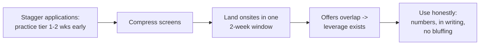

# Negotiation & Leveling — Intermediate Concepts

With a few years of experience, negotiation stops being one conversation and becomes a campaign: engineering competing offers, valuing equity honestly, contesting levels with evidence, and knowing each party's actual constraints.

## How the Other Side Works

Understanding the recruiter's machine removes both fear and false hope:

- **Recruiters are paid to close you** — they're not your adversary on *whether* you get more, only on *how much friction* it costs. A recruiter who believes you'll sign at a number will fight internal approvers for it.
- **Approval ladders are real:** within-band adjustments are often recruiter-level; band-top breaks need hiring-manager or comp-committee sign-off; level changes need a debrief revisit. Asking "what would need to be true to get there?" reveals which ladder you're on.
- **Headcount is budgeted by level.** "We can't match that" sometimes means "at this level." The fix is the level conversation, not haggling within the wrong band.
- **Companies have comp philosophies** — some pay top-of-market and don't negotiate (they mean it), some lowball expecting negotiation, most are in between. levels.fyi data + recruiter candor usually reveals which you're facing inside two conversations.

## Competing Offers: The Only Lever That Reliably Moves Numbers

Market evidence beats every script. Engineering it:

**Using a competing offer without burning anyone:**

> "I've received another offer at [TC number / 'X% above yours' — share what you're comfortable sharing, accurately]. Your team is my first choice because [specific, true reasons]. If you can close the gap to [number], I'll sign with you this week."

Rules of engagement:
- **Never fabricate or inflate.** Recruiters cross-check market reality and sometimes know each other; a called bluff is fatal and memorable.
- **"First choice + concrete number + commitment to sign"** is the strongest sentence in negotiation — it gives the recruiter exactly what their approval ladder needs.
- A *verbal* competing offer has weight; a written one has more; an expiring one creates urgency you should disclose honestly and manage (ask the expiring side for extension first — usually granted once).
- If you don't have a competing offer, **don't pretend** — use market data + the role's band + your evidence instead. Weaker but legitimate.

## Valuing Equity Like an Engineer

| Company stage | Instrument | Honest valuation approach |
|---|---|---|
| Public | RSUs | Face value, but model ±30% volatility; check vest schedule and refresh policy |
| Late private (D+) | RSUs/options | Discount preferred-share price 30–50%; ask about secondary-sale windows and last 409A/valuation |
| Early startup | Options | Treat as ~0 for decision purposes unless you'd invest cash in this company; negotiate base |

Questions that separate informed candidates (ask them; the *quality of answers* is itself a signal):
1. "How many fully diluted shares outstanding?" (your % is meaningless without it)
2. "What was the last 409A / round valuation, and when?"
3. "What's the post-termination exercise window?" (90 days vs 7 years changes everything)
4. "Do you do refresh grants, and what triggered the last ones?"
5. Public co: "Front-loaded or even vesting? Cliff?"

**Vesting math that matters mid-career:** a 4-year grant with no refreshes means your year-5 comp *drops* — ask about refresh culture before weighting equity heavily.

## Contesting a Level (Mid-Career's Highest-Stakes Move)

You interviewed expecting senior; the offer says mid. The bands barely overlap — this conversation is worth more than any other:

1. **Ask for the reasoning, neutrally:** "Help me understand the leveling decision — what evidence was the committee missing for senior?"
2. **Supply evidence, not protest:** map their senior criteria to your record — "end-to-end ownership: I designed, built, and operated X for 2 years including on-call and two migrations; mentorship: 3 engineers onboarded..." Offer artifacts (design docs, talks) where shareable.
3. **Ask what's procedurally possible:** an extra interview focused on the gap area is a common and reasonable resolution; some companies will, many won't revisit.
4. **If the level stands, negotiate the path:** written 6-month review with explicit senior criteria, band-top placement, and a signing bonus to bridge — or walk. **Accepting a downlevel silently is accepting a 1–3 year promotion queue** at most orgs; price that honestly.

Also know the *uplevel trap*: accepting a stretch level with a hostile band position means you're the lowest performer on paper at the new level. Sometimes top-of-band at the lower level with fast review beats bottom-of-band above.

## Negotiating More Than Money

Often easier to get than cash, frequently worth more:

| Item | Realistic ask |
|---|---|
| Signing bonus | The standard gap-closer; clawback terms negotiable (12 months prorated > cliff) |
| Start date | 4–8 weeks for a real break — nearly always granted |
| Remote/hybrid specifics | Get exceptions **in the offer letter**, not verbal |
| Title | Costs them nothing, compounds for you externally |
| Review timing | 6-month comp/level review in writing |
| Learning budget / conference | Easy yes at most orgs |
| On-call structure | Clarify before signing; "we'll figure it out" means yes-you're-on-call |
| Notice-period bridging | Lost bonus at current employer → signing bonus offset is a standard play |

## Sequencing the Endgame

With multiple processes converging:

1. **Slow the leader, speed the laggard.** Tell the slow company: "I have an offer expiring on X; you're my preferred team — can we compress?" (They can. Loops compress weekly for exactly this.)
2. **Extensions are normally granted once** — ask matter-of-factly: "I want to make this decision properly; can we extend to Friday?"
3. **Final round-robin is one pass, not an auction.** Take the best counter to your first choice once: "If you match X, I sign today." Then sign. Multi-round shopping sours the team you're about to join — recruiters talk to hiring managers.
4. **Decline gracefully everywhere else** — same-day, warm, specific. The DE world is small; the recruiter you decline kindly sources your next role.

## Common Mid-Level Mistakes

1. Negotiating before the offer ("what would you pay me?") — answer ranges, but extract theirs first.
2. Treating target bonus and paper equity as cash when comparing against a stable-base offer.
3. Winning 5% more cash but ignoring on-call, manager quality, or a dying data org — the matrix from fundamentals still applies.
4. Accepting "we don't negotiate" without testing it once, politely. (Some mean it; most flex on signing bonus even then.)
5. Burning the relationship in the last mile — you'll work with these people Monday.

## Key Takeaways

- Recruiters close, ladders approve, levels budget — aim your ask at the right mechanism.
- Overlapping offers are engineered, not lucky; use them honestly with "first choice + number + I'll sign."
- Value equity with engineer rigor: dilution, 409A, exercise windows, refresh culture.
- Contest levels with evidence and procedure; if it stands, negotiate the path or walk knowingly.
- The non-cash schedule (start date, remote terms, review timing, title) often holds the easiest wins.
