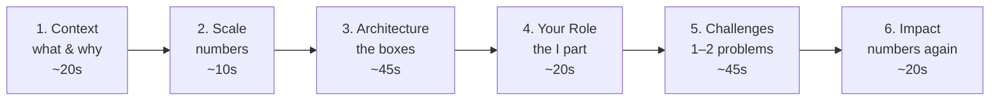

# Project Walkthrough — Fundamentals

"Walk me through a data project you've worked on" appears in nearly every DE loop — recruiter screens, technical rounds, hiring-manager chats. It looks like an open invitation; it's actually a structured test. This page gives you the structure, the junior-level version of quantifying impact, and the prep work that turns a rambling description into a story interviewers remember.

---

## The Six-Part Structure

Tell every project in this order. It mirrors how engineers evaluate systems, so it makes you sound like one.

### 1. Context — what problem, for whom

> "The sales team was building weekly reports by manually exporting CSVs from three systems and merging them in Excel — about six hours of someone's week, with frequent errors."

One or two sentences. Business problem first, technology never.

### 2. Scale — establish the numbers early

> "Three sources, about 400K rows a day combined, roughly 2 GB, refreshed nightly."

Even modest numbers beat no numbers. Saying scale out loud — *before being asked* — is one of the cheapest credibility wins available to a junior candidate.

### 3. Architecture — sources to consumers, left to right

> "Python scripts pull from the two APIs and one SFTP drop, land raw files in S3, a loader writes them to Postgres staging tables, SQL transforms build the reporting tables, and the whole thing runs on a scheduled Airflow DAG at 2 a.m. The sales dashboard reads the final tables."

Name the flow: **source → ingestion → storage → transform → serve → orchestration**. Keep it to five or six boxes at this stage; depth comes when they ask.

### 4. Your role — the sentence juniors skip

> "This was a two-person project — I built the ingestion and the Airflow DAG; my teammate did the SQL transform layer. I also ended up owning all of it after she changed teams."

If you don't draw this line, the interviewer draws it for you — conservatively.

### 5. Challenges — pick 1–2 with real mechanics

The single most-graded section. Choose problems that show DE thinking:

> "The SFTP source re-delivered files unpredictably — same data, new timestamp — which double-loaded rows. I made the load idempotent: each file's contents replace that file-date's partition rather than appending, and I track processed file hashes so true re-deliveries are skipped entirely."

Good junior challenge material: duplicate/re-delivered data, schema surprises, timezone bugs, API rate limits, slow queries you indexed, a failed load you made re-runnable. Weak material: "learning the tool was hard."

### 6. Impact — close with numbers

> "Report prep went from six manual hours a week to zero, the errors stopped, and the same pipeline now feeds two other dashboards we didn't anticipate."

---

## Quantifying Impact When You're Junior

You won't have "$2M saved." You still have numbers:

| Dimension | Junior-accessible example |
|---|---|
| Volume | "400K rows/day", "30 source files/night", "2 GB/day" |
| Time saved | "6 hours/week of manual work eliminated" |
| Latency | "data available by 6 a.m. instead of mid-afternoon" |
| Reliability | "zero duplicate-data incidents after the fix, versus ~2/month before" |
| Reuse | "3 dashboards now read these tables" |
| Speed-up | "the slow report query went from 90 seconds to 4 after indexing" |

**Estimating honestly:** if you didn't measure at the time, reconstruct and say so — "roughly 400K rows a day, by my estimate from the file sizes." Honest estimation reads fine; suspicious precision ("417,233 rows") or total vagueness ("lots of data") both read badly.

---

## The Three Depth Levels

Prepare every project at three lengths, because you'll be asked at all three:

| Version | Length | Where it's used | Content |
|---|---|---|---|
| Elevator | 30 sec | Recruiter screen, "tell me about yourself" | Context + what you built + one impact number |
| Standard | 2–3 min | Most rounds | The full six-part structure above |
| Deep dive | 10–20 min | Technical deep-dive round | Standard + schema decisions, failure handling, alternatives considered, code-level details |

**The elevator version, worked:**

> "I built the nightly pipeline that replaced my sales team's manual Excel reporting — Python ingestion from three sources into Postgres, orchestrated with Airflow, about 400K rows a day. Killed six hours a week of manual work and the copy-paste errors with it."

Rehearse the elevator version most — it's the one you'll say ten times.

---

## Personal & Bootcamp Projects: Making Them Count

Juniors often apologize for project provenance. Don't — present production *thinking* instead:

- **Add the boring parts.** A weather-API loader becomes interview-worthy when it has retries, idempotent loads, a data quality check, and logging. The boring parts *are* the data engineering.
- **State scale honestly, then show headroom thinking:** "It's 50K rows a day — small — but I partitioned by date anyway and documented what I'd change at 100×: batch the API calls, move Postgres to a warehouse, add backfill support."
- **Have one real war story.** Every project that ran for more than two weeks has had a failure. That failure is your challenges section.
- **Know your own code.** Interviewers ask "show me how you handled X" — being fuzzy on your own personal project is disqualifying in a way being fuzzy on a two-year-old job project is not.

---

## Common Junior Mistakes

- **Technology-first narration:** "I used Python, Airflow, S3, and Postgres" before any mention of the problem. Tools are the *how*; lead with the *why*.
- **No ownership line** in team/bootcamp projects — the interviewer assumes the smallest plausible contribution.
- **Skipping straight to the hard part** without context, leaving the interviewer lost about what the system even does.
- **Memorized monologue:** reciting without pause invites interviewers to interrupt-test you. Build in natural pauses — "want me to go deeper on the ingestion side?"
- **Claiming team-scale numbers as personal:** "we processed 50 TB a day" when your part touched one 2 GB feed. State both honestly: the system's scale and your slice.

---

## Preparation Worksheet

For each project you might discuss, write down before interview week:

- [ ] One-sentence business problem
- [ ] Three scale numbers (volume, frequency, size)
- [ ] The six boxes of the architecture, in flow order
- [ ] Your exact slice, in one sentence starting with "I"
- [ ] Two challenges with the mechanics of how you solved them
- [ ] Two impact numbers
- [ ] 30-second version, rehearsed aloud
- [ ] Answers to the obvious follow-ups: why this database? why batch? what breaks first at 10× volume?

Continue to **intermediate.md** for whiteboard technique and handling "why didn't you use X?" challenges.
