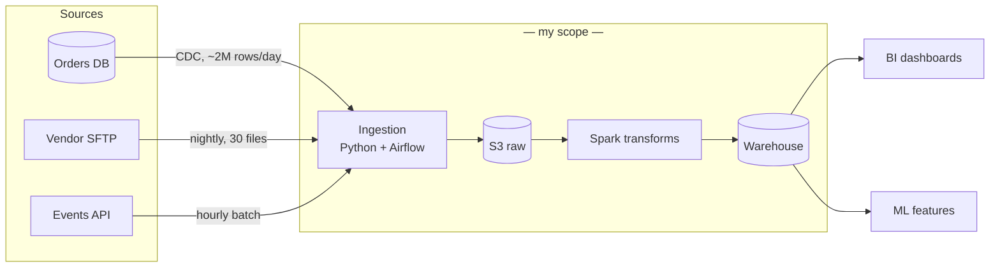

# Project Walkthrough — Intermediate

You can tell a structured project story. This page levels it up: drawing architecture on a whiteboard (physical or virtual) without losing your narrative, surviving the "why didn't you use X?" challenge, building your three-story portfolio, and the depth-control techniques that separate mid-level candidates from juniors with more years.

---

## Whiteboarding Your Architecture

The deep-dive round usually starts with "draw your system." How you draw is graded alongside what you draw.

### The drawing protocol

1. **Narrate before ink:** "I'll draw left to right, sources to consumers, then come back and annotate the parts worth discussing." Announcing the plan buys silence-free thinking time.
2. **Boxes first, labels immediately, arrows last.** Unlabeled boxes accumulate into mysteries; label as you go.
3. **Left-to-right data flow, always.** Sources far left, consumers far right, orchestration and monitoring drawn *below* the flow line as a separate plane.
4. **Annotate the arrows, not just the boxes.** Arrows are where data engineering lives: "nightly batch, ~5 GB", "CDC stream", "API, rate-limited 100 req/s". An arrow labeled with volume and frequency says more than three boxes.
5. **Mark your territory.** Draw a dotted boundary around the parts you personally built. It pre-answers the ownership question and shows confidence about the line.

### Virtual whiteboard specifics

- Ask the tool question *before* the round (Excalidraw, Miro, Zoom whiteboard, "just talk over a doc"). Practice 20 minutes in whichever they name.
- Virtual drawing is slow — compensate with bigger boxes, fewer of them, and more narration.
- If the tool fights you, offer: "I can also structure this as a numbered flow in text — whichever is clearer for you." Interviewers accept this more readily than candidates expect.

---

## Surviving "Why Didn't You Use X?"

This question is rarely about X. It tests whether your decisions had *reasons* and whether you handle challenge without folding or bristling. Four honest situations, four scripts:

### You considered X and rejected it

> "We looked at Kafka for this. The decisive factor was that our freshest consumer needed 15-minute data, not seconds — batch every 10 minutes met the requirement with one fewer distributed system to operate on a team of three. The revisit trigger we wrote down was any consumer needing sub-minute data; it hasn't fired yet."

Structure: decisive factor → requirement it traces to → revisit trigger. The revisit trigger is the mid-level signature — it shows the decision was a position, not a prejudice.

### X didn't exist / wasn't viable then

> "This was 2022 and our Snowflake contract predated me — honestly, Iceberg wasn't on our radar yet. If I were building it today I'd evaluate it seriously, and here's what would tip the decision either way…"

Then demonstrate current knowledge of X. The past decision is excused by history; your *current* fluency is what's being tested.

### Organizational reasons decided it

> "Pure-tech, Flink might have edged out what we did. But we had zero Flink operators on the team and a platform group already running managed Spark — the operational reality dominated. I'd defend that: a slightly-worse tool the team can run at 3 a.m. beats a slightly-better one nobody can."

Saying "the org context decided it, and that's legitimate engineering input" is a mature answer — *if* you show you understood the pure-tech trade-off you were overriding.

### You honestly didn't consider X

> "Honestly, that didn't make the list — at the time I defaulted to what I knew. Knowing what I know now about X, the comparison would look like… and I think it would have / wouldn't have changed the outcome because…"

One honest "didn't consider it" answered with good live reasoning out-scores three fake evaluations. Never invent a retroactive bake-off; the follow-up ("what did the benchmark show?") is fatal.

### The bristle test

Some interviewers push back on your defense — once — purely to see the reaction. The pass: engage the merits with curiosity ("what's the failure mode you're seeing that I'm not?"). The fail: capitulating instantly ("yeah, you're right, we should have") or getting defensive. Hold positions exactly as firmly as your reasons warrant.

---

## The Three-Story Portfolio

Walking into a loop with one project is fragile — different rounds want different things. Curate three:

| Slot | What it showcases | Used when |
|---|---|---|
| **The scale story** | Biggest volume/complexity you've genuinely touched; distributed compute, performance work | Technical deep dives, "most complex system" prompts |
| **The ownership story** | Smaller system but yours end-to-end: design, build, operate, on-call, evolve | Hiring manager rounds, ownership/initiative behavioral prompts |
| **The collaboration story** | Cross-team dynamics: consumers, contracts, migrations, stakeholders | Behavioral rounds, "working with analysts" prompts |

Prep each at all three depths (30 sec / 3 min / 20 min). Nine total artifacts — it sounds heavy and takes about two evenings, and it covers essentially every prompt a loop can throw.

**Choosing when projects overlap:** prefer the story where *your decisions* are most visible, even over the more impressive system where you executed someone else's design. "I chose, I traded off, I owned the consequence" is the mid-level grading axis.

---

## Depth Control: Answering at the Right Altitude

A mid-level differentiator is matching answer-depth to question-intent:

- **"How does the pipeline work?"** → architecture altitude. Boxes and flows, 90 seconds, then offer depth: "happy to go into the dedup logic or the orchestration, whichever is useful."
- **"How exactly did you handle late-arriving data?"** → mechanism altitude. Code-level specifics: watermark column, lookback window, merge keys.
- **"Why is it built this way?"** → decision altitude. Requirements, constraints, alternatives, trade-offs.

The classic mid-level failure is one altitude for everything — usually mechanism altitude, drowning an architecture question in column names. When unsure: "Do you want the architecture view or the implementation detail?" Asking is itself a good signal.

---

## Handling the Numbers Interrogation

Mid-level claims get audited live:

> **You:** "Cut the job from 4 hours to 40 minutes."
> **Them:** "How, specifically? What was the 4 hours spent on?"

Every performance number you state needs its *decomposition* loaded: where time/money actually went, what you changed, which change contributed most. "The 4 hours was mostly one skewed join — about 3 hours of it; salting the hot keys took it to 50 minutes, and partition pruning on the output write found the rest" survives the audit. "We optimized it" does not.

Same for cost and reliability numbers: know the before-baseline, the measurement method, and the one confounder you'd flag yourself. Volunteering the confounder ("some of that was also the warehouse upgrade landing the same month") buys disproportionate credibility.

---

## Pre-Loop Checklist

- [ ] Three stories chosen against the three slots
- [ ] Each rehearsed at 30 sec / 3 min, with a 20-min depth outline
- [ ] Architecture for each drawable in under 4 minutes, arrows annotated with volume + frequency
- [ ] Dotted "my scope" boundary decided in advance
- [ ] "Why not X?" prepared for the 3 most likely X's per project (check the company's stack — they'll ask about *their* tools)
- [ ] Every performance/impact number decomposed and audit-ready
- [ ] Practiced once on the actual virtual whiteboard tool
- [ ] One honest "didn't consider it" answer rehearsed so it lands with confidence
