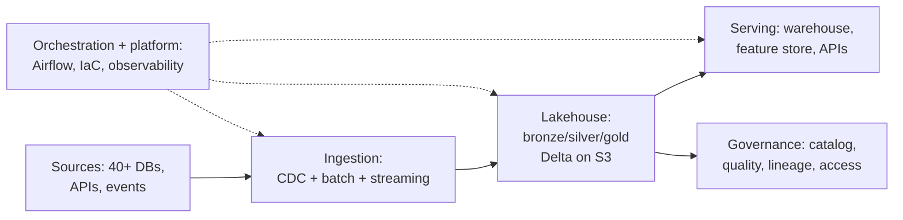

# Project Walkthrough — Interview Scenarios

<article data-difficulty="junior">

## 🟢 Junior: "Tell Me About a Project You're Proud Of"

**Scenario:** It's your first DE interview. The interviewer opens with: "Tell me about a data project you're proud of." Your honest answer is a bootcamp/university project: you built a pipeline that pulled weather API data into PostgreSQL and visualized it. How do you present this so it lands as real engineering rather than a toy?

💡 Hint

Structure beats scale. A small project told with context → architecture → decisions → challenges → results outperforms a big project told as a feature list. Find the genuine engineering decisions you made (scheduling, idempotency, schema choices, error handling) and quantify whatever you can, however small.

✅ Solution

**Use a tight structure (60–90 seconds for the first pass):**

1. **Context (10s):** "I built an end-to-end pipeline ingesting hourly weather data for 50 cities from a public API into PostgreSQL, with a Grafana dashboard on top."
2. **Architecture (20s):** "A Python extractor runs hourly on a cron schedule, lands raw JSON to disk first, then a transform step validates and upserts into a star-schema-ish model: a fact table of readings, dimensions for city and weather condition."
3. **Decisions — this is where juniors win or lose (30s):**
   - "I landed raw JSON before transforming, so when my parser broke on a null wind-speed field, I could fix it and replay without re-calling the API."
   - "I made loads idempotent with an upsert on (city_id, observed_at), so cron retries don't duplicate rows."
   - "I added a row-count and freshness check that writes to a log table; the dashboard shows when data is stale."
4. **A real challenge (15s):** "The API rate-limits at 60 calls/min; I batched cities and added exponential backoff."
5. **Result (10s):** "It's been running ~4 months, ~350K rows, survived two API schema changes."

**Why this works:** raw-then-transform, idempotency, replay, rate-limit handling, and freshness checks are *exactly* the concepts production DEs use — you've demonstrated the thinking without needing production scale.

**Avoid:** apologizing ("it's just a small project"), listing technologies without decisions, or inflating scale. Interviewers calibrate for experience level; they're scoring judgment, structure, and honesty.

</article>

<article data-difficulty="mid-level">

## 🟡 Mid-Level: Defending a Decision Under "Why Didn't You Use X?"

**Scenario:** You're walking through a batch pipeline you built (Airflow + Spark on EMR, S3 data lake, Redshift serving layer). The interviewer interrupts: "Why didn't you just use Snowflake and skip the Spark layer entirely?" You know Snowflake could have handled much of it. How do you respond without getting defensive or throwing your old team under the bus?

💡 Hint

"Why didn't you use X" tests whether you understood the decision space, not whether you picked the interviewer's favorite. The strong pattern: steelman X honestly, state the constraints that drove your actual choice (cost, team skills, existing contracts, data shapes), and say what would change your mind today.

✅ Solution

**The three-part answer pattern:**

**1. Steelman the alternative (shows you understand it):**
"Fair challenge — Snowflake would have eliminated cluster management, and for the SQL-shaped transformations, Snowpark or even plain SQL would've covered maybe 70% of our logic with less operational burden."

**2. Name the real constraints (shows the decision was reasoned, not default):**
- "Three of our transformations were genuinely Spark-shaped: a sessionization step over 2B events with custom window logic, and ML feature generation using libraries that didn't exist in Snowpark at the time."
- "We had an existing EMR commitment and an AWS enterprise discount; the projected Snowflake compute for our scan-heavy workloads came out ~2.3× our EMR cost when we modeled it."
- "The team had deep Spark experience and zero Snowflake experience — migration risk during a quarter with hard delivery deadlines."

**3. Show the decision isn't dogma (shows growth and current knowledge):**
"If I were starting that platform today, I'd revisit it — Snowpark's matured, and I'd consider keeping Spark only for the sessionization job and moving the SQL transformations into Snowflake + dbt. The architecture I'd defend isn't 'Spark everywhere,' it's 'engine per workload shape.'"

**Anti-patterns to avoid:**
- Getting defensive or treating the question as an attack.
- "That's just what the team used" with no analysis (the answer they're screening out).
- Trashing the old decision/team to align with the interviewer.
- Pretending there were no trade-offs.

**Bonus move:** invite the dialogue — "Was there a specific part of the stack you'd have done differently? Happy to dig into the cost model." Interviews at this level reward collaborative technical conversation.

</article>

<article data-difficulty="senior">

## 🔴 Senior: Walking Through a Multi-Year Platform on a Whiteboard

**Scenario:** Final-round interview for a senior DE role. The prompt: "Take the whiteboard and walk us through the most complex data platform you've owned. We'll interrupt." You have 30+ components across ingestion, lakehouse, orchestration, serving, and governance from a 3-year platform. Two interviewers; one is known to drill into details, the other into business impact. How do you structure 25 minutes?

💡 Hint

Don't draw 30 boxes. Senior walkthroughs are layered disclosure: a 5-box overview first, then zoom into the 2–3 areas where *you* made the hard calls, with numbers ready (scale, SLAs, cost, team). Plan for interruptions — they're the interview. Prepare the failure story and the "what I'd do differently" before walking in.

✅ Solution

**Minute 0–3 — Frame before drawing:**
"Context: logistics company, ~40 data sources, platform served 300 analysts and 12 ML services. I owned architecture and a team of 5. I'll draw the high level, then go deep wherever you want — I'd suggest the CDC ingestion redesign and the cost-governance work, since those had the hardest trade-offs."

Setting the menu yourself signals ownership and gives the interviewers hooks.

**Minute 3–8 — The 5-box overview (resist detail):**

State scale numbers unprompted: "~6 TB/day ingest, 4K Airflow tasks/day, P1 SLA was data-by-7am for finance marts, platform ran ~$85K/month at peak before the cost program."

**Minute 8–20 — Zoom into 2 deep areas (your hard calls):**

For each, use decision → alternatives → trade-off → outcome:
- **CDC redesign:** "Nightly full extracts were missing intraday updates and hammering source DBs. Options were vendor CDC (Fivetran), Debezium self-managed, or DB-native replicas. I chose Debezium despite the ops burden because of 40-source licensing cost and a hard requirement for sub-15-min latency on 8 tables. The mistake I'll own: I underestimated schema-evolution toil — we built a schema-registry-driven contract process after the third breaking change paged us at 2am. Latency went from 24h to 8 min on tier-1 tables."
- **Cost governance:** "Platform spend grew 3× in a year. I led tagging + showback, moved cold data through lifecycle tiers, right-sized the warehouse, and killed zombie pipelines — $85K → $52K/month in two quarters with no SLA regressions. The organizationally hard part was the showback conversations, not the engineering."

**Handling the two interviewer styles:**
- Detail-driller: go as deep as asked (Debezium snapshot modes, Delta compaction cadence) but *close the loop back* to the system view each time — "...and that's why the contract process mattered more than the connector choice."
- Impact-seeker: attach a business number to each technical claim — latency → same-day rebooking revenue; cost → headcount-equivalent savings.

**Minute 20–25 — Pre-prepared closers (senior signals):**
- **A real failure with blast radius:** "A backfill double-counted 3 days of revenue in the exec dashboard. We caught it via reconciliation checks *after* the CFO saw it. Postmortem led to staging-table promotion gates for all gold tables and a comms protocol for data incidents."
- **What I'd do differently:** "I'd introduce data contracts and ownership boundaries a year earlier — half our incidents were upstream schema changes we absorbed instead of governed."
- **Team/legacy:** "Two of the five engineers I mentored now run their own platform areas — durable impact beyond the architecture."

**Scoring rubric you're playing to:** ownership clarity ("I" vs "we" used honestly), layered abstraction control, quantified scale and impact, real trade-offs with named alternatives, owned failures with systemic fixes, and composure under interruption.

</article>

---

## Interview Tips

> **Tip 1:** "Walk me through a project" is a *structure* test before it's a technology test. Use context → scale → architecture → your decisions → a challenge → quantified outcome, in under two minutes for the first pass, then let the interviewer choose the zoom level. Rambling chronology is the most common failure mode at every level.

> **Tip 2:** Prepare exactly three project stories at different altitudes — one end-to-end platform (architecture + leadership), one deep technical problem (debugging/performance war story), one failure with a systemic fix. Nearly every behavioral-technical prompt maps to one of the three.

> **Tip 3:** Always know your numbers: rows/day, TB, latency SLA, cost before/after, team size, incident counts. "Significantly improved performance" is filler; "p95 from 45 min to 4 min on a 2B-row table" is evidence — and senior interviewers treat missing numbers as missing ownership.

---

## ⚡ Quick-fire Q&A

**Q: What's the ideal length for the first pass of a project walkthrough?**
A: 60–120 seconds: context, scale, architecture in one breath, your key decisions, one challenge, quantified result. Then invite the interviewer to pick where to go deep — layered disclosure beats a monologue.

**Q: How do I pick which project to present?**
A: The one where *you* made decisions you can defend — not the biggest system you were near. Decision ownership with a small system beats spectatorship on a huge one.

**Q: What if my real projects are under NDA?**
A: Abstract the domain ("a large retailer," "transactional system with ~X TB/day"), keep architecture and decisions concrete, and say upfront you're anonymizing. Interviewers respect it; vagueness about *decisions* is what hurts, not vagueness about names.

**Q: How do I handle "why didn't you use X?"**
A: Steelman X, name the constraints that drove your actual choice (cost, skills, latency, contracts), then say what would change your mind today. It's a test of decision process, not tool allegiance.

**Q: Should I mention projects that failed?**
A: Yes — prepared, with blast radius, root cause, your role honestly stated, and the systemic fix. A senior candidate with no failure story reads as either dishonest or unscarred by real ownership.

**Q: How many numbers should I have memorized per project?**
A: At minimum: data volume (rows/day or TB), latency/SLA, cost (before/after if you changed it), team size, and one business-impact figure. Five numbers per story, ready without hesitation.

**Q: Whiteboard or slides if given the choice?**
A: Whiteboard (or live diagramming) — it shows real-time abstraction control and invites the interruptions that senior interviews are actually made of. Start with ≤6 boxes, add detail only on request.

**Q: How do I show leadership in a project story without claiming others' work?**
A: Attribute precisely: "I designed the ingestion layer and the contract process; my teammate built the connector framework; I reviewed and unblocked." Precise attribution reads as stronger leadership than a blanket "I built everything."
