# Study Roadmaps — The Junior Data Engineer Track

This is a **12-week, interview-ready study path** for landing your first Data Engineering role (or moving from analyst/SWE into DE). It is the navigation backbone of this site: every block below maps to a topic you can study here.

**Time budget:** 12–15 hours/week. If you can only do 8, stretch each phase by ~50%.

---


## 🎯 Analogy

Think of a DE interview study roadmap like a training plan for a marathon: you don't run 26 miles on day one. Start with fundamentals (SQL, Python), add distributed systems (Spark, Kafka), then system design, and do mock interviews in the final week.

---
## The Big Picture

```mermaid
gantt
    title Junior DE 12-Week Roadmap
    dateFormat  W
    axisFormat Week %W
    section Foundations
    SQL deep work           :a1, 0, 3w
    Python for DE           :a2, 1, 3w
    section Core DE
    ETL Concepts            :b1, 4, 2w
    Data Modeling basics    :b2, 5, 2w
    section Platform
    One cloud (AWS or Azure or GCP) :c1, 7, 3w
    Airflow basics          :c2, 9, 2w
    section Polish
    Portfolio + mock interviews :d1, 11, 2w
```



**Priority order if you must cut:** sql > python > etl-concepts > one cloud > airflow > data-modeling. SQL and Python screens eliminate more junior candidates than everything else combined.

---

## Phase 1 — Foundations (Weeks 1–4)

### Weeks 1–3: SQL (the #1 junior filter)

Study the **sql** topic in this order:

| Week | Subtopics | Goal |
|---|---|---|
| 1 | joins, subqueries, ctes | Write any multi-table query without hesitation |
| 2 | window-functions, recursive-queries | Solve "top N per group", running totals, dedup |
| 3 | interview-coding-problems, query-optimization (skim) | 30+ timed problems solved |

**Milestone (end of week 3):** solve a "second-highest salary per department" and a "gaps and islands" problem in under 10 minutes each, cold.

```sql
-- You should be able to write this pattern from memory:
SELECT *
FROM (
    SELECT e.*,
           ROW_NUMBER() OVER (PARTITION BY dept_id ORDER BY salary DESC) AS rn
    FROM employees e
) ranked
WHERE rn = 2;
```

### Weeks 2–4: Python (overlaps with SQL on purpose)

Study the **python** topic:

- Core: lists/dicts/sets, comprehensions, string parsing, file I/O
- DE flavor: reading CSV/JSON, `datetime` handling, error handling with retries
- Light pandas: filter, groupby, merge — enough to discuss, not master
- Skim the pydantic and testing subtopics so the words aren't foreign

**Milestone (end of week 4):** write a script that reads a messy CSV, validates rows, logs bad records to a reject file, and writes clean output — in under 45 minutes.

```python
# The junior-interview workhorse pattern:
import csv

def clean_rows(path: str):
    with open(path, newline="") as f:
        for i, row in enumerate(csv.DictReader(f), start=2):
            try:
                yield {"id": int(row["id"]), "amount": float(row["amount"])}
            except (ValueError, KeyError) as exc:
                print(f"Rejected line {i}: {exc}")
```

---

## Phase 2 — Core DE Concepts (Weeks 5–7)

### Weeks 5–6: ETL Concepts

Study **etl-concepts** end to end:

- ETL vs ELT, batch vs streaming (concepts only — streaming depth comes later)
- Incremental loads, watermarks, CDC at a vocabulary level
- Idempotency and reruns — *the* junior differentiator concept
- Data quality basics: null checks, row counts, reconciliation (skim **data-quality** fundamentals)

**Milestone:** explain in 2 minutes, out loud, why a pipeline must be safe to re-run, with one concrete example (e.g., `DELETE + INSERT` by partition vs blind `INSERT`).

### Weeks 6–7: Data Modeling Basics

Study **data-modeling** fundamentals and intermediate:

- Star schema: facts vs dimensions, grain
- Slowly Changing Dimensions — know Type 1 and Type 2 cold
- Normalization vs denormalization trade-off in one sentence each

**Milestone:** given "design tables for an e-commerce orders dashboard", sketch a fact table with grain stated, plus 3 dimensions, in 10 minutes.

---

## Phase 3 — Platform Skills (Weeks 8–11)

### Weeks 8–10: One Cloud (pick exactly one)

| If your target market is... | Pick | Study topic |
|---|---|---|
| US big tech / startups | AWS | **aws-services** |
| Enterprise / consulting / Europe | Azure | **azure** |
| Analytics-heavy / ad tech | GCP | **gcp** |

Focus on the DE slice only: object storage (S3/ADLS/GCS), one warehouse (Redshift/Synapse/BigQuery — or **snowflake**, which is cloud-agnostic and very common in job posts), one orchestration-adjacent service, and IAM at a "can explain a role vs a user" level.

**Milestone:** build a tiny project: raw file → storage bucket → load into warehouse → one transform query, and be able to draw it.

### Weeks 10–11: Airflow Basics

Study **airflow** fundamentals:

- DAG anatomy: tasks, dependencies, schedule, `catchup`
- Operators vs sensors; retries and SLAs at a vocabulary level
- Backfill: what it is and when you'd use it

**Milestone:** write a 3-task DAG (extract → transform → load) from memory and explain what happens when task 2 fails.

```python
from airflow import DAG
from airflow.operators.python import PythonOperator
from datetime import datetime

with DAG("orders_daily", start_date=datetime(2026, 1, 1),
         schedule="@daily", catchup=False) as dag:
    extract = PythonOperator(task_id="extract", python_callable=extract_fn)
    transform = PythonOperator(task_id="transform", python_callable=transform_fn)
    load = PythonOperator(task_id="load", python_callable=load_fn)
    extract >> transform >> load
```

---

## Phase 4 — Polish & Apply (Weeks 11–12)

- Build **one** portfolio project that strings everything together: API or CSV source → Python extraction → cloud storage → warehouse → Airflow scheduling → one dashboard-ready table. Quality over quantity; one finished project beats four stubs.
- Skim **bash-scripting** fundamentals (you'll be asked to read shell in real jobs).
- Do 3 mock interviews: one SQL-only, one Python-only, one "walk me through your project" (see the **project-walkthrough** subtopic here).
- Read **behavioral-questions → fundamentals** in this topic and prepare 5 STAR stories.

---

## Weekly Rhythm That Works

| Day | Activity | Hours |
|---|---|---|
| Mon/Wed | New material from the current topic | 2 × 1.5 |
| Tue/Thu | Practice problems (SQL or Python) | 2 × 1.5 |
| Sat | Project work | 4 |
| Sun | Review + flashcards + 1 timed problem set | 2 |

---

## What Juniors Should NOT Study Yet

Deliberately skip for now — they dilute your prep and rarely appear in junior loops:

- **kafka**, **real-time-streaming** — know the words "topic, producer, consumer", nothing more
- **system-design** — junior loops test building blocks, not architecture
- **hadoop**, **teradata**, **oracle**, **nifi** — only if a specific job posting demands them
- **rag-llm**, **ai** — interesting, not load-bearing for junior DE offers
- A second cloud — one done well beats two done badly

---

## Readiness Checklist

Before applying, you should be able to tick every box:

- [ ] Solve medium SQL window-function problems in ≤ 15 min
- [ ] Write a file-parsing Python script with error handling, live, in ≤ 45 min
- [ ] Explain idempotency, incremental load, and SCD2 in plain English
- [ ] Draw your portfolio project's architecture in ≤ 5 minutes
- [ ] Name the storage, warehouse, and IAM basics of one cloud
- [ ] Explain a DAG, a retry, and a backfill
- [ ] Tell 5 STAR stories without notes

When all boxes are checked, move to the application phase — and start the **intermediate** roadmap in parallel, because mid-level knowledge compounds while you interview.

---

## Where to Go Next

- Ready-now interview prep: **real-world.md** in this subtopic (1-week and 1-day cram plans)
- Self-test: **scenarios.md** in this subtopic — the Junior checkpoint
- After landing the job: start **intermediate.md**, the mid-level track

## ▶️ Try It Yourself

```python
# 8-week study roadmap for senior DE interviews
roadmap = {
    "Week 1-2: SQL + Python fundamentals": [
        "Window functions (ROW_NUMBER, RANK, LAG, LEAD, SUM OVER)",
        "CTEs, recursive CTEs, subquery optimization",
        "Python: generators, decorators, context managers",
        "pandas: groupby, merge, pivot",
    ],
    "Week 3-4: Distributed Systems": [
        "Spark: partitioning, shuffles, joins (broadcast vs sort-merge)",
        "Kafka: producer/consumer, partitions, consumer groups, exactly-once",
        "Airflow: DAG design, XCom, sensors, pools",
        "dbt: models, tests, incremental, macros",
    ],
    "Week 5-6: Data Warehousing + Cloud": [
        "Star schema, SCD Type 1/2, Data Vault basics",
        "Snowflake: virtual warehouses, time travel, Snowpipe",
        "Cloud: S3, Glue, Kinesis, EMR (or GCP/Azure equivalents)",
        "Data lakehouse: Delta Lake, Iceberg, medallion architecture",
    ],
    "Week 7: System Design": [
        "Design a real-time fraud detection pipeline",
        "Design a data warehouse from scratch (1M events/day)",
        "Trade-off frameworks: batch vs streaming, cost vs latency",
    ],
    "Week 8: Mock Interviews": [
        "2 mock SQL interviews (LeetCode medium/hard)",
        "2 mock system design interviews",
        "1 behavioral mock with peer feedback",
    ],
}

for week, topics in roadmap.items():
    print(f"
{week}:")
    for t in topics:
        print(f"  ✓ {t}")
```

> **Run it:** Copy the snippet into a REPL or file — no external services needed for the basic example.

---
