# Interview Week — Compressed Prep Plans

The roadmaps in this subtopic assume months. This page assumes **the recruiter already emailed you**. Three plans (2-week, 1-week, 1-day), what to review the night before, and how to tilt your prep by company type.

**Golden rule of cramming:** in the final stretch, *retrieval beats input*. Doing 10 problems from memory beats reading 50 solutions.

---

## The 2-Week Plan (ideal compressed prep)

Assumes ~2.5 hours/weekday, 5 hours/weekend day.

```mermaid
gantt
    title 2-Week Interview Sprint
    dateFormat  D
    axisFormat Day %d
    section Week 1 — Rebuild
    SQL drills (daily)        :a1, 0, 7d
    Python drills (alt days)  :a2, 0, 7d
    Project stories drafted   :a3, 3, 3d
    section Week 2 — Simulate
    System design mocks       :b1, 7, 4d
    Behavioral rehearsal      :b2, 9, 3d
    Full mock loop            :b3, 12, 1d
    Taper + logistics         :b4, 13, 1d
```

| Day | Focus | Concrete tasks |
|---|---|---|
| 1–2 | SQL sharpening | 8 problems/day from **sql → interview-coding-problems**; redo every miss next morning |
| 3–4 | Python sharpening | File parsing, dict aggregation, top-K problems; one timed 45-min session each day |
| 5 | Project stories | Draft 3 stories using the structure in **project-walkthrough**; add numbers |
| 6–7 | Weakest pillar | Honest triage: pick your worst of pyspark / airflow / data-modeling and study only that |
| 8–9 | System design | 2 mocks (record yourself): one batch-analytics, one streaming prompt from **system-design** |
| 10 | Behavioral | Map your STARs to the 20 questions in **behavioral-questions → fundamentals**; rehearse aloud |
| 11 | Company research | Their stack (job post + engineering blog), prepare 6 questions to ask |
| 12 | Full mock loop | SQL screen + design + behavioral back-to-back, with a friend or alone-but-timed |
| 13 | Patch holes | Only review what the mock exposed; nothing new |
| 14 | Taper | Light review, logistics check, sleep |

---

## The 1-Week Plan (most common reality)

~3 hours/day. Cut breadth ruthlessly; the screen rounds gate everything else.

| Day | Focus |
|---|---|
| 1 | SQL: 10 problems, heavy on window functions + dedup + top-N-per-group |
| 2 | Python: 6 problems + one timed end-to-end script (CSV → clean → aggregate) |
| 3 | Your 3 project stories with metrics; rehearse the 2-minute and 5-minute versions |
| 4 | One system design mock + review batch-vs-streaming and idempotency talking points |
| 5 | Behavioral: 8 STAR stories rehearsed aloud; prepare failure story and conflict story |
| 6 | Half mock loop + patch the single worst gap |
| 7 | Taper: cheat-sheet review, logistics, sleep |

**Skip entirely on a 1-week runway:** new tools, second clouds, certifications, reading documentation cover-to-cover. None of these convert in 7 days.

---

## The 1-Day Cram (screen tomorrow)

Three sessions, 90 minutes each. Retrieval only.

**Session 1 — SQL (morning):**
- 5 problems from memory: top-N per group, running total, dedup with `ROW_NUMBER()`, month-over-month change with `LAG()`, gaps-and-islands (attempt, then review)
- Recite: `GROUP BY` vs window functions; `WHERE` vs `HAVING` vs `QUALIFY`

**Session 2 — Stories (afternoon):**
- Say your 2-minute self-intro out loud 3 times
- Say your best project story out loud twice (once at 2 min, once at 5 min)
- Say your failure story once — out loud, not in your head

**Session 3 — Light technical sweep (early evening):**
- One page of notes on the company's known stack
- Re-derive your pipeline-design skeleton: sources → ingestion → processing → storage → serving → orchestration → quality → monitoring
- Stop by 8 p.m. Cramming past this point trades accuracy for anxiety.

---

## The Night Before — Review Exactly This

1. **Your own resume.** Every line is fair game; interviewers ambush forgotten bullet points.
2. **One-page SQL patterns:** window function syntax, `QUALIFY`, `MERGE` skeleton.
3. **The pipeline skeleton** (above) — your design-round opening move.
4. **Your 3 numbers per project:** volume (rows/day or GB/day), latency/SLA, impact ($, hours, %).
5. **Logistics:** link works, camera/mic tested, water, charger, notebook, IDs for onsite.

Then close the laptop. Sleep is worth more than the 11th hour of review — reaction time and working memory are the actual interview substrate.

---

## Per-Company-Type Tilt

### FAANG / Big Tech
- **Weight:** coding rigor (SQL *and* Python/DSA-lite), structured system design, leveling-calibrated behavioral ("bar raiser" style at Amazon).
- **Tilt your prep:** add algorithmic Python (hash maps, two pointers, heaps for top-K); learn the company's leadership principles and map a STAR story to each cluster.
- **Watch for:** strict timeboxes; interviewers grade the *process* — narrate constantly.

### Startups (seed → Series C)
- **Weight:** pragmatism, breadth, shipping speed. Often one founder/lead does a deep technical chat plus a practical take-home.
- **Tilt:** be ready to discuss build-vs-buy honestly ("I'd start with Fivetran + dbt + one warehouse and revisit at scale"); show comfort with ambiguity and wearing the analytics hat too.
- **Watch for:** "design our actual stack" questions — research their product first; they want to see ownership instinct, not vendor name-dropping.

### Consultancies
- **Weight:** communication, client-readiness, multi-stack adaptability, certifications matter more here than anywhere else.
- **Tilt:** rehearse explaining technical choices to a non-technical stakeholder; have one story about handling a difficult client/stakeholder; brush both **azure** and **aws-services** vocabularies since staffing varies.
- **Watch for:** case-style prompts ("client has a 6-week deadline and a broken warehouse — first 2 weeks?").

### Banks / Insurance / Regulated Enterprise
- **Weight:** SQL depth, data modeling rigor, governance and lineage, batch reliability. Often **oracle**/**teradata** heritage migrating to cloud.
- **Tilt:** review SCD2 cold, **data-governance** basics (PII, access controls, audit), and reconciliation/controls vocabulary ("balance checks", "completeness controls"); expect slower, multi-round processes.
- **Watch for:** questions about precision and auditability — "how do you prove the numbers are right?" is the house specialty.

---

## Round-by-Round Final Checks

| Upcoming round | 30-minute booster |
|---|---|
| SQL screen | 3 timed problems + recite window-function patterns |
| Python screen | 1 timed file-parsing script + exception-handling pattern |
| PySpark deep dive | Shuffle/skew/broadcast riff + one debugging story |
| System design | Re-derive the skeleton + numbers (events/sec) drill |
| Behavioral | Say 3 STARs aloud + your questions for them |
| Hiring manager | Their stack, their team's likely pain, your 90-day instinct |

---

## After the Loop

- Send a short thank-you note same day (see **interview-process-formats → real-world** for templates).
- Write down every question you got within an hour — this list is your highest-value study guide for the next loop.
- If rejected: ask for feedback once, politely; mine the question list; re-enter the roadmap at the layer that failed, not at the beginning.
