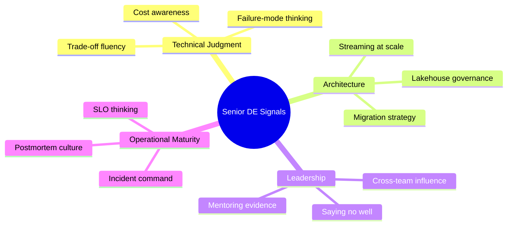

# Study Roadmaps — The Senior Data Engineer Track

Senior interviews aren't a bigger version of mid-level interviews. The evaluation axis rotates: from **"can you build it?"** to **"should it be built, what will it cost, what breaks, and who grows because you were there?"** This track is less about new tools and more about judgment, articulation, and scope.

**Time budget:** 6–10 hours/week over ~12 weeks, plus deliberate on-the-job practice (some signals can only be earned, not studied).

---

## The Senior Signal Model

Interviewers map almost every senior question onto one of those four quadrants. When stuck, ask yourself: *which quadrant is this question probing?*

---

## Block 1 — System Design Mastery (Weeks 1–4)

Work through the entire **system-design** topic, including end-to-end case studies. The bar:

- **Drive, don't answer.** You set the structure: requirements → scale estimates → architecture → deep dive → failure modes → evolution. The interviewer should rarely need to steer.
- **Numbers first.** 50M events/day ≈ 580/sec average, plan for 10× peak ≈ 6K/sec. Saying this unprompted is a senior tell.
- **Two designs, one recommendation.** Always present an alternative and explain why you didn't choose it.

Practice set (one per week, 45 minutes, recorded):

1. Multi-region CDC replication with sub-minute freshness and schema evolution
2. Clickstream platform: 1B events/day, sessionization, GDPR deletes
3. ML feature platform: batch + streaming parity, point-in-time correctness
4. Migrate a 200-table on-prem warehouse (**oracle**/**teradata**-style) to a lakehouse with zero downtime for consumers

**Milestone:** a mid-level engineer watching your recording can list your requirements, your two options, and your failure-handling plan without rewatching.

---

## Block 2 — Trade-off Analysis as a Language (Weeks 3–5)

Seniors don't say "it depends" and stop. They say what it depends *on*. Build a personal trade-off vocabulary across these axes and rehearse 2-minute riffs on each:

| Axis | The riff you must own |
|---|---|
| Latency vs cost | "Streaming halves latency and triples infra+oncall cost; here's the breakpoint…" |
| Build vs buy | "Fivetran at 40 connectors vs 2 engineers maintaining custom EL…" |
| Consistency vs availability | "Exactly-once is a spectrum of effort; effectively-once is usually the honest goal" |
| Centralized vs domain-owned data | "Mesh solves org bottlenecks, not technical ones — and creates new ones" |
| Flexibility vs governance | "Schema-on-read defers cost to every reader, forever" |

**Milestone:** for any past architecture decision you've made, deliver a 90-second "we chose X over Y because Z; the cost we accepted was W; the trigger to revisit is V."

---

## Block 3 — Data Governance & Compliance (Weeks 5–7)

Study **data-governance** fully — at senior level this stops being optional:

- Lineage: column-level vs table-level, what's realistic to maintain
- Access models: RBAC vs ABAC, row/column-level security in warehouses
- PII handling: classification, tokenization vs masking vs encryption, GDPR/CCPA delete pipelines (the right-to-be-forgotten in an immutable lake is a classic senior question)
- Data contracts as an organizational tool, not just a schema file

**Milestone:** design a right-to-be-forgotten flow for a Delta lake with downstream ML training sets — including the parts that are organizationally hard, not just technically hard.

---

## Block 4 — Cost Optimization (Weeks 7–8)

The most underprepared senior topic, and increasingly a dedicated interview question:

- Warehouse: credit/slot models (**snowflake** warehouses auto-suspend, BigQuery on-demand vs capacity), clustering to cut scan costs
- Spark: right-sizing, spot/preemptible strategies, the cost of small files and over-provisioned shuffle
- Storage tiering and lifecycle policies; the real cost of "keep everything forever in hot storage"
- A FinOps narrative: how you'd find the top 10 cost drivers in a platform you've never seen (query history, job runtime tables, storage growth curves, tagging)

**Milestone:** tell one true story — "I cut $X/month by Y" — with the investigation method, not just the punchline. If you don't have one, go create it at work this quarter; it's worth more than 50 hours of study.

---

## Block 5 — Streaming Architectures at Depth (Weeks 8–10)

Go past mid-level **kafka** into **real-time-streaming** architecture:

- Stateful stream processing: watermarks, late data, windowing semantics, state-store sizing (Flink/Spark Structured Streaming)
- Exactly-once: transactional producers, idempotent sinks, and where the guarantee actually ends
- Kappa vs Lambda — and the honest modern answer (lakehouse + streaming ingest covers most "Lambda" needs)
- Backpressure, replay/reprocessing strategy, schema registry evolution rules

**Milestone:** design "real-time fraud scoring, p99 < 2s, with a 30-day replayable history" and clearly mark which boxes are hard vs commodity.

---

## Block 6 — Leadership & Mentoring Evidence (Weeks 10–12, plus ongoing)

You can't cram experience, but you *can* cram articulation:

- Write 6 leadership STAR stories: a mentee you grew, a project you de-scoped, a disagreement with a senior peer where you committed anyway, a standard you instituted, an incident you commanded, a hiring/onboarding contribution
- Prepare your "how I mentor" 2-minute answer with a real artifact (review checklist, onboarding doc, pairing cadence)
- Prepare a "disagree and commit" story where you were *wrong* — senior interviewers probe for ego elasticity

See **behavioral-questions → senior-deep-dive** in this topic for the full treatment.

---

## Staff-Level Signals (if you're reaching above senior)

| Senior signal | Staff signal |
|---|---|
| Designs a pipeline well | Designs the platform other teams build pipelines on |
| Mentors individuals | Changes how the org operates (standards, paved roads) |
| Handles incidents | Removes whole classes of incidents |
| Influences own team | Influences adjacent orgs without authority |
| Cost-optimizes a workload | Owns the cost narrative with finance/leadership |

If a question feels senior-sized, a staff candidate widens it one ring: "Before designing this pipeline, I'd ask whether the other four teams with the same need should share a paved road."

---

## 12-Week Calendar

| Weeks | Focus | Output |
|---|---|---|
| 1–4 | System design mastery | 4 recorded mock designs |
| 3–5 | Trade-off riffs | 5 rehearsed 2-min riffs |
| 5–7 | Governance | RTBF design doc |
| 7–8 | Cost | One true cost story, quantified |
| 8–10 | Streaming depth | Fraud-scoring design |
| 10–12 | Leadership stories + full mock loops | 6 STARs, 2 full loops |

---

## ⚡ Cheat Sheet

- **Rotate the axis:** senior loops grade judgment, cost, failure-modes, and people — not tool trivia.
- **Numbers unprompted:** translate any volume to events/sec and plan 10× peak before drawing boxes.
- **Two options, one pick:** never present a design without the road not taken and the revisit trigger.
- **Four quadrants:** Technical Judgment / Architecture / Leadership / Operational Maturity — diagnose every question against them.
- **Own a cost story:** "found it via query history + tagging, cut $X/month" beats any certification.
- **Governance is senior-mandatory:** rehearse the GDPR-delete-from-a-lake design; it's the most common governance prompt.
- **Exactly-once honesty:** say "effectively-once with idempotent sinks" and explain where guarantees end.
- **Leadership needs artifacts:** mentoring claims require a checklist, doc, or mentee outcome you can name.
- **Be wrong gracefully:** keep one "I disagreed, committed, and was wrong" story loaded.
- **Staff = one ring wider:** platform over pipeline, org over team, class-of-problem over incident.
