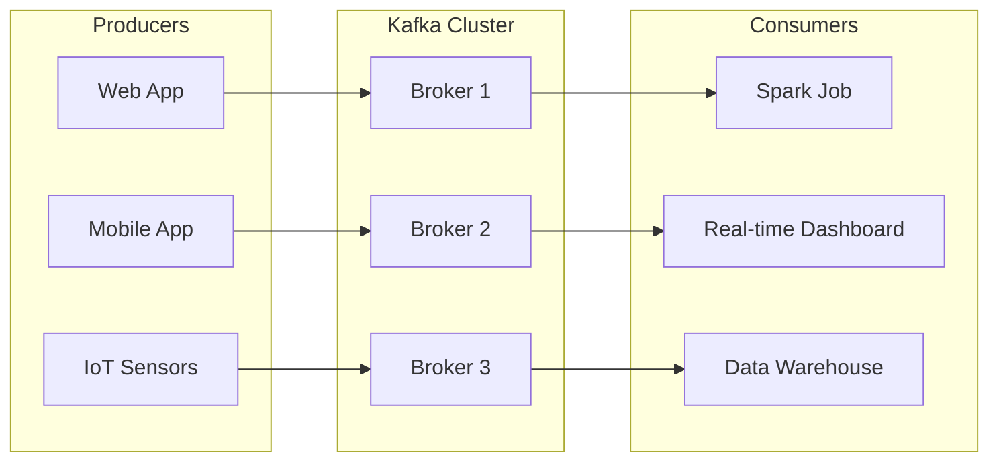
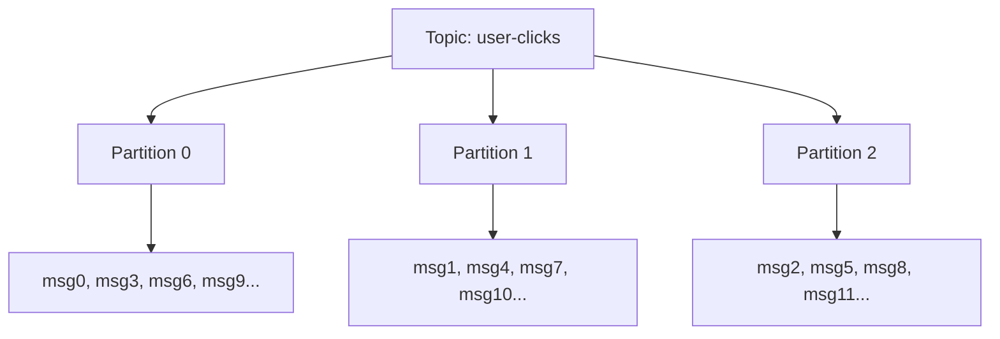
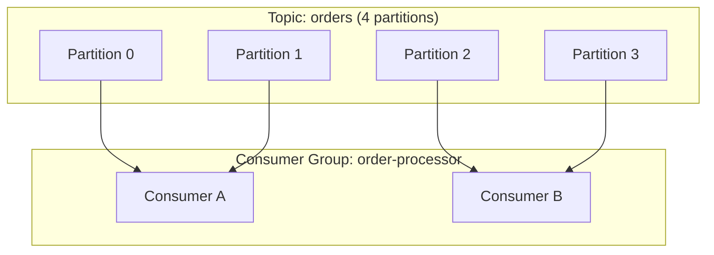

# Kafka Architecture — Fundamentals


## 🎯 Analogy

Think of Kafka like a massive, durable logbook in a busy post office. Producers drop letters (messages) into topic mailboxes (partitions). Consumers pick them up at their own pace — and the letters stay in the logbook for days, so late readers can catch up.

---
## What Is Apache Kafka?

Apache Kafka is a **distributed event streaming platform** — think of it as a highly durable, high-throughput message bus that sits between your data producers and consumers.

**The simple analogy:** Kafka is like a newspaper delivery system.
- **Producers** = journalists writing articles
- **Topics** = newspaper sections (Sports, Business, Tech)
- **Partitions** = different delivery trucks for the same section (parallelism)
- **Consumers** = readers subscribing to specific sections
- **Brokers** = the printing/distribution centers

> **Why Kafka matters for DE:** Kafka is the backbone of most modern data pipelines. It decouples producers from consumers, handles massive throughput (millions of events/second), and guarantees that data isn't lost.

---

## Core Components



**What this shows:**
- **Producers** send data to Kafka (any application that generates events)
- **Brokers** are the Kafka servers that store and serve data (typically 3+ in a cluster)
- **Consumers** read data from Kafka (analytics, storage, monitoring)
- Producers and consumers are completely decoupled — they don't know about each other

---

## Topics and Partitions

### Topics — Logical Categories

A topic is a **named stream of records** — like a table name in a database. All related events go to the same topic.

Examples:
- `user-clicks` — all clickstream events
- `orders-placed` — new order events
- `payment-processed` — completed payments

### Partitions — Parallelism Units

Each topic is split into **partitions** — independent, ordered sequences of records. This is how Kafka achieves parallelism.



**What this shows:**
- The `user-clicks` topic has 3 partitions
- Messages are distributed across partitions (typically by a key hash)
- Each partition is an independent, ordered log
- Multiple consumers can read different partitions in parallel (3x throughput)

**Key rules:**
- Order is guaranteed WITHIN a partition, NOT across partitions
- A message belongs to exactly one partition
- The partition is chosen by: key hash (if key provided) or round-robin (no key)

---

## Offsets — Position Tracking

Each message in a partition has an **offset** — a sequential number that uniquely identifies it.

```
Partition 0:  [offset 0] [offset 1] [offset 2] [offset 3] [offset 4] ...
                 msg-A      msg-B      msg-C      msg-D      msg-E
              
              ^ Consumer position: "I've read up to offset 2"
```

**What offsets enable:**
- Consumers track their position (resume after restart without re-reading)
- Multiple consumer groups can read the same topic at different positions
- Replay: a consumer can reset to offset 0 to reprocess all historical data

> **Key insight:** Kafka doesn't delete messages after they're consumed (unlike traditional queues). Messages stay for a configurable retention period (default: 7 days). This enables replay and multiple independent consumers.

---

## Brokers — The Servers

A **broker** is a single Kafka server. A cluster typically runs 3+ brokers for fault tolerance.

**Each broker:**
- Stores partitions assigned to it
- Handles read/write requests from producers and consumers
- Participates in replication (copies of data for safety)

**Example: 3-broker cluster with a 3-partition topic:**

| Partition | Leader | Replica 1 | Replica 2 |
|-----------|--------|-----------|-----------|
| Partition 0 | Broker 1 | Broker 2 | Broker 3 |
| Partition 1 | Broker 2 | Broker 3 | Broker 1 |
| Partition 2 | Broker 3 | Broker 1 | Broker 2 |

**Key concepts:**
- **Leader:** The broker that handles ALL reads/writes for a partition
- **Replicas:** Copies on other brokers for fault tolerance
- **Replication factor:** How many copies exist (typically 3)
- **ISR (In-Sync Replicas):** Replicas that are caught up with the leader

> **What happens when a broker dies:** If Broker 1 crashes, the replicas on Broker 2/3 get promoted to leader. Clients automatically redirect. No data loss (if ISR was maintained).

---

## Producers — Writing Data

Producers send records to a specific topic. Each record has:
- **Key** (optional) — determines which partition receives the message
- **Value** — the actual data payload (JSON, Avro, Protobuf, etc.)
- **Timestamp** — when the event occurred
- **Headers** (optional) — metadata key-value pairs

```python
# Conceptual producer example
from kafka import KafkaProducer
import json

producer = KafkaProducer(
    bootstrap_servers=['broker1:9092', 'broker2:9092'],
    value_serializer=lambda v: json.dumps(v).encode('utf-8')
)

# Send an event
producer.send(
    topic='user-clicks',
    key=b'user-123',          # Same user always goes to same partition
    value={"page": "/home", "action": "click", "timestamp": "2024-01-15T10:30:00"}
)
```

**Partition assignment logic:**
- If key is provided: `partition = hash(key) % num_partitions`
- If no key: round-robin across partitions

> **Why keys matter:** Using `user_id` as the key ensures all events for the same user go to the same partition — preserving per-user ordering. Critical for sessionization, state machines, etc.

---

## Consumers and Consumer Groups

### Single Consumer

A consumer reads from one or more partitions of a topic.

### Consumer Groups — Scalable Consumption

A **consumer group** is a set of consumers that share the workload of reading a topic. Each partition is assigned to exactly ONE consumer in the group.



**What this shows:**
- Topic has 4 partitions
- Consumer group has 2 consumers
- Each consumer handles 2 partitions (balanced load)
- If Consumer A crashes, its partitions get reassigned to Consumer B (rebalance)

**Scaling rules:**
- More consumers than partitions = some consumers sit idle
- Fewer consumers than partitions = consumers handle multiple partitions
- Max parallelism = number of partitions (can't split a partition further)

> **Multiple consumer groups:** Different groups read the same topic independently. Example: `analytics-group` and `alerting-group` both read `orders` but maintain separate offsets.

---

## Message Retention

Kafka is NOT a queue — it doesn't delete messages after consumption.

| Setting | Default | Meaning |
|---------|---------|---------|
| `retention.ms` | 7 days | How long messages are kept |
| `retention.bytes` | Unlimited | Max size before oldest messages are deleted |
| `cleanup.policy` | `delete` | Delete old messages (vs `compact` = keep latest per key) |

**Log compaction** (cleanup.policy=compact): Keeps only the LATEST message for each key. Used for changelog/state topics where you only need the current value.

---

## Quick Reference

| Concept | What It Is | Analogy |
|---------|-----------|---------|
| Topic | Named stream of events | Newspaper section |
| Partition | Parallel unit within topic | Delivery truck |
| Offset | Position of message in partition | Page number |
| Broker | Kafka server | Printing press |
| Producer | Sends events to Kafka | Journalist |
| Consumer | Reads events from Kafka | Reader |
| Consumer Group | Team of consumers sharing work | Reading club |
| Replication | Copies for fault tolerance | Backup printing press |

---


## ▶️ Try It Yourself

```bash
# Start Kafka locally (Docker)
# docker run -p 9092:9092 apache/kafka:3.7.0

# Create a topic
kafka-topics.sh --bootstrap-server localhost:9092 \
    --create --topic orders --partitions 3 --replication-factor 1

# List topics
kafka-topics.sh --bootstrap-server localhost:9092 --list

# Describe a topic (partitions, leader, replicas)
kafka-topics.sh --bootstrap-server localhost:9092 --describe --topic orders
```

> **Run it:** Copy the snippet into a REPL or file and run it — no external services needed for the basic example.

---
## Interview Tips

> **Tip 1:** When asked "How does Kafka ensure ordering?" — answer: "Order is guaranteed within a partition only. If you need per-user ordering, use user_id as the message key so all events for that user go to the same partition."

> **Tip 2:** When asked about fault tolerance: "Kafka replicates each partition to N brokers (typically 3). If a leader broker fails, a replica is promoted. No data loss as long as the ISR has at least one member."

> **Tip 3:** A common follow-up: "What determines your max parallelism?" — "The number of partitions. Each partition can only be consumed by one consumer in a group. So 12 partitions = max 12 parallel consumers."
