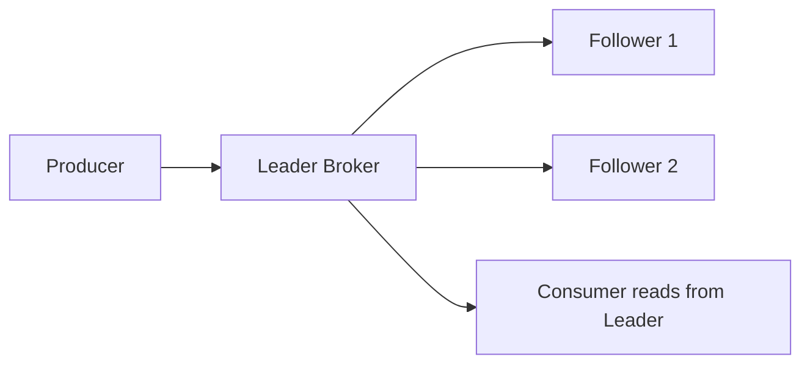

# Kafka Architecture — Intermediate Concepts

## Producer Acknowledgment Levels (acks)

When a producer sends a message, it can configure how many brokers must confirm receipt before considering it "sent."

| acks | Behavior | Durability | Latency | Use Case |
|------|----------|-----------|---------|----------|
| `acks=0` | Don't wait for any confirmation | Lowest (may lose data) | Fastest | Metrics, logs (acceptable loss) |
| `acks=1` | Wait for leader to write | Medium (lost if leader dies before replication) | Medium | Most use cases |
| `acks=all` | Wait for ALL in-sync replicas | Highest (survives any single failure) | Slowest | Financial data, critical events |

```python
# Production-safe producer config
producer = KafkaProducer(
    bootstrap_servers=['broker1:9092', 'broker2:9092', 'broker3:9092'],
    acks='all',                    # Wait for all replicas
    retries=3,                     # Retry on transient failures
    retry_backoff_ms=100,          # Wait between retries
    enable_idempotence=True,       # Prevent duplicates on retry
    max_in_flight_requests_per_connection=5,  # With idempotence, safe up to 5
)
```

> **Key tradeoff:** `acks=all` + `min.insync.replicas=2` guarantees no data loss even if one broker dies during write. This is the standard for financial/transactional data.

---

## Replication Deep Dive

### How Replication Works



**What this shows:**
- ALL writes go to the leader
- Followers pull data from the leader (they are consumers of the leader)
- ALL reads come from the leader (in standard Kafka — followers are just backups)
- Followers exist solely for fault tolerance

### ISR (In-Sync Replicas)

A replica is "in-sync" if it has replicated all messages up to the leader's high-water mark within `replica.lag.time.max.ms` (default 30 seconds).

**Scenario: What happens when a follower falls behind?**

| Time | Leader | Follower 1 | Follower 2 (slow) | ISR |
|------|--------|-----------|-------------------|-----|
| T1 | offset 100 | offset 100 | offset 100 | All 3 |
| T2 | offset 150 | offset 148 | offset 105 | All 3 (within 30s) |
| T3 | offset 200 | offset 198 | offset 110 | Leader + F1 only |

**When Follower 2 drops from ISR:**
- It's still replicating, just too slow
- If leader dies, ONLY an ISR member can be elected (no data loss)
- `min.insync.replicas=2` means writes will fail if ISR drops below 2 (safety net)

---

## Consumer Group Rebalancing

When consumers join/leave a group, partitions get **rebalanced** — redistributed among active consumers.

### Rebalancing Triggers

| Event | What Happens |
|-------|-------------|
| New consumer joins group | Partitions redistribute to include it |
| Consumer crashes/leaves | Its partitions go to remaining consumers |
| New partition added to topic | Assigned to an existing consumer |
| Consumer takes too long to poll | Broker thinks it's dead, triggers rebalance |

### Rebalancing Problem: "Stop the World"

During rebalance, ALL consumers in the group temporarily stop processing. For large groups, this can mean 30-60 seconds of downtime.

**Mitigation strategies:**
- **Static group membership:** Assign fixed member IDs so brief disconnects don't trigger rebalance
- **Cooperative rebalancing:** Only reassign the affected partitions (not all of them)
- **Increase session timeout:** Give consumers more time before being declared dead

```python
# Consumer config to reduce unnecessary rebalances
consumer = KafkaConsumer(
    'orders',
    group_id='order-processor',
    session_timeout_ms=45000,       # 45s before declared dead (default: 10s)
    heartbeat_interval_ms=15000,    # Send heartbeat every 15s
    max_poll_interval_ms=300000,    # 5 min max between polls
    partition_assignment_strategy=['cooperative-sticky'],  # Cooperative rebalancing
)
```

---

## Message Delivery Semantics

### At-Most-Once (Fire and Forget)

```
Producer sends → Don't wait for ack → Message may be lost
Consumer reads → Commit offset FIRST → Then process → If crash during processing, message is skipped
```

**Risk:** Lost messages. **Use when:** Non-critical logs, metrics where gaps are acceptable.

### At-Least-Once (Default — Most Common)

```
Producer sends → Wait for ack → Retry on failure → May produce duplicates
Consumer reads → Process FIRST → Then commit offset → If crash, re-reads and re-processes
```

**Risk:** Duplicate messages. **Use when:** Most pipelines (handle dedup downstream).

### Exactly-Once (Hardest to Achieve)

Requires coordination between producer, Kafka, and consumer:

```
Producer: Idempotent writes (dedup by sequence number)
Kafka: Transactional log (all-or-nothing batch writes)
Consumer: Read-process-commit in a single atomic operation
```

**Kafka's exactly-once support:**
- **Idempotent producer:** `enable.idempotence=True` — Kafka deduplicates retries using producer ID + sequence number
- **Transactions:** Producer can write to multiple partitions atomically
- **Consumer isolation:** `isolation.level=read_committed` — only read committed transactional messages

```python
# Exactly-once producer setup
producer = KafkaProducer(
    enable_idempotence=True,       # Dedup retries
    transactional_id='my-txn-id',  # Enable transactions
)

# Transactional write (all-or-nothing)
producer.init_transactions()
try:
    producer.begin_transaction()
    producer.send('topic-a', value=b'msg1')
    producer.send('topic-b', value=b'msg2')
    producer.commit_transaction()   # Both succeed or neither does
except Exception:
    producer.abort_transaction()    # Rollback
```

---

## Partition Assignment Strategies

How partitions get distributed among consumers in a group:

| Strategy | Behavior | Best For |
|----------|----------|----------|
| Range | Assigns contiguous partition ranges per topic | Co-partitioned topics (same key in multiple topics) |
| RoundRobin | Distributes partitions evenly across consumers | Balanced load, single topic |
| Sticky | Like RoundRobin but minimizes reassignment on rebalance | Production (fewer disruptions) |
| CooperativeSticky | Sticky + incremental rebalance (no stop-the-world) | Large consumer groups |

---

## Key Configuration Parameters

### Producer

| Parameter | Default | Recommended | Purpose |
|-----------|---------|-------------|---------|
| `acks` | 1 | `all` | Durability guarantee |
| `retries` | 2147483647 | Same | Auto-retry on failure |
| `batch.size` | 16KB | 32-64KB | Batch messages for throughput |
| `linger.ms` | 0 | 5-10 | Wait to fill batch before sending |
| `compression.type` | none | `snappy` or `lz4` | Reduce network/storage |
| `enable.idempotence` | false | `true` | Prevent duplicate on retry |

### Consumer

| Parameter | Default | Recommended | Purpose |
|-----------|---------|-------------|---------|
| `auto.offset.reset` | `latest` | `earliest` (new groups) | Where to start reading |
| `enable.auto.commit` | true | `false` (manual) | Control when offsets commit |
| `max.poll.records` | 500 | Tune to processing speed | Records per poll batch |
| `session.timeout.ms` | 10000 | 30000-45000 | Time before declared dead |

---

## Interview Tips

> **Tip 1:** "How do you guarantee no data loss?" — "Use `acks=all` with `min.insync.replicas=2` and `replication.factor=3`. This ensures at least 2 brokers have the message before the producer gets an ack."

> **Tip 2:** "How do you achieve exactly-once?" — "Three layers: (1) Idempotent producer prevents duplicates on retry, (2) Transactions for atomic multi-partition writes, (3) Consumer reads with `read_committed` isolation. In practice, most teams use at-least-once + idempotent sinks (upsert/dedup)."

> **Tip 3:** "What causes consumer lag?" — "Processing slower than production rate. Check: slow downstream systems, GC pauses, network issues, or insufficient consumers. Monitor with `kafka-consumer-groups.sh --describe`."
