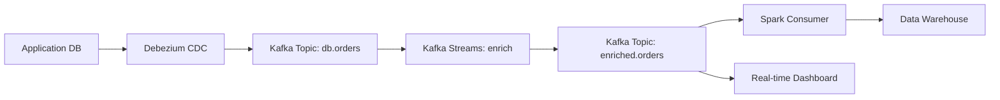
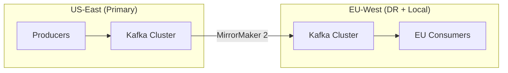
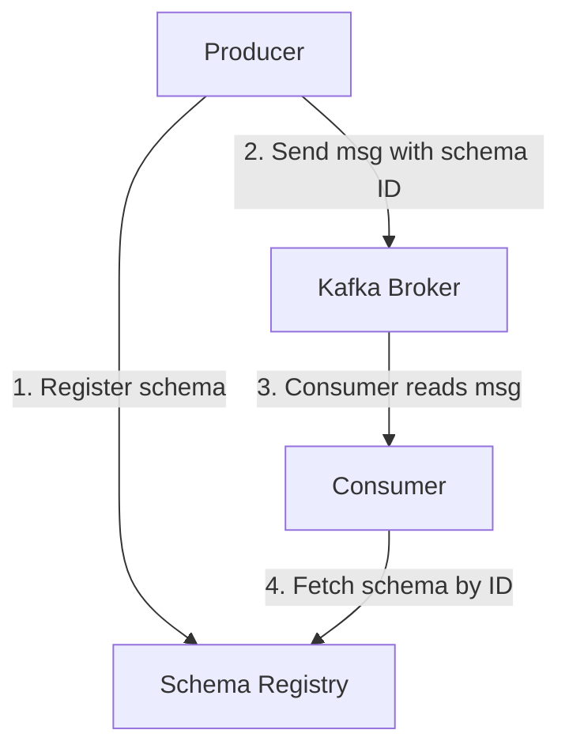

# Kafka Architecture — Real-World Production Examples

## Pattern 1: Event-Driven Data Pipeline

A complete production pipeline from source to data warehouse:



**What this shows:**
- **Debezium** captures database changes (CDC) and writes them to Kafka
- **Kafka Streams** enriches events in real-time (joins with dimension data)
- **Multiple consumers** read the same enriched topic independently
- Spark does batch loading to the warehouse; a separate consumer powers live dashboards

**Production configuration:**

```properties
# Topic: db.orders
num.partitions=12
replication.factor=3
min.insync.replicas=2
retention.ms=604800000          # 7 days
cleanup.policy=compact,delete   # Keep latest per key, delete old
compression.type=lz4
```

---

## Pattern 2: Multi-Datacenter Replication

Replicating data between regions for disaster recovery or geo-local processing:



**What this shows:**
- Primary cluster in US-East handles all writes
- MirrorMaker 2 replicates selected topics to EU cluster
- EU consumers read locally (low latency for EU users)
- On US failover, EU cluster becomes primary

**MirrorMaker 2 configuration highlights:**

```properties
# Replicate specific topics
topics=orders.*, payments.*
groups=analytics-group, alerting-group

# Preserve offsets across clusters (for consumer failover)
sync.group.offsets.enabled=true
emit.checkpoints.enabled=true

# Throughput tuning
tasks.max=8
consumer.max.poll.records=1000
producer.batch.size=65536
```

---

## Pattern 3: Schema Evolution with Schema Registry

In production, message formats change over time. Schema Registry enforces compatibility:



**What this shows:**
- Producer registers its schema (Avro/Protobuf/JSON Schema) before sending
- Messages contain a schema ID (5 bytes) instead of the full schema
- Consumer fetches the schema from the registry to deserialize
- Registry enforces compatibility rules (can't break existing consumers)

**Compatibility modes:**

| Mode | Rule | Use Case |
|------|------|----------|
| BACKWARD | New schema can read old data | Adding optional fields |
| FORWARD | Old schema can read new data | Removing optional fields |
| FULL | Both backward and forward | Most restrictive, safest |
| NONE | No compatibility check | Development only |

**Example: Safe schema evolution**

```json
// Version 1 (original)
{
  "type": "record",
  "name": "Order",
  "fields": [
    {"name": "order_id", "type": "string"},
    {"name": "amount", "type": "double"},
    {"name": "customer_id", "type": "string"}
  ]
}

// Version 2 (backward compatible — adding optional field)
{
  "type": "record",
  "name": "Order",
  "fields": [
    {"name": "order_id", "type": "string"},
    {"name": "amount", "type": "double"},
    {"name": "customer_id", "type": "string"},
    {"name": "currency", "type": "string", "default": "USD"}  // NEW - has default
  ]
}
```

> **Rule:** Adding a field WITH a default value is backward compatible. Removing a field or changing its type is a breaking change.

---

## Pattern 4: Consumer Lag Monitoring and Alerting

**Consumer lag** = difference between latest produced offset and consumer's committed offset. Critical health metric.

```python
# Monitoring consumer lag with kafka-python
from kafka import KafkaAdminClient, KafkaConsumer, TopicPartition

def get_consumer_lag(bootstrap_servers, group_id, topic):
    """Calculate lag for each partition in a consumer group."""
    admin = KafkaAdminClient(bootstrap_servers=bootstrap_servers)
    consumer = KafkaConsumer(bootstrap_servers=bootstrap_servers)
    
    # Get committed offsets for the group
    partitions = consumer.partitions_for_topic(topic)
    topic_partitions = [TopicPartition(topic, p) for p in partitions]
    
    # Get end offsets (latest available)
    end_offsets = consumer.end_offsets(topic_partitions)
    
    # Get committed offsets for group
    committed = admin.list_consumer_group_offsets(group_id)
    
    total_lag = 0
    for tp in topic_partitions:
        latest = end_offsets[tp]
        committed_offset = committed.get(tp, None)
        current = committed_offset.offset if committed_offset else 0
        lag = latest - current
        total_lag += lag
        print(f"  {tp.topic}-{tp.partition}: lag={lag} (committed={current}, latest={latest})")
    
    return total_lag

# Alert thresholds
lag = get_consumer_lag(['broker:9092'], 'order-processor', 'orders')
if lag > 100000:
    alert("CRITICAL: Consumer lag > 100K messages")
elif lag > 10000:
    alert("WARNING: Consumer lag > 10K messages")
```

**Alerting rules for production:**

| Metric | Warning | Critical | Action |
|--------|---------|----------|--------|
| Consumer lag (messages) | > 10K | > 100K | Scale consumers or investigate |
| Consumer lag (time) | > 5 min | > 30 min | Processing too slow |
| Under-replicated partitions | > 0 | > 0 for 5min | Broker issue, check disk/network |
| Offline partitions | Any | Any | Immediate: check broker health |
| ISR shrink rate | > 0.1/sec | > 1/sec | Network or disk pressure |

---

## Pattern 5: Dead Letter Queue (DLQ)

Handle poison messages that can't be processed without blocking the pipeline:

```python
def process_with_dlq(consumer, producer, dlq_topic, max_retries=3):
    """Process messages with dead letter queue for failures."""
    for message in consumer:
        retries = 0
        while retries < max_retries:
            try:
                process(message)
                consumer.commit()
                break
            except RecoverableError:
                retries += 1
                time.sleep(2 ** retries)  # Exponential backoff
            except PermanentError as e:
                # Can't process this message — send to DLQ
                producer.send(
                    dlq_topic,
                    key=message.key,
                    value=message.value,
                    headers=[
                        ('original-topic', message.topic.encode()),
                        ('error', str(e).encode()),
                        ('retry-count', str(retries).encode()),
                        ('failed-at', datetime.now().isoformat().encode()),
                    ]
                )
                consumer.commit()  # Move past the poison message
                break
        else:
            # Exhausted retries — send to DLQ
            producer.send(dlq_topic, key=message.key, value=message.value,
                         headers=[('error', b'max_retries_exceeded')])
            consumer.commit()
```

---

## Production Operations Checklist

| Category | Check | Frequency |
|----------|-------|-----------|
| Health | All brokers online | Continuous |
| Health | No under-replicated partitions | Continuous |
| Health | Consumer lag within SLA | Continuous |
| Performance | Disk usage < 80% | Daily |
| Performance | Network utilization < 70% | Daily |
| Durability | min.insync.replicas honored | At deploy |
| Security | ACLs for each topic | At topic creation |
| Schema | Compatibility mode set | At topic creation |
| Retention | Retention matches data lifecycle | Quarterly review |
| Scaling | Partition count vs consumer count | Monthly |

---

## Interview Tips

> **Tip 1:** "Walk me through a Kafka pipeline you've built" — Describe: source → topic naming → partition strategy → consumer group → error handling (DLQ) → monitoring (lag alerts). Mention schema registry for data contracts.

> **Tip 2:** "How do you handle a consumer that keeps crashing on one message?" — "Dead letter queue pattern. After N retries with backoff, route the poison message to a DLQ topic with error metadata. Commit the offset to unblock the consumer. Investigate DLQ messages separately."

> **Tip 3:** "How do you monitor Kafka in production?" — "Three key metrics: consumer lag (are consumers keeping up?), under-replicated partitions (is replication healthy?), and request latency (are brokers overloaded?). I use JMX metrics exported to Prometheus + Grafana dashboards."
