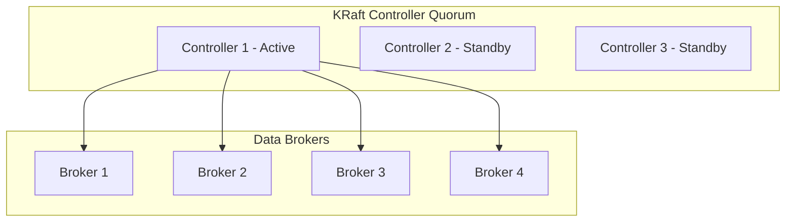

# Kafka Architecture — Senior-Level Deep Dive

## Internal Storage: Log Segments

Kafka stores data as an append-only **commit log** on disk. Each partition is a directory containing **log segments** (files).

```
/kafka-data/topic-orders-partition-0/
    00000000000000000000.log     # Segment 1: offsets 0-999
    00000000000000000000.index   # Sparse index for offset lookup
    00000000000000001000.log     # Segment 2: offsets 1000-1999
    00000000000000001000.index
    00000000000000002000.log     # Segment 3 (active): offsets 2000-...
    00000000000000002000.index
```

**How it works:**
- Messages are always appended to the **active segment** (the newest file)
- When a segment reaches `segment.bytes` (default 1GB) or `segment.ms` (default 7 days), it's "rolled" — a new segment starts
- Old segments are eligible for deletion (based on `retention.ms`) or compaction
- The `.index` file maps offsets to physical file positions (for fast seeks)

> **Why sequential I/O matters:** Kafka writes and reads are sequential (not random). This is why Kafka achieves millions of messages/sec on commodity disks — sequential I/O is 100-1000x faster than random I/O.

---

## Zero-Copy Transfer

When a consumer reads data, Kafka uses **zero-copy** (Linux `sendfile()` syscall):

```
Traditional path:
    Disk → Kernel buffer → User-space buffer → Socket buffer → NIC → Consumer
    (4 memory copies, 2 context switches)

Zero-copy path:
    Disk → Kernel buffer → NIC → Consumer
    (1 memory copy, 0 user-space involvement)
```

**Result:** Kafka serves consumers at near-network-speed with minimal CPU usage. This is why a single broker can serve thousands of consumers simultaneously.

---

## Log Compaction

With `cleanup.policy=compact`, Kafka keeps only the **latest value for each key**:

```
Before compaction:
    offset 0: key=A, value=v1
    offset 1: key=B, value=v1
    offset 2: key=A, value=v2    ← newer value for key A
    offset 3: key=C, value=v1
    offset 4: key=B, value=v2    ← newer value for key B

After compaction:
    offset 2: key=A, value=v2    ← kept (latest for A)
    offset 3: key=C, value=v1    ← kept (only value for C)
    offset 4: key=B, value=v2    ← kept (latest for B)
```

**Use cases for log compaction:**
- **Changelog topics** (Kafka Streams state stores)
- **CDC snapshots** (latest state of each database row)
- **Configuration distribution** (latest config per service)

**Tombstones:** Sending a message with value=NULL is a "delete marker." After compaction, the key is removed entirely (after `delete.retention.ms`).

---

## Controller and Metadata Management

### ZooKeeper Mode (Legacy — Being Replaced)

In traditional Kafka, ZooKeeper handles:
- Electing a **controller broker** (one broker coordinates the cluster)
- Storing topic/partition metadata
- Tracking which brokers are alive
- Managing ISR lists

**Problem with ZooKeeper:** Additional infrastructure, scalability limits (~200K partitions), latency in metadata operations.

### KRaft Mode (Kafka 3.3+ — The Future)

KRaft replaces ZooKeeper with Kafka's own Raft-based consensus protocol:



**What this shows:**
- Controllers run the Raft consensus protocol (leader + followers)
- Active controller pushes metadata to all brokers
- No ZooKeeper dependency — fewer moving parts
- Supports millions of partitions (vs ~200K with ZooKeeper)

**Benefits of KRaft:**
- Faster failover (milliseconds vs seconds)
- Simpler operations (no ZooKeeper cluster to manage)
- Higher partition count limits
- Single security model (no separate ZooKeeper ACLs)

---

## Partition Leader Election

When a broker fails, its leader partitions need new leaders:

**Election process:**
1. Controller detects broker failure (via heartbeat timeout)
2. For each partition that lost its leader:
   - Pick the first broker in the ISR list as new leader
   - If ISR is empty (all replicas dead): depends on `unclean.leader.election.enable`
3. Controller writes new leader metadata
4. Producers and consumers discover new leader via metadata refresh

**Unclean leader election:**

| Setting | Behavior | Tradeoff |
|---------|----------|----------|
| `false` (default) | Partition stays offline until ISR member recovers | No data loss, potential downtime |
| `true` | Out-of-sync replica can become leader | Data loss possible, higher availability |

> **Production recommendation:** Keep `unclean.leader.election.enable=false` for data-critical topics. Accept temporary unavailability over data loss. For logging/metrics topics, `true` is acceptable.

---

## Exactly-Once Internals

### Idempotent Producer (How It Works)

```
Producer assigns each message a:
  - Producer ID (PID): unique per producer instance
  - Sequence Number: incrementing per partition

Broker maintains: last 5 sequence numbers per PID per partition

On receive:
  - If sequence = expected next → Accept
  - If sequence < expected → Duplicate! Ignore (return success)
  - If sequence > expected + 1 → Out of order! Error
```

**This handles:** Network retries that would otherwise create duplicates. The broker deduplicates automatically.

### Transactional Protocol

```
1. Producer → Transaction Coordinator: BEGIN
2. Producer → Partition leaders: WRITE messages (marked as "uncommitted")
3. Producer → Transaction Coordinator: COMMIT
4. Transaction Coordinator → Partition leaders: Mark messages as "committed"
5. Consumers with isolation.level=read_committed: Only see committed messages
```

**Atomic multi-partition writes:** Either ALL messages in the transaction are committed, or NONE are. Used by Kafka Streams for stateful processing guarantees.

---

## Performance Characteristics

### Why Kafka Is Fast

| Technique | What It Does | Impact |
|-----------|-------------|--------|
| Sequential I/O | Append-only writes, sequential reads | 100x faster than random I/O |
| Zero-copy | Transfer data without user-space copy | Reduces CPU, increases throughput |
| Batching | Group messages in producer/consumer | Fewer network round-trips |
| Page cache | OS caches hot data in RAM | Reads often served from memory |
| Compression | Reduce message size on wire + disk | Higher throughput, lower storage |
| Partitioning | Horizontal scaling of reads/writes | Linear throughput scaling |

### Throughput Benchmarks (Approximate)

| Configuration | Throughput |
|--------------|-----------|
| Single broker, no replication | 800K+ messages/sec |
| 3 brokers, replication factor 3, acks=all | 200-400K messages/sec |
| Confluent Cloud (managed) | Scales to millions/sec |

### Latency Characteristics

| Scenario | Typical Latency |
|----------|----------------|
| Producer → Broker (acks=0) | < 5ms |
| Producer → Broker (acks=1) | 5-15ms |
| Producer → Broker (acks=all) | 15-50ms |
| End-to-end (produce → consume) | 10-100ms |

---

## Partition Count Design

**How to choose the number of partitions:**

```
Target throughput: 100 MB/s
Single consumer throughput: 10 MB/s per partition (typical)
Minimum partitions needed: 100 / 10 = 10 partitions

Account for future growth (2x): 20 partitions
Round up to nice number: 24 partitions
```

**Rules of thumb:**
- More partitions = more parallelism but more overhead
- Each partition uses ~10MB memory on broker + consumer
- Rebalancing time increases with partition count
- Start with `max(expected_throughput / per_partition_throughput, expected_consumers)`

> **Warning:** You can increase partitions later, but NEVER decrease them (would break key-based ordering). Choose conservatively but with headroom.

---

## Interview Tips

> **Tip 1:** "Why is Kafka so fast?" — "Four things: sequential I/O (append-only log), zero-copy transfer (sendfile syscall), batching (amortizes network overhead), and OS page cache (hot data served from RAM without Kafka code touching it)."

> **Tip 2:** "How does Kafka handle broker failure?" — "Every partition has a leader and N replicas. The controller detects failure via heartbeat timeout and promotes an in-sync replica to leader. Producers/consumers automatically reconnect to the new leader. Typical failover: seconds with ZooKeeper, milliseconds with KRaft."

> **Tip 3:** "How do you size partitions?" — "I calculate: target throughput / per-partition consumer throughput = minimum partitions. Then I add 2x headroom for growth. For a 100 MB/s workload with 10 MB/s per consumer, I'd use 20-24 partitions."
