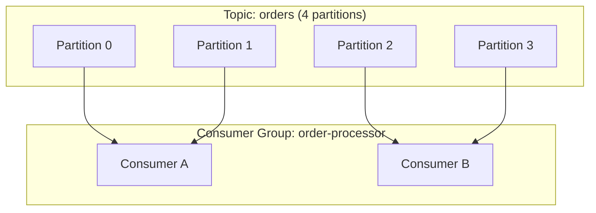

# Kafka Consumers — Fundamentals


## 🎯 Analogy

Think of a Kafka consumer like a news subscriber who keeps a bookmark (offset) in the logbook. It reads from where it left off, and Kafka remembers that bookmark so the consumer can restart without missing messages.

---
## What Is a Kafka Consumer?

A Kafka consumer is a client application that **reads (subscribes to) records from Kafka topics**. Consumers track their position (offset) so they can resume after restarts.

> **Why consumers matter for DE:** The consumer is where your data processing logic lives — reading events and writing to data lakes, warehouses, or other systems. Consumer configuration determines whether you process data exactly-once, at-least-once, or at-most-once.

---

## Consumer Groups

A consumer group is a set of consumers that **share the workload** of reading a topic:



**Rules:**
- Each partition is assigned to exactly ONE consumer in a group
- A consumer can handle multiple partitions
- Max useful consumers = number of partitions
- Multiple groups read the same topic independently (separate offsets)

---

## Basic Consumer Example

```python
from kafka import KafkaConsumer
import json

consumer = KafkaConsumer(
    'user-events',                           # Topic to subscribe to
    bootstrap_servers=['broker1:9092'],
    group_id='event-processor',              # Consumer group name
    auto_offset_reset='earliest',            # Where to start if no committed offset
    enable_auto_commit=False,                # Manual offset control (recommended)
    value_deserializer=lambda m: json.loads(m.decode('utf-8')),
)

# Poll loop: continuously read and process messages
try:
    for message in consumer:
        # Process the record
        event = message.value
        print(f"Partition: {message.partition}, Offset: {message.offset}")
        print(f"Event: {event}")
        
        process_event(event)
        
        # Commit offset AFTER successful processing (at-least-once)
        consumer.commit()
finally:
    consumer.close()
```

---

## Offset Management

Offsets track which messages have been processed:

| Strategy | How | Guarantee | Risk |
|----------|-----|-----------|------|
| `enable_auto_commit=True` | Commits every 5s automatically | At-most-once possible | May commit before processing completes |
| Manual commit after processing | `consumer.commit()` after success | At-least-once | Duplicates on crash (re-reads uncommitted) |
| Commit then process | Commit immediately, then process | At-most-once | Lost messages on crash |

```python
# RECOMMENDED: Process then commit (at-least-once)
for message in consumer:
    process(message)      # Process first
    consumer.commit()     # Commit after success
# If crash after process but before commit: message re-delivered (duplicate)
# Solution: make your processing idempotent

# Alternative: batch commit (less overhead)
batch = []
for message in consumer:
    batch.append(message)
    if len(batch) >= 100:
        process_batch(batch)
        consumer.commit()
        batch = []
```

---

## Consumer Configuration

| Parameter | Default | Recommended | Purpose |
|-----------|---------|-------------|---------|
| `group.id` | None | Set always | Identifies the consumer group |
| `auto.offset.reset` | latest | `earliest` for new groups | Where to start with no prior offset |
| `enable.auto.commit` | true | `false` | Manual commit for reliability |
| `max.poll.records` | 500 | 100-1000 | Records per poll() call |
| `max.poll.interval.ms` | 300000 | Tune to processing time | Max time between poll() calls |
| `session.timeout.ms` | 10000 | 30000-45000 | Time before declared dead |
| `heartbeat.interval.ms` | 3000 | 10000-15000 | Frequency of heartbeats |
| `fetch.min.bytes` | 1 | 1024 | Min data before returning from poll |
| `fetch.max.wait.ms` | 500 | 500 | Max wait for fetch.min.bytes |

---

## Handling Rebalances

When consumers join/leave a group, partitions are reassigned (rebalance):

```python
from kafka import ConsumerRebalanceListener

class RebalanceHandler(ConsumerRebalanceListener):
    def on_partitions_revoked(self, revoked):
        """Called BEFORE partitions are taken away."""
        # Commit any pending work before losing the partition
        consumer.commit()
        print(f"Partitions revoked: {revoked}")
    
    def on_partitions_assigned(self, assigned):
        """Called AFTER new partitions are assigned."""
        print(f"Partitions assigned: {assigned}")
        # Optionally: seek to a specific offset for the new partitions

consumer.subscribe(['orders'], listener=RebalanceHandler())
```

**Minimize rebalance disruption:**
- Use `cooperative-sticky` assignment strategy
- Set `session.timeout.ms` high enough to tolerate GC pauses
- Use `group.instance.id` for static membership (brief disconnects don't rebalance)

---

## Processing Patterns

### Pattern 1: Simple Record-by-Record

```python
for message in consumer:
    process_one(message.value)
    consumer.commit()
```

### Pattern 2: Micro-Batch (Better Throughput)

```python
while True:
    messages = consumer.poll(timeout_ms=1000, max_records=500)
    for tp, records in messages.items():
        for record in records:
            batch_buffer.append(record.value)
    
    if len(batch_buffer) >= 1000:
        bulk_insert(batch_buffer)
        consumer.commit()
        batch_buffer = []
```

### Pattern 3: Parallel Processing (Consumer + Worker Threads)

```python
from concurrent.futures import ThreadPoolExecutor

executor = ThreadPoolExecutor(max_workers=4)

for message in consumer:
    # Offload processing to thread pool
    future = executor.submit(process_record, message.value)
    # Commit only after processing completes
    futures.append((message, future))
    
    # Commit completed work periodically
    for msg, fut in completed_futures():
        if fut.done():
            consumer.commit({msg.partition: msg.offset + 1})
```

---

## Seeking (Resetting Position)

```python
from kafka import TopicPartition

# Seek to beginning (reprocess all data)
consumer.seek_to_beginning()

# Seek to end (skip all existing, only new messages)
consumer.seek_to_end()

# Seek to a specific offset
tp = TopicPartition('orders', 0)
consumer.seek(tp, 12345)

# Seek to a timestamp
offsets = consumer.offsets_for_times({tp: 1705334400000})  # Unix ms
consumer.seek(tp, offsets[tp].offset)
```

> **Use case:** "I need to reprocess all data from January 1st" → seek to the timestamp of Jan 1, then consume forward from there.

---


## ▶️ Try It Yourself

```python
from kafka import KafkaConsumer
import json

consumer = KafkaConsumer(
    "orders",
    bootstrap_servers=["localhost:9092"],
    group_id="order-processor",
    auto_offset_reset="earliest",      # Start from beginning if no offset saved
    enable_auto_commit=True,
    value_deserializer=lambda m: json.loads(m.decode("utf-8")),
)

print("Waiting for messages (Ctrl+C to stop)...")
for msg in consumer:
    print(f"Partition {msg.partition} | Offset {msg.offset} | {msg.value}")
    # In production: process msg, then commit offset manually
```

> **Run it:** Copy the snippet into a REPL or file and run it — no external services needed for the basic example.

---
## Interview Tips

> **Tip 1:** "Explain consumer groups" — "A consumer group is a set of consumers that cooperatively read a topic. Each partition is assigned to exactly one consumer in the group. This provides parallel processing and fault tolerance — if one consumer dies, its partitions are reassigned to others. Multiple groups can independently read the same topic with separate offset tracking."

> **Tip 2:** "How do you ensure exactly-once processing?" — "At the consumer level: at-least-once delivery (commit after processing) + idempotent processing logic (upsert instead of insert, or dedup table). True exactly-once requires: transactional producer (for produce-consume chains) or an idempotent sink (database upsert, S3 overwrite by partition)."

> **Tip 3:** "What happens when a consumer crashes?" — "The broker detects missing heartbeats after `session.timeout.ms`. It triggers a rebalance, reassigning the crashed consumer's partitions to remaining consumers. They resume from the last committed offset — any uncommitted messages are reprocessed (at-least-once semantics)."
