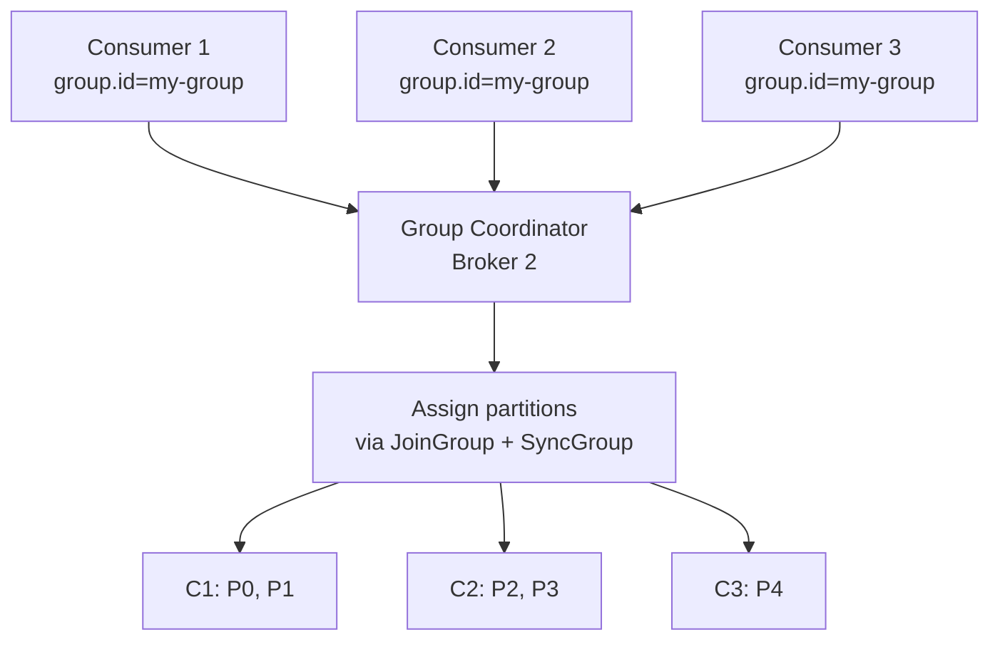
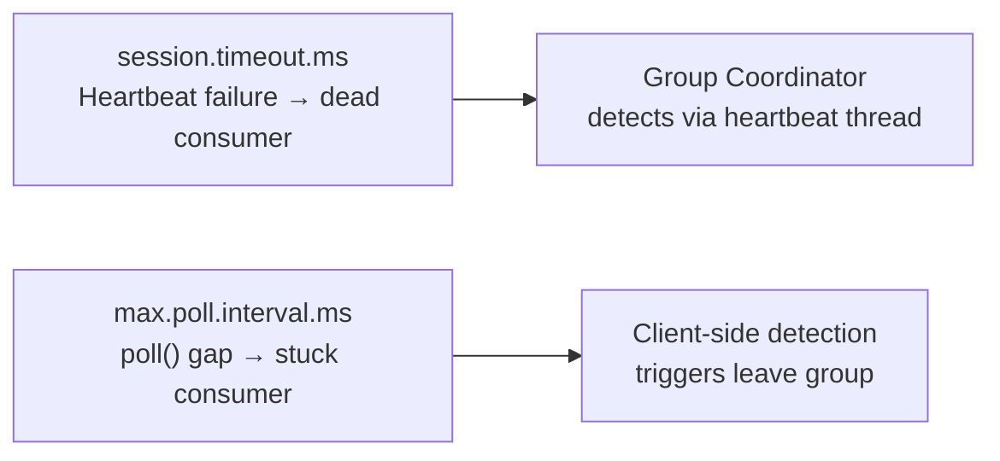

# Kafka Consumers — Intermediate

## Consumer Group Internals

A consumer group is a set of consumers sharing a `group.id`. The broker assigns partitions to consumers via the **Group Coordinator** (a broker) and a **Group Leader** (the first consumer to join).



**Key constraint**: each partition is assigned to at most one consumer in a group at a time. Adding more consumers than partitions leaves some consumers idle.

## Rebalancing Protocols

### Eager Rebalancing (Stop-the-World)

Default before Kafka 2.4. All consumers revoke ALL partitions, rejoin, and get new assignments. During rebalancing, no consumption occurs.

```
Trigger → All consumers STOP and revoke → JoinGroup → SyncGroup → Resume
```

**Problems**: even consumers unaffected by the trigger (e.g., a new consumer joining) lose their partitions temporarily.

### Cooperative (Incremental) Rebalancing

Available via `partition.assignment.strategy=CooperativeStickyAssignor`. Only the partitions that need to move are revoked.

```python
from confluent_kafka import Consumer

consumer = Consumer({
    'bootstrap.servers': 'broker:9092',
    'group.id': 'my-group',
    'partition.assignment.strategy': 'cooperative-sticky',
    'session.timeout.ms': 30000,
    'heartbeat.interval.ms': 10000,
})
```

The cooperative protocol runs 2 rounds:
1. Round 1: coordinator announces which partitions need to move; those consumers revoke them
2. Round 2: revoked partitions are assigned to new consumers

### Rebalance Triggers

| Trigger | Description |
|---------|-------------|
| Consumer joins | New `subscribe()` call with same `group.id` |
| Consumer leaves | Clean `close()` |
| Consumer crash | Missed heartbeat for `session.timeout.ms` |
| Topic partition change | Partition count increases |
| Group coordinator failover | Broker hosting coordinator fails |

## Offset Management Deep Dive

### Commit Strategies

```python
from confluent_kafka import Consumer

# Strategy 1: Auto-commit (at-least-once, fire-and-forget)
consumer = Consumer({
    'bootstrap.servers': 'broker:9092',
    'group.id': 'group1',
    'enable.auto.commit': True,
    'auto.commit.interval.ms': 5000,
})

# Strategy 2: Manual synchronous commit (safe, slower)
consumer = Consumer({
    'bootstrap.servers': 'broker:9092',
    'group.id': 'group1',
    'enable.auto.commit': False,
})

while True:
    msg = consumer.poll(1.0)
    if msg and not msg.error():
        process(msg)
        consumer.commit(message=msg, asynchronous=False)  # blocks until ack

# Strategy 3: Manual async commit (faster, may lose offset on crash)
def on_commit(err, partitions):
    if err:
        print(f"Commit failed: {err}")

while True:
    msg = consumer.poll(1.0)
    if msg and not msg.error():
        process(msg)
        consumer.commit(asynchronous=True, on_commit=on_commit)
```

### Batch Processing with Offset Management

```python
from confluent_kafka import Consumer, TopicPartition

consumer = Consumer({
    'bootstrap.servers': 'broker:9092',
    'group.id': 'batch-group',
    'enable.auto.commit': False,
    'max.poll.records': 500,
})
consumer.subscribe(['events'])

while True:
    batch = consumer.consume(num_messages=500, timeout=5.0)
    if not batch:
        continue

    # Process all; commit only the highest offset per partition
    offsets = {}
    for msg in batch:
        if msg.error():
            continue
        process(msg)
        tp = TopicPartition(msg.topic(), msg.partition(), msg.offset() + 1)
        if msg.partition() not in offsets or offsets[msg.partition()].offset < tp.offset:
            offsets[msg.partition()] = tp

    consumer.commit(offsets=list(offsets.values()), asynchronous=False)
```

## Consumer Lag and Monitoring

**Consumer lag** = latest offset (high-water mark) − committed offset. It measures how far behind a consumer group is.

```bash
# CLI lag check
kafka-consumer-groups.sh \
  --bootstrap-server broker:9092 \
  --describe --group my-group

# Output:
# TOPIC  PARTITION  CURRENT-OFFSET  LOG-END-OFFSET  LAG
# orders 0          1000            1100            100
# orders 1          950             1000            50
```

### Programmatic Lag Calculation

```python
from confluent_kafka import Consumer, TopicPartition
from confluent_kafka.admin import AdminClient

def get_consumer_lag(bootstrap: str, group_id: str, topic: str) -> dict:
    consumer = Consumer({
        'bootstrap.servers': bootstrap,
        'group.id': group_id,
    })
    admin = AdminClient({'bootstrap.servers': bootstrap})

    # Get committed offsets
    partitions = [TopicPartition(topic, p) for p in range(get_partition_count(admin, topic))]
    committed = consumer.committed(partitions)

    # Get end offsets (high-water marks)
    end_offsets = consumer.get_watermark_offsets

    lag = {}
    for tp in committed:
        _, hwm = consumer.get_watermark_offsets(tp)
        committed_off = tp.offset if tp.offset >= 0 else 0
        lag[tp.partition] = hwm - committed_off

    consumer.close()
    return lag
```

### Lag Alerting Thresholds

| Lag Level | Action |
|-----------|--------|
| < 1000 msgs | Normal |
| 1000–10000 | Investigate; consumer may be slow |
| > 10000 | Alert; scale up or fix processing bottleneck |
| Growing unboundedly | Critical; consumer is not keeping up with producer rate |

## Partition Assignment Strategies

| Strategy | Description | Best For |
|----------|-------------|----------|
| `RangeAssignor` | Consecutive partitions per consumer | Correlated topics with same partition count |
| `RoundRobinAssignor` | Evenly distributes across consumers | Balanced load, no correlation |
| `StickyAssignor` | Minimizes partition movement on rebalance | Long-running stateful consumers |
| `CooperativeStickyAssignor` | Incremental rebalance + sticky | Production default recommendation |

## `max.poll.interval.ms` vs `session.timeout.ms`

These two timeouts serve different purposes and are commonly confused.



| Timeout | Default | Triggers When |
|---------|---------|---------------|
| `session.timeout.ms` | 45 s | Heartbeat not received by broker |
| `heartbeat.interval.ms` | 3 s | Frequency of heartbeat sends (must be < session.timeout/3) |
| `max.poll.interval.ms` | 5 min | Gap between `poll()` calls exceeds threshold |

```python
consumer = Consumer({
    'bootstrap.servers': 'broker:9092',
    'group.id': 'slow-processor',
    'session.timeout.ms': 30000,
    'heartbeat.interval.ms': 10000,
    # If processing 500 records takes 3 min, set this accordingly
    'max.poll.interval.ms': 300000,
    'max.poll.records': 100,    # reduce batch size to process faster
})
```

## Seek and Replay

```python
from confluent_kafka import Consumer, TopicPartition
from datetime import datetime, timezone

consumer = Consumer({'bootstrap.servers': 'broker:9092', 'group.id': 'replay-group'})

# Seek to beginning
def replay_from_start(topic: str, partitions: int):
    tps = [TopicPartition(topic, p, 0) for p in range(partitions)]
    consumer.assign(tps)
    consumer.seek(tps[0])   # or loop over all

# Seek to timestamp (replaying last 1 hour)
def replay_from_time(topic: str, minutes_ago: int = 60):
    import time
    ts_ms = int((time.time() - minutes_ago * 60) * 1000)
    partitions = consumer.list_topics(topic).topics[topic].partitions
    tps = [TopicPartition(topic, p, ts_ms) for p in partitions]
    offsets = consumer.offsets_for_times(tps)
    consumer.assign(offsets)
    for tp in offsets:
        if tp.offset >= 0:
            consumer.seek(tp)
```

## Interview Tips

> **Tip 1:** Always distinguish `session.timeout.ms` (heartbeat-based, broker-side) from `max.poll.interval.ms` (poll-gap-based, client-side). A slow processor triggers the latter, not the former — heartbeats continue even when `poll()` is delayed.

> **Tip 2:** Cooperative sticky rebalancing is almost always better for production. Lead with it when asked about rebalancing optimization. Mention that it requires `partition.assignment.strategy=cooperative-sticky` on ALL consumers in the group simultaneously.

> **Tip 3:** For "how do you handle at-least-once processing," describe: disable auto-commit, process records, commit only after successful processing. For idempotent downstream operations (upserts, dedup by offset), this is sufficient.

> **Tip 4:** Consumer lag is your #1 operational metric. Know how to calculate it (HWM − committed offset) and how to distinguish "lag because processing is slow" from "lag because consumer is dead."

> **Tip 5:** Replaying data is a major Kafka advantage over traditional queues. Know how to use `offsets_for_times()` for timestamp-based replay — it's commonly asked in scenarios about debugging production incidents.
