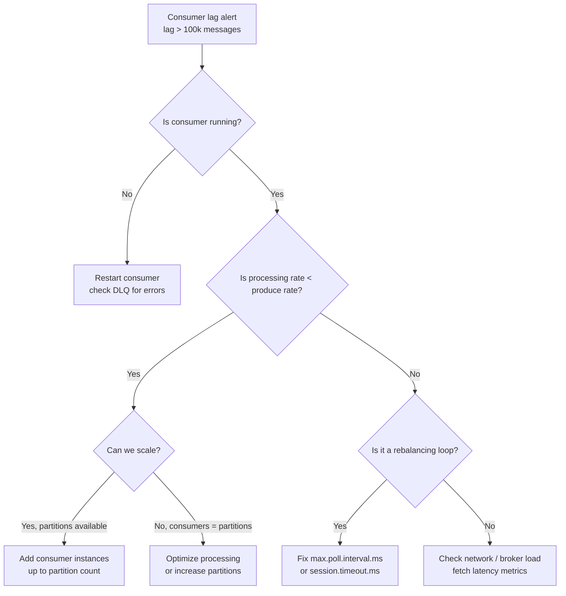

# Kafka Consumers — Real World Patterns

## Pattern 1: Multi-Threaded Consumer with Worker Pool

The Kafka consumer is NOT thread-safe. The recommended pattern is one consumer thread + a pool of worker threads.

```python
import threading
import queue
from confluent_kafka import Consumer, TopicPartition
from concurrent.futures import ThreadPoolExecutor

class ParallelConsumer:
    """One consumer thread, N processing threads, manual offset commit."""

    def __init__(self, bootstrap: str, group_id: str, topic: str, workers: int = 8):
        self.topic = topic
        self.work_queue: queue.Queue = queue.Queue(maxsize=workers * 4)
        self.executor = ThreadPoolExecutor(max_workers=workers)
        self._offset_tracker: dict[int, dict] = {}   # partition → {pending, committed}
        self._lock = threading.Lock()

        self.consumer = Consumer({
            'bootstrap.servers': bootstrap,
            'group.id': group_id,
            'enable.auto.commit': False,
            'max.poll.records': 200,
            'max.poll.interval.ms': 600000,  # 10 min; worker threads do the slow work
        })
        self.consumer.subscribe([topic])

    def run(self):
        futures = {}
        while True:
            batch = self.consumer.consume(num_messages=200, timeout=1.0)
            for msg in batch:
                if msg.error():
                    continue
                future = self.executor.submit(self._process, msg)
                futures[future] = msg

            # Check completed futures and commit eligible offsets
            done = [f for f in futures if f.done()]
            for f in done:
                msg = futures.pop(f)
                if f.exception() is None:
                    self._mark_done(msg)

            self._commit_ready_offsets()

    def _process(self, msg):
        """Runs in worker thread."""
        value = msg.value().decode()
        # ... heavy processing ...
        return value

    def _mark_done(self, msg):
        with self._lock:
            p = msg.partition()
            if p not in self._offset_tracker:
                self._offset_tracker[p] = {'max_done': -1}
            if msg.offset() > self._offset_tracker[p]['max_done']:
                self._offset_tracker[p]['max_done'] = msg.offset()

    def _commit_ready_offsets(self):
        with self._lock:
            offsets = [
                TopicPartition(self.topic, p, data['max_done'] + 1)
                for p, data in self._offset_tracker.items()
                if data['max_done'] >= 0
            ]
        if offsets:
            self.consumer.commit(offsets=offsets, asynchronous=True)
```

> **Note**: This pattern trades strict ordering for parallelism. If record ordering matters within a partition, process sequentially.

## Pattern 2: Consumer with Circuit Breaker

Protect downstream systems (databases, APIs) from consumer overload during spikes.

```python
import time
from confluent_kafka import Consumer
from enum import Enum

class CircuitState(Enum):
    CLOSED = "closed"       # normal operation
    OPEN = "open"           # downstream is failing; skip processing
    HALF_OPEN = "half_open" # probing recovery

class CircuitBreaker:
    def __init__(self, failure_threshold=5, recovery_timeout=60):
        self.state = CircuitState.CLOSED
        self.failures = 0
        self.failure_threshold = failure_threshold
        self.recovery_timeout = recovery_timeout
        self._opened_at: float = 0

    def call(self, fn, *args, **kwargs):
        if self.state == CircuitState.OPEN:
            if time.time() - self._opened_at > self.recovery_timeout:
                self.state = CircuitState.HALF_OPEN
            else:
                raise Exception("Circuit open — skipping")

        try:
            result = fn(*args, **kwargs)
            self._on_success()
            return result
        except Exception as e:
            self._on_failure()
            raise

    def _on_success(self):
        self.failures = 0
        self.state = CircuitState.CLOSED

    def _on_failure(self):
        self.failures += 1
        if self.failures >= self.failure_threshold:
            self.state = CircuitState.OPEN
            self._opened_at = time.time()


def run_consumer_with_circuit_breaker(bootstrap: str, topic: str):
    consumer = Consumer({
        'bootstrap.servers': bootstrap,
        'group.id': 'circuit-group',
        'enable.auto.commit': False,
    })
    consumer.subscribe([topic])
    breaker = CircuitBreaker(failure_threshold=5, recovery_timeout=30)

    while True:
        msg = consumer.poll(1.0)
        if msg is None or msg.error():
            continue

        try:
            breaker.call(write_to_database, msg.value())
            consumer.commit(message=msg, asynchronous=False)
        except Exception as e:
            if breaker.state == CircuitState.OPEN:
                # Back-pressure: slow down polling
                time.sleep(5)
            # Do NOT commit — message will be redelivered
```

## Pattern 3: Lag-Aware Consumer with Auto-Scaling Signal

```python
import json
import boto3
from confluent_kafka import Consumer, TopicPartition
from confluent_kafka.admin import AdminClient

class LagMonitor:
    """Emit CloudWatch metrics and signal autoscaling based on lag."""

    def __init__(self, bootstrap: str, group_id: str, topic: str):
        self.bootstrap = bootstrap
        self.group_id = group_id
        self.topic = topic
        self.cw = boto3.client('cloudwatch', region_name='us-east-1')
        self.asg = boto3.client('autoscaling', region_name='us-east-1')

    def get_lag(self) -> int:
        consumer = Consumer({
            'bootstrap.servers': self.bootstrap,
            'group.id': self.group_id,
        })
        admin = AdminClient({'bootstrap.servers': self.bootstrap})
        metadata = admin.list_topics(self.topic)
        partitions = list(metadata.topics[self.topic].partitions.keys())

        tps = [TopicPartition(self.topic, p) for p in partitions]
        committed = consumer.committed(tps, timeout=10)

        total_lag = 0
        for tp in committed:
            _, hwm = consumer.get_watermark_offsets(tp, timeout=10)
            offset = tp.offset if tp.offset >= 0 else 0
            total_lag += hwm - offset

        consumer.close()
        return total_lag

    def report_and_scale(self, asg_name: str, desired_per_10k_lag: int = 1):
        lag = self.get_lag()
        self.cw.put_metric_data(
            Namespace='Kafka/Consumers',
            MetricData=[{
                'MetricName': 'ConsumerLag',
                'Dimensions': [
                    {'Name': 'GroupId', 'Value': self.group_id},
                    {'Name': 'Topic', 'Value': self.topic},
                ],
                'Value': lag,
                'Unit': 'Count',
            }]
        )

        # Scale out: 1 consumer per 10k lag, max 20
        desired = min(max(1, lag // 10000 * desired_per_10k_lag), 20)
        self.asg.set_desired_capacity(
            AutoScalingGroupName=asg_name,
            DesiredCapacity=desired,
        )
        print(f"Lag={lag}, scaling to {desired} consumers")
```

## Pattern 4: Poison Pill Handler

A malformed message that crashes your consumer loop can stall an entire partition indefinitely.

```python
import json
from confluent_kafka import Consumer

def safe_process(msg_value: bytes) -> bool:
    """Returns True on success, False on expected failures."""
    try:
        data = json.loads(msg_value)
        validate_schema(data)
        write_to_sink(data)
        return True
    except json.JSONDecodeError:
        return False
    except ValidationError:
        return False

def run_with_poison_pill_handling(bootstrap: str, topic: str, dlq_topic: str):
    from confluent_kafka import Producer
    consumer = Consumer({
        'bootstrap.servers': bootstrap,
        'group.id': 'safe-group',
        'enable.auto.commit': False,
    })
    dlq_producer = Producer({'bootstrap.servers': bootstrap})
    consumer.subscribe([topic])

    consecutive_failures = 0
    MAX_CONSECUTIVE = 3

    while True:
        msg = consumer.poll(1.0)
        if msg is None or msg.error():
            continue

        success = safe_process(msg.value())

        if success:
            consumer.commit(message=msg, asynchronous=False)
            consecutive_failures = 0
        else:
            consecutive_failures += 1
            # Send to DLQ and commit to move past poison pill
            dlq_producer.produce(
                dlq_topic,
                key=msg.key(),
                value=msg.value(),
                headers=[('original_topic', topic.encode()),
                         ('original_partition', str(msg.partition()).encode()),
                         ('original_offset', str(msg.offset()).encode())],
            )
            dlq_producer.flush()
            consumer.commit(message=msg, asynchronous=False)

            if consecutive_failures >= MAX_CONSECUTIVE:
                raise RuntimeError(f"Too many consecutive failures; aborting")
```

## Operational Runbook: Consumer Is Lagging



## Common Consumer Anti-Patterns

| Anti-Pattern | Problem | Fix |
|--------------|---------|-----|
| Auto-commit with slow processing | Commits before processing done → data loss on crash | Disable auto-commit; commit after processing |
| Calling external API inside poll loop | Poll timeout triggers rebalance | Use async processing; increase `max.poll.interval.ms` |
| Sharing consumer across threads | Not thread-safe; crashes | One consumer per thread |
| Ignoring `msg.error()` | Partition EOF or errors silently skipped | Always check `msg.error()` |
| Committing inside retry loop | Commits partial batch | Only commit after entire batch succeeds |
| Using `seek(0)` on all partitions naively | Replays entire topic history | Use `offsets_for_times()` for targeted replay |

## Interview Tips

> **Tip 1:** The multi-threaded consumer pattern — one consumer thread, N worker threads — is the production-standard approach for CPU-bound processing. Emphasize that the consumer itself must never be called from worker threads.

> **Tip 2:** Poison pill handling is a real operational problem. The correct production answer is: send to DLQ, commit offset to move past it, alert. Never block the consumer partition indefinitely on a bad record.

> **Tip 3:** Consumer lag monitoring should drive autoscaling decisions. When describing your monitoring setup, mention that lag should be measured per partition (not just total) to detect hotspot partitions.

> **Tip 4:** The circuit breaker pattern prevents consumer-triggered cascades. If your downstream DB is overwhelmed, the consumer should slow down (back-pressure), not hammer the DB until it falls over.

> **Tip 5:** When asked "how would you replay data from 2 hours ago," describe `offsets_for_times()` — it returns the first offset at or after a given timestamp. This is more precise than `seek(BEGINNING)` and works without knowing offset numbers.
