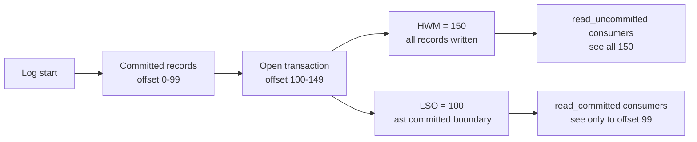
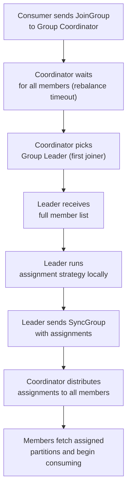
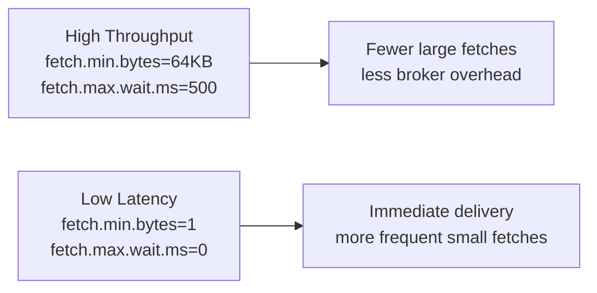

# Kafka Consumers — Senior Deep Dive

## Isolation Level and Read-Committed

When using Kafka transactions, consumers must opt in to see only committed data.

```python
from confluent_kafka import Consumer

# Default: read_uncommitted — sees all messages including aborted transactions
consumer_unsafe = Consumer({
    'bootstrap.servers': 'broker:9092',
    'group.id': 'g1',
    'isolation.level': 'read_uncommitted',  # default
})

# Correct for transactional producers: read_committed
consumer_safe = Consumer({
    'bootstrap.servers': 'broker:9092',
    'group.id': 'g1',
    'isolation.level': 'read_committed',
})
```

With `read_committed`, the consumer:
1. Buffers records from in-progress transactions
2. Only delivers them after the commit marker arrives
3. Skips records from aborted transactions (they're still in the log, just filtered)

This introduces **read latency** proportional to the longest running transaction. A stuck producer can stall all consumers on that partition.

### Last Stable Offset (LSO) vs High-Water Mark (HWM)



Monitor `records-lag-max` for `read_committed` consumers — true lag is against LSO, not HWM.

## Stateful Consumer Patterns

### External State Store (DB-Backed Consumer)

```python
import psycopg2
from confluent_kafka import Consumer, TopicPartition

class StatefulConsumer:
    """Consumer that persists processed offsets in PostgreSQL for exactly-once."""

    def __init__(self, bootstrap: str, group_id: str, db_conn_str: str):
        self.conn = psycopg2.connect(db_conn_str)
        self.consumer = Consumer({
            'bootstrap.servers': bootstrap,
            'group.id': group_id,
            'enable.auto.commit': False,
            'auto.offset.reset': 'earliest',
        })
        self.consumer.subscribe(
            ['events'],
            on_assign=self._on_assign,
            on_revoke=self._on_revoke,
        )

    def _on_assign(self, consumer, partitions):
        """Seek to stored offset, not Kafka committed offset."""
        for p in partitions:
            stored = self._load_offset(p.topic, p.partition)
            if stored is not None:
                p.offset = stored
        consumer.assign(partitions)

    def _on_revoke(self, consumer, partitions):
        """Flush pending writes before partition revoke."""
        self._flush_db()

    def _load_offset(self, topic: str, partition: int):
        cur = self.conn.cursor()
        cur.execute(
            "SELECT next_offset FROM consumer_offsets WHERE topic=%s AND partition=%s",
            (topic, partition)
        )
        row = cur.fetchone()
        return row[0] if row else None

    def _save_offset_in_tx(self, cur, topic: str, partition: int, offset: int):
        cur.execute("""
            INSERT INTO consumer_offsets (topic, partition, next_offset)
            VALUES (%s, %s, %s)
            ON CONFLICT (topic, partition) DO UPDATE SET next_offset = EXCLUDED.next_offset
        """, (topic, partition, offset + 1))

    def process(self):
        while True:
            msg = self.consumer.poll(1.0)
            if msg is None or msg.error():
                continue

            with self.conn:  # auto-commit DB transaction
                cur = self.conn.cursor()
                # Business logic writes in same DB transaction as offset
                self._upsert_data(cur, msg)
                self._save_offset_in_tx(cur, msg.topic(), msg.partition(), msg.offset())
            # Do NOT commit to Kafka — DB is the source of truth for offsets
```

This pattern achieves exactly-once without Kafka transactions: the DB transaction atomically commits the processed result and the offset together.

## Consumer Group Protocol Deep Dive

### JoinGroup / SyncGroup Flow



The assignment computation happens **on the client side** (group leader). The coordinator is a passive router. This is important: if your custom `ConsumerPartitionAssignor` has a bug, it runs in the consumer, not the broker.

### Static Group Membership

Static membership (`group.instance.id`) eliminates rebalances caused by consumer restarts within `session.timeout.ms`:

```python
import socket

consumer = Consumer({
    'bootstrap.servers': 'broker:9092',
    'group.id': 'stable-group',
    'group.instance.id': f"consumer-{socket.gethostname()}",  # unique per pod
    'session.timeout.ms': 300000,   # 5 min; pod restarts within this don't trigger rebalance
})
```

**Trade-off**: if the pod is gone for > `session.timeout.ms`, the coordinator will eventually rebalance. Static membership is valuable in Kubernetes where rolling restarts cause frequent rebalances.

## Exactly-Once Consumer Semantics — Full Analysis

| Delivery Guarantee | Implementation | Risk |
|-------------------|----------------|------|
| At-most-once | Commit before processing | Data loss if crash after commit |
| At-least-once | Commit after processing | Duplicates if crash after process, before commit |
| Exactly-once (external) | Commit offset atomically with output (DB txn) | DB becomes offset store |
| Exactly-once (Kafka) | `read_committed` + transactional producer | Requires full EOS stack |

### The Redelivery Problem

```python
# Classic at-least-once pattern
while True:
    msg = consumer.poll(1.0)
    if msg:
        process(msg)           # ← crash here
        consumer.commit(msg)   # ← offset never committed
        # On restart: message redelivered → duplicate processing
```

**Solution 1**: Idempotent processing (upsert by ID, dedup table)
**Solution 2**: Exactly-once with transactional API (as shown in producers/real-world)

## Fetch Performance Tuning

### Fetch Configuration Matrix

```python
consumer = Consumer({
    'bootstrap.servers': 'broker:9092',
    'group.id': 'high-throughput',
    # Fetch controls
    'fetch.min.bytes': 65536,      # wait until 64KB available (reduces requests)
    'fetch.max.wait.ms': 500,      # max wait if fetch.min.bytes not met
    'fetch.max.bytes': 52428800,   # 50MB max per fetch response
    'max.partition.fetch.bytes': 1048576,  # 1MB max per partition per fetch
    'max.poll.records': 1000,      # records returned per poll()
})
```

### Throughput vs Latency Tuning



## Consumer Position Tracking Internals

The consumer tracks two positions per partition:
- **Fetch position**: next offset to fetch (speculative, not committed)
- **Committed position**: last successfully committed offset (durable in `__consumer_offsets`)

On restart, the consumer always starts from the **committed position** (or `auto.offset.reset` if none exists), not the fetch position. This is why uncommitted in-flight records are redelivered after a crash.

## Multi-Tenant Consumer Isolation

In shared Kafka clusters, use quotas to prevent one consumer group from starving others:

```bash
# Set fetch-rate quota for a consumer group
kafka-configs.sh --bootstrap-server broker:9092 \
  --alter \
  --add-config 'consumer_byte_rate=20971520' \   # 20 MB/s
  --entity-type clients --entity-name slow-analytics-group
```

Throttled consumers receive a `Throttle` response with a back-off time — they must wait before the next fetch.

## Interview Tips

> **Tip 1:** The LSO vs HWM distinction is a senior-level differentiator. With `read_committed`, consumers read to LSO, not HWM. A long-running transaction blocks LSO advancement, increasing apparent lag even if the producer is actively writing.

> **Tip 2:** Static group membership (`group.instance.id`) is the right answer for Kubernetes deployments. Explain that it maps pod identity to partition assignment and avoids the costly rebalance storm during rolling restarts.

> **Tip 3:** When asked about exactly-once without Kafka transactions, describe the "offset in same DB transaction" pattern. This is practical for most OLTP systems and avoids the performance overhead of Kafka's EOS protocol.

> **Tip 4:** Know that assignment strategies run on the client (group leader), not the broker. This is why custom assignors must be on every consumer's classpath and why a buggy assignor crashes the consumer, not the broker.

> **Tip 5:** `max.poll.interval.ms` is the most common cause of unexpected rebalances in production. Slow processing loops (large DB writes, external API calls) easily exceed the 5-minute default. The fix is either increase the timeout or reduce `max.poll.records` to process smaller batches faster.

## ⚡ Cheat Sheet

**Offset Semantics Decision**
- `read_uncommitted` (default): reads up to HWM — may see messages from aborted txns
- `read_committed`: reads up to LSO (Last Stable Offset) — waits for txn to commit or abort
- LSO < HWM during open transactions → consumer lags on large uncommitted batches (set tight `transaction.timeout.ms`)

**Rebalance Types & Triggers**
| Trigger | Rebalance Type | Impact |
|---|---|---|
| Consumer joins/leaves | Eager (STOP_THE_WORLD) | All stop, reassign |
| Poll gap > `max.poll.interval.ms` | Eager | Most common production cause |
| Static membership timeout | Eager after grace period | Use `group.instance.id` to prevent rolling restart rebalances |
| Cooperative/incremental | Only reassigned partitions stop | Default in KIP-429 (Kafka 2.4+) |

**Static Membership Key Config**
```properties
group.instance.id=consumer-pod-1  # Unique stable ID per consumer
session.timeout.ms=60000          # Must be > max restart time
max.poll.interval.ms=300000       # Must be > your batch processing time
```

**Exactly-Once Consumer Pattern (DB Txn)**
```python
# Atomic: store offset in same DB txn as processed data
with db.transaction():
    db.execute("INSERT INTO processed_events ...")
    db.execute("UPDATE consumer_offsets SET offset=? WHERE partition=?", ...)
consumer.seek(partition, db_offset_at_start)  # skip auto-commit entirely
```

**Partition Assignment Protocol**
- JoinGroup → SyncGroup: leader calculates assignment, sends to coordinator, all members receive
- Range: assigns contiguous partitions per topic (can be uneven)
- RoundRobin: even distribution across topics/partitions
- Cooperative Sticky (recommended): retains current assignments; only moves minimally

**Key Metrics to Monitor**
- `records-lag-max` per consumer group: lagging > 1min of produce rate = concern
- `poll-idle-ratio`: < 0.2 = consumer is CPU-bound (shrink batch or add consumers)
- `join-rate` > 0 frequently = unstable rebalances occurring
