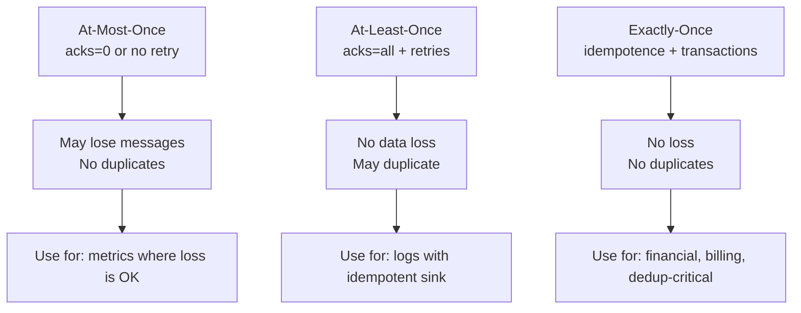
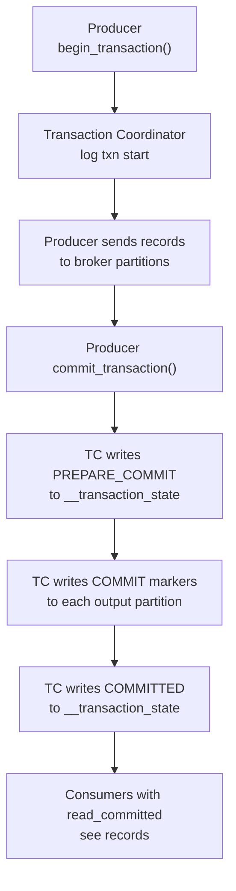

# Exactly-Once Semantics — Fundamentals


## 🎯 Analogy

Think of exactly-once semantics like a bank transfer that's guaranteed to happen exactly once: not zero times (lost), not twice (duplicate charge), but exactly once — even if the network hiccups.

---
## Delivery Guarantees in Kafka

Kafka supports three delivery guarantee levels. Understanding the tradeoffs is foundational.



| Guarantee | Config | Data Loss? | Duplicates? | Overhead |
|-----------|--------|-----------|-------------|----------|
| At-most-once | `acks=0`, `retries=0` | Yes | No | Lowest |
| At-least-once | `acks=all`, high retries | No | Yes | Medium |
| Exactly-once | Idempotence + transactions | No | No | Highest |

## What Causes Duplicates?

Without idempotence, producer retries can create duplicates:

```
1. Producer sends Batch A (seq=0) to broker
2. Broker writes Batch A, sends ACK
3. ACK lost in network
4. Producer times out, retries Batch A
5. Broker writes Batch A AGAIN → duplicate!
```

## Idempotent Producer

The idempotent producer assigns a **Producer ID (PID)** and **sequence number** to each batch. The broker deduplicates retries with the same PID + sequence.

```python
from confluent_kafka import Producer

producer = Producer({
    'bootstrap.servers': 'broker:9092',
    'enable.idempotence': True,
    # These are automatically set when idempotence is enabled:
    # acks = all
    # retries = 2147483647 (max)
    # max.in.flight.requests.per.connection = 5
})
```

With idempotence:
1. Producer assigns seq=0 to Batch A
2. Broker writes Batch A (seq=0), sends ACK
3. ACK lost; producer retries with same seq=0
4. Broker sees seq=0 already committed → **silently drops duplicate**

**Limitation**: PID is session-scoped. If the producer process restarts, it gets a new PID — the broker cannot deduplicate across process restarts without transactions.

## Kafka Transactions

Transactions enable **atomic multi-partition writes**: either all records in a transaction are committed, or none are.

```python
producer = Producer({
    'bootstrap.servers': 'broker:9092',
    'transactional.id': 'my-producer-1',   # unique per producer instance
    'enable.idempotence': True,            # auto-enabled with transactions
})

producer.init_transactions()

try:
    producer.begin_transaction()
    producer.produce('topic-a', key='k1', value='v1')
    producer.produce('topic-b', key='k2', value='v2')
    producer.commit_transaction()     # atomic: both or neither committed
except Exception:
    producer.abort_transaction()      # rollback both
    raise
```

## Transaction Coordinator

The **Transaction Coordinator** is a special broker partition (from `__transaction_state` topic) that manages the two-phase commit.



## Consumer Isolation Level

Consumers must opt in to see only committed transactional data:

```python
from confluent_kafka import Consumer

# Default: sees all records including in-progress and aborted transactions
consumer_default = Consumer({
    'bootstrap.servers': 'broker:9092',
    'group.id': 'g1',
    'isolation.level': 'read_uncommitted',  # default
})

# Correct for transactional workloads
consumer_eos = Consumer({
    'bootstrap.servers': 'broker:9092',
    'group.id': 'g1',
    'isolation.level': 'read_committed',
})
```

## The Complete EOS Stack

Exactly-once end-to-end requires cooperation across the full stack:

```
Producer:  enable.idempotence=true + transactional.id
Broker:    __transaction_state topic (replication factor >= 3)
Consumer:  isolation.level=read_committed
```

None of these alone is sufficient:
- Idempotence without transactions: dedup per session, no atomic multi-partition writes
- Transactions without `read_committed`: consumer sees aborted records

## When NOT to Use EOS

EOS has real overhead. It's not always the right choice:

| Use Case | Recommendation |
|----------|---------------|
| Log shipping (metrics, access logs) | At-least-once + idempotent sink |
| Payment processing | Exactly-once mandatory |
| Clickstream analytics | At-least-once + approximate aggregation |
| Billing / invoicing | Exactly-once mandatory |
| ML feature pipelines | At-least-once + upsert destination |


## ▶️ Try It Yourself

```python
from kafka import KafkaProducer, KafkaConsumer
# Exactly-once requires: idempotent producer + transactions

producer = KafkaProducer(
    bootstrap_servers=["localhost:9092"],
    enable_idempotence=True,         # Dedup producer retries
    acks="all",
    transactional_id="my-producer-1", # Unique ID for this producer
)

producer.init_transactions()
try:
    producer.begin_transaction()
    producer.send("output-topic", key=b"k1", value=b"exactly-once message")
    producer.commit_transaction()
    print("Transaction committed — exactly once!")
except Exception as e:
    producer.abort_transaction()
    print(f"Aborted: {e}")
```

> **Run it:** Copy the snippet into a REPL or file and run it — no external services needed for the basic example.

---
## Interview Tips

> **Tip 1:** When asked about Kafka delivery guarantees, always present all three levels before diving into the one the interviewer is interested in. This shows systematic thinking.

> **Tip 2:** Idempotent producers deduplicate **within a session** (same PID). Transactional producers provide dedup **across sessions** (same `transactional.id` → same PID after fencing). This is the key distinction.

> **Tip 3:** The classic interview trap: "Can Kafka guarantee exactly-once to external systems (databases, APIs)?" Answer: No — Kafka EOS only applies to Kafka-to-Kafka data flows. For external sinks, you need idempotent write APIs in the sink.

> **Tip 4:** Transactions require `acks=all` and `enable.idempotence=true` automatically. You cannot have a transactional producer with `acks=1` — Kafka enforces this.

> **Tip 5:** `transactional.id` must be unique per producer instance. If two instances share the same ID, one will be fenced when the other initializes. In Kubernetes, use pod name or ordinal index as part of the ID.
