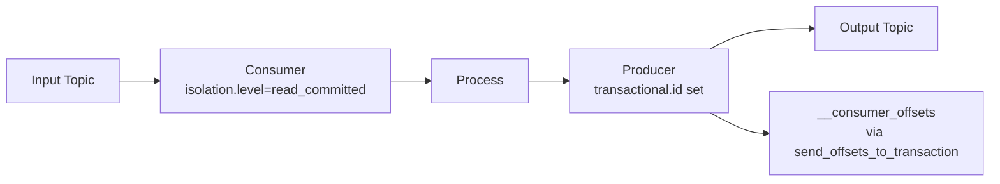
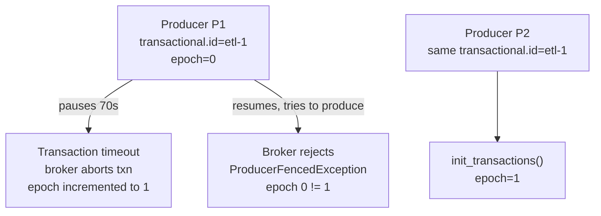
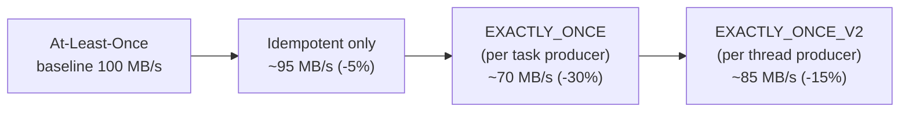

# Exactly-Once Semantics — Intermediate

## The Read-Process-Write Pattern

The canonical EOS pattern in data pipelines: consume from one Kafka topic, process, produce to another topic — atomically.



The key insight: **consumer offset commit must be part of the transaction**. This is what makes the entire consume-process-produce atomic.

```python
from confluent_kafka import Consumer, Producer, TopicPartition

producer = Producer({
    'bootstrap.servers': 'broker:9092',
    'transactional.id': 'etl-service-1',
    'enable.idempotence': True,
})
producer.init_transactions()

consumer = Consumer({
    'bootstrap.servers': 'broker:9092',
    'group.id': 'etl-group',
    'isolation.level': 'read_committed',
    'enable.auto.commit': False,
})
consumer.subscribe(['input-topic'])

while True:
    messages = consumer.consume(num_messages=100, timeout=5.0)
    if not messages:
        continue

    producer.begin_transaction()
    try:
        for msg in messages:
            if msg.error():
                continue
            result = transform(msg.value())
            producer.produce('output-topic', key=msg.key(), value=result)

        # Commit offsets AS PART of the transaction
        offsets = [TopicPartition(m.topic(), m.partition(), m.offset() + 1)
                   for m in messages if not m.error()]
        producer.send_offsets_to_transaction(
            offsets,
            consumer.consumer_group_metadata()   # includes generation ID
        )
        producer.commit_transaction()

    except Exception as e:
        producer.abort_transaction()
        # Do NOT commit consumer offsets — will re-consume on next poll
        raise
```

## `send_offsets_to_transaction` Deep Dive

This API call writes the consumer offsets to the `__consumer_offsets` topic **within the transaction**. When the transaction commits:
- Output records become visible (to `read_committed` consumers)
- Consumer offsets are committed atomically

When the transaction aborts:
- Output records are discarded
- Consumer offsets remain at previous committed position
- Consumer re-reads the same batch on next `consume()` call

The `consumer_group_metadata()` includes the **generation ID** — this prevents a fenced consumer (kicked out of the group) from committing offsets into a transaction.

## Transaction Timeout and Zombie Detection

```python
producer = Producer({
    'bootstrap.servers': 'broker:9092',
    'transactional.id': 'etl-1',
    'transaction.timeout.ms': 60000,   # broker aborts txn after 60s of inactivity
})
```

If the producer fails to `commit_transaction()` or `abort_transaction()` within `transaction.timeout.ms`, the broker:
1. Marks the transaction as `PrepareAbort`
2. Writes abort markers to all affected partitions
3. Bumps the producer epoch (fencing)

**Important**: `delivery.timeout.ms` must be less than `transaction.timeout.ms`. If a produce call times out, the transaction cannot commit.

## Abort Markers in the Log

When a transaction aborts, the broker writes **abort markers** to each affected partition. These markers are visible in the partition log but filtered by `read_committed` consumers.

```bash
# See transaction markers in the log (advanced debugging)
kafka-dump-log.sh --files /var/kafka/data/output-topic-0/00000000000000000000.log \
  --print-data-log | grep -E "type|transaction"
```

The log contains:
- Regular data records
- Transaction control records (BEGIN, COMMIT, ABORT markers)

`read_uncommitted` consumers see the data records even if the transaction aborts. `read_committed` consumers wait for the marker and filter aborted records.

## Exactly-Once with Multiple Output Topics

```python
producer.begin_transaction()
try:
    # Write to multiple topics atomically
    for order in batch:
        # Main output
        producer.produce('fulfilled-orders', key=order['id'], value=serialize(order))
        # Audit trail
        producer.produce('audit-log', key=order['id'],
                         value=serialize({'action': 'ORDER_FULFILLED', 'ts': now()}))
        # Metrics aggregation topic
        producer.produce('order-metrics', key=order['region'],
                         value=serialize({'count': 1, 'amount': order['amount']}))

    producer.send_offsets_to_transaction(offsets, consumer.consumer_group_metadata())
    producer.commit_transaction()
    # All three outputs + offset commit are atomic
except Exception:
    producer.abort_transaction()
```

## Fencing Old Producers



This fencing guarantees only one active producer per `transactional.id`. In Kubernetes:
- Pod name as part of `transactional.id` ensures uniqueness
- Old pod gets fenced when new pod starts

## Performance Overhead of EOS



EOS sources of overhead:
1. **Transaction coordination**: `__transaction_state` writes on begin/commit
2. **Marker writes**: commit/abort markers to each partition
3. **Epoch management**: PID/epoch lookup on init
4. **Reduced pipelining**: transactions serialize some operations

## Idempotent Sink Alternative

For cases where the downstream system supports idempotent writes, at-least-once + idempotent sink can achieve effective exactly-once without Kafka transaction overhead:

```python
# Example: upsert to PostgreSQL (idempotent by primary key)
def process_message(msg):
    order = json.loads(msg.value())
    conn.execute("""
        INSERT INTO orders (order_id, amount, status)
        VALUES (%(order_id)s, %(amount)s, %(status)s)
        ON CONFLICT (order_id) DO UPDATE
        SET amount = EXCLUDED.amount,
            status = EXCLUDED.status
    """, order)
    # Duplicate delivery of same order_id → same result (idempotent upsert)
```

This is simpler and higher throughput than Kafka transactions, but requires:
1. A stable unique key per record
2. An idempotent write operation (upsert, not append)

## Interview Tips

> **Tip 1:** `send_offsets_to_transaction()` is the most-missed piece of the EOS puzzle. Without it, you can have exactly-once output but at-least-once input — re-reading the same messages produces double output records on consumer restart.

> **Tip 2:** The generation ID in `consumer_group_metadata()` prevents a fenced consumer from committing offsets. This is subtle: if a consumer is kicked out due to rebalance, its generation ID becomes stale and `send_offsets_to_transaction()` with it will fail.

> **Tip 3:** For the question "how does Kafka handle zombie producers," walk through: `transactional.id` → same PID → epoch bumped on new `init_transactions()` → old epoch rejected. This shows you understand the fencing mechanism.

> **Tip 4:** EOS with Kafka Streams is simpler because `EXACTLY_ONCE_V2` mode handles the producer transaction management internally. In plain producer/consumer code, you manage it explicitly as shown above.

> **Tip 5:** Always mention the idempotent sink alternative. Not every use case needs Kafka transactions. If your sink (PostgreSQL, DynamoDB, BigQuery) supports upserts by natural key, that's often the simpler and higher-performance path.
