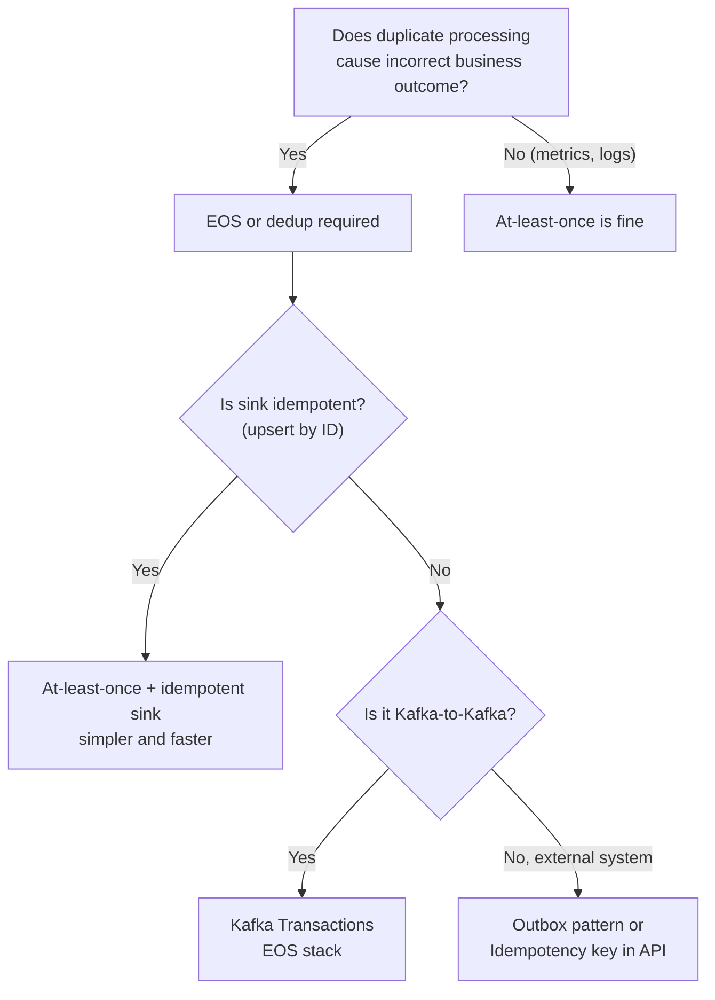

# Exactly-Once Semantics — Real World Patterns

## Pattern 1: Financial Transaction Pipeline (Full EOS)

Payment processing is the canonical use case for Kafka EOS. A duplicate payment event could charge a customer twice.

```python
import uuid
from confluent_kafka import Consumer, Producer, TopicPartition
from confluent_kafka.admin import AdminClient

class PaymentProcessor:
    def __init__(self, bootstrap: str, instance_id: str):
        self.consumer = Consumer({
            'bootstrap.servers': bootstrap,
            'group.id': 'payment-processor',
            'isolation.level': 'read_committed',   # only see committed payments
            'enable.auto.commit': False,
            'auto.offset.reset': 'earliest',
        })
        self.producer = Producer({
            'bootstrap.servers': bootstrap,
            'transactional.id': f'payment-processor-{instance_id}',
            'enable.idempotence': True,
            'acks': 'all',
            'transaction.timeout.ms': 30000,   # 30s max transaction duration
        })
        self.producer.init_transactions()

    def run(self):
        self.consumer.subscribe(['payment-requests'])

        while True:
            batch = self.consumer.consume(num_messages=50, timeout=2.0)
            if not batch:
                continue

            valid_msgs = [m for m in batch if not m.error()]
            if not valid_msgs:
                continue

            self.producer.begin_transaction()
            try:
                results = []
                for msg in valid_msgs:
                    payment = deserialize(msg.value())
                    result = self.process_payment(payment)   # calls payment gateway
                    results.append((msg, result))

                for msg, result in results:
                    # Write outcome to downstream topics
                    self.producer.produce(
                        'payment-results',
                        key=msg.key(),
                        value=serialize(result),
                    )
                    if result['status'] == 'FAILED':
                        self.producer.produce(
                            'payment-failures',
                            key=msg.key(),
                            value=serialize({**result, 'retry_eligible': True}),
                        )

                # Atomically commit offsets + output
                offsets = [TopicPartition(m.topic(), m.partition(), m.offset() + 1)
                           for m in valid_msgs]
                self.producer.send_offsets_to_transaction(
                    offsets,
                    self.consumer.consumer_group_metadata(),
                )
                self.producer.commit_transaction()

            except Exception as e:
                self.producer.abort_transaction()
                # Logs + alerting here
                raise

    def process_payment(self, payment: dict) -> dict:
        # Idempotency key: payment ID prevents double-charging
        response = payment_gateway.charge(
            amount=payment['amount'],
            idempotency_key=payment['payment_id'],   # critical!
        )
        return {'payment_id': payment['payment_id'], 'status': response.status}
```

**Critical observation**: even with Kafka EOS, the payment gateway call uses an **idempotency key**. If the transaction aborts and retries, the same `payment_id` is sent again — the gateway deduplicates it. This is multi-system EOS via idempotent external APIs.

## Pattern 2: Outbox Pattern for Database + Kafka Atomicity

When you need to update a database AND publish a Kafka event atomically (without distributed 2PC):

```python
import psycopg2
import json
from confluent_kafka import Producer

class OutboxWriter:
    """Write to DB and outbox table in one transaction."""

    def __init__(self, db_conn_str: str):
        self.conn = psycopg2.connect(db_conn_str)

    def create_order(self, order: dict) -> str:
        order_id = str(uuid.uuid4())
        with self.conn:    # DB transaction
            cur = self.conn.cursor()
            # Business write
            cur.execute(
                "INSERT INTO orders (id, user_id, amount) VALUES (%s, %s, %s)",
                (order_id, order['user_id'], order['amount'])
            )
            # Outbox write (same transaction)
            cur.execute("""
                INSERT INTO outbox (id, topic, key, payload, created_at)
                VALUES (%s, %s, %s, %s, NOW())
            """, (
                str(uuid.uuid4()),
                'order-events',
                order_id,
                json.dumps({'order_id': order_id, 'event': 'ORDER_CREATED', **order})
            ))
        return order_id


class OutboxRelay:
    """Poll outbox table and publish to Kafka — exactly once via DB dedup."""

    def __init__(self, db_conn_str: str, bootstrap: str):
        self.conn = psycopg2.connect(db_conn_str)
        self.producer = Producer({
            'bootstrap.servers': bootstrap,
            'enable.idempotence': True,
            'acks': 'all',
        })

    def relay(self):
        while True:
            with self.conn:
                cur = self.conn.cursor()
                cur.execute("""
                    SELECT id, topic, key, payload
                    FROM outbox
                    WHERE published = FALSE
                    ORDER BY created_at
                    LIMIT 100
                    FOR UPDATE SKIP LOCKED
                """)
                rows = cur.fetchall()
                if not rows:
                    import time; time.sleep(0.1)
                    continue

                for row_id, topic, key, payload in rows:
                    self.producer.produce(
                        topic=topic,
                        key=key.encode(),
                        value=payload.encode() if isinstance(payload, str) else json.dumps(payload).encode(),
                    )

                self.producer.flush()   # ensure delivery before marking as published

                ids = [r[0] for r in rows]
                cur.execute(
                    "UPDATE outbox SET published = TRUE WHERE id = ANY(%s)", (ids,)
                )
```

**Why this achieves effective EOS:**
- DB transaction: order + outbox row committed atomically
- If relay crashes before marking published: re-publishes to Kafka (idempotent producer deduplicates)
- If relay crashes after marking published: no re-publish

## Pattern 3: Deduplication at the Consumer (Alternative to EOS)

When the producer cannot use transactions, implement deduplication at the consumer:

```python
import redis
import json
from confluent_kafka import Consumer

class DeduplicatingConsumer:
    def __init__(self, bootstrap: str, redis_url: str, ttl_seconds: int = 86400):
        self.consumer = Consumer({
            'bootstrap.servers': bootstrap,
            'group.id': 'dedup-consumer',
            'enable.auto.commit': False,
        })
        self.redis = redis.from_url(redis_url)
        self.ttl = ttl_seconds

    def process(self, topic: str, handler):
        self.consumer.subscribe([topic])

        while True:
            msg = self.consumer.poll(1.0)
            if msg is None or msg.error():
                continue

            event = json.loads(msg.value())
            event_id = event.get('event_id')   # stable, unique ID per event

            if not event_id:
                # No dedup key — process anyway (can't dedup)
                handler(event)
                self.consumer.commit(message=msg, asynchronous=False)
                continue

            # Check Redis dedup set
            dedup_key = f"dedup:{topic}:{event_id}"
            if self.redis.exists(dedup_key):
                # Already processed — skip and commit offset
                self.consumer.commit(message=msg, asynchronous=False)
                continue

            # Process and mark as done
            handler(event)

            # Mark in Redis with TTL (atomic: no double processing)
            self.redis.set(dedup_key, '1', ex=self.ttl)
            self.consumer.commit(message=msg, asynchronous=False)
```

**Tradeoff**: Redis dedup requires a stable unique `event_id` per record and a Redis cluster. It works even when the producer doesn't use transactions, at the cost of Redis dependency and TTL management.

## EOS in Practice: When It Actually Matters



## Production Checklist for EOS

- [ ] `enable.idempotence=True` on all producers
- [ ] `transactional.id` unique per producer instance (use pod ordinal)
- [ ] `transaction.timeout.ms` less than your processing SLA
- [ ] `isolation.level=read_committed` on all downstream consumers
- [ ] `min.insync.replicas=2` on `__transaction_state` and output topics
- [ ] `__transaction_state` replication factor = 3
- [ ] Monitor `ActiveTransactionCount` on brokers (alert if stuck transactions)
- [ ] Monitor consumer lag against LSO, not HWM
- [ ] External API calls use idempotency keys
- [ ] Abort transaction on unrecoverable errors; alert and escalate

## Interview Tips

> **Tip 1:** The outbox pattern is the senior-level answer for "how do you guarantee exactly-once between a database and Kafka without distributed transactions." Describe the two steps clearly: (1) DB transaction writes business data + outbox row atomically, (2) relay publishes outbox rows to Kafka with at-least-once and idempotent producer deduplication.

> **Tip 2:** Idempotency keys in external APIs (payment gateways, inventory systems) are the companion to Kafka EOS. EOS handles Kafka-side atomicity; idempotency keys handle external-system atomicity on retry.

> **Tip 3:** The Redis deduplication pattern is pragmatic for cross-team situations where you don't control the producer. Emphasize that it requires stable event IDs per event (not Kafka offsets, which change on replay).

> **Tip 4:** Be explicit about when EOS is NOT needed. At-least-once + idempotent sink covers most analytics use cases. Transactions add 15-30% overhead — don't impose that cost on log pipelines.

> **Tip 5:** Monitoring EOS in production: watch `ActiveTransactionCount` for stuck transactions, and measure consumer lag against LSO (not HWM). A stuck transaction causes both metrics to diverge from expectations and is often missed by engineers who only look at HWM-based lag.
