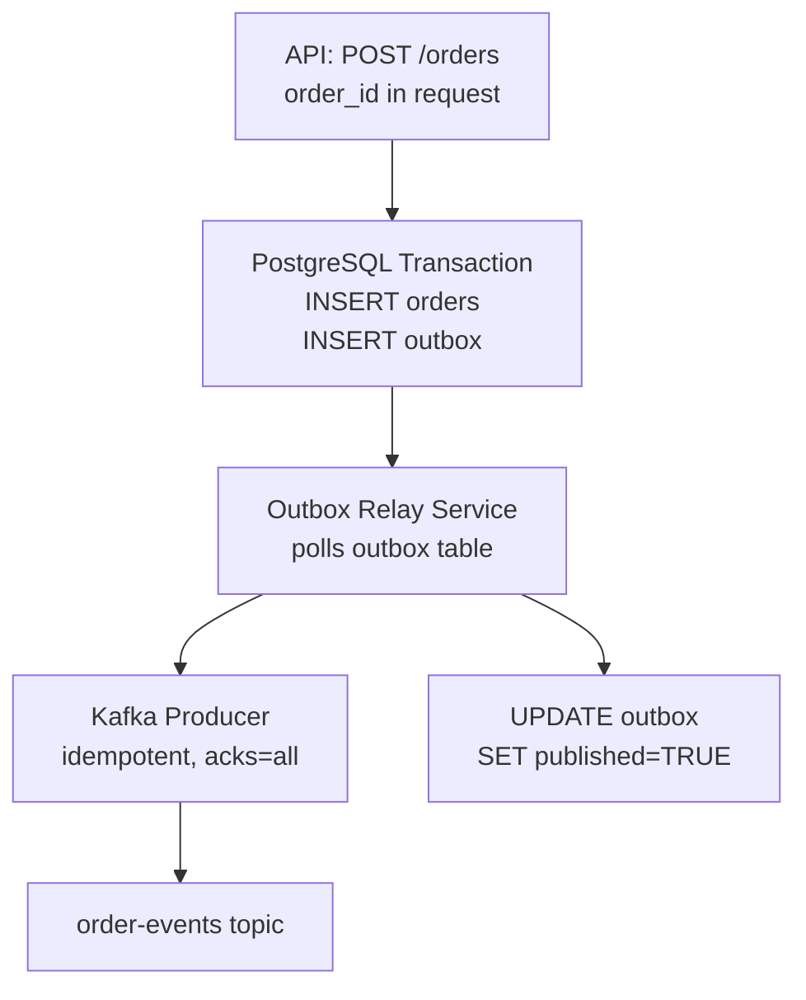

# Scenario Questions — Exactly-Once Semantics

<article data-difficulty="junior">

## 🟢 Junior: Preventing Duplicate Order Notifications

**Scenario:** Your notification service consumes from an `orders` topic and sends emails. Due to a bug, some messages were retried by the producer, causing duplicate records in the topic. Users are receiving two emails for the same order. The producer does not use transactions.

**Question:** How do you fix the consumer side to prevent duplicate emails?

<details>
<summary>💡 Hint</summary>

You can't fix the producer-side duplicates retroactively (they're already in the topic). Focus on detecting and skipping duplicates at the consumer. What makes an order unique? Use that as a deduplication key. Where can you store processed IDs?
</details>

<details>
<summary>✅ Solution</summary>

Implement consumer-side deduplication using Redis or a database:

```python
import redis
import json
from confluent_kafka import Consumer

r = redis.Redis(host='redis-host', port=6379, db=0)

consumer = Consumer({
    'bootstrap.servers': 'broker:9092',
    'group.id': 'notification-service',
    'enable.auto.commit': False,
})
consumer.subscribe(['orders'])

while True:
    msg = consumer.poll(1.0)
    if msg is None or msg.error():
        continue

    order = json.loads(msg.value())
    order_id = order['order_id']

    # Try to set a dedup key with NX (only if not exists) and TTL
    is_new = r.set(f"notified:{order_id}", '1', ex=86400, nx=True)

    if is_new:
        send_email(order)   # only send if not already processed
    else:
        print(f"Duplicate skipped: {order_id}")

    # Always commit offset (including duplicates we skipped)
    consumer.commit(message=msg, asynchronous=False)
```

**Key points:**
- `nx=True` makes the Redis SET atomic — only one process sets it first
- TTL of 24h prevents Redis growing unboundedly (tune based on your order ID lifetime)
- Always commit the offset, even for skipped duplicates — otherwise you'll re-process them on restart
- `order_id` must be a stable, unique identifier (not generated fresh for each message)
</details>

</article>

<article data-difficulty="mid-level">

## 🟡 Mid-Level: ETL Pipeline with Exactly-Once

**Scenario:** You're building a data pipeline that reads from `raw-events` topic, transforms each event (adds geo-enrichment from an in-memory lookup table), and writes to `enriched-events` topic. The pipeline must guarantee no lost events and no duplicate output records, even if the service crashes mid-batch.

**Question:** Design the producer/consumer configuration. Show the transaction boundary.

<details>
<summary>💡 Hint</summary>

This is the classic read-process-write pattern for EOS. The transaction must include: the produce to output topic AND the consumer offset commit. If the transaction aborts, the consumer re-reads the same messages. What API ties the offset commit into the transaction?
</details>

<details>
<summary>✅ Solution</summary>

```python
from confluent_kafka import Consumer, Producer, TopicPartition
import json

BOOTSTRAP = 'broker:9092'
INPUT_TOPIC = 'raw-events'
OUTPUT_TOPIC = 'enriched-events'
CONSUMER_GROUP = 'geo-enrichment-pipeline'

consumer = Consumer({
    'bootstrap.servers': BOOTSTRAP,
    'group.id': CONSUMER_GROUP,
    'isolation.level': 'read_committed',   # only read committed input events
    'enable.auto.commit': False,
    'auto.offset.reset': 'earliest',
})

producer = Producer({
    'bootstrap.servers': BOOTSTRAP,
    'transactional.id': 'geo-enrichment-1',   # unique per instance
    'enable.idempotence': True,
    'acks': 'all',
    'transaction.timeout.ms': 30000,
})

producer.init_transactions()
consumer.subscribe([INPUT_TOPIC])

geo_table = load_geo_lookup_table()   # in-memory enrichment data

while True:
    batch = consumer.consume(num_messages=200, timeout=5.0)
    if not batch:
        continue

    valid = [m for m in batch if not m.error()]
    if not valid:
        continue

    producer.begin_transaction()
    try:
        for msg in valid:
            raw = json.loads(msg.value())
            enriched = {**raw, 'region': geo_table.get(raw.get('ip_prefix', ''), 'unknown')}
            producer.produce(OUTPUT_TOPIC, key=msg.key(), value=json.dumps(enriched).encode())

        # CRITICAL: commit offset as part of the transaction
        offsets = [TopicPartition(m.topic(), m.partition(), m.offset() + 1) for m in valid]
        producer.send_offsets_to_transaction(offsets, consumer.consumer_group_metadata())
        producer.commit_transaction()

    except Exception as e:
        producer.abort_transaction()
        # Consumer offsets NOT committed — will re-read same batch
        print(f"Transaction aborted: {e}")
        # Brief backoff before retry
        import time; time.sleep(1)
```

**Why this is exactly-once:**
- If crash before `commit_transaction()`: transaction aborts, consumer re-reads (at-least-once input), output never visible
- If crash after `commit_transaction()`: consumer offset committed, output visible — no re-processing
- `read_committed` on consumer: won't process partially-committed upstream data

**What it does NOT guarantee:** if `geo_table.get()` itself has side effects (e.g., API calls), those are not protected by the Kafka transaction.
</details>

</article>

<article data-difficulty="senior">

## 🔴 Senior: EOS Across Kafka and PostgreSQL

**Scenario:** Your order service must:
1. Persist an order to PostgreSQL
2. Publish an `OrderCreated` event to Kafka

Both must succeed or both must fail. You cannot use a distributed transaction coordinator (XA). Users sometimes hit "Submit" twice; the payment gateway charges idempotently by order ID.

**Question:** Design an architecture that guarantees exactly-once semantics across both systems. Discuss failure modes at each step and how your design handles them.

<details>
<summary>💡 Hint</summary>

There is no distributed 2PC here. The key insight is the outbox pattern: write to PostgreSQL (order table + outbox table) in one DB transaction, then relay the outbox to Kafka separately. Double-click submission is handled by a unique constraint on order_id in PostgreSQL. Walk through each failure scenario explicitly.
</details>

<details>
<summary>✅ Solution</summary>

**Architecture:**



**Step 1: Atomic DB Write**

```sql
-- Orders table with unique constraint for double-submit protection
CREATE TABLE orders (
    order_id    UUID PRIMARY KEY,
    user_id     UUID NOT NULL,
    amount      DECIMAL(12,2) NOT NULL,
    status      VARCHAR(20) DEFAULT 'PENDING',
    created_at  TIMESTAMP DEFAULT NOW()
);

-- Outbox table
CREATE TABLE outbox (
    id          UUID PRIMARY KEY DEFAULT gen_random_uuid(),
    topic       VARCHAR(255) NOT NULL,
    key         VARCHAR(255) NOT NULL,
    payload     JSONB NOT NULL,
    created_at  TIMESTAMP DEFAULT NOW(),
    published   BOOLEAN DEFAULT FALSE
);
```

```python
def create_order(order_id: str, user_id: str, amount: float):
    with db.transaction():
        try:
            db.execute(
                "INSERT INTO orders (order_id, user_id, amount) VALUES (%s, %s, %s)",
                (order_id, user_id, amount)
            )
        except UniqueViolation:
            # Double-submit: idempotent — return existing order
            return db.fetchone("SELECT * FROM orders WHERE order_id = %s", (order_id,))

        db.execute("""
            INSERT INTO outbox (topic, key, payload)
            VALUES ('order-events', %s, %s)
        """, (order_id, json.dumps({'order_id': order_id, 'event': 'ORDER_CREATED',
                                    'user_id': user_id, 'amount': amount})))
```

**Step 2: Outbox Relay**

```python
def relay_outbox():
    producer = Producer({
        'bootstrap.servers': BOOTSTRAP,
        'enable.idempotence': True,
        'acks': 'all',
    })

    while True:
        with db.transaction():
            rows = db.fetchall("""
                SELECT id, topic, key, payload FROM outbox
                WHERE published = FALSE
                ORDER BY created_at
                LIMIT 100
                FOR UPDATE SKIP LOCKED
            """)

            for row in rows:
                producer.produce(
                    topic=row['topic'],
                    key=row['key'],
                    value=json.dumps(row['payload']).encode()
                )

            producer.flush()   # ensure delivery before marking published

            db.execute(
                "UPDATE outbox SET published = TRUE WHERE id = ANY(%s)",
                ([r['id'] for r in rows],)
            )
```

**Failure mode analysis:**

| Failure Point | Outcome | Recovery |
|--------------|---------|----------|
| API crash before DB commit | Order not created; no outbox row | Client retries with same order_id → idempotent |
| DB commit succeeds; relay not yet run | Order in DB; not yet in Kafka | Relay picks it up on next poll |
| Relay produces to Kafka; crashes before marking published | Kafka message + outbox row with published=FALSE | Relay re-produces on next run; idempotent producer deduplicates |
| Kafka producer fails | Relay retries; outbox not marked published | Safe retry |
| Double-submit (same order_id) | DB unique constraint rejects second insert | Return existing order; no duplicate outbox row |

**Why this is effectively exactly-once:**
- PostgreSQL unique constraint = dedup at creation
- DB transaction = atomic business write + outbox row
- Kafka idempotent producer = dedup on relay retry
- `published` flag updated after confirmed Kafka delivery = exactly-once relay

**Limitations:**
- Outbox relay adds latency (poll interval: typically 100ms-1s)
- `FOR UPDATE SKIP LOCKED` prevents relay parallelism conflicts
- Relay must be a singleton or use row-level locks (shown above)
</details>

</article>
