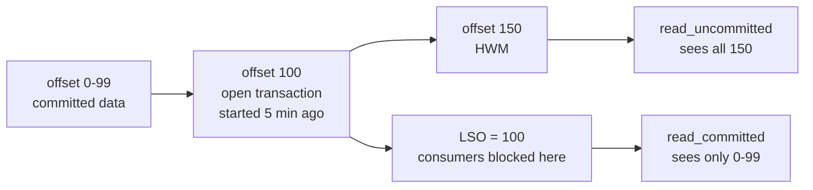
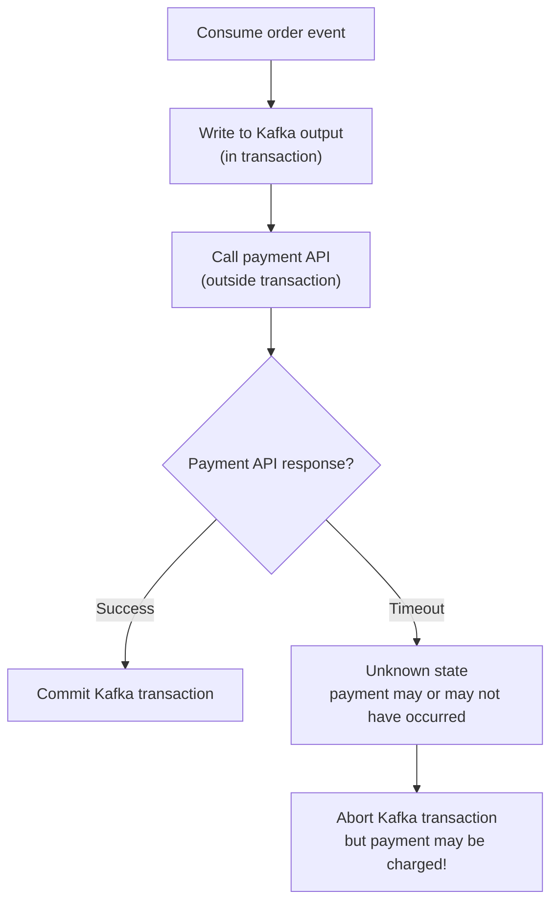

# Exactly-Once Semantics — Senior Deep Dive

## The Impossibility Result and Kafka's Approach

In distributed systems, achieving exactly-once across independent failure domains is theoretically impossible (related to the Two Generals Problem). Kafka's EOS works within a bounded failure model:

1. **Producer ↔ Broker**: Idempotence via PID + sequence
2. **Multi-partition atomic writes**: Two-phase commit via Transaction Coordinator
3. **Consumer offset atomicity**: `send_offsets_to_transaction()` makes offset part of the transaction

The system assumes the **transaction log is durable** (replication factor ≥ 3) and the **transaction coordinator can recover** from crashes. These assumptions hold under the Kafka fault model.

## Transaction State Machine

Each transaction goes through well-defined states in `__transaction_state`:

```
Empty → Ongoing → PrepareCommit → CompleteCommit
                ↓
             PrepareAbort → CompleteAbort
                ↑
         (timeout or error)
```

| State | Description |
|-------|-------------|
| Empty | No active transaction |
| Ongoing | `begin_transaction()` called; records being produced |
| PrepareCommit | `commit_transaction()` called; 2PC phase 1 |
| CompleteCommit | Commit markers written to all partitions |
| PrepareAbort | Abort initiated (explicit or timeout) |
| CompleteAbort | Abort markers written to all partitions |

```bash
# Inspect __transaction_state topic
kafka-dump-log.sh \
  --files /var/kafka/data/__transaction_state-0/00000000000000000000.log \
  --offsets-decoder
```

## Two-Phase Commit Implementation Details

### Phase 1: Prepare

```
1. Producer calls commit_transaction()
2. Producer sends EndTransactionRequest(commit=true) to Transaction Coordinator (TC)
3. TC writes TransactionMetadata{state=PrepareCommit} to __transaction_state
4. TC returns success to producer
```

### Phase 2: Commit Markers

```
5. TC sends WriteTxnMarkersRequest to each partition leader involved in the txn
6. Each partition leader writes a COMMIT marker record to the log
7. TC writes TransactionMetadata{state=CompleteCommit} to __transaction_state
8. TC returns to producer: commit complete
```

**Durability guarantee**: if TC crashes after step 3 but before step 7, the new TC reads `PrepareCommit` state and continues writing commit markers. The producer doesn't need to do anything — the TC is responsible for completing the commit.

## Last Stable Offset (LSO) and Consumer Stalls

The LSO is the highest offset below which all transactions are committed or aborted. `read_committed` consumers cannot read past the LSO.



**Production problem: Stuck transaction stalls all consumers**

If a transactional producer hangs (GC pause, network partition) without committing/aborting, LSO freezes at that producer's start offset. All `read_committed` consumers on that partition accumulate lag — even though new data is being written beyond the stuck transaction.

**Solution**: `transaction.timeout.ms` is the safety valve. The broker aborts stuck transactions after this timeout. Default is 1 minute — verify this is appropriate for your workload.

## Producer Epoch and Idempotent Deduplication

### Sequence Number Storage on Broker

The broker maintains per-(PID, TopicPartition) sequence number state in memory (also persisted in partition log). It keeps the last 5 sequence numbers (matching `max.in.flight=5`).

```
Broker state for (PID=42, TopicPartition=orders-0):
  last_seen_sequences = [95, 96, 97, 98, 99]  (ring buffer)
```

On receiving a produce request:
- `seq == last + 1`: accept (normal)
- `seq in last 5`: duplicate — silently drop, send ACK
- `seq < last - 5`: out-of-order — `OutOfOrderSequenceException`
- `seq > last + 1`: gap detected — `OutOfOrderSequenceException`

### Epoch Bump Events

| Event | Epoch Action |
|-------|-------------|
| New `init_transactions()` with existing `transactional.id` | Epoch + 1 |
| Transaction timeout (broker-initiated) | Epoch + 1 |
| Producer explicitly aborts and reinitializes | Epoch + 1 |

The epoch is stored in `__transaction_state` and survives broker restarts.

## EOS Across Microservices (The Hard Problem)

Kafka EOS is **intra-Kafka**: atomic writes across Kafka topics. The moment you involve an external system, you lose atomicity.



**There is no EOS across independent systems without a distributed transaction protocol (2PC across systems).** Practical solutions:

1. **Outbox pattern**: Write to a DB outbox table in the same DB transaction as business logic. A relay reads the outbox and publishes to Kafka.
2. **Saga pattern**: Compensating transactions for rollback
3. **Idempotent external APIs**: Use API idempotency keys; retrying with same key has no extra effect

## EXACTLY_ONCE_V2 vs Legacy

| | `EXACTLY_ONCE` (legacy) | `EXACTLY_ONCE_V2` |
|-|------------------------|-------------------|
| Available since | Kafka 0.11 | Kafka 2.5 (Streams 2.6) |
| Producer per | Task | StreamThread |
| Transactions per | Task | StreamThread |
| Epoch bump frequency | Per task restart | Per thread restart |
| Throughput | ~70% of baseline | ~85% of baseline |
| `transactional.id` format | `{app-id}-{task-id}` | `{app-id}-{thread-id}` |

Use `EXACTLY_ONCE_V2` (or the constant `StreamsConfig.EXACTLY_ONCE_V2`) for all new Kafka Streams applications.

## Monitoring EOS in Production

```python
# Key JMX metrics for EOS health
eos_metrics = {
    # Producer
    'kafka.producer:type=producer-metrics,name=txn-init-time-avg': 
        'Avg time for init_transactions()',
    'kafka.producer:type=producer-metrics,name=txn-begin-time-avg': 
        'Avg time for begin_transaction()',
    'kafka.producer:type=producer-metrics,name=txn-send-offsets-time-avg': 
        'Avg time for send_offsets_to_transaction()',
    'kafka.producer:type=producer-metrics,name=txn-commit-time-avg': 
        'Avg time for commit_transaction()',
    'kafka.producer:type=producer-metrics,name=txn-abort-time-avg': 
        'Avg time for abort_transaction()',
    # Broker
    'kafka.server:type=ProducerStateManager,name=ActiveTransactionCount': 
        'Open transactions (alert if stuck)',
}

# Alert: committed offsets diverging from LSO
# indicates stuck transaction stalling consumers
```

## Interview Tips

> **Tip 1:** When asked about the two-phase commit recovery case, explain: if the TC crashes after writing `PrepareCommit` to `__transaction_state` but before writing markers to partitions, the new TC reads `PrepareCommit` and **completes the commit** — not aborts it. This is the correct behavior for 2PC phase-2 crash.

> **Tip 2:** LSO vs HWM is a critical production distinction. A hung transaction causes LSO to freeze while HWM advances. `read_committed` consumers accumulate lag against LSO, not HWM. This means your lag dashboards may understate the problem if based on HWM.

> **Tip 3:** EOS cannot solve the "external system + Kafka" atomicity problem. The correct senior answer is the outbox pattern: write to DB and publish from DB as a two-step process where the DB is the source of truth.

> **Tip 4:** The sequence number ring buffer (last 5 sequences) is why `max.in.flight.requests.per.connection` must be ≤ 5 with idempotence. With 6 in-flight requests, a duplicate could arrive after the sequence has scrolled out of the ring buffer.

> **Tip 5:** For performance, distinguish the three levels: (1) no idempotence — baseline, (2) idempotence only — 5% overhead, (3) full transactions — 15-30% overhead. Choosing the right level for each pipeline is an engineering decision, not a one-size-fits-all.
