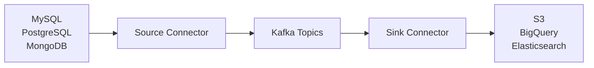
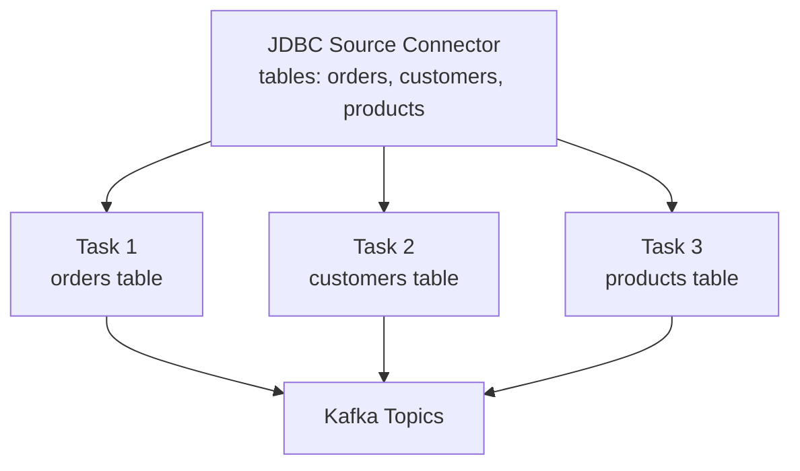

# Kafka Connect — Fundamentals

## What Is Kafka Connect?

Kafka Connect is a **scalable, fault-tolerant framework** for streaming data between Kafka and external systems. It eliminates the need to write custom producer/consumer code for common integrations.



**Key benefits:**
- Pre-built connectors for 200+ systems (Confluent Hub)
- Automatic offset management (no manual offset tracking)
- Built-in parallelism via tasks
- Schema Registry integration
- REST API for management

## Core Concepts

### Connectors

A **connector** is a configuration-driven integration with an external system. Two types:
- **Source Connector**: pulls data FROM an external system INTO Kafka
- **Sink Connector**: pushes data FROM Kafka INTO an external system

### Workers

Workers are the JVM processes that execute connectors. They can run in two modes:

| Mode | Description | Best For |
|------|-------------|----------|
| **Standalone** | Single worker, single process | Development, testing |
| **Distributed** | Multiple workers, auto-rebalancing | Production |

### Tasks

Connectors are parallelized into **tasks**. Each task handles a subset of the work (e.g., one task per table, one task per partition).



### Converters

Converters serialize/deserialize data between Connect's internal format and Kafka's byte format.

| Converter | Description |
|-----------|-------------|
| `AvroConverter` | Avro with Schema Registry |
| `JsonConverter` | JSON string (with or without schema) |
| `StringConverter` | Plain string |
| `ByteArrayConverter` | Raw bytes |

## Common Connectors

### Source Connectors

| Connector | Source System | Key Use Case |
|-----------|--------------|-------------|
| Debezium MySQL | MySQL binlog | CDC (change data capture) |
| Debezium PostgreSQL | PG replication slot | CDC |
| JDBC Source | Any JDBC DB | Polling-based ingestion |
| S3 Source | Amazon S3 | File-based ingestion |
| HTTP Source | REST APIs | API polling |

### Sink Connectors

| Connector | Sink System | Key Use Case |
|-----------|------------|-------------|
| S3 Sink | Amazon S3 | Data lake landing zone |
| BigQuery Sink | Google BigQuery | Analytics warehouse |
| Elasticsearch Sink | Elasticsearch | Search indexing |
| JDBC Sink | Any JDBC DB | DB replication |
| Snowflake Sink | Snowflake | Data warehouse |

## Deploying a Connector

### REST API (Distributed Mode)

```bash
# Deploy S3 Sink Connector
curl -X POST http://connect:8083/connectors \
  -H 'Content-Type: application/json' \
  -d '{
    "name": "s3-sink",
    "config": {
      "connector.class": "io.confluent.connect.s3.S3SinkConnector",
      "tasks.max": "4",
      "topics": "orders,customers",
      "s3.region": "us-east-1",
      "s3.bucket.name": "my-data-lake",
      "s3.part.size": "67108864",
      "flush.size": "10000",
      "storage.class": "io.confluent.connect.s3.storage.S3Storage",
      "format.class": "io.confluent.connect.s3.format.parquet.ParquetFormat",
      "schema.compatibility": "FULL",
      "key.converter": "org.apache.kafka.connect.storage.StringConverter",
      "value.converter": "io.confluent.connect.avro.AvroConverter",
      "value.converter.schema.registry.url": "http://schema-registry:8081"
    }
  }'

# Check connector status
curl http://connect:8083/connectors/s3-sink/status

# List all connectors
curl http://connect:8083/connectors

# Delete connector
curl -X DELETE http://connect:8083/connectors/s3-sink
```

### Standalone Mode (Development)

```properties
# worker.properties
bootstrap.servers=broker:9092
key.converter=org.apache.kafka.connect.json.JsonConverter
value.converter=org.apache.kafka.connect.json.JsonConverter
offset.storage.file.filename=/tmp/connect.offsets
```

```properties
# my-connector.properties
name=local-file-source
connector.class=FileStreamSource
tasks.max=1
file=/tmp/test.txt
topic=connect-test
```

```bash
connect-standalone.sh worker.properties my-connector.properties
```

## Single Message Transforms (SMTs)

SMTs transform individual records as they flow through Connect — no separate stream processing needed.

```json
{
  "transforms": "addField,renameField",
  "transforms.addField.type": "org.apache.kafka.connect.transforms.InsertField$Value",
  "transforms.addField.static.field": "source_system",
  "transforms.addField.static.value": "mysql-orders",
  "transforms.renameField.type": "org.apache.kafka.connect.transforms.ReplaceField$Value",
  "transforms.renameField.renames": "order_id:orderId,created_at:createdAt"
}
```

Common SMTs:

| SMT | Purpose |
|-----|---------|
| `InsertField` | Add static or metadata field |
| `ReplaceField` | Rename or drop fields |
| `MaskField` | Mask PII fields |
| `TimestampConverter` | Convert timestamp formats |
| `ValueToKey` | Use a value field as the message key |
| `ExtractField` | Extract nested field to top level |
| `Filter` | Drop records matching a predicate |

## Offset Management

Connect automatically manages offsets in Kafka topics:
- Source connectors: offsets stored in `connect-offsets` topic
- Sink connectors: offsets stored in `__consumer_offsets` topic

This means connectors are fault-tolerant by default — if a worker dies, another picks up from the last committed offset.

## Interview Tips

> **Tip 1:** Kafka Connect is not just "a managed producer/consumer." Emphasize that it provides automatic parallelism (tasks), schema management, SMTs, and REST management API — things you'd have to build yourself with raw producer/consumer APIs.

> **Tip 2:** Source vs Sink: Source reads from external system and writes to Kafka; Sink reads from Kafka and writes to external system. These are commonly confused under stress.

> **Tip 3:** Distributed mode is always used in production. Standalone is for development. In distributed mode, workers form a cluster and automatically rebalance tasks when workers join or leave.

> **Tip 4:** SMTs are powerful for simple transformations (field rename, masking PII, adding metadata) without writing a Kafka Streams application. Know when to use SMTs vs when to use Kafka Streams (SMTs: per-record stateless; Streams: joins, aggregations, stateful).

> **Tip 5:** Connectors manage their own offsets — you don't manually commit. For source connectors, the framework calls `sourceRecord.sourceOffset()` and stores it in `connect-offsets`. On restart, it fetches from there and resumes.
