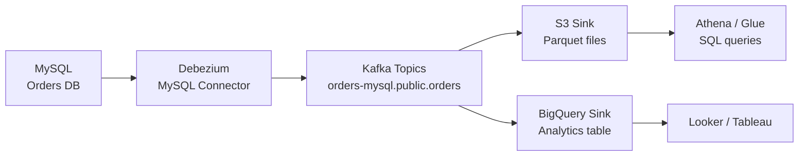

# Kafka Connect — Real World Patterns

## Pattern 1: Full CDC Pipeline (MySQL → Kafka → S3 → BigQuery)

A common data lake architecture using Kafka Connect as the integration layer.



**Debezium MySQL config:**
```json
{
  "name": "mysql-cdc",
  "config": {
    "connector.class": "io.debezium.connector.mysql.MySqlConnector",
    "tasks.max": "1",
    "database.hostname": "mysql.internal",
    "database.port": "3306",
    "database.user": "debezium",
    "database.password": "${file:/opt/secrets/db.properties:password}",
    "database.server.id": "12345",
    "topic.prefix": "orders-mysql",
    "database.include.list": "orders",
    "table.include.list": "orders.orders,orders.order_items,orders.customers",
    "database.history.kafka.bootstrap.servers": "broker:9092",
    "database.history.kafka.topic": "dbhistory.orders-mysql",
    "include.schema.changes": "true",
    "snapshot.mode": "initial",
    "transforms": "unwrap,route",
    "transforms.unwrap.type": "io.debezium.transforms.ExtractNewRecordState",
    "transforms.unwrap.drop.tombstones": "false",
    "transforms.route.type": "org.apache.kafka.connect.transforms.RegexRouter",
    "transforms.route.regex": "orders-mysql.orders.(.*)",
    "transforms.route.replacement": "raw-$1",
    "value.converter": "io.confluent.connect.avro.AvroConverter",
    "value.converter.schema.registry.url": "http://schema-registry:8081",
    "errors.tolerance": "all",
    "errors.deadletterqueue.topic.name": "cdc-dlq"
  }
}
```

**S3 Sink config (partitioned by event time):**
```json
{
  "name": "s3-sink-orders",
  "config": {
    "connector.class": "io.confluent.connect.s3.S3SinkConnector",
    "tasks.max": "4",
    "topics": "raw-orders,raw-order_items,raw-customers",
    "s3.bucket.name": "data-lake-bronze",
    "flush.size": "50000",
    "rotate.schedule.interval.ms": "3600000",
    "format.class": "io.confluent.connect.s3.format.parquet.ParquetFormat",
    "parquet.codec": "snappy",
    "partitioner.class": "io.confluent.connect.storage.partitioner.TimeBasedPartitioner",
    "path.format": "'dt'=YYYY-MM-dd/'hr'=HH",
    "locale": "en_US",
    "timezone": "UTC",
    "timestamp.extractor": "RecordField",
    "timestamp.field": "updated_at",
    "schema.compatibility": "FULL",
    "value.converter": "io.confluent.connect.avro.AvroConverter",
    "value.converter.schema.registry.url": "http://schema-registry:8081",
    "errors.tolerance": "all",
    "errors.deadletterqueue.topic.name": "s3-sink-dlq"
  }
}
```

## Pattern 2: JDBC Sink with Upsert for Data Warehousing

```json
{
  "name": "jdbc-sink-dim-customers",
  "config": {
    "connector.class": "io.confluent.connect.jdbc.JdbcSinkConnector",
    "tasks.max": "4",
    "topics": "raw-customers",
    "connection.url": "jdbc:postgresql://dw-host:5432/warehouse",
    "connection.user": "connect_writer",
    "connection.password": "${file:/opt/secrets/dw.properties:password}",
    "insert.mode": "upsert",
    "pk.mode": "record_key",
    "pk.fields": "customer_id",
    "auto.create": "false",
    "auto.evolve": "true",
    "table.name.format": "dim_${topic}",
    "batch.size": "3000",
    "max.retries": "10",
    "retry.backoff.ms": "3000",
    "errors.tolerance": "all",
    "errors.deadletterqueue.topic.name": "jdbc-sink-dlq",
    "errors.deadletterqueue.context.headers.enable": "true",
    "transforms": "dropTs",
    "transforms.dropTs.type": "org.apache.kafka.connect.transforms.ReplaceField$Value",
    "transforms.dropTs.exclude": "__deleted,__op,__source_ts_ms"
  }
}
```

## Pattern 3: Secrets Management

Never hardcode credentials in connector configs. Use externalized secrets:

```java
// Custom ConfigProvider implementation
public class VaultConfigProvider implements ConfigProvider {
    private VaultClient vault;

    @Override
    public void configure(Map<String, ?> configs) {
        this.vault = VaultClient.create(configs.get("vault.address").toString());
    }

    @Override
    public ConfigData get(String path) {
        Map<String, String> secrets = vault.read(path).getData();
        return new ConfigData(secrets);
    }

    @Override
    public ConfigData get(String path, Set<String> keys) {
        Map<String, String> all = vault.read(path).getData();
        Map<String, String> filtered = keys.stream()
            .filter(all::containsKey)
            .collect(Collectors.toMap(k -> k, all::get));
        return new ConfigData(filtered);
    }
}
```

```properties
# In worker properties
config.providers=vault
config.providers.vault.class=com.example.VaultConfigProvider
config.providers.vault.param.vault.address=https://vault.internal:8200
```

```json
{
  "database.password": "${vault:secret/kafka-connect/mysql:password}"
}
```

## Pattern 4: Connector Health Monitoring Automation

```python
import requests
import time
import boto3

def auto_restart_failed_tasks(connect_url: str, sns_topic: str):
    """Automatically restart FAILED tasks and alert on repeated failures."""
    sns = boto3.client('sns', region_name='us-east-1')
    failure_counts = {}

    while True:
        connectors = requests.get(
            f"{connect_url}/connectors?expand=status", timeout=10
        ).json()

        for name, info in connectors.items():
            for task in info['status']['tasks']:
                if task['state'] == 'FAILED':
                    task_key = f"{name}:{task['id']}"
                    failure_counts[task_key] = failure_counts.get(task_key, 0) + 1

                    if failure_counts[task_key] <= 3:
                        # Auto-restart
                        requests.post(
                            f"{connect_url}/connectors/{name}/tasks/{task['id']}/restart",
                            timeout=10
                        )
                        print(f"Restarted {task_key} (attempt {failure_counts[task_key]})")
                    else:
                        # Alert: repeated failures need human intervention
                        sns.publish(
                            TopicArn=sns_topic,
                            Subject=f"Kafka Connect: {name} task {task['id']} repeatedly failing",
                            Message=f"Task {task_key} has failed {failure_counts[task_key]} times.\n"
                                   f"Error: {task.get('trace', 'N/A')}"
                        )
                else:
                    # Reset failure count on healthy check
                    task_key = f"{name}:{task['id']}"
                    failure_counts.pop(task_key, None)

        time.sleep(30)
```

## Common Production Problems

| Problem | Symptom | Root Cause | Fix |
|---------|---------|-----------|-----|
| Debezium replication slot lag | PostgreSQL WAL disk growing | Debezium offline, slot not dropped | Monitor restart_lsn, add slot lag alert |
| S3 sink small files | Thousands of tiny Parquet files | Low throughput + short rotate interval | Increase `flush.size`, use `rotate.schedule.interval.ms` |
| Schema mismatch error | Tasks fail on schema change | `auto.evolve=false` with new column | Enable `auto.evolve=true` or pre-migrate schema |
| Task stuck in UNASSIGNED | Task never starts | Worker count < `tasks.max` | Reduce `tasks.max` or add workers |
| OOM on worker | Worker crashes with heap error | Large messages or batch size too high | Reduce `batch.max.rows`, increase JVM heap |
| Connector lag growing | Sink behind producer | Sink throughput < produce rate | Add tasks, tune batch size, check sink system performance |

## Deployment Architecture (Kubernetes)

```yaml
# kafka-connect deployment
apiVersion: apps/v1
kind: Deployment
metadata:
  name: kafka-connect
spec:
  replicas: 3   # 3 workers in the Connect cluster
  template:
    spec:
      containers:
      - name: connect
        image: confluentinc/cp-kafka-connect:7.5.0
        env:
        - name: CONNECT_BOOTSTRAP_SERVERS
          value: "broker:9092"
        - name: CONNECT_GROUP_ID
          value: "connect-cluster"
        - name: CONNECT_CONFIG_STORAGE_TOPIC
          value: "connect-configs"
        - name: CONNECT_CONFIG_STORAGE_REPLICATION_FACTOR
          value: "3"
        - name: CONNECT_OFFSET_STORAGE_TOPIC
          value: "connect-offsets"
        - name: CONNECT_OFFSET_STORAGE_REPLICATION_FACTOR
          value: "3"
        - name: CONNECT_STATUS_STORAGE_TOPIC
          value: "connect-status"
        - name: CONNECT_STATUS_STORAGE_REPLICATION_FACTOR
          value: "3"
        resources:
          requests:
            memory: "2Gi"
            cpu: "1"
          limits:
            memory: "4Gi"
            cpu: "2"
        readinessProbe:
          httpGet:
            path: /connectors
            port: 8083
          initialDelaySeconds: 30
          periodSeconds: 10
```

## Interview Tips

> **Tip 1:** When describing a data lake pipeline, walk through the full chain: Debezium captures row-level changes from binlog, publishes to Kafka with Avro+Schema Registry, S3 Sink writes time-partitioned Parquet to S3, Glue Crawler catalogs it, Athena queries it. This demonstrates end-to-end thinking.

> **Tip 2:** Secrets management is a differentiator. Never mention hardcoding credentials in Connect configs. Describe either environment variable substitution, `config.providers` (Vault, AWS Secrets Manager), or mounted secrets files.

> **Tip 3:** Auto-restart automation is expected in production. Describe a monitoring loop that restarts FAILED tasks 1-3 times automatically, then escalates to human via PagerDuty/SNS. This shows operational maturity.

> **Tip 4:** Small file problem in S3 Sink is a classic interview scenario. Explain the cause (low throughput + small `rotate.interval.ms`) and the fix (`rotate.schedule.interval.ms` for calendar-aligned flushes, `flush.size` for minimum record count). Note that small Parquet files cause slow Athena/Spark queries.

> **Tip 5:** The three Connect internal topics need replication factor 3, not 1. Emphasize this. Also mention that these topics should be excluded from any topic-deletion or cleanup policies — they're the cluster's state store.
