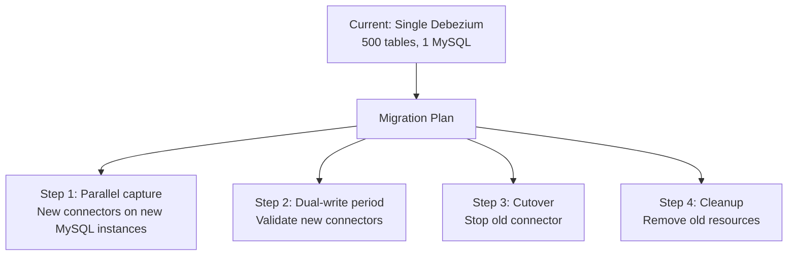

# Scenario Questions — Kafka Connect

<article data-difficulty="junior">

## 🟢 Junior: Setting Up an S3 Data Lake Pipeline

**Scenario:** Your team needs to archive all messages from the `transactions` Kafka topic to S3 in Parquet format, organized by date (`year=YYYY/month=MM/day=dd`). Files should be created at least hourly and contain at least 10,000 records each.

**Question:** Write the Kafka Connect S3 Sink configuration.

<details>
<summary>💡 Hint</summary>

Use the Confluent S3 Sink Connector. For time-based partitioning, use `TimeBasedPartitioner` with a custom `path.format`. To control file creation, use both `flush.size` (record count) and `rotate.schedule.interval.ms` (time-based). Files flush when either condition is met first.
</details>

<details>
<summary>✅ Solution</summary>

```json
{
  "name": "s3-transactions-sink",
  "config": {
    "connector.class": "io.confluent.connect.s3.S3SinkConnector",
    "tasks.max": "4",
    "topics": "transactions",
    "s3.region": "us-east-1",
    "s3.bucket.name": "data-lake-transactions",
    "format.class": "io.confluent.connect.s3.format.parquet.ParquetFormat",
    "parquet.codec": "snappy",
    "storage.class": "io.confluent.connect.s3.storage.S3Storage",
    "partitioner.class": "io.confluent.connect.storage.partitioner.TimeBasedPartitioner",
    "path.format": "'year'=YYYY/'month'=MM/'day'=dd",
    "locale": "en_US",
    "timezone": "UTC",
    "timestamp.extractor": "Wallclock",
    "flush.size": "10000",
    "rotate.schedule.interval.ms": "3600000",
    "key.converter": "org.apache.kafka.connect.storage.StringConverter",
    "value.converter": "io.confluent.connect.avro.AvroConverter",
    "value.converter.schema.registry.url": "http://schema-registry:8081",
    "errors.tolerance": "all",
    "errors.deadletterqueue.topic.name": "s3-sink-dlq"
  }
}
```

**Key decisions explained:**
- `flush.size=10000`: file is written after 10,000 records
- `rotate.schedule.interval.ms=3600000`: file is also written at every hour boundary (ensures files appear even during low traffic)
- `timestamp.extractor=Wallclock`: uses processing time for partitioning (simpler; use `RecordField` if event time matters)
- `parquet.codec=snappy`: good compression with low CPU overhead
- `tasks.max=4`: parallelism limited by topic partition count (adjust to match)
</details>

</article>

<article data-difficulty="mid-level">

## 🟡 Mid-Level: Debezium Connector Troubleshooting

**Scenario:** Your Debezium PostgreSQL CDC connector suddenly stops processing events. The connector status shows RUNNING but the source-record-write-rate metric drops to 0. Meanwhile, your DBA reports that the PostgreSQL WAL directory has grown from 2 GB to 40 GB over 3 days. No schema changes were made.

**Question:** Diagnose the root cause and provide a remediation plan.

<details>
<summary>💡 Hint</summary>

The WAL growth + 0 throughput combination points to a replication slot issue. What happens to WAL when a replication slot's consumer isn't advancing? Check `pg_replication_slots`. Also check Kafka Connect task logs for errors — RUNNING connector status doesn't mean the task is actually processing.
</details>

<details>
<summary>✅ Solution</summary>

**Diagnosis:**

```sql
-- Check replication slot status
SELECT slot_name, active, restart_lsn, confirmed_flush_lsn,
       pg_size_pretty(pg_wal_lsn_diff(pg_current_wal_lsn(), restart_lsn)) AS lag
FROM pg_replication_slots;

-- Expected output:
-- slot_name    | active | restart_lsn | confirmed_flush_lsn | lag
-- debezium_slot| f      | 0/1A000000  | 0/1A000000          | 38 GB
```

`active=false` means Debezium is NOT consuming from the slot. The slot is holding WAL since `restart_lsn`, causing 38 GB accumulation.

**Root cause investigation:**
```bash
# Check Debezium task logs
curl http://connect:8083/connectors/postgres-cdc/status | jq '.tasks'
# Even if "state": "RUNNING", check actual logs:
kubectl logs -l app=kafka-connect | grep "debezium\|postgres-cdc" | tail -100
```

Common causes when connector shows RUNNING but has 0 throughput:
1. **PostgreSQL replication slot was dropped** and recreated — Debezium lost its position
2. **Permission revoked** on the replication user
3. **Debezium task is in reconnect loop** (shows RUNNING but actually reconnecting)
4. **Kafka topic full** (retention reached, producer blocked)

**Remediation:**

```bash
# Step 1: Restart the connector task
curl -X POST http://connect:8083/connectors/postgres-cdc/tasks/0/restart

# Step 2: Monitor slot activity
# SQL: watch confirmed_flush_lsn advance within 30 seconds

# Step 3: If slot shows active=false after restart:
# Verify replication permissions
```
```sql
-- Verify Debezium user has REPLICATION permission
SELECT rolname, rolreplication FROM pg_roles WHERE rolname = 'debezium';

-- Re-grant if needed
ALTER ROLE debezium REPLICATION;
```

```bash
# Step 4: If connector must be reset (snapshot mode)
curl -X DELETE http://connect:8083/connectors/postgres-cdc
# Wait for slot to be dropped (or drop manually)
```
```sql
SELECT pg_drop_replication_slot('debezium_slot');
```
```bash
# Redeploy connector with snapshot.mode=initial to re-snapshot tables
curl -X POST http://connect:8083/connectors -d '{...snapshot.mode: "initial"...}'
```

**Prevention:**
- Alert on `pg_wal_lsn_diff(pg_current_wal_lsn(), restart_lsn) > 5GB`
- Alert on `active=false` in `pg_replication_slots` for > 5 minutes
- Set `max_slot_wal_keep_size = 10GB` in `postgresql.conf` (Postgres 13+) to auto-drop stale slots and prevent disk fill
</details>

</article>

<article data-difficulty="senior">

## 🔴 Senior: Designing a Zero-Downtime Connector Migration

**Scenario:** You have a Debezium MySQL connector streaming 500 tables from a monolithic database to Kafka. The engineering team is migrating to a microservices architecture: 500 tables will be split across 8 separate MySQL instances (each service owns its data). 

You must migrate to 8 Debezium connectors (one per MySQL instance) with zero data loss and minimal downtime. The current connector has been running for 2 years with accumulated offsets.

**Question:** Design the migration plan. What are the risks at each step?

<details>
<summary>✅ Solution</summary>

**Migration Architecture:**



**Step 1: Initial Setup (Weeks 1-2)**

For each of the 8 new MySQL instances:
```json
{
  "name": "service-orders-cdc",
  "config": {
    "connector.class": "io.debezium.connector.mysql.MySqlConnector",
    "database.server.id": "20001",
    "topic.prefix": "svc-orders",
    "database.include.list": "orders_service",
    "snapshot.mode": "initial",
    "database.history.kafka.topic": "dbhistory.svc-orders"
  }
}
```

Run full snapshot on each new MySQL instance independently. New connectors publish to NEW topic prefix (`svc-orders.*` instead of `monolith-mysql.*`).

**Step 2: Dual-Write Validation (Weeks 2-4)**

During application migration (dual writes to both old and new DB):
- Old connector: writes to `monolith-mysql.*` topics
- New connectors: write to `svc-orders.*` topics
- Consumer teams migrate to new topics

Validation check:
```python
def validate_parity(old_consumer, new_consumer, table: str, sample_pct: float = 0.1):
    """Compare events between old and new CDC streams for same table."""
    old_events = {}
    new_events = {}

    # Sample from both streams
    for msg in old_consumer.consume(num_messages=1000):
        event = deserialize(msg.value())
        if event.get('table') == table:
            old_events[event['id']] = event

    for msg in new_consumer.consume(num_messages=1000):
        event = deserialize(msg.value())
        new_events[event['id']] = event

    missing_in_new = set(old_events.keys()) - set(new_events.keys())
    extra_in_new = set(new_events.keys()) - set(old_events.keys())

    return {'missing': len(missing_in_new), 'extra': len(extra_in_new)}
```

**Step 3: Cutover (Zero-Downtime)**

```
T=0: Freeze application writes to old MySQL (maintenance window for final sync)
T=0: Verify old connector lag = 0 (all events consumed by downstream)
T=0: Verify new connectors fully caught up with new MySQL
T=1min: Stop old Debezium connector
T=1min: Update all remaining consumers to new topics
T=5min: Enable application writes to new MySQL instances only
T=10min: Monitor new connector throughput
```

**Risk matrix:**

| Risk | Probability | Impact | Mitigation |
|------|------------|--------|-----------|
| New connector misses events during snapshot | Medium | High | Run snapshot BEFORE cutover; validate row counts |
| Consumer teams not migrated to new topics | High | Medium | Track migration in JIRA; block cutover if any consumer still on old topics |
| Old replication slot not dropped | Medium | High | Monitor WAL accumulation; add alert |
| server.id conflict (MySQL) | Low | Medium | Use unique server IDs (e.g., 20001-20008) |
| New MySQL binlog not enabled | Low | High | Pre-flight checklist: verify `log_bin=ON` on all new DBs |
| Schema divergence between old/new MySQL | Medium | High | Run schema diff before cutover |

**Step 4: Cleanup (Week 6+)**

```bash
# After all consumers confirmed on new topics for 2+ weeks:
curl -X DELETE http://connect:8083/connectors/old-monolith-cdc

# Drop old MySQL replication slot
mysql -e "SELECT * FROM information_schema.PROCESSLIST WHERE USER='debezium';"

# Archive (don't immediately delete) old topics
kafka-configs.sh --bootstrap-server broker:9092 \
  --alter --add-config 'retention.ms=604800000' \  # 7 days
  --entity-type topics --entity-name 'monolith-mysql.*'
```

**Key success metrics:**
- Zero consumer groups showing lag increase after cutover
- All 8 new connectors at `source-record-write-rate > 0`
- No WAL accumulation on old MySQL after connector stopped
</details>

</article>
