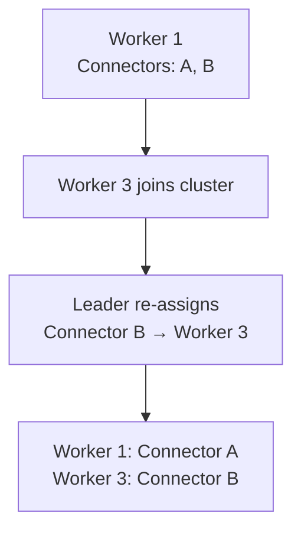

# Kafka Connect — Senior Deep Dive

## Writing a Custom Source Connector

When no pre-built connector exists, you implement the `SourceConnector` and `SourceTask` interfaces.

```java
// Custom connector: reads from a REST API
public class RestApiSourceConnector extends SourceConnector {
    private Map<String, String> config;

    @Override
    public void start(Map<String, String> props) {
        this.config = props;
        // Validate config, initialize resources
    }

    @Override
    public Class<? extends Task> taskClass() {
        return RestApiSourceTask.class;
    }

    @Override
    public List<Map<String, String>> taskConfigs(int maxTasks) {
        // Partition work across tasks (e.g., by endpoint or region)
        List<Map<String, String>> taskConfigs = new ArrayList<>();
        List<String> endpoints = Arrays.asList(config.get("api.endpoints").split(","));
        int numTasks = Math.min(maxTasks, endpoints.size());

        for (int i = 0; i < numTasks; i++) {
            Map<String, String> taskConfig = new HashMap<>(config);
            taskConfig.put("task.endpoint", endpoints.get(i));
            taskConfigs.add(taskConfig);
        }
        return taskConfigs;
    }

    @Override
    public void stop() {}

    @Override
    public ConfigDef config() {
        return new ConfigDef()
            .define("api.base.url", Type.STRING, Importance.HIGH, "Base URL of REST API")
            .define("api.endpoints", Type.LIST, Importance.HIGH, "Comma-separated endpoints")
            .define("poll.interval.ms", Type.LONG, 5000L, Importance.MEDIUM, "Poll interval");
    }

    @Override
    public String version() { return "1.0.0"; }
}
```

```java
public class RestApiSourceTask extends SourceTask {
    private String endpoint;
    private long pollIntervalMs;
    private String lastOffset;
    private RestApiClient client;

    @Override
    public void start(Map<String, String> props) {
        this.endpoint = props.get("task.endpoint");
        this.pollIntervalMs = Long.parseLong(props.getOrDefault("poll.interval.ms", "5000"));
        this.client = new RestApiClient(props.get("api.base.url"));

        // Restore offset from Connect's offset storage
        Map<String, Object> offsetKey = Collections.singletonMap("endpoint", endpoint);
        Map<String, Object> storedOffset = context.offsetStorageReader().offset(offsetKey);
        this.lastOffset = storedOffset != null ? (String) storedOffset.get("cursor") : null;
    }

    @Override
    public List<SourceRecord> poll() throws InterruptedException {
        Thread.sleep(pollIntervalMs);
        List<ApiRecord> records = client.fetchSince(endpoint, lastOffset);

        List<SourceRecord> sourceRecords = new ArrayList<>();
        for (ApiRecord record : records) {
            Map<String, Object> sourcePartition = Map.of("endpoint", endpoint);
            Map<String, Object> sourceOffset = Map.of("cursor", record.getCursor());

            sourceRecords.add(new SourceRecord(
                sourcePartition,
                sourceOffset,
                "api-events",        // target Kafka topic
                null,                // partition (null = let partitioner decide)
                Schema.STRING_SCHEMA,
                record.getId(),      // key
                Schema.STRING_SCHEMA,
                record.toJson()      // value
            ));
            this.lastOffset = record.getCursor();
        }
        return sourceRecords;
    }

    @Override
    public void stop() { client.close(); }

    @Override
    public String version() { return "1.0.0"; }
}
```

## Custom Sink Connector

```java
public class DatabaseSinkTask extends SinkTask {
    private Connection dbConn;

    @Override
    public void start(Map<String, String> props) {
        dbConn = DriverManager.getConnection(props.get("db.url"));
        dbConn.setAutoCommit(false);
    }

    @Override
    public void put(Collection<SinkRecord> records) {
        for (SinkRecord record : records) {
            Struct value = (Struct) record.value();
            // Upsert logic
            PreparedStatement stmt = dbConn.prepareStatement(
                "INSERT INTO events (id, payload) VALUES (?, ?) ON CONFLICT (id) DO UPDATE SET payload = EXCLUDED.payload"
            );
            stmt.setString(1, (String) record.key());
            stmt.setString(2, value.toString());
            stmt.executeUpdate();
        }
    }

    @Override
    public void flush(Map<TopicPartition, OffsetAndMetadata> offsets) {
        // Called before offset commit — commit DB transaction here
        dbConn.commit();
    }

    @Override
    public void stop() { dbConn.close(); }
}
```

**Critical**: `flush()` is called with the offsets about to be committed. Your external write must complete successfully before returning from `flush()`. If `flush()` throws, the framework retries and does NOT commit the offsets — enabling at-least-once delivery to the sink.

## Exactly-Once in Kafka Connect

Sink connectors can achieve exactly-once delivery to external systems if the connector implements the `ExactlyOnceSupport` interface (Kafka 3.3+).

The framework manages transactions:
1. Begins a Kafka transaction
2. Calls `put()` on the sink
3. On successful `flush()`, commits the Kafka transaction atomically with the consumer offsets

For sinks without EOS support, the standard at-least-once pattern applies: commit offsets only after `flush()` succeeds.

## Worker Group Rebalancing

When a new worker joins or an existing one fails, Connect rebalances connectors/tasks across workers.



Rebalancing uses the same Kafka consumer group protocol. The worker with the lowest `worker.id` becomes the leader and computes the assignment.

**Config for stable assignments:**
```properties
# Increase session timeout to reduce spurious rebalances
session.timeout.ms=60000
heartbeat.interval.ms=20000
worker.sync.timeout.ms=3000
```

## Connector Offset Reset

```bash
# Reset offsets for a source connector (requires connector to be stopped)
curl -X DELETE \
  "http://connect:8083/connectors/my-source/offsets"

# Reset to specific position (Kafka Connect 3.6+)
curl -X PATCH \
  "http://connect:8083/connectors/my-source/offsets" \
  -H 'Content-Type: application/json' \
  -d '{"offsets": [{"partition": {"table": "orders"}, "offset": {"cursor": "1000"}}]}'
```

## Monitoring Connect at Scale

### Key Metrics

| Metric | Type | Alert When |
|--------|------|-----------|
| `kafka.connect:type=connector-task-metrics,connector=X,task=Y,attribute=status` | Status | Not RUNNING |
| `kafka.connect:type=source-task-metrics,..name=source-record-write-rate` | Rate | Drop to 0 |
| `kafka.connect:type=sink-task-metrics,..name=sink-record-send-rate` | Rate | Drop to 0 |
| `kafka.connect:type=sink-task-metrics,..name=offset-commit-completion-rate` | Rate | Drop = commit lag |
| `kafka.connect:type=connector-metrics,..name=connector-total-task-count` | Count | Differs from config |

```python
# Prometheus scraping Connect REST API for task health
import requests
import json

def check_connect_health(connect_url: str) -> dict:
    connectors = requests.get(f"{connect_url}/connectors?expand=status").json()
    unhealthy = []
    for name, info in connectors.items():
        status = info['status']['connector']['state']
        if status != 'RUNNING':
            unhealthy.append({'name': name, 'state': status})
        for task in info['status']['tasks']:
            if task['state'] != 'RUNNING':
                unhealthy.append({'name': name, 'task': task['id'], 'state': task['state']})
    return {'total': len(connectors), 'unhealthy': unhealthy}
```

## Schema Evolution with Connect

When source data schema changes, Connect must handle it gracefully:

```json
{
  "value.converter": "io.confluent.connect.avro.AvroConverter",
  "value.converter.schema.registry.url": "http://schema-registry:8081",
  "value.converter.auto.register.schemas": "true",
  "schema.compatibility": "BACKWARD"
}
```

With `auto.register.schemas=true`, the connector registers schema changes automatically. Set `schema.compatibility=BACKWARD` to enforce safe evolution.

## Interview Tips

> **Tip 1:** The `SourceTask.poll()` and `SinkTask.put()`/`flush()` contracts are critical for custom connector implementation. `poll()` returns records with source offsets embedded. `flush()` is the signal to commit external writes atomically with the framework's offset commit.

> **Tip 2:** Worker rebalancing is the Connect equivalent of consumer group rebalancing. During rebalance, all tasks stop on all workers. Cooperative rebalancing (available in newer Connect versions) reduces this disruption.

> **Tip 3:** Offset reset via the REST API (Kafka Connect 3.6+) is a common operational need for debugging or reprocessing. Know that the connector must be stopped first, and the offset format is connector-specific (not Kafka partition/offset).

> **Tip 4:** For Debezium connectors, the offset stored is the binlog position (MySQL) or WAL LSN (PostgreSQL) — not a Kafka offset. This is why resetting is complex: you're resetting the CDC cursor, not a Kafka consumer offset.

> **Tip 5:** The three Connect internal topics (`connect-configs`, `connect-offsets`, `connect-status`) are the cluster's brain. Losing them without backup means losing all connector configs. In production, these must have replication factor 3 and regular backups.
