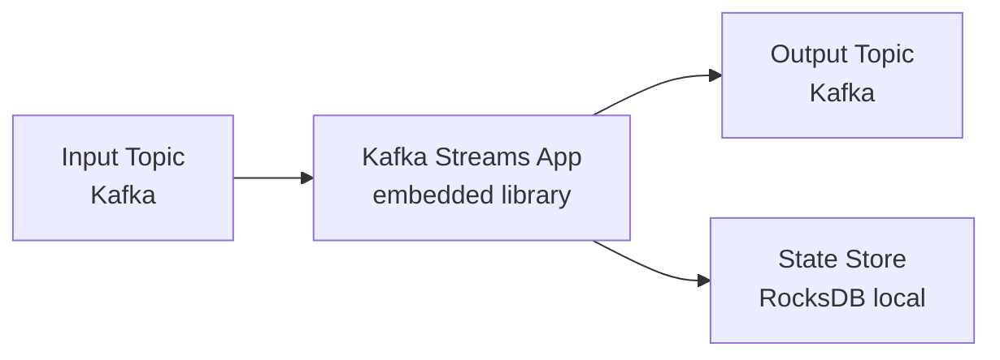
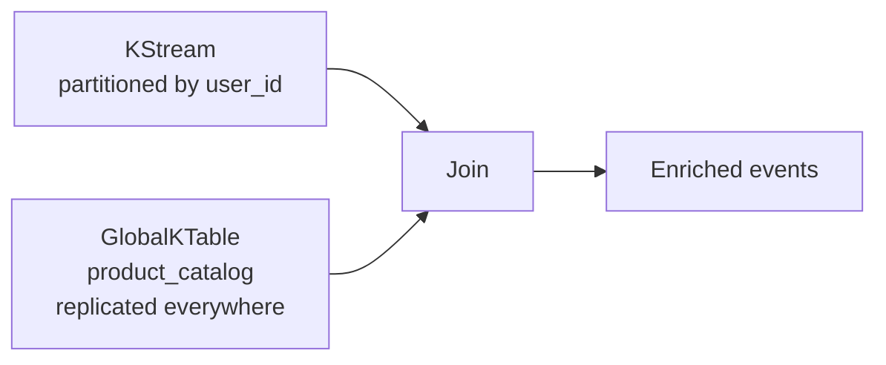
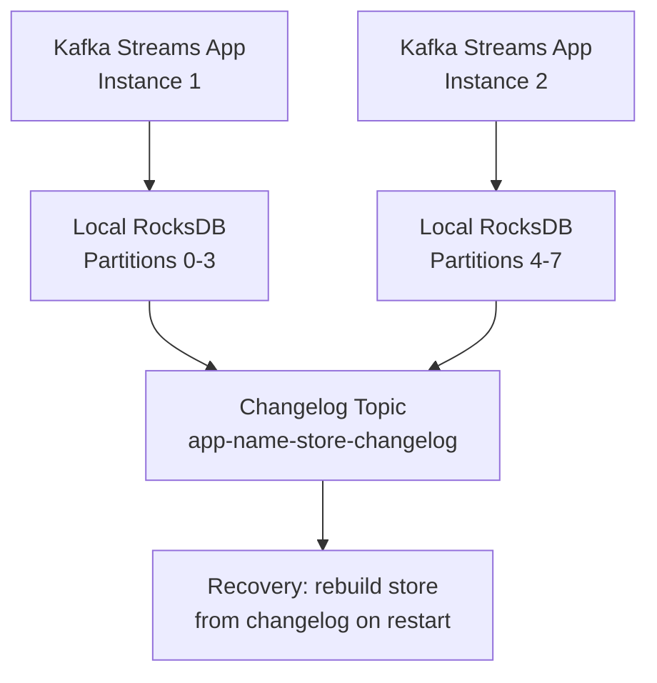
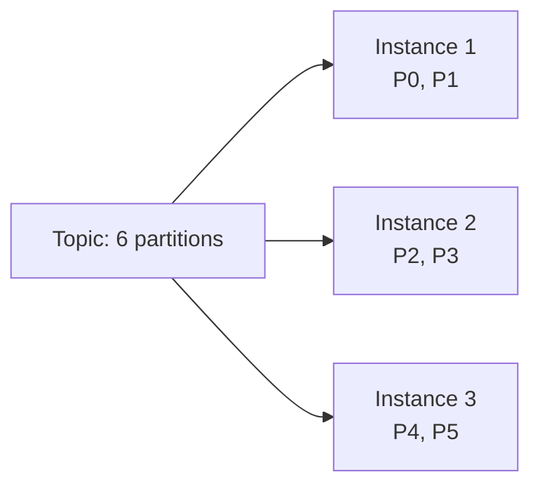

# Kafka Streams — Fundamentals

## What Is Kafka Streams?

Kafka Streams is a **client library** (not a separate cluster) for building stream processing applications on top of Kafka. Unlike Flink or Spark Streaming, it runs inside your application process — no separate cluster to manage.



**Key properties:**
- Runs as a regular Java/Scala process (or Python via faust/kstreams)
- State stored locally in RocksDB, backed up to Kafka changelog topics
- Scales by adding more instances of the same app
- Exactly-once semantics supported out of the box

## Core Abstractions

### KStream

A `KStream` represents an **infinite stream of records** — each record is an independent event. Think of it as an append-only log.

```
KStream<String, Order>
key="user-1", value={order_id: 1, amount: 100}
key="user-1", value={order_id: 2, amount: 200}   ← both records kept
key="user-2", value={order_id: 3, amount: 50}
```

### KTable

A `KTable` represents a **changelog stream** — the latest value per key. It models a materialized view that updates in place.

```
KTable<String, UserProfile>
key="user-1", value={name: "Alice", tier: "gold"}    ← only latest kept
key="user-1", value={name: "Alice", tier: "platinum"} → replaces previous
```

### GlobalKTable

A `GlobalKTable` is replicated to **every instance** of the application (not partitioned). Used for small reference datasets that need to be joined with any partition of a stream.



## Topology Basics

A **topology** is a directed acyclic graph of stream processors. Each node is either a source, a processor, or a sink.

```
Source (reads from topic)
  → Filter processor
  → Map processor
  → Sink (writes to topic)
```

### StreamsBuilder DSL

```java
// Java example (Kafka Streams is a Java library)
StreamsBuilder builder = new StreamsBuilder();

KStream<String, String> orders = builder.stream("orders");

KStream<String, String> filtered = orders
    .filter((key, value) -> value.contains("\"status\":\"PLACED\""))
    .mapValues(value -> value.toUpperCase())
    .peek((key, value) -> System.out.println("Processing: " + key));

filtered.to("processed-orders");

Topology topology = builder.build();
KafkaStreams streams = new KafkaStreams(topology, config);
streams.start();
```

### Python with Faust (Kafka Streams concepts in Python)

```python
import faust

app = faust.App('order-processor', broker='kafka://broker:9092')

orders_topic = app.topic('orders', value_type=str)
output_topic = app.topic('processed-orders', value_type=str)

@app.agent(orders_topic)
async def process_orders(stream):
    async for key, value in stream.items():
        if 'PLACED' in value:
            await output_topic.send(key=key, value=value.upper())
```

## Stateless Transformations

These transformations process each record independently — no state required.

| Operation | Description | Example |
|-----------|-------------|---------|
| `filter` | Keep records matching predicate | Keep orders > $100 |
| `map` | Transform key and value | Parse JSON string → object |
| `mapValues` | Transform value only | Enrich value |
| `flatMap` | One record → multiple records | Split batch event |
| `peek` | Side effect without changing stream | Log or metric |
| `branch` | Split stream into multiple | Route by category |

```java
// Branch example: split orders by region
KStream<String, Order>[] branches = orders.branch(
    (key, order) -> order.getRegion().equals("US"),
    (key, order) -> order.getRegion().equals("EU"),
    (key, order) -> true   // catch-all
);
KStream<String, Order> usOrders = branches[0];
KStream<String, Order> euOrders = branches[1];
KStream<String, Order> otherOrders = branches[2];
```

## Stateful Transformations

### Aggregations

```java
KStream<String, Order> orders = builder.stream("orders");

// Count orders per user
KTable<String, Long> orderCount = orders
    .groupByKey()
    .count(Materialized.as("order-count-store"));

orderCount.toStream().to("order-counts");
```

### Windowed Aggregations

```java
// Count orders per user in 5-minute tumbling windows
KTable<Windowed<String>, Long> windowedCount = orders
    .groupByKey()
    .windowedBy(TimeWindows.ofSizeWithNoGrace(Duration.ofMinutes(5)))
    .count(Materialized.as("windowed-order-count"));
```

## Stream-Table Join

```java
KStream<String, Order> orders = builder.stream("orders");
KTable<String, Customer> customers = builder.table("customers");

// Enrich orders with customer info
KStream<String, EnrichedOrder> enriched = orders.join(
    customers,
    (order, customer) -> new EnrichedOrder(order, customer)
);
enriched.to("enriched-orders");
```

## State Stores

State stores are the local databases used by Kafka Streams for stateful operations.



State stores are:
- **Persistent**: backed by RocksDB on disk
- **Fault-tolerant**: continuously backed up to changelog topics
- **Queryable**: via Interactive Queries API (IQ)

## Running Kafka Streams

```java
Properties config = new Properties();
config.put(StreamsConfig.APPLICATION_ID_CONFIG, "order-processor");
config.put(StreamsConfig.BOOTSTRAP_SERVERS_CONFIG, "broker:9092");
config.put(StreamsConfig.DEFAULT_KEY_SERDE_CLASS_CONFIG, Serdes.String().getClass());
config.put(StreamsConfig.DEFAULT_VALUE_SERDE_CLASS_CONFIG, Serdes.String().getClass());

KafkaStreams streams = new KafkaStreams(topology, config);

// Add shutdown hook
Runtime.getRuntime().addShutdownHook(new Thread(streams::close));

streams.start();
```

## Scaling Kafka Streams



Adding more instances = more parallelism (up to partition count). Removing an instance triggers reassignment of its partitions (and state) to remaining instances.

## Interview Tips

> **Tip 1:** Kafka Streams runs inside your application — there is no separate cluster. This is a key differentiator from Flink or Spark. Mention this when asked about operational complexity.

> **Tip 2:** KStream vs KTable: KStream is for events (each record matters), KTable is for state (only the latest value per key matters). A changelog of user profile updates is a KTable; a stream of page views is a KStream.

> **Tip 3:** GlobalKTable is replicated to every instance; KTable is partitioned. Use GlobalKTable for reference data (product catalog, country codes) that needs to join with any partition.

> **Tip 4:** State stores are backed up to changelog topics automatically. On restart, the app rebuilds its state from the changelog — this is the fault-tolerance mechanism. Standby replicas (`num.standby.replicas`) speed up recovery by pre-warming state.

> **Tip 5:** Scalability is limited by partition count. If your input topic has 10 partitions, you can run at most 10 stream instances in parallel. Plan partition counts accordingly.
