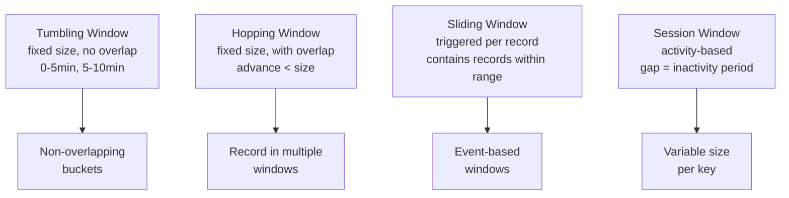
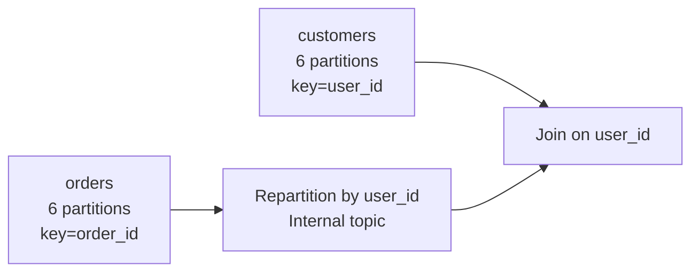

# Kafka Streams — Intermediate

## Window Types

Kafka Streams supports four window types for time-based aggregations.



### Tumbling Windows

```java
// Count clicks per user every 5 minutes
KTable<Windowed<String>, Long> clickCounts = clickStream
    .groupByKey()
    .windowedBy(TimeWindows.ofSizeWithNoGrace(Duration.ofMinutes(5)))
    .count(Materialized.as("click-counts"));
```

### Hopping Windows

```java
// 10-minute window sliding every 1 minute (overlap)
KTable<Windowed<String>, Long> hoppingCounts = clickStream
    .groupByKey()
    .windowedBy(TimeWindows.ofSizeAndGrace(Duration.ofMinutes(10), Duration.ofMinutes(1))
                            .advanceBy(Duration.ofMinutes(1)))
    .count();
```

### Session Windows

```java
// Group user activity into sessions with 30-min inactivity gap
KTable<Windowed<String>, Long> sessions = clickStream
    .groupByKey()
    .windowedBy(SessionWindows.ofInactivityGapWithNoGrace(Duration.ofMinutes(30)))
    .count(Materialized.as("user-sessions"));
```

## Grace Periods and Late Data

Out-of-order records arrive after their window's close time. Grace periods extend the window to accept late data.

```java
TimeWindows window = TimeWindows
    .ofSizeAndGrace(Duration.ofMinutes(5), Duration.ofMinutes(2));
// Window closes at t+5min, but accepts records up to t+7min
```

| Strategy | Behavior |
|----------|----------|
| No grace | Late records silently dropped |
| `ofSizeAndGrace` | Accept late records up to grace period |
| Suppress (`.suppress()`) | Emit only final result after window + grace |

```java
// Emit only the final count after window closes
KTable<Windowed<String>, Long> finalCounts = clickStream
    .groupByKey()
    .windowedBy(TimeWindows.ofSizeAndGrace(Duration.ofMinutes(5), Duration.ofMinutes(1)))
    .count()
    .suppress(Suppressed.untilWindowCloses(Suppressed.BufferConfig.unbounded()));
```

## Stream-Stream Joins

Unlike stream-table joins, stream-stream joins require a **join window** — records from both sides must arrive within that window.

```java
StreamJoined<String, Order, Payment> joinParams = StreamJoined.with(
    Serdes.String(), orderSerde, paymentSerde
);

KStream<String, OrderPayment> joined = orders.join(
    payments,
    (order, payment) -> new OrderPayment(order, payment),
    JoinWindows.ofTimeDifferenceWithNoGrace(Duration.ofMinutes(15)),
    joinParams
);
```

### Join Types Comparison

| Join Type | Left null? | Right null? | Use Case |
|-----------|-----------|------------|----------|
| `join` (inner) | No | No | Both sides required |
| `leftJoin` | No | Yes | Left side always emits |
| `outerJoin` | Yes | Yes | Emit from either side |

## Custom SerDes

Kafka Streams requires serialization for keys and values. Custom SerDes wrap your own serializers.

```java
// Using Jackson for JSON SerDe
public class OrderSerde implements Serde<Order> {
    private final ObjectMapper mapper = new ObjectMapper();

    @Override
    public Serializer<Order> serializer() {
        return (topic, order) -> {
            try {
                return mapper.writeValueAsBytes(order);
            } catch (Exception e) {
                throw new RuntimeException(e);
            }
        };
    }

    @Override
    public Deserializer<Order> deserializer() {
        return (topic, bytes) -> {
            try {
                return mapper.readValue(bytes, Order.class);
            } catch (Exception e) {
                throw new RuntimeException(e);
            }
        };
    }
}

// Register in config
config.put(StreamsConfig.DEFAULT_VALUE_SERDE_CLASS_CONFIG, OrderSerde.class);
```

### Avro SerDe with Schema Registry

```java
Map<String, Object> serdeConfig = Map.of(
    "schema.registry.url", "http://schema-registry:8081"
);
Serde<GenericRecord> avroSerde = new GenericAvroSerde();
avroSerde.configure(serdeConfig, false);  // false = value serde

KStream<String, GenericRecord> stream = builder.stream(
    "orders",
    Consumed.with(Serdes.String(), avroSerde)
);
```

## Repartitioning and Co-Partitioning

When you join two streams, they must be **co-partitioned** — same partition count and same key partitioner. If they're not, Kafka Streams automatically repartitions by writing to an internal repartition topic.



```java
// Explicit selectKey triggers repartition
KStream<String, Order> reKeyedOrders = orders
    .selectKey((k, order) -> order.getUserId());  // marks for repartitioning

// Now can join with customers table (keyed by user_id)
KStream<String, EnrichedOrder> enriched = reKeyedOrders.join(customers, ...);
```

Repartition topics are managed automatically but add **latency and storage overhead**. Design your input topics to be co-partitioned when possible.

## Changelog Topics and State Store Backup

Every state store has a backing **changelog topic** in Kafka:

```
app-name-KSTREAM-AGGREGATE-STATE-STORE-0000000003-changelog
```

Properties:
- Compacted: only the latest value per key is retained
- Replication factor = `replication.factor` in Streams config
- Written to synchronously during state store updates

```java
// Configure state store with custom changelog settings
Materialized<String, Long, KeyValueStore<Bytes, byte[]>> storeSpec =
    Materialized.<String, Long, KeyValueStore<Bytes, byte[]>>as("order-counts")
        .withLoggingEnabled(Map.of(
            TopicConfig.CLEANUP_POLICY_CONFIG, TopicConfig.CLEANUP_POLICY_COMPACT,
            TopicConfig.MIN_CLEANABLE_DIRTY_RATIO_CONFIG, "0.01"
        ))
        .withCachingEnabled();

KTable<String, Long> counts = orders.groupByKey().count(storeSpec);
```

## Interactive Queries

Interactive Queries (IQ) let you query the state stores from outside the Kafka Streams application — turning your stream processor into a queryable microservice.

```java
// Query local state store
ReadOnlyKeyValueStore<String, Long> store = streams.store(
    StoreQueryParameters.fromNameAndType("order-counts", QueryableStoreTypes.keyValueStore())
);

Long count = store.get("user-123");

// Range scan
try (KeyValueIterator<String, Long> range = store.range("user-100", "user-200")) {
    while (range.hasNext()) {
        KeyValue<String, Long> next = range.next();
        System.out.println(next.key + " -> " + next.value);
    }
}
```

### Routing IQ Across Instances

State is partitioned — each instance owns a subset. You need to route queries to the correct instance.

```java
// Find which host owns a key
KeyQueryMetadata metadata = streams.queryMetadataForKey(
    "order-counts", "user-123", Serdes.String().serializer()
);
HostInfo host = metadata.activeHost();

if (host.equals(thisInstanceHost)) {
    return store.get("user-123");
} else {
    // Forward HTTP request to the owning instance
    return httpClient.get(host.host(), host.port(), "/counts/user-123");
}
```

## Record Caching and Emit Rates

Kafka Streams caches state store updates and flushes them in batches. This reduces the number of downstream emissions.

```java
// Cache size per task (default 10 MB)
config.put(StreamsConfig.STATESTORE_CACHE_MAX_BYTES_CONFIG, 10 * 1024 * 1024L);

// Commit interval (default 30 s) — controls cache flush frequency
config.put(StreamsConfig.COMMIT_INTERVAL_MS_CONFIG, 1000L);  // flush every 1s
```

With caching enabled, a KTable update for the same key within the cache flush interval is **deduplicated** — downstream receives only the latest value. Disable caching for real-time accuracy at the cost of throughput.

## Interview Tips

> **Tip 1:** Explain window types with use cases: tumbling for period-based metrics (5-min revenue), session for user activity analysis (session length), hopping for sliding SLAs (rolling 1-hour error rate).

> **Tip 2:** Grace periods are critical for real-world data. Network delays, mobile apps going offline, and IoT devices all produce late data. Without grace, late events are silently dropped — which is often worse than processing them slightly late.

> **Tip 3:** Co-partitioning is a prerequisite for stream-stream and stream-table joins. When asked about joining in Kafka Streams, immediately mention co-partitioning and that `selectKey()` triggers a repartition (with overhead).

> **Tip 4:** Interactive Queries are a powerful feature often missed by candidates. They turn the stream processor into a queryable service — describe how you'd use IQ with a REST API to expose real-time leaderboards or fraud scores.

> **Tip 5:** Caching in Kafka Streams is not the same as consumer batch processing. It's an internal dedup/aggregation cache that reduces write amplification to the state store changelog. Mention this when discussing performance tuning.
