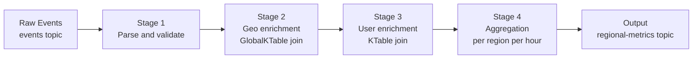

# Kafka Streams — Real World Patterns

## Pattern 1: Real-Time Fraud Detection

Detect suspicious transaction patterns using session windows and stateful aggregation.

```java
StreamsBuilder builder = new StreamsBuilder();

KStream<String, Transaction> transactions = builder.stream(
    "transactions",
    Consumed.with(Serdes.String(), transactionSerde)
);

// Count transactions per user in 10-minute session windows
KTable<Windowed<String>, TransactionSummary> sessionSummary = transactions
    .groupByKey()
    .windowedBy(SessionWindows.ofInactivityGapWithNoGrace(Duration.ofMinutes(10)))
    .aggregate(
        TransactionSummary::new,
        (key, txn, summary) -> summary.addTransaction(txn),
        (key, aggA, aggB) -> aggA.merge(aggB),   // session merger
        Materialized.<String, TransactionSummary, SessionStore<Bytes, byte[]>>as("session-store")
            .withValueSerde(transactionSummarySerde)
    );

// Emit alerts when session exceeds thresholds
sessionSummary.toStream()
    .filter((windowedKey, summary) ->
        summary.getCount() > 20 || summary.getTotalAmount() > 50000)
    .map((windowedKey, summary) ->
        KeyValue.pair(windowedKey.key(), new FraudAlert(windowedKey.key(), summary)))
    .to("fraud-alerts", Produced.with(Serdes.String(), fraudAlertSerde));
```

## Pattern 2: Dual-Write with Change Data Capture

Stream database changes (via Debezium CDC) and maintain a KTable for enrichment.

```java
// CDC events from Debezium: customers table changes
KTable<String, Customer> customerTable = builder.table(
    "db.public.customers",        // Debezium topic name
    Consumed.with(Serdes.String(), customerSerde),
    Materialized.as("customer-store")
);

// Raw order events
KStream<String, Order> orders = builder.stream("orders");

// Re-key orders by customer_id for joining
KStream<String, Order> ordersByCustomer = orders
    .selectKey((k, order) -> order.getCustomerId());

// Enrich orders with latest customer data
KStream<String, EnrichedOrder> enriched = ordersByCustomer.join(
    customerTable,
    (order, customer) -> EnrichedOrder.builder()
        .order(order)
        .customerName(customer.getName())
        .customerTier(customer.getTier())
        .build()
);

enriched.to("enriched-orders");
```

## Pattern 3: Real-Time Leaderboard with Interactive Queries

```java
// Aggregate scores per player
KTable<String, Long> leaderboard = builder
    .stream("game-events", Consumed.with(Serdes.String(), gameEventSerde))
    .filter((playerId, event) -> event.getType().equals("SCORE"))
    .groupByKey()
    .aggregate(
        () -> 0L,
        (playerId, event, total) -> total + event.getPoints(),
        Materialized.<String, Long, KeyValueStore<Bytes, byte[]>>as("leaderboard-store")
            .withValueSerde(Serdes.Long())
    );

// Expose via REST API using Interactive Queries
@RestController
public class LeaderboardController {
    private final KafkaStreams streams;

    @GetMapping("/leaderboard/{playerId}")
    public Long getScore(@PathVariable String playerId) {
        ReadOnlyKeyValueStore<String, Long> store = streams.store(
            StoreQueryParameters.fromNameAndType("leaderboard-store",
                QueryableStoreTypes.keyValueStore())
        );

        // Check if this instance owns the key
        KeyQueryMetadata meta = streams.queryMetadataForKey(
            "leaderboard-store", playerId, Serdes.String().serializer()
        );

        if (meta.activeHost().equals(thisHost)) {
            return store.get(playerId);
        } else {
            // Redirect or proxy to owning instance
            return restTemplate.getForObject(
                "http://" + meta.activeHost().host() + ":" + meta.activeHost().port()
                    + "/leaderboard/" + playerId,
                Long.class
            );
        }
    }

    @GetMapping("/leaderboard/top/{n}")
    public List<Map.Entry<String, Long>> getTopN(@PathVariable int n) {
        ReadOnlyKeyValueStore<String, Long> store = streams.store(
            StoreQueryParameters.fromNameAndType("leaderboard-store",
                QueryableStoreTypes.keyValueStore())
        );
        // Scan all local keys (each instance returns its partition's data)
        List<Map.Entry<String, Long>> results = new ArrayList<>();
        store.all().forEachRemaining(kv -> results.add(Map.entry(kv.key, kv.value)));
        return results.stream()
            .sorted(Map.Entry.<String, Long>comparingByValue().reversed())
            .limit(n)
            .collect(Collectors.toList());
    }
}
```

## Pattern 4: Late Data Handling with Suppress

For billing and reporting, you need exactly one output per window — not an update stream.

```java
KTable<Windowed<String>, Double> hourlyRevenue = builder
    .stream("orders", Consumed.with(Serdes.String(), orderSerde))
    .mapValues(Order::getAmount)
    .groupByKey()
    .windowedBy(
        TimeWindows.ofSizeAndGrace(Duration.ofHours(1), Duration.ofMinutes(15))
    )
    .reduce(Double::sum)
    .suppress(
        Suppressed.untilWindowCloses(
            Suppressed.BufferConfig.maxRecords(100000)
                .emitEarlyWhenFull()   // safety valve: emit when buffer full
        )
    );

hourlyRevenue.toStream()
    .map((windowedKey, revenue) -> KeyValue.pair(
        windowedKey.key() + ":" + windowedKey.window().startTime(),
        revenue
    ))
    .to("hourly-revenue");
```

## Pattern 5: Multi-Stage Enrichment Pipeline



```java
// Stage 1: Parse
KStream<String, Event> parsed = builder
    .stream("raw-events")
    .filterNot((k, v) -> v == null || v.isEmpty())
    .mapValues(EventParser::parse);

// Stage 2: Geo enrichment (GlobalKTable — small reference data)
GlobalKTable<String, GeoData> geoTable = builder.globalTable("geo-data");
KStream<String, Event> geoEnriched = parsed.join(
    geoTable,
    (key, event) -> event.getIpPrefix(),  // extract join key from event
    (event, geo) -> event.withRegion(geo.getRegion())
);

// Stage 3: User enrichment (KTable — large, partitioned)
KTable<String, UserProfile> userTable = builder.table("user-profiles");
KStream<String, Event> fullEnriched = geoEnriched
    .selectKey((k, event) -> event.getUserId())
    .join(userTable, (event, profile) -> event.withUserTier(profile.getTier()));

// Stage 4: Aggregate
fullEnriched
    .groupBy((k, event) -> event.getRegion() + ":" + event.getCategory())
    .windowedBy(TimeWindows.ofSizeWithNoGrace(Duration.ofHours(1)))
    .count()
    .toStream()
    .to("regional-metrics");
```

## Operational Considerations

### State Store Recovery Time

With `num.standby.replicas=0` (no standby), recovery time is proportional to state size:

```
Recovery time ≈ state_store_size / changelog_read_throughput
~1 GB state / 100 MB/s = ~10 seconds
~100 GB state / 100 MB/s = ~17 minutes (unacceptable)
```

For large state: use `num.standby.replicas >= 1`.

### Deployment Anti-Patterns

| Anti-Pattern | Problem | Fix |
|-------------|---------|-----|
| `application.id` shared across environments | Dev rebalances affect prod | Unique ID per environment |
| No changelog topic retention | State lost after extended downtime | Set `retention.ms` to > max outage expected |
| EOS without idempotent downstream | Exactly-once in Kafka, duplicates in sink | Ensure sink supports idempotent writes |
| Single stream thread per instance | Underutilizes multi-core hosts | Set `num.stream.threads` to (cores - 1) |
| Missing `addShutdownHook` | State not flushed on SIGTERM | Always register shutdown hook |

## Interview Tips

> **Tip 1:** For fraud detection scenarios, describe session windows specifically — they're ideal for grouping bursts of user activity with inactivity gaps. Explain that the gap parameter defines "idle" and window size is variable.

> **Tip 2:** Interactive Queries are the key to making Kafka Streams serve as both a processor and a queryable service. Show that you understand the routing challenge: queries must be forwarded to the instance owning the partition for that key.

> **Tip 3:** The `suppress()` operator is important for billing/reporting use cases where you need exactly one final result per window. Emphasize that without suppress, every intermediate update is emitted — which is 100s of records per window.

> **Tip 4:** GlobalKTable vs KTable for joins: GlobalKTable is replicated everywhere (no co-partitioning needed, limited to small data). KTable is partitioned (co-partitioning required, scales to large data). State the tradeoff explicitly.

> **Tip 5:** When discussing production deployments, always mention the standby replica tradeoff. For stateless apps, failover is free. For stateful apps with large RocksDB stores, standby replicas are essential to avoid multi-minute recovery pauses.
