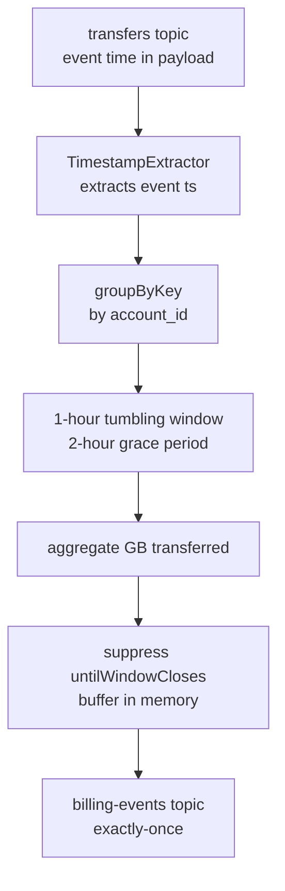

# Scenario Questions — Kafka Streams

<article data-difficulty="junior">

## 🟢 Junior: Counting Events Per User

**Scenario:** You receive a stream of click events on the `clicks` topic. Each message has `user_id` as the key. You need to maintain a running count of clicks per user and write it to the `click-counts` topic.

<details>
<summary>💡 Hint</summary>

Think about which abstraction models "latest count per user" — KStream or KTable? Use `groupByKey()` and `count()`. The output is a KTable (one count per user), which you convert back to a stream to write to the output topic.
</details>

<details>
<summary>✅ Solution</summary>

```java
StreamsBuilder builder = new StreamsBuilder();

KStream<String, String> clicks = builder.stream("clicks");

KTable<String, Long> clickCounts = clicks
    .groupByKey()
    .count(Materialized.as("click-count-store"));

clickCounts.toStream().to("click-counts",
    Produced.with(Serdes.String(), Serdes.Long()));
```

**Key points:**
- `groupByKey()` groups by existing key (user_id) — no repartition needed
- `count()` returns a KTable — one entry per key (latest count)
- `.toStream()` converts KTable to KStream for writing to output topic
- The state is stored in RocksDB under `click-count-store` and backed up to a changelog topic
</details>

</article>

<article data-difficulty="mid-level">

## 🟡 Mid-Level: Revenue Per Category Per Hour

**Scenario:** You have an `orders` topic with events containing `category` (String) and `amount` (Double). Compute total revenue per category per hour and emit a single final result per window (not intermediate updates). Handle late events arriving up to 15 minutes after the window closes.

<details>
<summary>💡 Hint</summary>

Use a tumbling window of 1 hour with a 15-minute grace period. Use `suppress(untilWindowCloses(...))` to emit only the final result after the window closes. You'll need to `groupBy` on category (not the existing key), then aggregate.
</details>

<details>
<summary>✅ Solution</summary>

```java
StreamsBuilder builder = new StreamsBuilder();

KStream<String, Order> orders = builder.stream(
    "orders", Consumed.with(Serdes.String(), orderSerde));

// Re-key by category (triggers repartition)
KTable<Windowed<String>, Double> hourlyRevenue = orders
    .selectKey((k, order) -> order.getCategory())
    .groupByKey()
    .windowedBy(
        TimeWindows.ofSizeAndGrace(Duration.ofHours(1), Duration.ofMinutes(15))
    )
    .aggregate(
        () -> 0.0,
        (category, order, total) -> total + order.getAmount(),
        Materialized.<String, Double, WindowStore<Bytes, byte[]>>as("hourly-revenue-store")
            .withValueSerde(Serdes.Double())
    )
    .suppress(
        Suppressed.untilWindowCloses(Suppressed.BufferConfig.unbounded())
    );

hourlyRevenue.toStream()
    .map((windowed, revenue) -> KeyValue.pair(
        windowed.key() + "@" + windowed.window().startTime().toEpochMilli(),
        revenue
    ))
    .to("hourly-revenue", Produced.with(Serdes.String(), Serdes.Double()));
```

**Key points:**
- `selectKey()` on category triggers a repartition (internal topic created automatically)
- Grace period accepts events up to 15 min after window close
- `suppress()` holds results until the window fully closes — no intermediate updates emitted
- `suppress()` requires state memory; `BufferConfig.maxRecords(n)` or `maxBytes(n)` limits can be used as safety valves
</details>

</article>

<article data-difficulty="senior">

## 🔴 Senior: Late Event Handling and Exactly-Once Billing

**Scenario:** Your company bills customers based on the total GB of data transferred per hour. Data transfer events arrive on `transfers` topic, keyed by `account_id`, with a timestamp embedded in the payload (not the Kafka timestamp). Events can arrive up to 2 hours late due to mobile device buffering. You need to:
1. Use event time (not processing time)
2. Emit exactly one billing record per account per hour
3. Guarantee exactly-once processing end-to-end

**Question:** Design the full Kafka Streams topology including configuration choices. What are the failure modes and how does your design handle them?

<details>
<summary>💡 Hint</summary>

Custom `TimestampExtractor` extracts event time from payload. Use `TimeWindows.ofSizeAndGrace` with 2-hour grace. `suppress(untilWindowCloses)` for final-only emission. `EXACTLY_ONCE_V2` processing guarantee. Consider what happens if the app crashes between suppress buffer and commit.
</details>

<details>
<summary>✅ Solution</summary>

**Architecture:**



**Implementation:**

```java
// Custom timestamp extractor
public class TransferTimestampExtractor implements TimestampExtractor {
    @Override
    public long extract(ConsumerRecord<Object, Object> record, long partitionTime) {
        TransferEvent event = (TransferEvent) record.value();
        return event != null ? event.getEventTimeMs() : partitionTime;
    }
}

// Config
Properties config = new Properties();
config.put(StreamsConfig.APPLICATION_ID_CONFIG, "billing-processor");
config.put(StreamsConfig.BOOTSTRAP_SERVERS_CONFIG, "broker:9092");
config.put(StreamsConfig.PROCESSING_GUARANTEE_CONFIG, StreamsConfig.EXACTLY_ONCE_V2);
config.put(StreamsConfig.DEFAULT_TIMESTAMP_EXTRACTOR_CLASS_CONFIG,
           TransferTimestampExtractor.class);
config.put(StreamsConfig.NUM_STANDBY_REPLICAS_CONFIG, 1);  // fast failover

// Topology
StreamsBuilder builder = new StreamsBuilder();

KTable<Windowed<String>, Double> hourlyBilling = builder
    .stream("transfers", Consumed.with(Serdes.String(), transferSerde))
    .groupByKey()
    .windowedBy(
        TimeWindows.ofSizeAndGrace(Duration.ofHours(1), Duration.ofHours(2))
    )
    .aggregate(
        () -> 0.0,
        (accountId, transfer, totalGb) -> totalGb + transfer.getGbTransferred(),
        Materialized.<String, Double, WindowStore<Bytes, byte[]>>as("billing-store")
            .withValueSerde(Serdes.Double())
    )
    .suppress(
        Suppressed.untilWindowCloses(
            Suppressed.BufferConfig.maxBytes(512 * 1024 * 1024L)  // 512 MB
                .emitEarlyWhenFull()   // safety: emit early if buffer fills
        )
    );

hourlyBilling.toStream()
    .map((windowed, totalGb) -> KeyValue.pair(
        windowed.key(),
        new BillingRecord(windowed.key(), windowed.window(), totalGb)
    ))
    .to("billing-events", Produced.with(Serdes.String(), billingSerde));
```

**Failure modes and mitigations:**

| Failure | Impact | Mitigation |
|---------|--------|-----------|
| App crash during suppress buffer | Buffer lost; window re-computed from changelog | EOS: transaction aborted; state restored from changelog |
| Suppress buffer full | Early emission (partial result) | Set large `maxBytes`, monitor `suppress-buffer-size-avg` |
| Event arrives after grace period | Late event dropped | Alert on late arrival rate; extend grace if needed |
| Standby instance unavailable | Slower failover (replay changelog) | Monitor standby lag metric; ensure replicas are healthy |

**Key design decisions:**
- `EXACTLY_ONCE_V2` wraps output + offset commit in single Kafka transaction
- Standby replicas ensure state recovery in seconds, not minutes
- `emitEarlyWhenFull()` prevents OOM but produces a partial result — downstream billing must handle potential follow-up correction records
- Monitor `records-lag-max` specifically against LSO (not HWM) for `read_committed` consumers downstream
</details>

</article>
