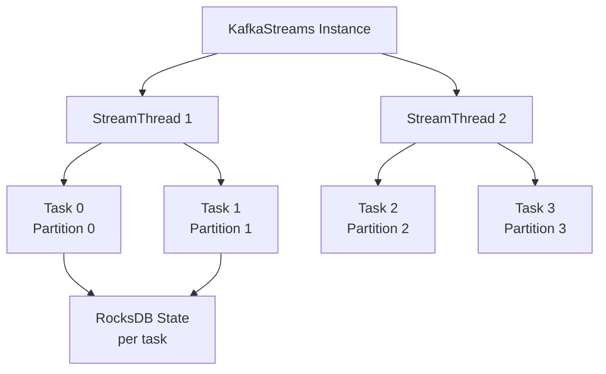
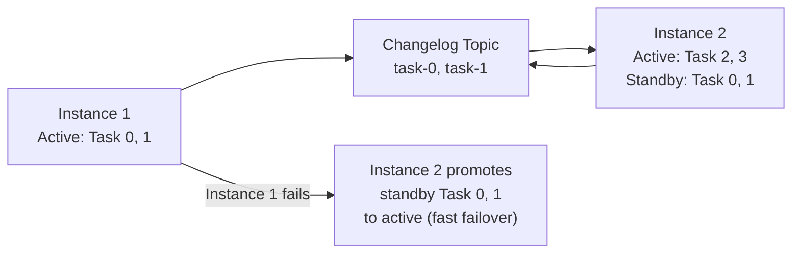
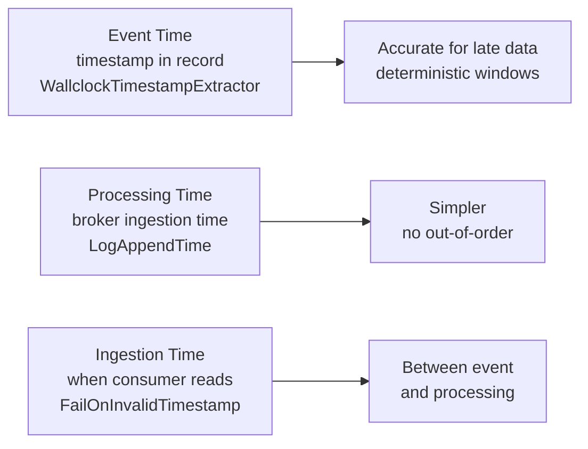

# Kafka Streams — Senior Deep Dive

## Processor API (Low-Level)

The DSL (StreamsBuilder) compiles down to the Processor API. Use the Processor API directly for maximum control: custom scheduling, multi-state-store access, or non-standard processing logic.

```java
public class FraudDetector implements Processor<String, Transaction, String, Alert> {

    private KeyValueStore<String, Long> txnCountStore;
    private ProcessorContext<String, Alert> context;
    private Cancellable punctuator;

    @Override
    public void init(ProcessorContext<String, Alert> context) {
        this.context = context;
        this.txnCountStore = context.getStateStore("txn-count-store");

        // Schedule a punctuation every 60 seconds (stream time or wall clock)
        this.punctuator = context.schedule(
            Duration.ofSeconds(60),
            PunctuationType.WALL_CLOCK_TIME,
            this::flushAlerts
        );
    }

    @Override
    public void process(Record<String, Transaction> record) {
        String userId = record.key();
        Transaction txn = record.value();

        Long count = txnCountStore.get(userId);
        count = (count == null) ? 1L : count + 1L;
        txnCountStore.put(userId, count);

        if (count > 10 && txn.getAmount() > 1000) {
            context.forward(record.withValue(new Alert(userId, "FRAUD_SUSPECTED")));
        }
    }

    private void flushAlerts(long timestamp) {
        // Periodic cleanup of old counts
        try (KeyValueIterator<String, Long> all = txnCountStore.all()) {
            while (all.hasNext()) {
                KeyValue<String, Long> kv = all.next();
                if (kv.value < 2) txnCountStore.delete(kv.key);
            }
        }
    }

    @Override
    public void close() {
        punctuator.cancel();
    }
}

// Wire into topology
Topology topology = new Topology();
topology.addSource("Source", "transactions")
        .addProcessor("FraudDetector", FraudDetector::new, "Source")
        .addStateStore(
            Stores.keyValueStoreBuilder(
                Stores.persistentKeyValueStore("txn-count-store"),
                Serdes.String(), Serdes.Long()
            ), "FraudDetector"
        )
        .addSink("Alerts", "fraud-alerts", "FraudDetector");
```

## Task and Thread Architecture



**Key relationships:**
- One **task** per source partition (1:1 mapping)
- Tasks are distributed across **StreamThreads** within an instance
- Tasks are distributed across **instances** in the same `application.id`
- Each task owns its own state store(s) — no cross-task state sharing

```java
// Configure thread count per instance
config.put(StreamsConfig.NUM_STREAM_THREADS_CONFIG, 4);
// Standby replicas for fast failover
config.put(StreamsConfig.NUM_STANDBY_REPLICAS_CONFIG, 1);
```

## Standby Replicas and Failover

Standby replicas are "warm copies" of active tasks on other instances. They consume the changelog topic to stay up-to-date.



Without standby replicas, failover requires replaying the entire changelog from offset 0 — slow for large state stores. With standby replicas (`num.standby.replicas=1`), failover is near-instant.

**Cost**: standby replicas consume additional memory and CPU on the standby instance, plus broker bandwidth for changelog replication.

## Exactly-Once Semantics in Kafka Streams

Kafka Streams EOS uses the transactional producer API internally. Each task wraps its output + offset commits in a single Kafka transaction.

```java
config.put(StreamsConfig.PROCESSING_GUARANTEE_CONFIG, StreamsConfig.EXACTLY_ONCE_V2);
// EXACTLY_ONCE_V2 (Kafka 2.6+): one producer per stream thread (more efficient)
// EXACTLY_ONCE (legacy): one producer per task
```

EOS transactions in Kafka Streams:
1. Process batch of records
2. Write output records to output topics (within transaction)
3. Commit offsets to `__consumer_offsets` topic (within transaction)
4. Commit transaction atomically

If the app crashes mid-transaction, the broker aborts it. On restart, the consumer re-reads from the last committed offset.

**EOS performance cost**: ~20-30% throughput reduction vs at-least-once due to transaction overhead. Use `EXACTLY_ONCE_V2` which reduces this by sharing producers per thread.

## RocksDB Tuning

RocksDB is the default state store backend. For large state (> GB), tuning is essential.

```java
import org.apache.kafka.streams.state.RocksDBConfigSetter;
import org.rocksdb.*;

public class CustomRocksDBConfig implements RocksDBConfigSetter {
    @Override
    public void setConfig(String storeName, Options options, Map<String, Object> configs) {
        // Increase block cache (default 50MB per store)
        BlockBasedTableConfig tableConfig = new BlockBasedTableConfig();
        tableConfig.setBlockCacheSize(256 * 1024 * 1024L);   // 256 MB
        tableConfig.setBlockSize(64 * 1024L);                 // 64 KB blocks
        options.setTableFormatConfig(tableConfig);

        // Reduce write amplification
        options.setMaxWriteBufferNumber(3);
        options.setWriteBufferSize(64 * 1024 * 1024L);       // 64 MB memtable
        options.setCompactionStyle(CompactionStyle.LEVEL);
        options.setLevel0FileNumCompactionTrigger(4);
    }

    @Override
    public void close(String storeName, Options options) {
        options.close();
    }
}

config.put(StreamsConfig.ROCKSDB_CONFIG_SETTER_CLASS_CONFIG, CustomRocksDBConfig.class);
```

### RocksDB State Store Monitoring

Key metrics:
- `rocksdb-state-id-bytes-read-rate`: read throughput
- `rocksdb-state-id-bytes-write-rate`: write throughput
- `rocksdb-state-id-block-cache-hit-ratio`: should be > 0.9 for hot data

## Time Semantics: Event Time vs Processing Time



```java
// Custom timestamp extractor from payload
public class OrderTimestampExtractor implements TimestampExtractor {
    @Override
    public long extract(ConsumerRecord<Object, Object> record, long partitionTime) {
        if (record.value() instanceof Order) {
            return ((Order) record.value()).getEventTimestampMs();
        }
        return partitionTime;  // fallback to partition time
    }
}

config.put(StreamsConfig.DEFAULT_TIMESTAMP_EXTRACTOR_CLASS_CONFIG,
           OrderTimestampExtractor.class);
```

## Topology Optimization

Kafka Streams 2.6+ supports topology optimization to merge redundant operations:

```java
Properties config = new Properties();
config.put(StreamsConfig.TOPOLOGY_OPTIMIZATION_CONFIG, StreamsConfig.OPTIMIZE);
// Merges source nodes with the same topic
// Eliminates unnecessary repartition topics when co-partitioning is guaranteed
```

## Dead Letter Queues in Kafka Streams

Kafka Streams 2.6+ introduced the `DeserializationExceptionHandler` and `ProductionExceptionHandler`:

```java
public class DLQDeserializationHandler implements DeserializationExceptionHandler {
    @Override
    public DeserializationHandlerResponse handle(
            ProcessorContext context,
            ConsumerRecord<byte[], byte[]> record,
            Exception exception) {
        // Send raw bytes to DLQ topic
        context.headers().add("error", exception.getMessage().getBytes());
        // In practice: use a separate producer to write to DLQ
        return DeserializationHandlerResponse.CONTINUE;  // skip and continue
    }
}

config.put(StreamsConfig.DEFAULT_DESERIALIZATION_EXCEPTION_HANDLER_CLASS_CONFIG,
           DLQDeserializationHandler.class);
```

## Interview Tips

> **Tip 1:** The task = partition relationship is fundamental. One task per source partition, multiple tasks per thread, multiple threads per instance. Parallelism is controlled at three levels: partition count (max tasks), threads per instance, and number of instances.

> **Tip 2:** EOS in Kafka Streams uses transactions internally. `EXACTLY_ONCE_V2` (Kafka 2.6+) uses one producer per stream thread instead of one per task — significantly more efficient for topologies with many tasks.

> **Tip 3:** Standby replicas are the answer to "how do you minimize failover time in Kafka Streams." Explain the tradeoff: standby replicas cost memory and bandwidth on the standby node but make failover near-instant (seconds vs minutes for large state).

> **Tip 4:** The Processor API gives you capabilities the DSL cannot: multi-store access in one processor, fine-grained punctuation scheduling, custom forwarding logic. Know when to drop down to it.

> **Tip 5:** RocksDB block cache sizing is a common production problem. Default 50MB per store is too small for any significant state. Describe the `RocksDBConfigSetter` interface and the block cache metric to watch.
