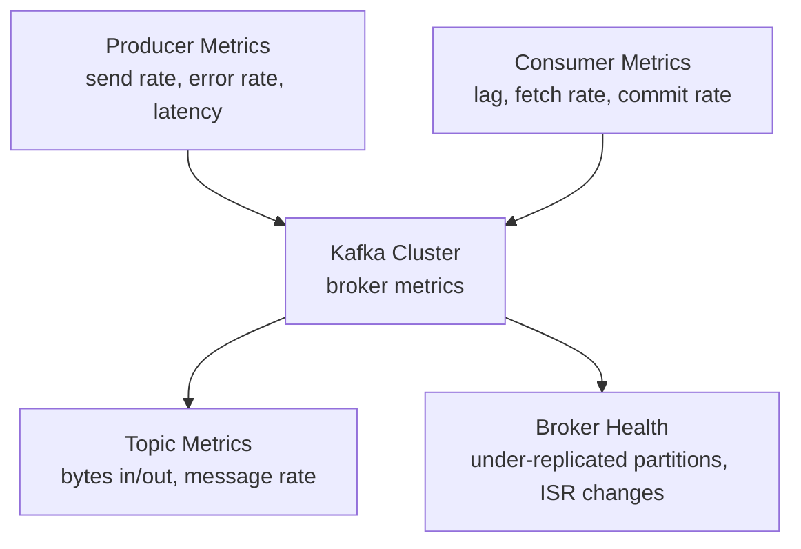

# Kafka Monitoring — Fundamentals

## The Three Monitoring Layers

Kafka monitoring covers three distinct layers, each with its own metrics:



## JMX — The Primary Metrics Source

Kafka exposes all metrics via **JMX (Java Management Extensions)**. In production, these are scraped by:
- **Prometheus JMX Exporter** (most common for cloud-native)
- **Datadog Agent**
- **Confluent Control Center**
- **AWS CloudWatch** (for MSK)

```bash
# Enable JMX on Kafka broker
JMX_PORT=9999 kafka-server-start.sh config/server.properties

# Connect JConsole for ad-hoc inspection
jconsole localhost:9999
```

## Must-Watch Broker Metrics

| Metric | JMX Path | Normal | Alert When |
|--------|----------|--------|-----------|
| Under-Replicated Partitions | `kafka.server:type=ReplicaManager,name=UnderReplicatedPartitions` | 0 | > 0 |
| Active Controller Count | `kafka.controller:type=KafkaController,name=ActiveControllerCount` | 1 per cluster | != 1 |
| Leader Election Rate | `kafka.controller:type=ControllerStats,name=LeaderElectionRateAndTimeMs` | Near 0 | Sustained > 0 |
| Bytes In per Sec | `kafka.server:type=BrokerTopicMetrics,name=BytesInPerSec` | Varies | > capacity limit |
| Request Queue Size | `kafka.network:type=RequestMetrics,name=RequestQueueSize` | < 10 | Sustained > 50 |
| Log Flush Rate | `kafka.log:type=LogFlushStats,name=LogFlushRateAndTimeMs` | Varies | High p99 latency |

### Most Critical: Under-Replicated Partitions

```bash
# Check under-replicated partitions via CLI
kafka-topics.sh --bootstrap-server broker:9092 \
  --describe --under-replicated-partitions

# Output shows partitions where ISR < replication factor
# Topic: orders  Partition: 3  Leader: 1  Replicas: 1,2,3  Isr: 1,2
# ← Replica 3 is out of ISR (lagging)
```

## Consumer Lag Monitoring

Consumer lag is the most operationally important metric. It tells you how far behind consumers are from the latest data.

```bash
# List all consumer groups
kafka-consumer-groups.sh --bootstrap-server broker:9092 --list

# Describe a specific group's lag
kafka-consumer-groups.sh --bootstrap-server broker:9092 \
  --describe --group my-consumer-group

# Output:
# GROUP           TOPIC    PARTITION  CURRENT-OFFSET  LOG-END-OFFSET  LAG
# my-consumer     orders   0          5000            5100            100
# my-consumer     orders   1          4800            5000            200
# my-consumer     orders   2          5200            5200            0
```

### Programmatic Lag Monitoring

```python
from confluent_kafka import Consumer, TopicPartition
from confluent_kafka.admin import AdminClient

def get_group_lag(bootstrap: str, group_id: str) -> dict:
    """Returns lag per topic-partition for a consumer group."""
    consumer = Consumer({
        'bootstrap.servers': bootstrap,
        'group.id': f'lag-monitor-{group_id}',
    })

    admin = AdminClient({'bootstrap.servers': bootstrap})
    group_offsets = {}

    # Get committed offsets via admin API
    groups = admin.list_consumer_group_offsets([group_id])
    for topic_partition, offset_meta in groups[group_id].result().items():
        group_offsets[topic_partition] = offset_meta.offset

    lag = {}
    for tp, committed_offset in group_offsets.items():
        _, hwm = consumer.get_watermark_offsets(tp, timeout=5)
        lag[f"{tp.topic}:{tp.partition}"] = hwm - max(committed_offset, 0)

    consumer.close()
    return lag
```

## Producer Metrics

| Metric | Description | Target |
|--------|-------------|--------|
| `record-send-rate` | Records sent per second | Matches expected throughput |
| `record-error-rate` | Failed sends per second | 0 |
| `request-latency-avg` | Avg round-trip to broker | < 100 ms |
| `batch-size-avg` | Avg batch size in bytes | Near `batch.size` = good batching |
| `compression-rate-avg` | Compression ratio | < 1.0 (compressed) |
| `buffer-exhausted-rate` | Back-pressure events | 0 |

```python
# Enable Prometheus metrics with confluent-kafka
from confluent_kafka import Producer
import json

STATS = {}

def on_stats(stats_json: str):
    global STATS
    STATS = json.loads(stats_json)
    # Key metrics:
    # STATS['msg_cnt']          total msgs queued
    # STATS['msg_size']         total bytes queued
    # STATS['tx']               total transmit requests
    # STATS['txerrs']           total transmit errors
    # STATS['topics'][topic]['partitions'][n]['txmsgs']  msgs sent

producer = Producer({
    'bootstrap.servers': 'broker:9092',
    'statistics.interval.ms': 10000,
    'stats_cb': on_stats,
})
```

## Kafka CLI Tools for Quick Diagnostics

```bash
# Describe all topics
kafka-topics.sh --bootstrap-server broker:9092 --list

# Topic details including partition counts and replication
kafka-topics.sh --bootstrap-server broker:9092 --describe --topic orders

# Check for topics with offline partitions
kafka-topics.sh --bootstrap-server broker:9092 --describe --unavailable-partitions

# Log dir info (per-broker disk usage by topic-partition)
kafka-log-dirs.sh --bootstrap-server broker:9092 \
  --topic-list orders --describe

# Broker list
kafka-broker-api-versions.sh --bootstrap-server broker:9092
```

## Basic Alerting Thresholds

```yaml
# Prometheus alerting rules (simplified)
groups:
- name: kafka
  rules:
  - alert: KafkaUnderReplicatedPartitions
    expr: kafka_server_replicamanager_underreplicatedpartitions > 0
    for: 1m
    labels:
      severity: critical
    annotations:
      summary: "Kafka has under-replicated partitions"

  - alert: KafkaConsumerLagHigh
    expr: kafka_consumer_group_lag > 10000
    for: 5m
    labels:
      severity: warning

  - alert: KafkaActiveControllers
    expr: kafka_controller_kafkacontroller_activecontrollercount != 1
    for: 30s
    labels:
      severity: critical
```

## Interview Tips

> **Tip 1:** Under-Replicated Partitions (URP) is the single most important broker health metric. URP > 0 means data is not fully replicated and you're at risk of data loss if the leader fails. Always mention this when asked about Kafka monitoring.

> **Tip 2:** There should always be exactly 1 active controller per cluster. If 0: no leader elections can happen, cluster is degraded. If 2+: split-brain. Both are critical conditions.

> **Tip 3:** Consumer lag is the operational heartbeat of your pipelines. Know how to check it via CLI (`kafka-consumer-groups.sh --describe`) and programmatically. Lag growing unboundedly means the consumer cannot keep up with the producer rate.

> **Tip 4:** JMX is the underlying metrics source for Kafka. In modern deployments, the Prometheus JMX Exporter scrapes JMX and exposes metrics for Grafana dashboards. Know this stack even if you use managed services.

> **Tip 5:** For MSK (AWS), CloudWatch automatically publishes broker metrics. Key MSK metrics: `KafkaDataLogsDiskUsed`, `UnderReplicatedPartitions`, `BytesInPerSec`. You don't need the JMX exporter on MSK.
