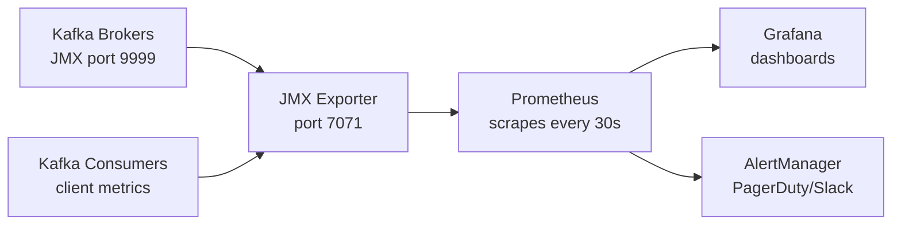

# Kafka Monitoring — Intermediate

## Prometheus + Grafana Stack

The standard cloud-native Kafka monitoring stack:



### JMX Exporter Configuration

```yaml
# jmx_exporter_config.yml
startDelaySeconds: 0
ssl: false
lowercaseOutputName: true
lowercaseOutputLabelNames: true
rules:
  # Broker metrics
  - pattern: "kafka.server<type=ReplicaManager, name=(.+)><>Value"
    name: kafka_server_replicamanager_$1
    labels:
      broker: "$BROKER_ID"

  # Consumer group lag
  - pattern: "kafka.consumer<type=consumer-fetch-manager-metrics, client-id=(.+)><>records-lag-max"
    name: kafka_consumer_records_lag_max
    labels:
      client_id: "$1"

  # Topic metrics
  - pattern: "kafka.server<type=BrokerTopicMetrics, name=(.+), topic=(.+)><>OneMinuteRate"
    name: kafka_server_brokertopicmetrics_$1_1m_rate
    labels:
      topic: "$2"
```

### Burrow: Dedicated Lag Monitor

LinkedIn's Burrow is purpose-built for consumer lag monitoring. It evaluates lag trends, not just point-in-time values.

```yaml
# burrow.yaml
[zookeeper]
servers=["zk1:2181","zk2:2181"]

[kafka "production"]
brokers=["broker1:9092","broker2:9092"]

[consumer "kafka_cluster"]
class="kafka"
cluster="production"
servers=["broker1:9092","broker2:9092"]

[notifier "http"]
class="http"
url-open="http://alerting.internal/kafka-lag"
threshold=100
```

Burrow evaluates lag status as: OK, WARNING, ERROR, STALL, STOP — distinguishing between a consumer that's making progress (even if behind) vs one that's completely stopped.

## Key Metric Categories

### Broker Throughput Metrics

```bash
# Bytes in/out per second (per topic)
kafka.server:type=BrokerTopicMetrics,name=BytesInPerSec,topic=orders
kafka.server:type=BrokerTopicMetrics,name=BytesOutPerSec,topic=orders
kafka.server:type=BrokerTopicMetrics,name=MessagesInPerSec,topic=orders

# Total across all topics
kafka.server:type=BrokerTopicMetrics,name=BytesInPerSec
kafka.server:type=BrokerTopicMetrics,name=BytesOutPerSec
```

### Request Metrics

```bash
# Request handler thread pool utilization
kafka.server:type=KafkaRequestHandlerPool,name=RequestHandlerAvgIdlePercent
# Alert: < 30% idle = broker is overloaded

# Request latency (in ms) by type
kafka.network:type=RequestMetrics,name=TotalTimeMs,request=Produce
kafka.network:type=RequestMetrics,name=TotalTimeMs,request=FetchConsumer
kafka.network:type=RequestMetrics,name=TotalTimeMs,request=FetchFollower
```

### ISR and Replication Health

```bash
# ISR shrinks (each shrink = a follower fell behind)
kafka.server:type=ReplicaManager,name=IsrShrinksPerSec

# ISR expands (followers catching up)
kafka.server:type=ReplicaManager,name=IsrExpandsPerSec

# Under-replicated and offline partitions
kafka.server:type=ReplicaManager,name=UnderReplicatedPartitions
kafka.server:type=ReplicaManager,name=OfflineReplicaCount
```

## Grafana Dashboard: Essential Panels

```json
// Grafana dashboard JSON snippet for Consumer Lag panel
{
  "title": "Consumer Group Lag",
  "type": "timeseries",
  "targets": [
    {
      "expr": "sum by (consumergroup, topic) (kafka_consumergroup_lag)",
      "legendFormat": "{{consumergroup}}/{{topic}}"
    }
  ],
  "alert": {
    "conditions": [
      {
        "evaluator": {"params": [10000], "type": "gt"},
        "query": {"params": ["A", "5m", "now"]},
        "reducer": {"type": "max"}
      }
    ]
  }
}
```

**Essential Grafana panels for a Kafka cluster:**

| Panel | Metrics | Description |
|-------|---------|-------------|
| Throughput | BytesInPerSec / BytesOutPerSec | Traffic volume |
| Consumer Lag | consumergroup_lag by group+topic | Backlog depth |
| URP | UnderReplicatedPartitions | Replication health |
| ISR Changes | IsrShrinksPerSec, IsrExpandsPerSec | Follower stability |
| Request Handler Idle | RequestHandlerAvgIdlePercent | CPU saturation |
| Network Processor Idle | NetworkProcessorAvgIdlePercent | Network thread saturation |
| Disk Usage | node_filesystem_avail_bytes | Storage |
| Produce Latency | TotalTimeMs for Produce p99 | Client experience |

## End-to-End Latency Monitoring

Track the full path from producer send to consumer receive:

```python
import time
from confluent_kafka import Producer, Consumer

def measure_e2e_latency(bootstrap: str, topic: str) -> float:
    """Produce a sentinel message and measure time until consumed."""
    probe_id = str(time.time_ns())
    start_ts = time.monotonic()

    producer = Producer({'bootstrap.servers': bootstrap})
    producer.produce(topic, key=b'__probe__', value=probe_id.encode(),
                     headers={'probe': b'true'})
    producer.flush()

    consumer = Consumer({
        'bootstrap.servers': bootstrap,
        'group.id': f'latency-probe-{probe_id}',
        'auto.offset.reset': 'latest',
    })
    consumer.subscribe([topic])

    while True:
        msg = consumer.poll(0.1)
        if msg and not msg.error():
            headers = dict(msg.headers() or [])
            if headers.get('probe') == b'true' and msg.value() == probe_id.encode():
                latency_ms = (time.monotonic() - start_ts) * 1000
                consumer.close()
                return latency_ms

# Run every minute as a health check
e2e_latency = measure_e2e_latency('broker:9092', 'health-check')
latency_gauge.set(e2e_latency)
```

## Alerting Strategy: Tiered Severity

```yaml
# Prometheus alerting rules with tiered severity
groups:
- name: kafka_critical
  rules:
  - alert: KafkaNoActiveController
    expr: sum(kafka_controller_kafkacontroller_activecontrollercount) != 1
    for: 30s
    labels: {severity: critical}
    annotations:
      summary: "Kafka cluster has no active controller"

  - alert: KafkaUnderReplicatedPartitions
    expr: kafka_server_replicamanager_underreplicatedpartitions > 0
    for: 2m
    labels: {severity: critical}
    annotations:
      summary: "{{ $labels.instance }}: {{ $value }} under-replicated partitions"

- name: kafka_warning
  rules:
  - alert: KafkaHighConsumerLag
    expr: max by (consumergroup, topic) (kafka_consumergroup_lag) > 10000
    for: 10m
    labels: {severity: warning}

  - alert: KafkaRequestHandlerBusy
    expr: kafka_server_kafkarequesthandlerpool_requesthandleravgidlepercent < 0.3
    for: 5m
    labels: {severity: warning}
    annotations:
      summary: "Broker request handlers are {{ $value | humanizePercentage }} idle"

- name: kafka_info
  rules:
  - alert: KafkaISRShrinking
    expr: rate(kafka_server_replicamanager_isrshrinks_total[5m]) > 0.1
    for: 5m
    labels: {severity: info}
```

## Consumer Group Health States

Beyond raw lag numbers, understand what lag patterns mean:

| Pattern | Interpretation |
|---------|---------------|
| Lag constant, low | Consumer keeping up |
| Lag growing slowly | Consumer slightly behind produce rate |
| Lag growing fast | Serious backlog — scale or fix |
| Lag at 0 but consumer restarting | Commit storm — check rebalance logs |
| Lag jumps to huge value | Consumer offset reset or assignment change |
| Lag varies by partition | Hotspot partition — check partition key distribution |

## Interview Tips

> **Tip 1:** The Prometheus + JMX Exporter + Grafana stack is the industry standard. Know the flow: JMX Exporter converts JMX MBeans to Prometheus format, Prometheus scrapes it, Grafana visualizes. For managed services (MSK, Confluent Cloud), use their native metric APIs instead.

> **Tip 2:** Request Handler Idle percentage below 30% is a key saturation indicator. When brokers are request-handler-saturated, produce and fetch latency both spike. Scale vertically (more cores) or horizontally (add brokers + rebalance).

> **Tip 3:** ISR shrinks and expands are leading indicators of problems. A follower falling out of ISR means it can't keep up with the leader — check its disk I/O, network, and GC pauses. Frequent ISR changes cause replication instability.

> **Tip 4:** End-to-end latency measurement (probe message round-trip) is valuable for SLA tracking. A broker health check based on a real produce→consume cycle catches issues that individual metric thresholds miss.

> **Tip 5:** Consumer lag patterns matter as much as absolute values. Stable lag at 10,000 is less alarming than lag growing from 0 to 10,000 over 10 minutes. Burrow's trend analysis catches the latter even when raw lag is below the threshold.
