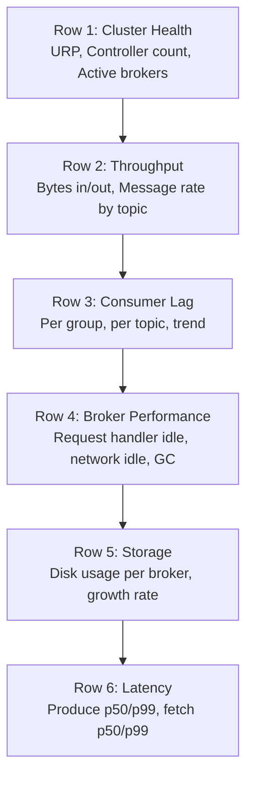
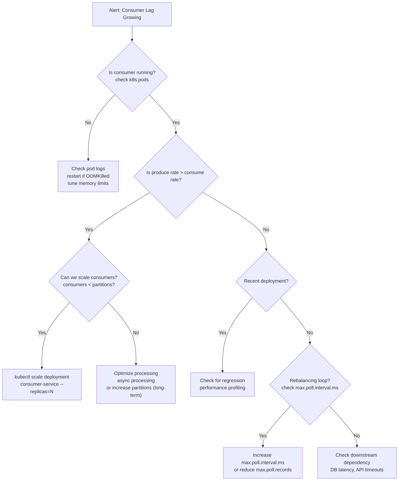

# Kafka Monitoring — Real World Patterns

## Pattern 1: Comprehensive Grafana Dashboard Layout

A production Kafka dashboard should surface the most critical metrics at a glance:



### Key Dashboard Panels (Prometheus Queries)

```promql
# Under-Replicated Partitions (should always be 0)
sum(kafka_server_replicamanager_underreplicatedpartitions)

# Consumer Lag by Group (heatmap or table)
max by (consumergroup, topic) (
  kafka_consumergroup_lag
)

# Bytes In Rate per Topic (stacked area chart)
sum by (topic) (
  rate(kafka_server_brokertopicmetrics_bytesinpersec[5m])
)

# Request Handler Idle % (gauge, alert < 30%)
avg by (instance) (
  kafka_server_kafkarequesthandlerpool_requesthandleravgidlepercent
)

# Disk Usage % per Broker
(
  1 - (node_filesystem_avail_bytes{mountpoint="/var/kafka"} /
       node_filesystem_size_bytes{mountpoint="/var/kafka"})
) * 100

# Produce Request Latency p99
histogram_quantile(0.99,
  rate(kafka_network_requestmetrics_totaltimems_bucket{request="Produce"}[5m])
)
```

## Pattern 2: Automated Lag Alerting with Context

Raw lag numbers without context create alert fatigue. Add context to make alerts actionable:

```python
import requests
import boto3
import json
from datetime import datetime, timedelta

class LagAlertEnricher:
    def __init__(self, bootstrap: str, prometheus_url: str):
        self.bootstrap = bootstrap
        self.prom_url = prometheus_url
        self.sns = boto3.client('sns')

    def enrich_and_alert(self, group_id: str, topic: str, lag: int):
        # Get lag trend (growing or stable?)
        trend = self._get_lag_trend(group_id, topic)

        # Get consumer throughput
        consume_rate = self._get_consume_rate(group_id, topic)

        # Estimate time to clear lag
        if consume_rate > 0:
            seconds_to_clear = lag / consume_rate
            eta = datetime.utcnow() + timedelta(seconds=seconds_to_clear)
        else:
            eta = None

        message = {
            'group': group_id,
            'topic': topic,
            'current_lag': lag,
            'trend': trend,  # 'GROWING', 'STABLE', 'CLEARING'
            'consume_rate_per_sec': consume_rate,
            'estimated_clear_time': eta.isoformat() if eta else 'CONSUMER_STOPPED',
            'recommended_action': self._recommend_action(trend, lag, eta),
        }

        if trend == 'GROWING' or eta is None:
            self.sns.publish(
                TopicArn='arn:aws:sns:us-east-1:123:kafka-alerts',
                Subject=f"Kafka Lag Alert: {group_id}/{topic}",
                Message=json.dumps(message, indent=2),
            )

    def _recommend_action(self, trend: str, lag: int, eta) -> str:
        if eta is None:
            return "CRITICAL: Consumer appears stopped. Check consumer health immediately."
        if trend == 'GROWING':
            return f"Scale consumer group. Current consume rate insufficient for produce rate."
        if lag > 1000000:
            return "High lag detected but clearing. Monitor and consider temporary scale-out."
        return "Lag is within acceptable bounds."
```

## Pattern 3: Kafka Health Check Service

```python
from fastapi import FastAPI, Response
from confluent_kafka.admin import AdminClient
from confluent_kafka import Producer, Consumer
import time
import asyncio

app = FastAPI()

BOOTSTRAP = "broker:9092"
HEALTH_TOPIC = "__health-checks"

@app.get("/health/kafka")
async def kafka_health():
    checks = {}

    # 1. Broker connectivity
    try:
        admin = AdminClient({'bootstrap.servers': BOOTSTRAP})
        metadata = admin.list_topics(timeout=5)
        checks['brokers_reachable'] = len(metadata.brokers) > 0
        checks['broker_count'] = len(metadata.brokers)
    except Exception as e:
        checks['brokers_reachable'] = False
        checks['error'] = str(e)
        return Response(content=str(checks), status_code=503)

    # 2. Under-replicated partitions (via admin)
    # (In practice, fetch from Prometheus or JMX)
    checks['under_replicated'] = 0  # simplified

    # 3. Producer health (can we write?)
    try:
        producer = Producer({'bootstrap.servers': BOOTSTRAP})
        probe_sent = asyncio.get_event_loop().run_in_executor(
            None,
            lambda: _send_probe(producer)
        )
        checks['producer_healthy'] = True
    except Exception as e:
        checks['producer_healthy'] = False

    # 4. Consumer group count
    try:
        groups = admin.list_consumer_groups()
        result = groups.result()
        checks['consumer_group_count'] = len(result.valid)
    except Exception:
        checks['consumer_group_count'] = -1

    all_healthy = checks.get('brokers_reachable') and checks.get('producer_healthy')
    status_code = 200 if all_healthy else 503

    return Response(
        content=str({'status': 'healthy' if all_healthy else 'degraded', **checks}),
        status_code=status_code,
        media_type='application/json'
    )

def _send_probe(producer: Producer) -> bool:
    sent = [False]
    def cb(err, msg):
        sent[0] = err is None
    producer.produce(HEALTH_TOPIC, value=b'probe', on_delivery=cb)
    producer.flush(timeout=5)
    return sent[0]
```

## Pattern 4: Incident Response Playbook



### Incident Response Commands Reference

```bash
# 1. Quick cluster health check
kafka-topics.sh --bootstrap-server broker:9092 --describe --under-replicated-partitions
kafka-topics.sh --bootstrap-server broker:9092 --describe --unavailable-partitions

# 2. Consumer group status
kafka-consumer-groups.sh --bootstrap-server broker:9092 --list
kafka-consumer-groups.sh --bootstrap-server broker:9092 --describe --group my-group --state

# 3. Topic throughput
kafka-console-consumer.sh --bootstrap-server broker:9092 \
  --topic my-topic --partition 0 --offset latest --max-messages 10

# 4. Broker log dirs
kafka-log-dirs.sh --bootstrap-server broker:9092 --describe \
  --topic-list my-topic | grep "size"

# 5. Delete consumer group (reset offsets)
kafka-consumer-groups.sh --bootstrap-server broker:9092 \
  --delete --group my-group

# 6. Reset consumer offset to earliest
kafka-consumer-groups.sh --bootstrap-server broker:9092 \
  --group my-group --topic my-topic --reset-offsets --to-earliest --execute
```

## Common Monitoring Anti-Patterns

| Anti-Pattern | Problem | Fix |
|-------------|---------|-----|
| Monitoring only total lag | Misses partition hotspots | Alert per partition, not just sum |
| Alert threshold without trend | Alert fatigue from transient spikes | Use burn-rate or 5-min sustained |
| No runbook attached | On-call can't act quickly | Every alert links to runbook |
| Monitoring HWM-based lag for EOS | Misses LSO stalls | Monitor lag vs LSO for `read_committed` consumers |
| Single metric for broker health | Misses nuanced failures | Monitor URP + controller + request handler idle + disk |
| No end-to-end latency tracking | Can't detect slowdowns until consumers complain | Probe-based e2e latency monitoring |

## Interview Tips

> **Tip 1:** When asked "how do you monitor Kafka," give a layered answer: (1) broker health (URP, controller, disk), (2) topic throughput (bytes in/out), (3) consumer lag per group/topic, (4) producer error rate, (5) end-to-end latency. This shows systematic thinking.

> **Tip 2:** Context-enriched alerts — trend analysis, time-to-clear estimation, recommended action — are what separate junior from senior monitoring. Raw threshold alerts are table stakes; the enrichment is the value-add.

> **Tip 3:** A health check endpoint for Kafka is standard in microservices architectures. Kubernetes readiness probes call it. Know the difference: liveness (is the process running?) vs readiness (can the process successfully interact with Kafka?).

> **Tip 4:** Consumer group reset via CLI (`--reset-offsets`) is a critical operational tool. Know when to use `--to-earliest` (replay all data), `--to-latest` (skip the backlog), and `--to-datetime` (replay from a specific timestamp).

> **Tip 5:** The most important monitoring miss in production is EOS consumers: their lag should be measured against LSO, not HWM. A stuck transaction freezes LSO while HWM advances — standard HWM-based lag dashboards understate the problem.
