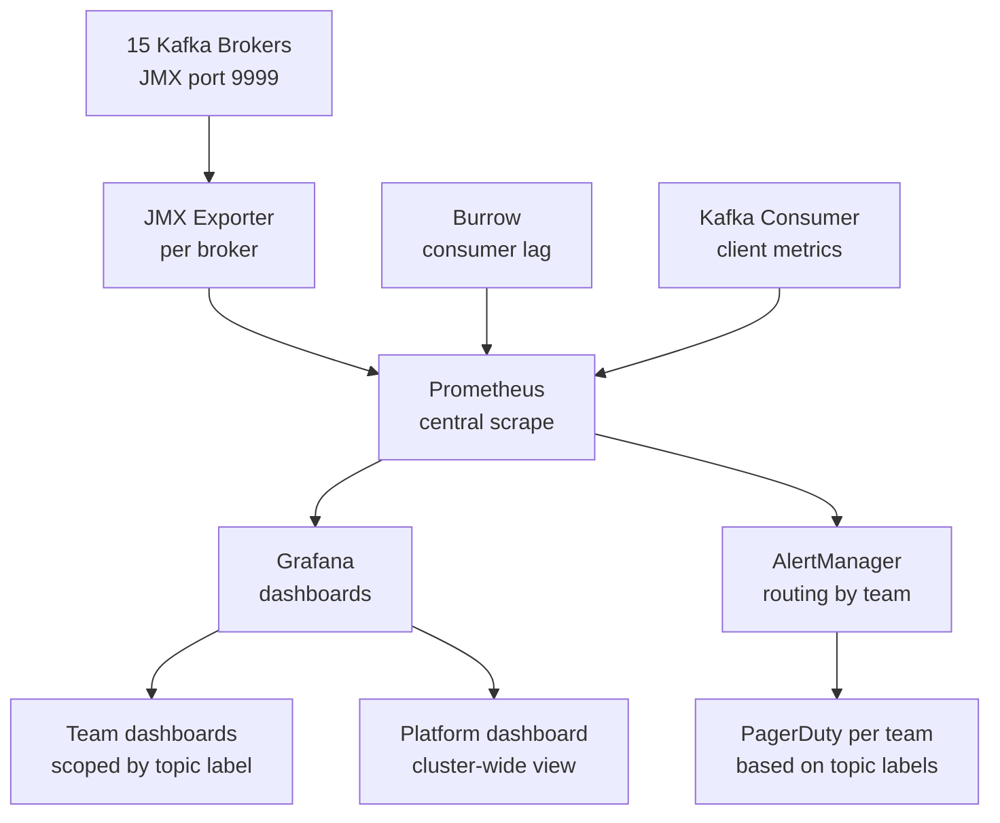

# Scenario Questions — Kafka Monitoring

<article data-difficulty="junior">

## 🟢 Junior: Setting Up Basic Consumer Lag Monitoring

**Scenario:** You've deployed a new Kafka consumer that processes payment events. Your manager asks you to set up monitoring so the team knows if the consumer falls behind. You need: (1) a way to check current lag, (2) an alert if lag exceeds 5,000 messages for more than 5 minutes.

**Question:** How do you implement this?

<details>
<summary>💡 Hint</summary>

Consumer lag = HWM (high-water mark) - committed offset. For manual checking, use `kafka-consumer-groups.sh`. For automated alerting, you need a metrics exporter (Prometheus or Burrow) and an alerting rule. Think about what tools you have available.
</details>

<details>
<summary>✅ Solution</summary>

**Step 1: Manual lag check (CLI)**
```bash
kafka-consumer-groups.sh \
  --bootstrap-server broker:9092 \
  --describe --group payment-processor

# Output:
# GROUP              TOPIC       PARTITION  CURRENT-OFFSET  LOG-END-OFFSET  LAG
# payment-processor  payments    0          98000           100000          2000
# payment-processor  payments    1          97500           100500          3000
```

**Step 2: Programmatic lag check (Python)**
```python
from confluent_kafka.admin import AdminClient
from confluent_kafka import Consumer, TopicPartition

def get_lag(bootstrap: str, group_id: str, topic: str) -> dict:
    admin = AdminClient({'bootstrap.servers': bootstrap})
    consumer = Consumer({'bootstrap.servers': bootstrap, 'group.id': group_id})

    # Get committed offsets
    partitions = [TopicPartition(topic, p) for p in range(get_partition_count(admin, topic))]
    committed = consumer.committed(partitions, timeout=10)

    lag = {}
    for tp in committed:
        _, hwm = consumer.get_watermark_offsets(tp, timeout=5)
        committed_offset = tp.offset if tp.offset >= 0 else 0
        lag[tp.partition] = hwm - committed_offset

    consumer.close()
    return lag
```

**Step 3: Prometheus alert rule**
```yaml
# prometheus_alerts.yml
groups:
- name: kafka_consumer
  rules:
  - alert: PaymentConsumerHighLag
    expr: |
      max by (consumergroup, topic) (
        kafka_consumergroup_lag{consumergroup="payment-processor", topic="payments"}
      ) > 5000
    for: 5m
    labels:
      severity: warning
      team: payments
    annotations:
      summary: "Payment consumer lag is {{ $value }} messages"
      description: |
        The payment-processor consumer group has been lagging by more than
        5,000 messages for over 5 minutes. This may delay payment processing.
      runbook_url: "https://wiki/runbooks/payment-consumer-lag"
```

**Step 4: Grafana panel**
- Panel type: Time series
- Query: `kafka_consumergroup_lag{consumergroup="payment-processor"}`
- Alert threshold: dotted red line at 5,000
- Legend: `Partition {{partition}}`
</details>

</article>

<article data-difficulty="mid-level">

## 🟡 Mid-Level: Diagnosing Under-Replicated Partitions

**Scenario:** At 3 PM on a Tuesday, you receive a PagerDuty alert: "Kafka Under-Replicated Partitions > 0." The Grafana dashboard shows `UnderReplicatedPartitions = 15`. The cluster has 3 brokers and the `orders` topic has 30 partitions with replication factor 3.

**Question:** Walk through your diagnosis steps. What are the likely causes and how do you confirm each?

<details>
<summary>💡 Hint</summary>

Under-replicated partitions mean some replicas are not in the ISR. This can happen because a broker is slow, a broker restarted, network issues between brokers, or the leader is overloaded. Start by identifying WHICH broker is not in ISR, then look at that broker's health metrics.
</details>

<details>
<summary>✅ Solution</summary>

**Step 1: Identify affected partitions and the lagging broker**
```bash
kafka-topics.sh --bootstrap-server broker:9092 \
  --describe --under-replicated-partitions

# Output example:
# Topic: orders  Partition: 0   Leader: 1  Replicas: 1,2,3  Isr: 1,2
# Topic: orders  Partition: 5   Leader: 1  Replicas: 1,2,3  Isr: 1,2
# Topic: orders  Partition: 10  Leader: 2  Replicas: 2,3,1  Isr: 2,1
# ...
# ← Broker 3 is consistently missing from ISR!
```

**Step 2: Check broker 3's health**
```bash
# Check if broker 3 is even running
kafka-broker-api-versions.sh --bootstrap-server broker3:9092

# Check broker 3 logs
ssh broker3
grep -E "ERROR|WARN|OutOfMemory|GC overhead" /var/log/kafka/server.log | tail -50

# Check system resources on broker3
iostat -x 1 5       # disk I/O
vmstat 1 5          # memory/CPU
netstat -s | grep -i error  # network errors
```

**Step 3: Check ISR shrink events (broker logs)**
```bash
# On broker 3
grep "Shrinking ISR" /var/log/kafka/server.log | tail -20
# Output: "Shrinking ISR from {1,2,3} to {1,2} for orders-0 at epoch 15"
# Timestamp shows when broker 3 started falling behind

# On leader broker (broker 1)
grep "replica-lag-time" /var/log/kafka/server.log | grep "broker3"
```

**Step 4: Identify root cause**

| Evidence | Likely Cause | Fix |
|---------|-------------|-----|
| Disk I/O > 90% on broker 3 | Disk saturation — can't replicate fast enough | Expand disk, tune flush settings |
| GC pause > 1s in logs | JVM memory pressure | Increase heap, tune GC |
| Network errors on broker 3 | Network issues | Check physical network, MTU |
| Broker 3 recently restarted | Normal catch-up after restart | Wait 5-15 min for ISR to stabilize |
| Produce rate spike | Temporary overload | Throttle producers if possible |

**Step 5: Monitor recovery**
```bash
# Watch ISR changes in real-time
watch -n 5 'kafka-topics.sh --bootstrap-server broker:9092 \
  --describe --under-replicated-partitions | wc -l'

# Alert resolves when URP returns to 0
# Typical recovery time: 2-15 minutes depending on lag amount
```

**Step 6: Post-incident actions**
- If disk I/O: add `replica.fetch.max.bytes` tuning, add disks
- If GC: enable G1GC, tune `KAFKA_HEAP_OPTS="-Xms6g -Xmx6g"`
- If network: work with infrastructure team
- Always: add `replica.lag.time.max.ms` to monitoring (how long before ISR shrinks)
</details>

</article>

<article data-difficulty="senior">

## 🔴 Senior: Designing a Kafka Observability Platform for 50 Teams

**Scenario:** Your company has 50 engineering teams all sharing a Kafka cluster with 800+ topics, 200+ consumer groups, and 15 brokers. Each team wants visibility into their topics and consumers without seeing other teams' data. The platform team needs a global view. Current state: no monitoring exists.

**Question:** Design a comprehensive observability platform. Cover: architecture, metric collection, dashboards, alerting, and access control. What are the key challenges?

<details>
<summary>✅ Solution</summary>

**Architecture Overview:**



**Step 1: Metric Collection**

```yaml
# prometheus.yml — scrape JMX exporter on each broker
scrape_configs:
- job_name: 'kafka-brokers'
  static_configs:
  - targets:
    - 'broker1:7071'
    - 'broker2:7071'
    # ... all 15 brokers
  relabel_configs:
  - source_labels: [__address__]
    regex: 'broker([0-9]+):.*'
    target_label: broker_id
    replacement: '$1'

- job_name: 'burrow'
  static_configs:
  - targets: ['burrow:8000']

- job_name: 'kafka-clients'
  # Producer/consumer metrics via push gateway or pull endpoint
  static_configs:
  - targets: ['pushgateway:9091']
```

**Step 2: Topic-to-Team Mapping**

```python
# Topic naming convention: {team}-{service}-{eventtype}
# e.g., "payments-checkout-order-placed"
# Label topics by team using recording rules

# prometheus recording rule
# kafka_topic_team_label = extracted team prefix
- record: kafka_topic_team
  expr: |
    label_replace(
      kafka_server_brokertopicmetrics_messagesinpersec,
      "team",
      "$1",
      "topic",
      "([a-z]+)-.*"
    )
```

**Step 3: Grafana Multi-Tenancy**

```python
# Grafana provisioning: per-team dashboards with team variable
dashboard_template = {
    "title": "Kafka Team Dashboard",
    "templating": {
        "list": [
            {
                "name": "team",
                "type": "custom",
                "options": [],  # populated per team
                "current": {"value": "${team_name}"},
            }
        ]
    },
    "panels": [
        {
            "title": "Consumer Lag — My Topics",
            "targets": [
                {
                    "expr": 'kafka_consumergroup_lag{topic=~"$team-.*"}'
                }
            ]
        },
        {
            "title": "Bytes In — My Topics",
            "targets": [
                {
                    "expr": 'sum by (topic) (rate(kafka_server_brokertopicmetrics_bytesinpersec{topic=~"$team-.*"}[5m]))'
                }
            ]
        },
    ]
}

# Grafana org per team (strong isolation) OR Grafana folders + RBAC (simpler)
# Recommendation: Grafana folders + RBAC per team using team SSO group
```

**Step 4: Team-Scoped Alerting**

```yaml
# AlertManager routing — route by topic prefix → team Slack/PagerDuty
route:
  receiver: 'platform-team'
  routes:
  - match_re:
      topic: 'payments-.*'
    receiver: 'payments-team'
  - match_re:
      topic: 'orders-.*'
    receiver: 'orders-team'
  # fallback: platform team

receivers:
- name: 'payments-team'
  pagerduty_configs:
  - routing_key: '<payments-pagerduty-key>'
    description: 'Kafka alert for {{ range .Alerts }}{{ .Annotations.summary }}{{ end }}'
- name: 'platform-team'
  slack_configs:
  - api_url: '<platform-slack-webhook>'
    channel: '#kafka-alerts'
```

**Step 5: Self-Service Lag Monitoring API**

```python
# Teams call this API to check their own consumer groups
from fastapi import FastAPI, Depends, HTTPException
import jwt

app = FastAPI()

@app.get("/v1/lag/{group_id}")
async def get_lag(group_id: str, token: str = Depends(get_auth_token)):
    team = get_team_from_token(token)

    # Verify the consumer group belongs to this team
    # Convention: group ID starts with team prefix
    if not group_id.startswith(f"{team}-"):
        raise HTTPException(status_code=403, detail="Access denied to this consumer group")

    lag = calculate_lag(group_id)
    return {"group_id": group_id, "lag_by_partition": lag}
```

**Key Challenges:**

| Challenge | Solution |
|-----------|---------|
| 200+ consumer groups → alert noise | Team-scoped routing; each team owns their alerts |
| Topic naming inconsistency | Enforce naming convention via Topic ACL naming rules |
| Self-service vs platform visibility | Grafana RBAC: teams see their folder; platform team sees all |
| Metric cardinality explosion | Use topic-level not partition-level metrics by default; partition only on request |
| 800 topics × 3 replicas × 15 brokers | Label filtering in dashboards; recording rules to pre-aggregate |
| On-call rotation per team | AlertManager receiver per team → team's PagerDuty |

**Platform-Level Guarantees (SLOs):**
- URP = 0 at all times (platform team owns)
- p99 produce latency < 200ms (platform team owns)
- Consumer lag SLO per pipeline (team owns, platform alerts on breach)
</details>

</article>

---

## ⚡ Quick-fire Q&A

**Q: What are the most critical Kafka metrics to monitor?**
A: Consumer group lag (records behind latest offset), under-replicated partitions (broker falling behind replication), offline partitions (no leader), broker disk utilization, request latency, and producer/consumer throughput (bytes in/out per second).

**Q: What is consumer lag and how do you alert on it?**
A: Consumer lag is the difference between the latest offset produced and the last committed offset consumed per partition. Alert when lag exceeds a threshold (e.g., 10,000 messages or a time-equivalent representing N minutes of data). Use Burrow, Kafka's consumer-groups API, or CloudWatch for lag monitoring.

**Q: What are under-replicated partitions and why are they dangerous?**
A: Under-replicated partitions have fewer in-sync replicas (ISRs) than the configured replication factor, meaning data is at risk of loss if the remaining replicas fail. Caused by slow or failing follower brokers. This metric should alert immediately as it indicates cluster instability.

**Q: What is an offline partition in Kafka?**
A: An offline partition has no elected leader, making it completely unavailable for reads and writes. This occurs when all replicas of a partition are offline (broker failures). Any non-zero count of offline partitions is a critical alert requiring immediate action.

**Q: What tools are commonly used for Kafka monitoring?**
A: Kafka exposes JMX metrics which integrate with Prometheus (via JMX Exporter) + Grafana for dashboards. Confluent Control Center provides managed monitoring. Burrow (LinkedIn) specializes in consumer lag analysis. Datadog and New Relic have native Kafka integrations. AWS MSK provides CloudWatch metrics.

**Q: How do you monitor producer health in Kafka?**
A: Monitor producer request rate, error rate, average/max request latency, batch size, compression ratio, and record send failures. High producer error rates or latency spikes indicate broker-side issues (leader not available, ISR shrink) or network problems.

**Q: What is the significance of the active controller metric?**
A: The Kafka cluster should have exactly one active controller at any time. If this metric is 0 (no controller) or >1 (split brain), the cluster cannot manage partition leadership changes or broker registration — both are critical failure states.

**Q: How do you correlate broker disk usage with retention policies for capacity planning?**
A: Track disk usage per broker and per topic. Project growth based on incoming bytes/second × retention period. Alert at 70-80% disk usage to allow time for intervention. Use `kafka-log-dirs.sh` to inspect per-topic, per-partition disk consumption for targeted cleanup.

---

## 💼 Interview Tips

- Lead with consumer lag as the primary operational metric — it directly reflects business impact (how far behind are your consumers). Interviewers want to see you prioritize metrics by business relevance.
- Know under-replicated partitions as a data safety alarm, not just a performance concern — the risk of data loss under further broker failure makes this a P0 alert.
- Describe a complete monitoring stack (JMX → Prometheus → Grafana, or Datadog, or CloudWatch for MSK) rather than just listing metrics — it shows you've built or operated production monitoring.
- Discuss consumer lag in time units, not just message counts — "10,000 messages lag" means nothing without knowing throughput; "5 minutes of data behind" is actionable for SLA assessment.
- For senior roles, discuss capacity planning metrics: disk growth rate, bytes in/out per topic, and how to project when a broker will fill up based on current retention settings.
- Mention Burrow specifically for consumer lag — it understands lag trends (improving vs. worsening) rather than just the current value, which eliminates false alerts during normal catch-up after downtime.
