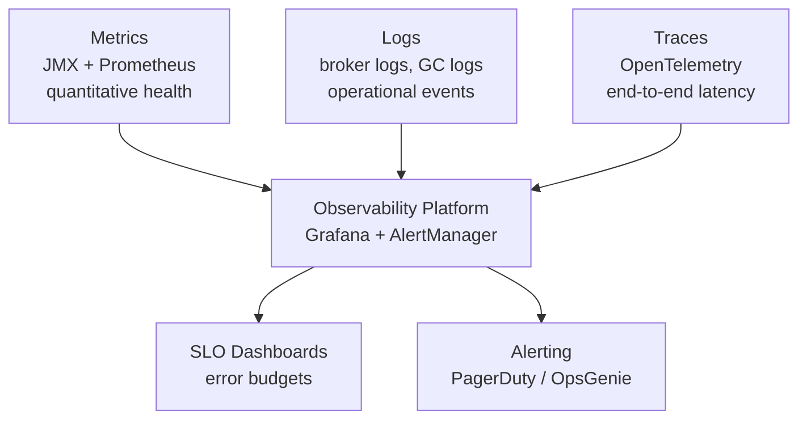

# Kafka Monitoring — Senior Deep Dive

## Observability Framework: Metrics, Logs, Traces

A mature Kafka observability practice combines all three pillars:



### Structured Broker Logs

```bash
# log4j configuration for structured JSON logging
log4j.appender.kafkaAppender=org.apache.log4j.ConsoleAppender
log4j.appender.kafkaAppender.layout=org.apache.log4j.PatternLayout
log4j.appender.kafkaAppender.layout.ConversionPattern=%d{ISO8601} %p [%t] %c: %m%n

# Key log events to monitor:
# ERROR | "Lost connection to ZooKeeper" → ZK/controller issue
# WARN  | "Shrinking ISR from" → follower falling behind
# WARN  | "Fetch session expired" → consumer fetch issue
# INFO  | "Started new log segment" → normal rotation
# ERROR | "Disk full" → critical
```

### Distributed Tracing for Kafka

```python
# OpenTelemetry instrumentation for producer
from opentelemetry import trace
from opentelemetry.propagate import inject
from confluent_kafka import Producer

tracer = trace.get_tracer("kafka-producer")

def traced_produce(producer: Producer, topic: str, key: bytes, value: bytes, span_name: str):
    with tracer.start_as_current_span(span_name) as span:
        span.set_attribute("messaging.system", "kafka")
        span.set_attribute("messaging.destination", topic)
        span.set_attribute("messaging.destination_kind", "topic")

        # Inject trace context into message headers
        headers = {}
        inject(headers)

        producer.produce(
            topic=topic,
            key=key,
            value=value,
            headers=list(headers.items()),
        )
        span.set_attribute("messaging.kafka.partition", -1)  # updated in callback
```

## SLOs for Kafka Pipelines

Define clear SLOs for each pipeline component:

| SLO | Target | Measurement |
|-----|--------|-------------|
| Producer delivery success rate | 99.99% | (1 - record_error_rate / record_send_rate) |
| Consumer lag p99 | < 30 seconds equivalent | lag / consume_rate |
| End-to-end latency p99 | < 500 ms | probe message round-trip |
| Broker availability | 99.95% | uptime without URP |
| Replication lag | 0 | UnderReplicatedPartitions = 0 |

```python
# SLO burn rate alerting (like Google SRE)
# 99.99% success SLO = 0.01% error budget
# 1-hour burn: if error rate > 14.4× the budget rate, alert

MONTHLY_ERROR_BUDGET_PCT = 0.0001  # 99.99% SLO
HOURLY_BURN_ALERT_MULTIPLIER = 14.4  # burns 1 month's budget in 2 hours

# Prometheus:
# alert when: error_rate > MONTHLY_ERROR_BUDGET_PCT * HOURLY_BURN_ALERT_MULTIPLIER
# for: 5m
```

## Capacity Planning Metrics

### Broker Saturation Signals

```bash
# CPU saturation
node_cpu_seconds_total{mode!="idle"} > 0.8   # > 80% CPU

# Network saturation  
node_network_transmit_bytes_total rate > network_interface_speed * 0.8

# Disk I/O saturation
rate(node_disk_io_time_seconds_total[5m]) > 0.8

# Kafka-specific saturation:
# RequestHandlerAvgIdlePercent < 0.3  → CPU/request saturation
# NetworkProcessorAvgIdlePercent < 0.3 → network thread saturation
# ProduceTotalTimeMs p99 > 500ms → latency degradation
```

### Predicting Disk Growth

```python
def predict_disk_exhaustion(bootstrap: str, broker_id: int, days_ahead: int = 30):
    """Predict when broker disk will be full based on current growth rate."""
    import time
    from confluent_kafka.admin import AdminClient

    admin = AdminClient({'bootstrap.servers': bootstrap})

    # Sample disk usage at t=0 and t=5min
    usage_t0 = get_broker_disk_bytes(broker_id)
    time.sleep(300)
    usage_t5 = get_broker_disk_bytes(broker_id)

    growth_per_second = (usage_t5 - usage_t0) / 300
    total_capacity = get_broker_disk_capacity(broker_id)
    available = total_capacity - usage_t5

    if growth_per_second <= 0:
        return "Disk not growing"

    seconds_until_full = available / growth_per_second
    days_until_full = seconds_until_full / 86400

    return {
        'growth_rate_gb_per_day': growth_per_second * 86400 / (1024**3),
        'current_usage_pct': usage_t5 / total_capacity * 100,
        'days_until_full': days_until_full,
        'alert': days_until_full < days_ahead,
    }
```

## MSK-Specific Monitoring (AWS)

For Amazon MSK, use CloudWatch metrics:

```python
import boto3

cw = boto3.client('cloudwatch', region_name='us-east-1')

# Key MSK CloudWatch metrics
MSK_METRICS = [
    ('AWS/Kafka', 'UnderReplicatedPartitions', 'Cluster Name'),
    ('AWS/Kafka', 'ActiveControllerCount', 'Cluster Name'),
    ('AWS/Kafka', 'OfflinePartitionsCount', 'Cluster Name'),
    ('AWS/Kafka', 'BytesInPerSec', 'Broker ID'),
    ('AWS/Kafka', 'BytesOutPerSec', 'Broker ID'),
    ('AWS/Kafka', 'KafkaDataLogsDiskUsed', 'Broker ID'),
    ('AWS/Kafka', 'CpuUser', 'Broker ID'),
    ('AWS/Kafka', 'MemoryUsed', 'Broker ID'),
]

def get_msk_metric(cluster_name: str, metric_name: str, period_seconds: int = 60):
    response = cw.get_metric_statistics(
        Namespace='AWS/Kafka',
        MetricName=metric_name,
        Dimensions=[{'Name': 'Cluster Name', 'Value': cluster_name}],
        StartTime=datetime.utcnow() - timedelta(minutes=5),
        EndTime=datetime.utcnow(),
        Period=period_seconds,
        Statistics=['Average', 'Maximum'],
    )
    return response['Datapoints']
```

### MSK Enhanced Monitoring Tiers

| Tier | Metrics | Cost |
|------|---------|------|
| DEFAULT | Cluster-level only | Free |
| PER_BROKER | Per-broker metrics | Extra |
| PER_TOPIC_PER_BROKER | Per-topic per-broker | Extra |
| PER_TOPIC_PER_PARTITION | Most granular | Highest |

## Kafka Streams Monitoring

```java
// Enable built-in Kafka Streams metrics
Properties streamsConfig = new Properties();
streamsConfig.put(StreamsConfig.BUILT_IN_METRICS_VERSION_CONFIG, "latest");
streamsConfig.put(StreamsConfig.METRICS_RECORDING_LEVEL_CONFIG, "DEBUG");  // or "INFO"

// Key Kafka Streams metrics
// kafka.streams:type=stream-task-metrics,thread-id=X,task-id=Y
//   process-rate: records processed per second
//   process-latency-avg: processing latency
// kafka.streams:type=stream-state-metrics,thread-id=X,task-id=Y,store-id=Z
//   put-rate: state store write rate
//   get-rate: state store read rate
// kafka.streams:type=stream-record-cache-metrics
//   hit-ratio-avg: cache hit rate (higher = better, reduces changelog writes)
```

## Alerting Runbook Integration

```yaml
# Alert with runbook link
- alert: KafkaUnderReplicatedPartitions
  expr: kafka_server_replicamanager_underreplicatedpartitions > 0
  for: 2m
  labels:
    severity: critical
    team: platform
  annotations:
    summary: "{{ $labels.instance }} has {{ $value }} under-replicated partitions"
    description: |
      Under-replicated partitions mean data is not fully replicated.
      If the leader fails, data loss is possible.
    runbook_url: "https://wiki.internal/runbooks/kafka-urp"
    dashboard_url: "https://grafana.internal/d/kafka-broker"
```

### Runbook Example: URP > 0

```markdown
## Under-Replicated Partitions Runbook

1. Identify affected partitions:
   kafka-topics.sh --bootstrap-server broker:9092 --describe --under-replicated-partitions

2. Identify slow broker:
   - Check which broker is NOT in ISR for affected partitions
   - Check that broker's disk I/O, CPU, and GC pauses

3. Common causes and fixes:
   - Slow disk I/O → check iostat, consider broker replacement
   - GC pause > 1s → tune JVM heap, use G1GC
   - Network saturation → check bandwidth usage
   - Broker restart → wait for leader election (< 30s normally)

4. Escalate if URP persists > 10 minutes
```

## Interview Tips

> **Tip 1:** SLO-based alerting (burn rate alerting) is the modern approach. Instead of "alert when lag > 10,000," say "alert when we're burning our error budget 14x faster than normal." This avoids alert fatigue from thresholds that are sometimes OK to exceed briefly.

> **Tip 2:** For MSK, know the four monitoring tiers and their cost/granularity tradeoff. PER_TOPIC_PER_BROKER is the most common production choice — it gives per-topic visibility without the cost of per-partition metrics.

> **Tip 3:** Request handler idle percentage and network processor idle percentage are the two key broker saturation signals. Below 30% idle means the broker is CPU/thread saturated. Show you understand that adding more producers just makes this worse — you need to scale the broker fleet.

> **Tip 4:** Distributed tracing for Kafka (OpenTelemetry) is often missed by candidates. Trace context in message headers lets you track a request from producer to consumer end-to-end. This is invaluable for debugging latency issues in multi-hop pipelines.

> **Tip 5:** Runbooks attached to alerts demonstrate operational maturity. When describing your monitoring setup, mention that every production alert has a linked runbook with diagnosis steps and escalation criteria. Alerts without runbooks are just noise generators.
