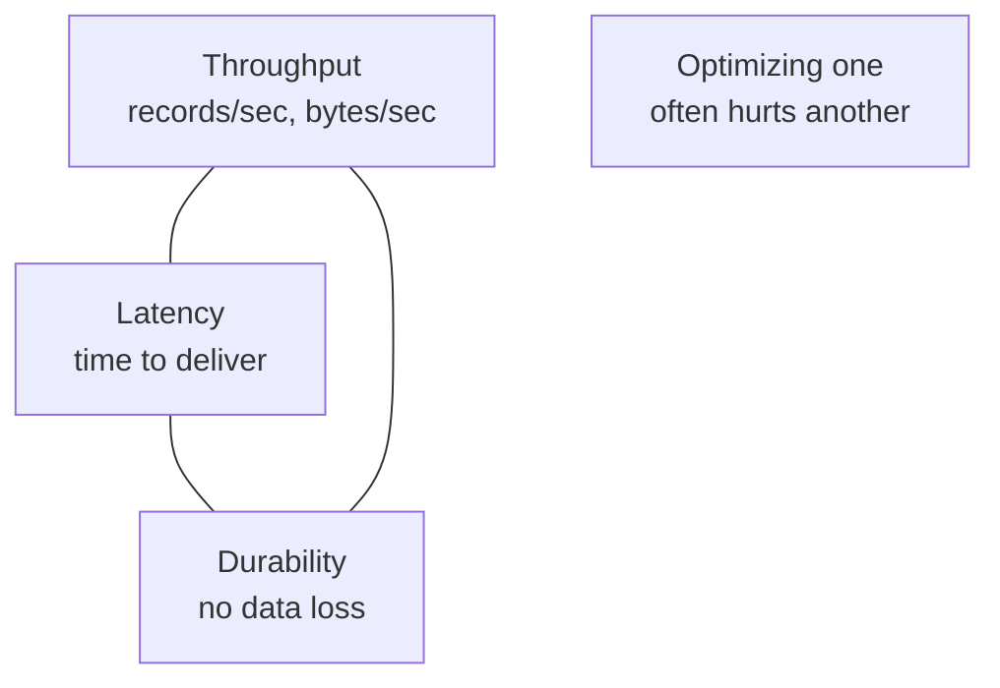

# Kafka Performance Tuning — Fundamentals

## The Performance Tradeoff Triangle

Kafka performance tuning balances three competing dimensions:



**The fundamental tradeoffs:**
- High throughput → larger batches → higher latency
- Low latency → smaller batches → lower throughput
- High durability (acks=all) → more network round-trips → higher latency

## Producer Performance Basics

### Throughput-Optimized Producer

```python
from confluent_kafka import Producer

high_throughput_producer = Producer({
    'bootstrap.servers': 'broker:9092',
    # Batching
    'linger.ms': 50,              # wait 50ms to accumulate records
    'batch.size': 524288,          # 512 KB batch size
    'buffer.memory': 134217728,    # 128 MB accumulator buffer
    # Compression
    'compression.type': 'lz4',    # fast compression
    # Reliability
    'acks': '1',                   # leader ack only (for speed)
    'enable.idempotence': False,   # skip idempotence overhead
})
```

### Latency-Optimized Producer

```python
low_latency_producer = Producer({
    'bootstrap.servers': 'broker:9092',
    # Minimal batching
    'linger.ms': 0,               # send immediately
    'batch.size': 16384,           # 16 KB (default)
    # No compression (adds latency)
    'compression.type': 'none',
    # Faster ack
    'acks': '1',
})
```

### Key Producer Tuning Parameters

| Parameter | Default | Throughput Tuning | Latency Tuning |
|-----------|---------|-------------------|----------------|
| `linger.ms` | 0 | 20-100 ms | 0 |
| `batch.size` | 16 KB | 128-512 KB | 16 KB |
| `compression.type` | none | lz4 or snappy | none |
| `buffer.memory` | 32 MB | 128 MB | 32 MB |
| `acks` | all | 1 | 1 |

## Consumer Performance Basics

### Throughput-Optimized Consumer

```python
from confluent_kafka import Consumer

high_throughput_consumer = Consumer({
    'bootstrap.servers': 'broker:9092',
    'group.id': 'fast-consumer',
    # Fetch larger batches
    'fetch.min.bytes': 65536,       # wait for 64 KB before returning
    'fetch.max.wait.ms': 500,        # or up to 500ms
    'fetch.max.bytes': 52428800,     # 50 MB max per fetch
    'max.partition.fetch.bytes': 10485760,  # 10 MB per partition
    'max.poll.records': 2000,        # larger batches
})
```

### Latency-Optimized Consumer

```python
low_latency_consumer = Consumer({
    'bootstrap.servers': 'broker:9092',
    'group.id': 'fast-consumer',
    # Fetch immediately, don't wait
    'fetch.min.bytes': 1,           # return as soon as any data available
    'fetch.max.wait.ms': 10,         # max 10ms wait
    'max.poll.records': 100,         # smaller batches for faster processing
})
```

## Broker Performance Basics

### OS-Level Tuning (Linux)

```bash
# Increase file descriptor limit
echo "* hard nofile 100000" >> /etc/security/limits.conf
echo "* soft nofile 100000" >> /etc/security/limits.conf

# Disable transparent huge pages (reduces GC pause)
echo never > /sys/kernel/mm/transparent_hugepage/enabled

# Optimize network buffers
sysctl -w net.core.rmem_max=134217728
sysctl -w net.core.wmem_max=134217728
sysctl -w net.ipv4.tcp_rmem="4096 87380 134217728"
sysctl -w net.ipv4.tcp_wmem="4096 65536 134217728"

# Disk scheduler: use deadline or noop for SSDs
echo deadline > /sys/block/sda/queue/scheduler
```

### JVM Tuning

```bash
# In kafka-server-start.sh or KAFKA_HEAP_OPTS environment variable
export KAFKA_HEAP_OPTS="-Xms6g -Xmx6g"
export KAFKA_JVM_PERFORMANCE_OPTS="-XX:+UseG1GC \
  -XX:MaxGCPauseMillis=20 \
  -XX:InitiatingHeapOccupancyPercent=35 \
  -XX:+ExplicitGCInvokesConcurrent \
  -XX:G1HeapRegionSize=16 \
  -Djava.awt.headless=true"
```

**G1GC recommendations:**
- Heap: 6 GB (avoid > 8 GB — GC pause increases)
- `MaxGCPauseMillis=20` — target max GC pause (soft target for G1GC)
- `InitiatingHeapOccupancyPercent=35` — start GC earlier (prevents full GC)

## Disk Performance

Kafka benefits enormously from fast disks. Sequential I/O is the key pattern.

| Disk Type | Sequential Read | Sequential Write | Best For |
|-----------|----------------|-----------------|---------|
| HDD (7200 RPM) | 100-150 MB/s | 100-150 MB/s | Archive / cheap storage |
| SSD (SATA) | 500 MB/s | 400 MB/s | General production |
| NVMe SSD | 3000+ MB/s | 2000+ MB/s | High-throughput clusters |

**Multiple disks**: Kafka can use multiple log directories (`log.dirs`). Partitions are spread across directories for higher aggregate throughput.

```properties
# Use multiple disks for parallel I/O
log.dirs=/data1/kafka,/data2/kafka,/data3/kafka
```

## Replication Factor vs Performance

Higher replication = more durable but more network traffic:

```
Single record, replication factor 3:
1 write to leader + 2 writes to followers = 3× network bandwidth
```

For every 100 MB/s produce rate with RF=3:
- Total network traffic: ~300 MB/s per broker (write) + ~200 MB/s (fetch consumers)
- Plan for 10 Gbps NICs for high-throughput brokers

## Interview Tips

> **Tip 1:** Always start performance discussions with the tradeoff triangle: throughput vs latency vs durability. Show you understand that optimizing one usually comes at the expense of another.

> **Tip 2:** `linger.ms` and `batch.size` are the primary throughput levers on the producer. Explain that `linger.ms` waits for more records to fill the batch; `batch.size` limits the max batch size. Both must be increased together for effective throughput improvement.

> **Tip 3:** G1GC with 6 GB heap is the production standard for Kafka brokers. Avoid ZGC (not tuned for Kafka's workload pattern). Mention `MaxGCPauseMillis=20` — this is what prevents > 20ms GC pauses that cause ISR shrinks.

> **Tip 4:** Multiple `log.dirs` pointing to separate physical disks is a free throughput multiplier. Kafka spreads partitions across directories — 4 NVMe drives = 4× the sequential write throughput of one drive.

> **Tip 5:** For latency-critical workloads, `acks=all` with `min.insync.replicas=2` and `linger.ms=0` is the correct config. `acks=all` doesn't add much latency if ISR is healthy — the latency is dominated by network round-trips, not the extra replication.
