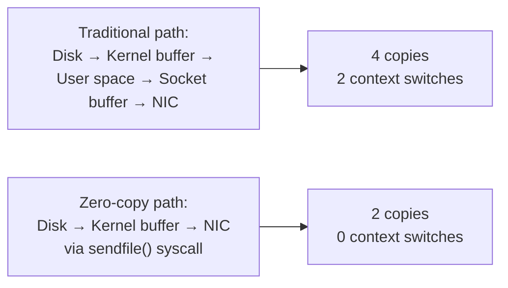
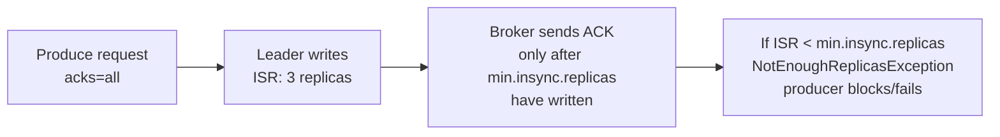

# Kafka Performance Tuning — Intermediate

## Zero-Copy and sendfile()

Kafka's most important performance optimization is **zero-copy** data transfer for consumers. When a consumer fetches data already persisted to disk:



Zero-copy only works when:
- Data is **not compressed** on the broker after receipt (or consumer uses same compression)
- Data is **not decrypted** between broker and consumer

Enabling SSL/TLS disables zero-copy (data must be encrypted before sending). This is a real performance cost of in-transit encryption:
- Without SSL: ~600 MB/s throughput per broker
- With SSL: ~200 MB/s (encryption overhead)

## Page Cache Optimization

Kafka relies heavily on the OS page cache for hot data. Avoid anything that evicts the page cache:

```bash
# Do NOT run other memory-hungry processes on Kafka brokers
# Java heap contends with page cache for RAM

# Leave RAM for page cache
# 32 GB server: 6 GB JVM heap, 26 GB for page cache

# If using dedicated Kafka brokers:
vm.swappiness=1    # minimize swapping
vm.dirty_ratio=80  # allow more dirty pages before writeback
vm.dirty_background_ratio=5  # start background writeback early
```

### Measuring Cache Hit Rate

```bash
# Check how much of Kafka log data is in page cache
# (On broker host)
vmstat -s | grep -E "memory|cache|buffer"

# pcstat tool: shows % of file in page cache
pcstat /var/kafka/data/orders-0/*.log
# Output:
# Name                         Size (bytes) Pages Cached Percent
# 00000000000000000000.log  1073741824   262144  261500  99.75%
```

High cache hit rate → consumer fetches from memory → very low latency. When cache hit rate drops (log grows beyond RAM), fetches hit disk → latency spikes.

## Partition Count Tuning

### Producer-Side Parallelism

```
Throughput ≈ min(producers, partitions) × throughput_per_producer
```

More partitions = more parallelism, but with diminishing returns and costs:

| Partition Count | Benefits | Costs |
|----------------|---------|-------|
| 10 | Limited parallelism | Low overhead |
| 100 | Good parallelism | More file handles (~300 files) |
| 1000 | High parallelism | High file handles, slower leader election |
| 10000 | Extreme | Memory pressure on brokers, very slow election |

**Practical guidance:**
```
target_partitions = max(throughput_target / per_partition_throughput, 
                        max_consumers_in_group)

per_partition_throughput = 10-100 MB/s (depending on HW)
```

### Consumer-Side Parallelism

```python
# Verify partition count matches desired consumer parallelism
from confluent_kafka.admin import AdminClient

admin = AdminClient({'bootstrap.servers': 'broker:9092'})
metadata = admin.list_topics('orders')
partition_count = len(metadata.topics['orders'].partitions)

# If partition_count < desired consumers: increase partitions
# If partition_count > consumers: consumers get multiple partitions each

def check_consumer_utilization(partition_count: int, consumer_count: int):
    partitions_per_consumer = partition_count / consumer_count
    if partitions_per_consumer < 1:
        return f"WARNING: {consumer_count - partition_count} consumers are idle"
    if partitions_per_consumer > 5:
        return f"Consider increasing partitions; each consumer handles {partitions_per_consumer:.1f}"
    return f"Balanced: {partitions_per_consumer:.1f} partitions per consumer"
```

## Replication Tuning

### Fetch and Throttle for Followers

```properties
# Broker: rate at which followers fetch from leader
replica.fetch.min.bytes=1
replica.fetch.max.bytes=10485760   # 10 MB per fetch
replica.fetch.wait.max.ms=500

# Throttle replication to avoid starving producers during catch-up
# (e.g., after a broker restart)
# Set temporarily, not permanently:
# kafka-configs.sh --alter --add-config 'follower.replication.throttled.rate=52428800'
```

### ISR and `min.insync.replicas`



```properties
# Broker topic config
min.insync.replicas=2   # require 2 of 3 replicas to be in-sync before ack
# With RF=3 and min.insync.replicas=2:
# - Can tolerate 1 broker failure
# - If 2 brokers fail: produces block (no writes accepted)
```

**Performance impact**: `acks=all` with `min.insync.replicas=2` adds one follower's replication latency (~1-5 ms over LAN) to each produce request. This is usually acceptable for durability.

## Quota Management

Kafka quotas prevent noisy neighbors from degrading cluster performance:

```bash
# Per-client producer quota: 50 MB/s
kafka-configs.sh --bootstrap-server broker:9092 \
  --alter \
  --add-config 'producer_byte_rate=52428800' \
  --entity-type clients --entity-name analytics-producer

# Per-user consumer quota
kafka-configs.sh --bootstrap-server broker:9092 \
  --alter \
  --add-config 'consumer_byte_rate=104857600' \   # 100 MB/s
  --entity-type users --entity-name analytics-user

# Verify quotas
kafka-configs.sh --bootstrap-server broker:9092 \
  --describe --entity-type clients --entity-name analytics-producer
```

When quota is exceeded, the broker delays the response by a calculated throttle time:
```
throttle_time_ms = (quota_exceeded_bytes / quota_rate) × 1000
```

The client backs off for this duration. Monitor `produce-throttle-time-avg` and `fetch-throttle-time-avg` on the client side.

## Log Flush Performance

By default, Kafka relies on OS page cache and does **not** force fsync per message. This is intentional — replication (not fsync) provides durability.

```properties
# Do NOT set these for performance (they kill throughput):
# log.flush.interval.messages=1   # fsync every message = 100x slower
# log.flush.interval.ms=100       # fsync every 100ms = 10x slower

# Correct approach: rely on OS page cache + replication
# Only fsync on graceful shutdown (automatic in Kafka)
```

**Why replication > fsync for durability:**
- fsync blocks the producer waiting for disk write
- Replication to 2+ brokers provides equivalent durability without the latency
- Modern HDDs: fsync latency 5-10ms; NVMe: 0.1ms — still significant at scale

## Tuning for Specific Workloads

### High-Throughput Batch Processing

```python
producer_config = {
    'linger.ms': 100,              # wait 100ms for batch filling
    'batch.size': 1048576,          # 1 MB batches
    'compression.type': 'zstd',    # best compression ratio
    'buffer.memory': 268435456,     # 256 MB buffer
    'acks': '1',                    # leader-only ack (higher throughput)
    'max.in.flight.requests.per.connection': 10,  # more pipelining
}

consumer_config = {
    'fetch.min.bytes': 1048576,    # wait for 1 MB
    'fetch.max.wait.ms': 1000,     # up to 1 second
    'max.poll.records': 5000,
}
```

### Real-Time / Low-Latency Streaming

```python
producer_config = {
    'linger.ms': 0,
    'batch.size': 16384,
    'compression.type': 'none',
    'acks': '1',
}

consumer_config = {
    'fetch.min.bytes': 1,
    'fetch.max.wait.ms': 0,
    'max.poll.records': 50,
}
```

## Interview Tips

> **Tip 1:** Zero-copy is Kafka's secret weapon for consumer performance. Know that it uses `sendfile()` to transfer data from the OS page cache directly to the network socket without copying to user space. SSL breaks this — always mention this cost when discussing encryption.

> **Tip 2:** Page cache is critical for Kafka performance. Hot partitions (recently written data) live in RAM. When the total log size exceeds available RAM, fetches hit disk and latency spikes. This is why oversized topics on under-specced hardware cause performance degradation.

> **Tip 3:** Quotas are essential for shared clusters. Without quotas, one team's high-volume producer can degrade the entire cluster. Describe per-client and per-user quota enforcement — the broker throttles violators by delaying responses.

> **Tip 4:** Avoid fsync tuning (`log.flush.interval.*`). These settings force expensive disk syncs that destroy throughput. Kafka's durability comes from replication, not fsync. Mention this when someone asks why Kafka doesn't use fsync per message.

> **Tip 5:** Partition count is a one-way door — you can increase partitions but not decrease. Over-provisioning is safer than under-provisioning, but avoid extreme counts (> 1000 per broker) which cause leader election slowdowns and memory pressure.
