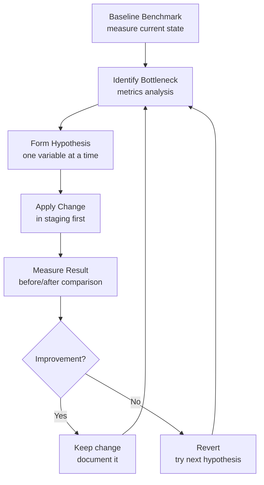

# Kafka Performance Tuning — Real World Patterns

## Pattern 1: Systematic Tuning Methodology

Never tune by guessing. Use a structured approach:



### Baseline Benchmarking Script

```python
import time
import threading
from confluent_kafka import Producer, Consumer
from dataclasses import dataclass
from typing import Optional

@dataclass
class BenchmarkResult:
    total_records: int
    duration_seconds: float
    throughput_records_per_sec: float
    throughput_mb_per_sec: float
    latency_p50_ms: float
    latency_p99_ms: float
    error_count: int

def benchmark_producer(
    bootstrap: str,
    topic: str,
    num_records: int,
    record_size: int,
    config: dict,
) -> BenchmarkResult:
    latencies = []
    errors = [0]
    delivered = [0]

    def on_delivery(err, msg):
        if err:
            errors[0] += 1
        else:
            delivered[0] += 1

    producer_config = {'bootstrap.servers': bootstrap, **config}
    producer = Producer(producer_config)
    payload = b'X' * record_size

    start = time.monotonic()
    for _ in range(num_records):
        t0 = time.monotonic()
        producer.produce(topic, value=payload, on_delivery=on_delivery)
        producer.poll(0)
        latencies.append((time.monotonic() - t0) * 1000)

    producer.flush()
    duration = time.monotonic() - start

    latencies.sort()
    return BenchmarkResult(
        total_records=num_records,
        duration_seconds=duration,
        throughput_records_per_sec=delivered[0] / duration,
        throughput_mb_per_sec=(delivered[0] * record_size / duration) / (1024**2),
        latency_p50_ms=latencies[len(latencies) // 2],
        latency_p99_ms=latencies[int(len(latencies) * 0.99)],
        error_count=errors[0],
    )

# Compare configs
configs_to_test = [
    {'name': 'baseline', 'linger.ms': '0', 'batch.size': '16384', 'compression.type': 'none'},
    {'name': 'optimized', 'linger.ms': '50', 'batch.size': '524288', 'compression.type': 'lz4'},
]

for cfg in configs_to_test:
    name = cfg.pop('name')
    result = benchmark_producer('broker:9092', 'perf-test', 1000000, 1024, cfg)
    print(f"{name}: {result.throughput_mb_per_sec:.1f} MB/s, "
          f"p99={result.latency_p99_ms:.1f}ms, errors={result.error_count}")
```

## Pattern 2: High-Throughput Log Aggregation Tuning

**Scenario**: 500 application servers, each producing 1,000 log events/sec at 500 bytes each. Total: 500,000 events/sec = 250 MB/s.

**Producer config (per application server):**
```python
log_producer_config = {
    'bootstrap.servers': 'broker1:9092,broker2:9092,broker3:9092',
    # Aggressive batching — log data tolerates latency
    'linger.ms': 100,
    'batch.size': 1048576,       # 1 MB batches
    'compression.type': 'lz4',   # fast, 3x compression on log data
    'buffer.memory': 67108864,   # 64 MB buffer
    # Throughput over durability (logs can be reproduced)
    'acks': '1',
    'enable.idempotence': False,
    'max.in.flight.requests.per.connection': 10,
    # Don't block on full buffer
    'max.block.ms': '5000',
}
```

**Topic configuration:**
```bash
kafka-topics.sh --bootstrap-server broker:9092 --create \
  --topic application-logs \
  --partitions 50 \              # 50 partitions for 50 consumer threads
  --replication-factor 2         # RF=2 for logs (1 replica is OK to lose)

kafka-configs.sh --bootstrap-server broker:9092 --alter \
  --add-config 'retention.ms=86400000,
                segment.bytes=268435456,
                compression.type=lz4' \
  --entity-type topics --entity-name application-logs
```

**Consumer config (Elasticsearch sink):**
```python
log_consumer_config = {
    'bootstrap.servers': 'broker1:9092',
    'group.id': 'elasticsearch-sink',
    'enable.auto.commit': False,
    'fetch.min.bytes': 1048576,    # 1 MB min fetch
    'fetch.max.wait.ms': 500,
    'max.poll.records': 5000,
    'max.poll.interval.ms': 300000, # 5 min; ES bulk indexing can be slow
}
```

**Expected performance:**
- Compression: 1 MB batch at 3:1 ratio → 333 KB on wire → 750 MB/s effective throughput per broker NIC at 250 MB/s produce rate
- 50 partitions × 5 MB/s per partition = 250 MB/s total capacity

## Pattern 3: Low-Latency Payment Processing Tuning

**Scenario**: Payment events must be processed with < 20ms end-to-end latency (p99).

```python
payment_producer_config = {
    'bootstrap.servers': 'broker:9092',
    # No batching — immediate send
    'linger.ms': 0,
    'batch.size': 16384,           # 16 KB (default; records likely smaller)
    'compression.type': 'none',    # compression adds latency
    # Maximum durability
    'acks': 'all',
    'enable.idempotence': True,
    # Fast timeout
    'request.timeout.ms': 5000,    # fail fast instead of waiting 30s
    'delivery.timeout.ms': 10000,
    # Reduce retry backoff for faster recovery
    'retry.backoff.ms': 100,
}

payment_consumer_config = {
    'bootstrap.servers': 'broker:9092',
    'group.id': 'payment-processor',
    'isolation.level': 'read_committed',
    'enable.auto.commit': False,
    # Immediate fetch
    'fetch.min.bytes': 1,
    'fetch.max.wait.ms': 0,
    'max.poll.records': 10,         # small batch = fast commit after processing
    'session.timeout.ms': 10000,
    'heartbeat.interval.ms': 3000,
}
```

**Broker tuning for low-latency:**
```properties
# Reduce network delay
num.network.threads=8
num.io.threads=16
socket.send.buffer.bytes=1048576
socket.receive.buffer.bytes=1048576

# Disable OS buffering delay (at cost of throughput)
# log.flush.interval.ms=1   ← DO NOT do this for payments; use replication instead

# Topic-specific: 3 partitions (one per payment region)
# RF=3, min.insync.replicas=2
```

**Latency budget:**
```
Producer → Broker: 1-3 ms (LAN round-trip)
Leader → Follower replication: 1-3 ms
Broker → Consumer: 1-3 ms
Consumer processing: 5-10 ms
Total p50: 8-19 ms ✓
Total p99: 15-25 ms (borderline — monitor closely)
```

## Pattern 4: Capacity Planning Calculator

```python
def kafka_capacity_planner(
    produce_rate_mb_per_sec: float,
    retention_days: int,
    replication_factor: int,
    compression_ratio: float,  # e.g., 0.33 for 3:1 compression
    num_topics: int,
    avg_partitions_per_topic: int,
    peak_multiplier: float = 2.0,  # peak traffic vs average
) -> dict:
    """
    Calculate Kafka cluster capacity requirements.
    """
    # Network
    # Peak produce rate
    peak_produce_mb_s = produce_rate_mb_per_sec * peak_multiplier
    # Each byte written once to leader, replicated N-1 times
    replication_write_mb_s = peak_produce_mb_s * replication_factor
    # Consumers typically read 2-5x produce rate
    consumer_read_mb_s = peak_produce_mb_s * 3
    total_network_mb_s = replication_write_mb_s + consumer_read_mb_s

    # Storage (before compression)
    raw_bytes_per_day = produce_rate_mb_per_sec * 86400 * 1024**2
    compressed_bytes_per_day = raw_bytes_per_day * compression_ratio
    total_storage_bytes = compressed_bytes_per_day * retention_days * replication_factor
    total_storage_tb = total_storage_bytes / (1024**4)

    # Partitions
    total_partitions = num_topics * avg_partitions_per_topic * replication_factor

    # Broker count (rule of thumb: 80% utilization target)
    min_brokers_network = int(total_network_mb_s / (10 * 1024 * 0.8)) + 1  # 10 GbE
    min_brokers_storage = int(total_storage_tb / (12 * 0.8)) + 1  # 12 TB per broker
    recommended_brokers = max(min_brokers_network, min_brokers_storage, 3)  # min 3

    return {
        'peak_produce_mb_s': round(peak_produce_mb_s, 1),
        'total_network_mb_s': round(total_network_mb_s, 1),
        'storage_tb_needed': round(total_storage_tb, 1),
        'total_partitions': total_partitions,
        'recommended_broker_count': recommended_brokers,
        'min_by_network': min_brokers_network,
        'min_by_storage': min_brokers_storage,
    }

# Example: 100 MB/s produce rate, 7-day retention, RF=3, lz4 compression
plan = kafka_capacity_planner(
    produce_rate_mb_per_sec=100,
    retention_days=7,
    replication_factor=3,
    compression_ratio=0.4,   # lz4: ~2.5:1
    num_topics=50,
    avg_partitions_per_topic=10,
)
print(plan)
# {'peak_produce_mb_s': 200.0, 'total_network_mb_s': 1200.0,
#  'storage_tb_needed': 14.5, 'total_partitions': 1500,
#  'recommended_broker_count': 2, ...}
```

## Interview Tips

> **Tip 1:** The methodology matters as much as the answer. When asked about performance tuning, describe the process: (1) baseline benchmark, (2) identify bottleneck via metrics, (3) change one variable, (4) benchmark again, (5) decide. This is the scientific method applied to systems.

> **Tip 2:** For log aggregation, prioritize throughput over latency. Logs tolerate seconds of delay. Use `linger.ms=100`, large batches, lz4 compression, `acks=1`. For payments, flip everything: `linger.ms=0`, no compression, `acks=all`.

> **Tip 3:** Capacity planning is a senior-level skill. Know the inputs: produce rate, retention period, replication factor, compression ratio, peak multiplier. Walk through the calculation to show you can right-size a cluster.

> **Tip 4:** End-to-end latency budget analysis (producer round-trip + replication + consumer round-trip + processing) is how you validate whether a configuration meets a latency SLA. Show you can decompose the latency into measurable components.

> **Tip 5:** Benchmarking tools matter: `kafka-producer-perf-test.sh` and `kafka-consumer-perf-test.sh` are built in. For custom scenarios, write a producer that measures per-message latency and reports percentiles. Always use p99, not average — p99 is what your SLA cares about.
